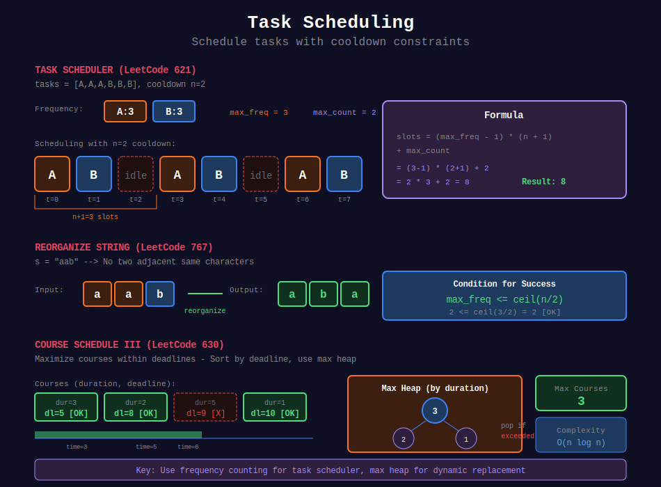

<div align="center">

# ⏰ Task Scheduling



<p>
  
  
</p>

</div>

---

## 🧭 Navigation

| ⬅️ Previous | 📂 Current | ➡️ Next |
|:------------|:----------:|--------:|
| [← 01. Interval Scheduling](../01_interval_scheduling/README.md) | **02. Task Scheduling** | [03. Array Greedy →](../03_array_greedy/README.md) |

---

## 📐 Mathematical Foundations

### 1️⃣ Task Scheduler Formula

With cooldown $n$ between same tasks:

```math
\text{time} = \max(\text{total tasks}, (\text{max freq} - 1) \times (n + 1) + \text{count of max freq})

```

---

### 2️⃣ Reorganize String

**Condition for success:**

```math
\text{max frequency} \leq \lceil \frac{n}{2} \rceil

```

---

## 💻 Code Implementations

```python
def leastInterval(tasks: list[str], n: int) -> int:
    """
    Task Scheduler (LeetCode 621).
    
    Minimum time with cooldown n.
    
    Time: O(t), Space: O(1)
    """
    from collections import Counter
    
    freq = Counter(tasks)
    max_freq = max(freq.values())
    max_count = sum(1 for f in freq.values() if f == max_freq)
    
    # Minimum slots needed
    slots = (max_freq - 1) * (n + 1) + max_count
    
    return max(len(tasks), slots)

def reorganizeString(s: str) -> str:
    """
    Reorganize String (LeetCode 767).
    
    No two adjacent same characters.
    
    Time: O(n log 26), Space: O(n)
    """
    import heapq
    from collections import Counter
    
    freq = Counter(s)
    
    # Check if possible
    if max(freq.values()) > (len(s) + 1) // 2:
        return ""
    
    # Max heap by frequency
    heap = [(-count, char) for char, count in freq.items()]
    heapq.heapify(heap)
    
    result = []
    prev = (0, '')  # Previously used
    
    while heap:
        count, char = heapq.heappop(heap)
        result.append(char)
        
        if prev[0] < 0:
            heapq.heappush(heap, prev)
        
        prev = (count + 1, char)  # Decrement count
    
    return ''.join(result)

def scheduleCourse(courses: list[list[int]]) -> int:
    """
    Course Schedule III (LeetCode 630).
    
    Maximum courses within deadlines.
    
    Time: O(n log n), Space: O(n)
    """
    import heapq
    
    # Sort by deadline
    courses.sort(key=lambda x: x[1])
    
    heap = []  # Max heap of durations (negative for max)
    time = 0
    
    for duration, deadline in courses:
        heapq.heappush(heap, -duration)
        time += duration
        
        # If exceeded deadline, remove longest course
        if time > deadline:
            time += heapq.heappop(heap)  # Add back (negative)
    
    return len(heap)

def carPooling(trips: list[list[int]], capacity: int) -> bool:
    """
    Car Pooling (LeetCode 1094).
    
    Can pick up all passengers?
    
    Time: O(n log n), Space: O(n)
    """
    events = []
    
    for passengers, start, end in trips:
        events.append((start, passengers))
        events.append((end, -passengers))
    
    events.sort()
    
    current = 0
    for _, change in events:
        current += change
        if current > capacity:
            return False
    
    return True

```

---

## 🏆 LeetCode Problems

### 🟡 Medium

| # | Problem | Pattern | Time | Space |
|:-:|---------|---------|:----:|:-----:|
| 621 | [Task Scheduler](https://leetcode.com/problems/task-scheduler/) | Frequency | O(n) | O(1) |
| 767 | [Reorganize String](https://leetcode.com/problems/reorganize-string/) | Max Heap | O(n log 26) | O(n) |
| 1094 | [Car Pooling](https://leetcode.com/problems/car-pooling/) | Line Sweep | O(n log n) | O(n) |

### 🔴 Hard

| # | Problem | Pattern | Time | Space |
|:-:|---------|---------|:----:|:-----:|
| 630 | [Course Schedule III](https://leetcode.com/problems/course-schedule-iii/) | Sort + Heap | O(n log n) | O(n) |

---

## 📚 References

| Resource | Link |
|----------|------|
| **Job Scheduling** | [Wikipedia](https://en.wikipedia.org/wiki/Job-shop_scheduling) |

---

<div align="center">

**Made with ❤️ by [Gaurav Goswami](https://github.com/Gaurav14cs17)**

</div>

---

## 🧭 Navigation

| ⬅️ Previous | 📂 Current | ➡️ Next |
|:------------|:----------:|--------:|
| [← 01. Interval Scheduling](../01_interval_scheduling/README.md) | **02. Task Scheduling** | [03. Array Greedy →](../03_array_greedy/README.md) |
