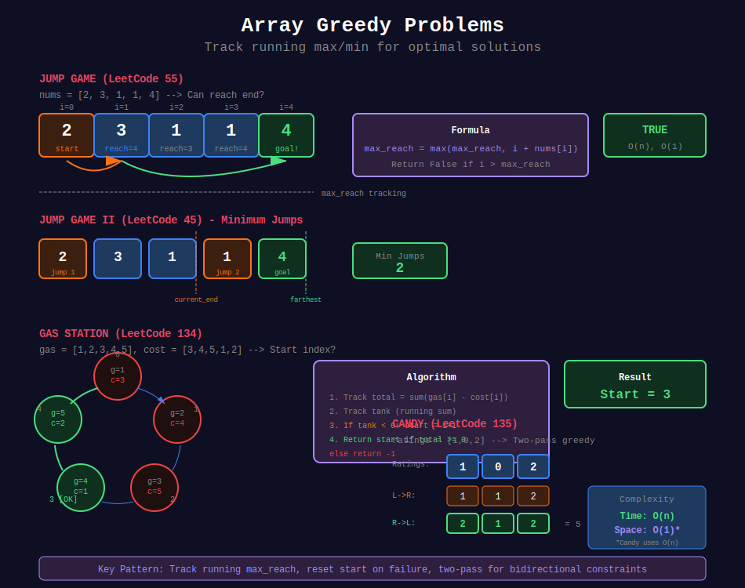

<div align="center">

# 📊 Array Greedy Problems



<p>
  
  
</p>

</div>

---

## 🧭 Navigation

| ⬅️ Previous | 📂 Current | ➡️ Next Topic |
|:------------|:----------:|--------:|
| [← 02. Task Scheduling](../02_task_scheduling/README.md) | **03. Array Greedy** | [🏠 Greedy Home](../README.md) → [Divide & Conquer](../../20_divide_and_conquer/README.md) |

---

## 📐 Mathematical Foundations

### 1️⃣ Jump Game

Track furthest reachable position:

```math
\text{max\_reach} = \max(\text{max\_reach}, i + nums[i])

```

---

### 2️⃣ Gas Station

**Key insight:** If total gas ≥ total cost, solution exists.

Start from position where running sum first becomes non-negative.

---

### 3️⃣ Candy Distribution

**Two-pass approach:**
1. Left to right: higher rating than left → more candy
2. Right to left: higher rating than right → more candy

---

## 💻 Code Implementations

```python
def canJump(nums: list[int]) -> bool:
    """
    Jump Game (LeetCode 55).
    
    Time: O(n), Space: O(1)
    """
    max_reach = 0
    
    for i, jump in enumerate(nums):
        if i > max_reach:
            return False
        max_reach = max(max_reach, i + jump)
    
    return True

def jump(nums: list[int]) -> int:
    """
    Jump Game II (LeetCode 45).
    
    Minimum jumps to reach end.
    
    Time: O(n), Space: O(1)
    """
    jumps = 0
    current_end = 0
    farthest = 0
    
    for i in range(len(nums) - 1):
        farthest = max(farthest, i + nums[i])
        
        if i == current_end:
            jumps += 1
            current_end = farthest
    
    return jumps

def canCompleteCircuit(gas: list[int], cost: list[int]) -> int:
    """
    Gas Station (LeetCode 134).
    
    Time: O(n), Space: O(1)
    """
    total = 0
    tank = 0
    start = 0
    
    for i in range(len(gas)):
        diff = gas[i] - cost[i]
        total += diff
        tank += diff
        
        if tank < 0:
            start = i + 1
            tank = 0
    
    return start if total >= 0 else -1

def candy(ratings: list[int]) -> int:
    """
    Candy (LeetCode 135).
    
    Time: O(n), Space: O(n)
    """
    n = len(ratings)
    candies = [1] * n
    
    # Left to right
    for i in range(1, n):
        if ratings[i] > ratings[i - 1]:
            candies[i] = candies[i - 1] + 1
    
    # Right to left
    for i in range(n - 2, -1, -1):
        if ratings[i] > ratings[i + 1]:
            candies[i] = max(candies[i], candies[i + 1] + 1)
    
    return sum(candies)

def wiggleMaxLength(nums: list[int]) -> int:
    """
    Wiggle Subsequence (LeetCode 376).
    
    Count peaks and valleys.
    
    Time: O(n), Space: O(1)
    """
    if len(nums) < 2:
        return len(nums)
    
    up = down = 1
    
    for i in range(1, len(nums)):
        if nums[i] > nums[i - 1]:
            up = down + 1
        elif nums[i] < nums[i - 1]:
            down = up + 1
    
    return max(up, down)

def maxProfit(prices: list[int]) -> int:
    """
    Best Time to Buy and Sell Stock II (LeetCode 122).
    
    Collect all upward slopes.
    
    Time: O(n), Space: O(1)
    """
    profit = 0
    for i in range(1, len(prices)):
        if prices[i] > prices[i - 1]:
            profit += prices[i] - prices[i - 1]
    return profit

```

---

## 🏆 LeetCode Problems

### 🟡 Medium

| # | Problem | Pattern | Time | Space |
|:-:|---------|---------|:----:|:-----:|
| 45 | [Jump Game II](https://leetcode.com/problems/jump-game-ii/) | BFS/Greedy | O(n) | O(1) |
| 55 | [Jump Game](https://leetcode.com/problems/jump-game/) | Max Reach | O(n) | O(1) |
| 122 | [Best Time II](https://leetcode.com/problems/best-time-to-buy-and-sell-stock-ii/) | All Gains | O(n) | O(1) |
| 134 | [Gas Station](https://leetcode.com/problems/gas-station/) | Running Sum | O(n) | O(1) |
| 376 | [Wiggle Subsequence](https://leetcode.com/problems/wiggle-subsequence/) | Peak Count | O(n) | O(1) |

### 🔴 Hard

| # | Problem | Pattern | Time | Space |
|:-:|---------|---------|:----:|:-----:|
| 135 | [Candy](https://leetcode.com/problems/candy/) | Two Pass | O(n) | O(n) |

---

## 📚 References

| Resource | Link |
|----------|------|
| **Greedy Problems** | [GeeksforGeeks](https://www.geeksforgeeks.org/greedy-algorithms/) |

---

<div align="center">

**Made with ❤️ by [Gaurav Goswami](https://github.com/Gaurav14cs17)**

</div>

---

## 🧭 Navigation

| ⬅️ Previous | 📂 Current | ➡️ Next Topic |
|:------------|:----------:|--------:|
| [← 02. Task Scheduling](../02_task_scheduling/README.md) | **03. Array Greedy** | [🏠 Greedy Home](../README.md) → [Divide & Conquer](../../20_divide_and_conquer/README.md) |
