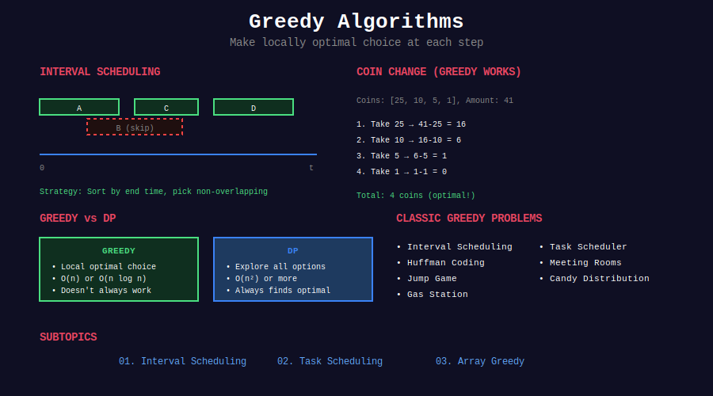

<div align="center">

# 🎯 Greedy Algorithms



<p>
  
  
  
</p>

**Make locally optimal choices to find global optimum**

[⬅️ Previous: Dynamic Programming](../18_dynamic_programming/README.md) | [🏠 Home](../README.md) | [Next: Divide & Conquer ➡️](../20_divide_and_conquer/README.md)

</div>

---

## 📐 Mathematical Foundation

### 1️⃣ Greedy Choice Property

At each step, make the choice that looks best right now.

$$
\text{Local optimum} \Rightarrow \text{Global optimum}
$$

**Warning:** This only works for specific problem types!

---

### 2️⃣ Optimal Substructure

After making a greedy choice, the remaining subproblem is also optimal.

---

### 3️⃣ Greedy vs Dynamic Programming

| Aspect | Greedy | DP |
|--------|--------|-----|
| Choices | One best choice | Try all choices |
| Subproblems | One subproblem | Multiple subproblems |
| Speed | Usually faster | May be slower |
| Correctness | Need proof | Always correct |

---

### 4️⃣ Exchange Argument

**Proof technique:** Show that any solution can be transformed to greedy solution without loss.

If non-greedy choice exists, swap it with greedy choice → solution doesn't worsen.

---

### 5️⃣ Activity Selection Proof

**Claim:** Greedy (select earliest finish time) is optimal.

**Proof:**
1. Let $A$ be greedy solution, $O$ be optimal
2. If first activities differ, swap $O$'s first with $A$'s first
3. $O$ doesn't worsen (greedy ends earliest)
4. By induction, $|A| = |O|$ ∎

---

## 📂 Subtopics Navigation

| # | Topic | Problems | Link |
|:-:|-------|:--------:|------|
| 1 | Interval Scheduling | 10+ | [📖 Go →](./01_interval_scheduling/README.md) |
| 2 | Task Scheduling | 8+ | [📖 Go →](./02_task_scheduling/README.md) |
| 3 | Array Greedy | 10+ | [📖 Go →](./03_array_greedy/README.md) |

---

## 🎯 Key Patterns

### Interval Scheduling

```python
def eraseOverlapIntervals(intervals: list[list[int]]) -> int:
    """
    Minimum removals to make non-overlapping.
    
    Greedy: Keep interval with earliest end time.
    
    Time: O(n log n), Space: O(1)
    """
    if not intervals:
        return 0
    
    intervals.sort(key=lambda x: x[1])
    end = intervals[0][1]
    removals = 0
    
    for i in range(1, len(intervals)):
        if intervals[i][0] < end:
            removals += 1
        else:
            end = intervals[i][1]
    
    return removals
```

### Jump Game

```python
def canJump(nums: list[int]) -> bool:
    """
    Can reach last index?
    
    Track furthest reachable position.
    
    Time: O(n), Space: O(1)
    """
    max_reach = 0
    
    for i, jump in enumerate(nums):
        if i > max_reach:
            return False
        max_reach = max(max_reach, i + jump)
    
    return True
```

---

## 🏆 LeetCode Problems

### 🟢 Easy

| # | Problem | Pattern | Time | Space |
|:-:|---------|---------|:----:|:-----:|
| 455 | [Assign Cookies](https://leetcode.com/problems/assign-cookies/) | Sort + Two Ptr | O(n log n) | O(1) |
| 860 | [Lemonade Change](https://leetcode.com/problems/lemonade-change/) | Greedy Change | O(n) | O(1) |
| 1005 | [Maximize Sum After K Negations](https://leetcode.com/problems/maximize-sum-of-array-after-k-negations/) | Sort | O(n log n) | O(1) |

### 🟡 Medium

| # | Problem | Pattern | Time | Space |
|:-:|---------|---------|:----:|:-----:|
| 45 | [Jump Game II](https://leetcode.com/problems/jump-game-ii/) | BFS/Greedy | O(n) | O(1) |
| 55 | [Jump Game](https://leetcode.com/problems/jump-game/) | Max Reach | O(n) | O(1) |
| 134 | [Gas Station](https://leetcode.com/problems/gas-station/) | Circular | O(n) | O(1) |
| 253 | [Meeting Rooms II](https://leetcode.com/problems/meeting-rooms-ii/) | Heap | O(n log n) | O(n) |
| 376 | [Wiggle Subsequence](https://leetcode.com/problems/wiggle-subsequence/) | Peak Count | O(n) | O(1) |
| 406 | [Queue Reconstruction](https://leetcode.com/problems/queue-reconstruction-by-height/) | Sort + Insert | O(n²) | O(n) |
| 435 | [Non-overlapping Intervals](https://leetcode.com/problems/non-overlapping-intervals/) | Interval | O(n log n) | O(1) |
| 452 | [Minimum Arrows](https://leetcode.com/problems/minimum-number-of-arrows-to-burst-balloons/) | Interval | O(n log n) | O(1) |
| 621 | [Task Scheduler](https://leetcode.com/problems/task-scheduler/) | Frequency | O(n) | O(1) |
| 763 | [Partition Labels](https://leetcode.com/problems/partition-labels/) | Last Occurrence | O(n) | O(1) |
| 1024 | [Video Stitching](https://leetcode.com/problems/video-stitching/) | Interval Cover | O(n log n) | O(1) |

### 🔴 Hard

| # | Problem | Pattern | Time | Space |
|:-:|---------|---------|:----:|:-----:|
| 135 | [Candy](https://leetcode.com/problems/candy/) | Two Pass | O(n) | O(n) |
| 330 | [Patching Array](https://leetcode.com/problems/patching-array/) | Range Cover | O(log n) | O(1) |
| 630 | [Course Schedule III](https://leetcode.com/problems/course-schedule-iii/) | Heap | O(n log n) | O(n) |
| 1326 | [Minimum Taps](https://leetcode.com/problems/minimum-number-of-taps-to-open-to-water-a-garden/) | Interval Cover | O(n) | O(n) |

---

## 📊 Greedy Pattern Decision

```
Greedy Problem
      |
      +-- Intervals → Sort by end time
      |
      +-- Task scheduling → Frequency + idle slots
      |
      +-- Array optimization → Track running max/min
      |
      +-- Assignment → Sort both, match greedily
      |
      +-- Always verify greedy works!
```

---

## 📚 References

| Resource | Link |
|----------|------|
| **Greedy Algorithms** | [Wikipedia](https://en.wikipedia.org/wiki/Greedy_algorithm) |
| **Activity Selection** | [GeeksforGeeks](https://www.geeksforgeeks.org/activity-selection-problem-greedy-algo-1/) |
| **Exchange Argument** | [Jeff Erickson](http://jeffe.cs.illinois.edu/teaching/algorithms/) |

---

<div align="center">

**Made with ❤️ by [Gaurav Goswami](https://github.com/Gaurav14cs17)**

[⬅️ Previous: Dynamic Programming](../18_dynamic_programming/README.md) | [🏠 Home](../README.md) | [Next: Divide & Conquer ➡️](../20_divide_and_conquer/README.md)

</div>
