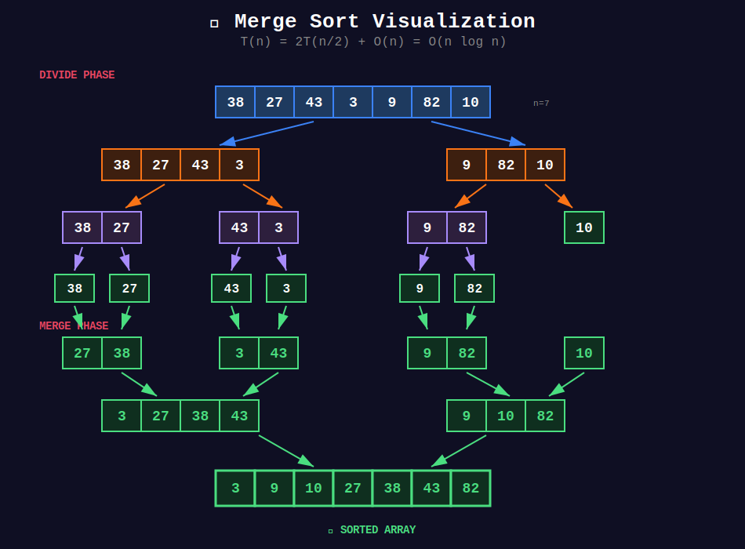
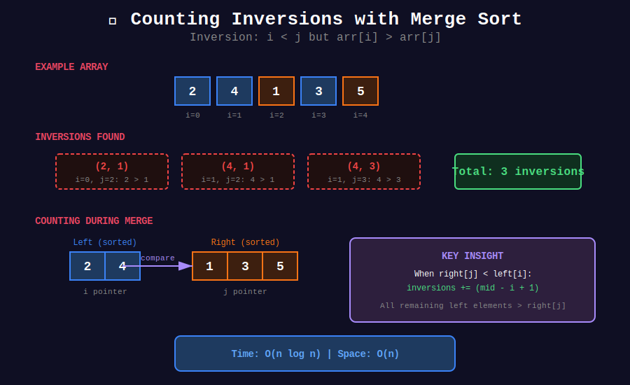

<div align="center">

# 🔀 Merge Sort Pattern

<p>
  
  
</p>

</div>

---

## 🧭 Navigation

| ⬅️ Previous | 📂 Current | ➡️ Next |
|:------------|:----------:|--------:|
| [🏠 D&C Home](../README.md) | **01. Merge Sort Pattern** | [02. Quick Select →](../02_quick_select/README.md) |

---

## 🖼️ Visual Overview

<div align="center">
  
</div>

<details>
<summary>📊 Counting Inversions Visualization</summary>

<div align="center">
  
</div>

</details>

---

## 📐 Mathematical Foundations

### 1️⃣ Merge Sort Recurrence

```math
T(n) = 2T(n/2) + O(n) = O(n \log n)

```

---

### 2️⃣ Counting Inversions

Count pairs $(i, j)$ where $i < j$ but $arr[i] > arr[j]$:

```math
\text{inversions} = \text{left_inv} + \text{right_inv} + \text{split_inv}

```

Split inversions counted during merge.

---

### 3️⃣ Merge Sort Properties

- **Stable:** Equal elements maintain relative order

- **Not in-place:** Requires $O(n)$ auxiliary space

- **Optimal for linked lists:** No random access needed

---

## 💻 Code Implementations

```python
def sortArray(nums: list[int]) -> list[int]:
    """
    Sort an Array (LeetCode 912).
    
    Time: O(n log n), Space: O(n)
    """
    def merge_sort(arr):
        if len(arr) <= 1:
            return arr
        
        mid = len(arr) // 2
        left = merge_sort(arr[:mid])
        right = merge_sort(arr[mid:])
        
        return merge(left, right)
    
    def merge(left, right):
        result = []
        i = j = 0
        
        while i < len(left) and j < len(right):
            if left[i] <= right[j]:
                result.append(left[i])
                i += 1
            else:
                result.append(right[j])
                j += 1
        
        result.extend(left[i:])
        result.extend(right[j:])
        return result
    
    return merge_sort(nums)

def countSmaller(nums: list[int]) -> list[int]:
    """
    Count of Smaller Numbers After Self (LeetCode 315).
    
    Time: O(n log n), Space: O(n)
    """
    def merge_count(indices):
        if len(indices) <= 1:
            return indices
        
        mid = len(indices) // 2
        left = merge_count(indices[:mid])
        right = merge_count(indices[mid:])
        
        result = []
        i = j = 0
        right_count = 0
        
        while i < len(left) and j < len(right):
            if nums[left[i]] > nums[right[j]]:
                right_count += 1
                result.append(right[j])
                j += 1
            else:
                counts[left[i]] += right_count
                result.append(left[i])
                i += 1
        
        while i < len(left):
            counts[left[i]] += right_count
            result.append(left[i])
            i += 1
        
        result.extend(right[j:])
        return result
    
    n = len(nums)
    counts = [0] * n
    merge_count(list(range(n)))
    return counts

def reversePairs(nums: list[int]) -> int:
    """
    Reverse Pairs (LeetCode 493).
    
    Count pairs where i < j and nums[i] > 2 * nums[j].
    
    Time: O(n log n), Space: O(n)
    """
    def merge_count(arr):
        if len(arr) <= 1:
            return 0
        
        mid = len(arr) // 2
        left = arr[:mid]
        right = arr[mid:]
        
        count = merge_count(left) + merge_count(right)
        
        # Count reverse pairs
        j = 0
        for i in range(len(left)):
            while j < len(right) and left[i] > 2 * right[j]:
                j += 1
            count += j
        
        # Merge
        arr[:] = sorted(arr)
        return count
    
    return merge_count(nums)

def mergeKLists(lists: list) -> 'ListNode':
    """
    Merge K Sorted Lists (LeetCode 23).
    
    Time: O(n log k), Space: O(log k)
    """
    def merge_two(l1, l2):
        dummy = ListNode(0)
        curr = dummy
        
        while l1 and l2:
            if l1.val <= l2.val:
                curr.next = l1
                l1 = l1.next
            else:
                curr.next = l2
                l2 = l2.next
            curr = curr.next
        
        curr.next = l1 or l2
        return dummy.next
    
    def merge_range(start, end):
        if start > end:
            return None
        if start == end:
            return lists[start]
        
        mid = (start + end) // 2
        left = merge_range(start, mid)
        right = merge_range(mid + 1, end)
        
        return merge_two(left, right)
    
    return merge_range(0, len(lists) - 1)

```

---

## 🏆 LeetCode Problems

### 🟡 Medium

| # | Problem | Pattern | Time | Space |
|:-:|---------|---------|:----:|:-----:|
| 148 | [Sort List](https://leetcode.com/problems/sort-list/) | Linked List Merge | O(n log n) | O(log n) |
| 912 | [Sort an Array](https://leetcode.com/problems/sort-an-array/) | Basic Merge Sort | O(n log n) | O(n) |

### 🔴 Hard

| # | Problem | Pattern | Time | Space |
|:-:|---------|---------|:----:|:-----:|
| 23 | [Merge K Sorted Lists](https://leetcode.com/problems/merge-k-sorted-lists/) | D&C Merge | O(n log k) | O(log k) |
| 315 | [Count Smaller After Self](https://leetcode.com/problems/count-of-smaller-numbers-after-self/) | Index Tracking | O(n log n) | O(n) |
| 493 | [Reverse Pairs](https://leetcode.com/problems/reverse-pairs/) | Count During Merge | O(n log n) | O(n) |

---

## 📚 References

| Resource | Link |
|----------|------|
| **Merge Sort** | [Wikipedia](https://en.wikipedia.org/wiki/Merge_sort) |

---

<div align="center">

**Made with ❤️ by [Gaurav Goswami](https://github.com/Gaurav14cs17)**

</div>

---

## 🧭 Navigation

| ⬅️ Previous | 📂 Current | ➡️ Next |
|:------------|:----------:|--------:|
| [🏠 D&C Home](../README.md) | **01. Merge Sort Pattern** | [02. Quick Select →](../02_quick_select/README.md) |
