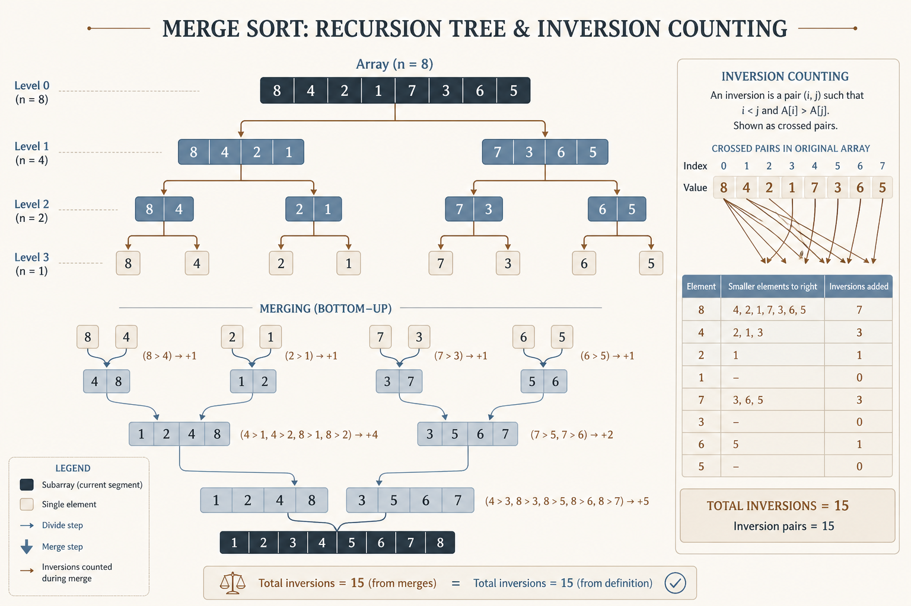
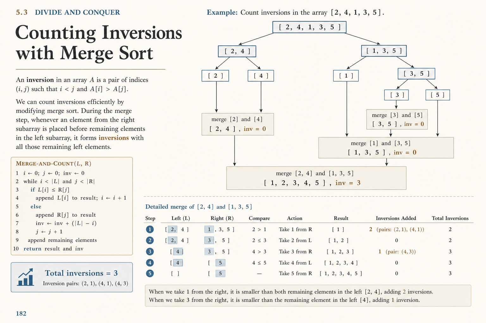
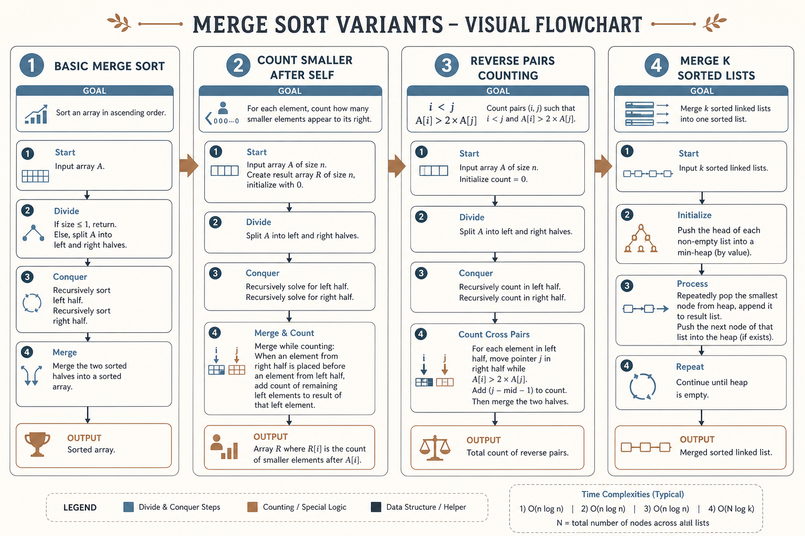

# 🔀 Merge Sort Pattern

### *Master Merge Sort Pattern — patterns, proofs, and code*

  
  

---

## 📊 Visual Overview

  

📊 Counting Inversions Visualization

  

---

---

---

## 🎯 At a Glance

| | |
|:---|:---|
| **Topic** | 🔀 Merge Sort Pattern |
| **Difficulty** | Medium to Hard |
| **Problems** | 8+ |

> **How to use this page:** Start with the visual overview, scan **At a Glance**, then work through theory → walkthroughs → code.

---

## 🧭 Navigation

| ⬅️ Previous | 📂 Current | ➡️ Next |
|:------------|:----------:|--------:|
| [🏠 D&C Home](../README.md) | **01. Merge Sort Pattern** | [02. Quick Select →](../02_quick_select/README.md) |

---

## 📐 Mathematical Foundation
### 1️⃣ Merge Sort Recurrence

$$T(n) = 2T(n/2) + O(n) = O(n \log n)$$

---

### 2️⃣ Counting Inversions

Count pairs $(i, j)$ where $i < j$ but $arr[i] > arr[j]$:

$$\text{inversions} = \text{left inv} + \text{right inv} + \text{split inv}$$

Split inversions counted during merge.

---

### 3️⃣ Merge Sort Properties

- **Stable:** Equal elements maintain relative order

- **Not in-place:** Requires $O(n)$ auxiliary space

- **Optimal for linked lists:** No random access needed

---

## 💻 Code Implementations

---

## 🏆 LeetCode Problems

### 🟡 Medium

| # | Problem | Pattern | Time | Space |
|:-:|---------|---------|:----:|:-----:|
| 148 | [Sort List](https://leetcode.com/problems/sort-list/) | Linked List Merge | O(n log n) | O(log n) |
| 912 | [Sort an Array](https://leetcode.com/problems/sort-an-array/) | Basic Merge Sort | O(n log n) | O(n) |

### 🔴 Hard

| # | Problem | Pattern | Time | Space |
|:-:|---------|---------|:----:|:-----:|
| 23 | [Merge K Sorted Lists](https://leetcode.com/problems/merge-k-sorted-lists/) | D&C Merge | O(n log k) | O(log k) |
| 315 | [Count Smaller After Self](https://leetcode.com/problems/count-of-smaller-numbers-after-self/) | Index Tracking | O(n log n) | O(n) |
| 493 | [Reverse Pairs](https://leetcode.com/problems/reverse-pairs/) | Count During Merge | O(n log n) | O(n) |

---

## 📚 References

| Resource | Link |
|----------|------|
| **Merge Sort** | [Wikipedia](https://en.wikipedia.org/wiki/Merge_sort) |

---

**Made with ❤️ by [Gaurav Goswami](https://github.com/Gaurav14cs17)**

---
