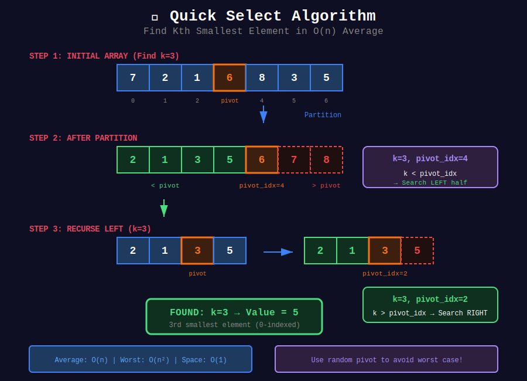
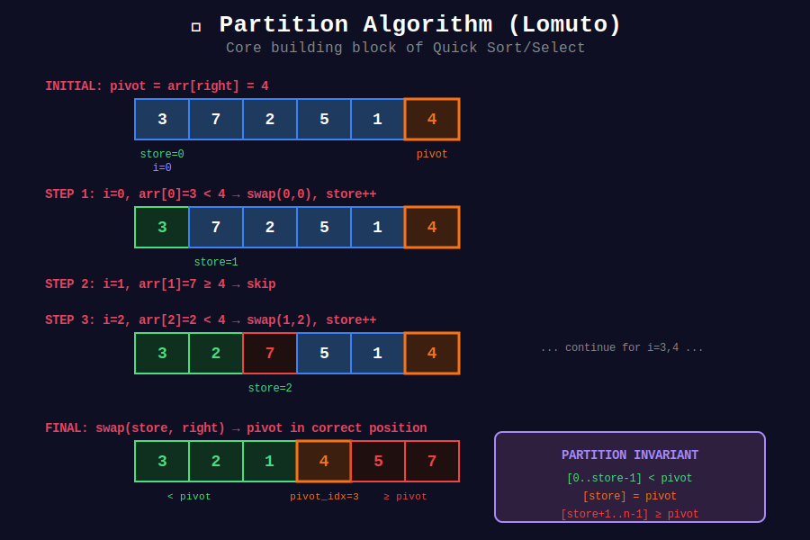

<div align="center">

# ⚡ Quick Select

<p>
  
  
</p>

</div>

---

## 🧭 Navigation

| ⬅️ Previous | 📂 Current | ➡️ Next |
|:------------|:----------:|--------:|
| [← 01. Merge Sort Pattern](../01_merge_sort_pattern/README.md) | **02. Quick Select** | [03. Binary Search D&C →](../03_binary_search_dc/README.md) |

---

## 🖼️ Visual Overview

<div align="center">
  
</div>

<details>
<summary>🔄 Partition Algorithm Visualization</summary>

<div align="center">
  
</div>

</details>

---

## 📐 Mathematical Foundations

### 1️⃣ Quick Select Complexity

**Average case:**

```math
T(n) = T(n/2) + O(n) = O(n)

```

**Worst case (bad pivots):**

```math
T(n) = T(n-1) + O(n) = O(n^2)

```

---

### 2️⃣ Median of Medians

Guaranteed $O(n)$ by choosing better pivot:
1. Divide into groups of 5
2. Find median of each group
3. Recursively find median of medians
4. Use as pivot

---

### 3️⃣ Partition Invariant

After partition with pivot at index $p$:
- Elements $[0, p-1]$: all $\leq$ pivot
- Element $[p]$: pivot
- Elements $[p+1, n-1]$: all $\geq$ pivot

---

## 💻 Code Implementations

```python
def findKthLargest(nums: list[int], k: int) -> int:
    """
    Kth Largest Element (LeetCode 215).
    
    Average: O(n), Worst: O(n²)
    """
    import random
    
    k = len(nums) - k  # Convert to kth smallest
    
    def partition(left, right):
        pivot_idx = random.randint(left, right)
        pivot = nums[pivot_idx]
        
        # Move pivot to end
        nums[pivot_idx], nums[right] = nums[right], nums[pivot_idx]
        
        store = left
        for i in range(left, right):
            if nums[i] < pivot:
                nums[store], nums[i] = nums[i], nums[store]
                store += 1
        
        nums[store], nums[right] = nums[right], nums[store]
        return store
    
    left, right = 0, len(nums) - 1
    
    while left <= right:
        pivot_idx = partition(left, right)
        
        if pivot_idx == k:
            return nums[k]
        elif pivot_idx < k:
            left = pivot_idx + 1
        else:
            right = pivot_idx - 1
    
    return nums[k]

def topKFrequent(nums: list[int], k: int) -> list[int]:
    """
    Top K Frequent Elements (LeetCode 347).
    
    Time: O(n) average, Space: O(n)
    """
    from collections import Counter
    import random
    
    freq = Counter(nums)
    unique = list(freq.keys())
    n = len(unique)
    
    def partition(left, right):
        pivot_idx = random.randint(left, right)
        pivot_freq = freq[unique[pivot_idx]]
        
        unique[pivot_idx], unique[right] = unique[right], unique[pivot_idx]
        
        store = left
        for i in range(left, right):
            if freq[unique[i]] > pivot_freq:
                unique[store], unique[i] = unique[i], unique[store]
                store += 1
        
        unique[store], unique[right] = unique[right], unique[store]
        return store
    
    left, right = 0, n - 1
    
    while left <= right:
        pivot_idx = partition(left, right)
        
        if pivot_idx == k - 1:
            return unique[:k]
        elif pivot_idx < k - 1:
            left = pivot_idx + 1
        else:
            right = pivot_idx - 1
    
    return unique[:k]

def wiggleSort(nums: list[int]) -> None:
    """
    Wiggle Sort II (LeetCode 324).
    
    Find median, then 3-way partition.
    
    Time: O(n), Space: O(n)
    """
    n = len(nums)
    median = findKthLargest(nums.copy(), (n + 1) // 2)
    
    # Virtual indexing for in-place
    def index(i):
        return (1 + 2 * i) % (n | 1)
    
    left, i, right = 0, 0, n - 1
    
    while i <= right:
        if nums[index(i)] > median:
            nums[index(left)], nums[index(i)] = nums[index(i)], nums[index(left)]
            left += 1
            i += 1
        elif nums[index(i)] < median:
            nums[index(right)], nums[index(i)] = nums[index(i)], nums[index(right)]
            right -= 1
        else:
            i += 1

```

---

## 🏆 LeetCode Problems

### 🟡 Medium

| # | Problem | Pattern | Time | Space |
|:-:|---------|---------|:----:|:-----:|
| 215 | [Kth Largest](https://leetcode.com/problems/kth-largest-element-in-an-array/) | Quick Select | O(n) avg | O(1) |
| 324 | [Wiggle Sort II](https://leetcode.com/problems/wiggle-sort-ii/) | Median + Partition | O(n) | O(n) |
| 347 | [Top K Frequent](https://leetcode.com/problems/top-k-frequent-elements/) | Quick Select | O(n) avg | O(n) |
| 973 | [K Closest Points](https://leetcode.com/problems/k-closest-points-to-origin/) | Quick Select | O(n) avg | O(1) |

---

## 📚 References

| Resource | Link |
|----------|------|
| **Quick Select** | [Wikipedia](https://en.wikipedia.org/wiki/Quickselect) |
| **Median of Medians** | [Wikipedia](https://en.wikipedia.org/wiki/Median_of_medians) |

---

<div align="center">

**Made with ❤️ by [Gaurav Goswami](https://github.com/Gaurav14cs17)**

</div>

---

## 🧭 Navigation

| ⬅️ Previous | 📂 Current | ➡️ Next |
|:------------|:----------:|--------:|
| [← 01. Merge Sort Pattern](../01_merge_sort_pattern/README.md) | **02. Quick Select** | [03. Binary Search D&C →](../03_binary_search_dc/README.md) |
