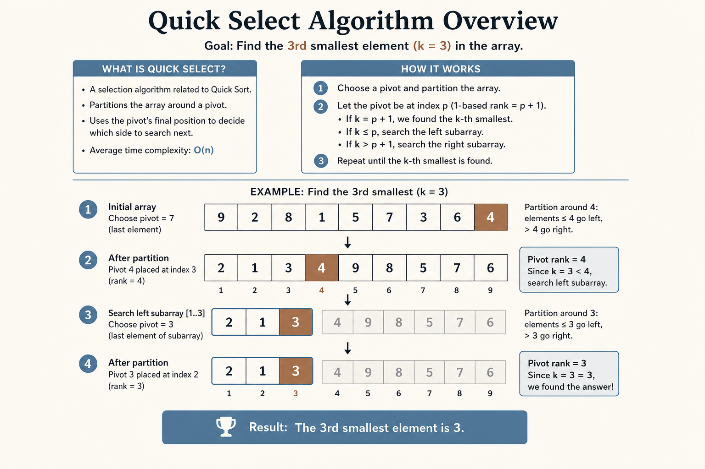
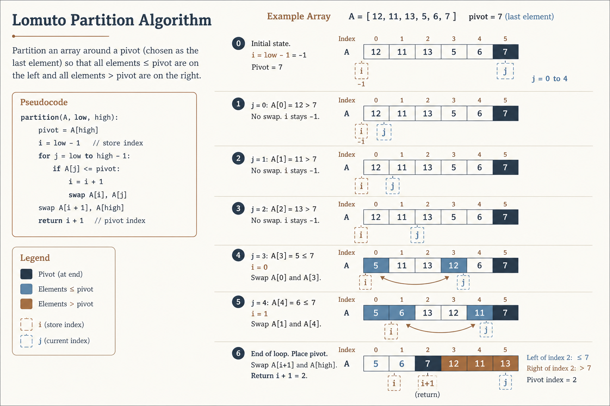
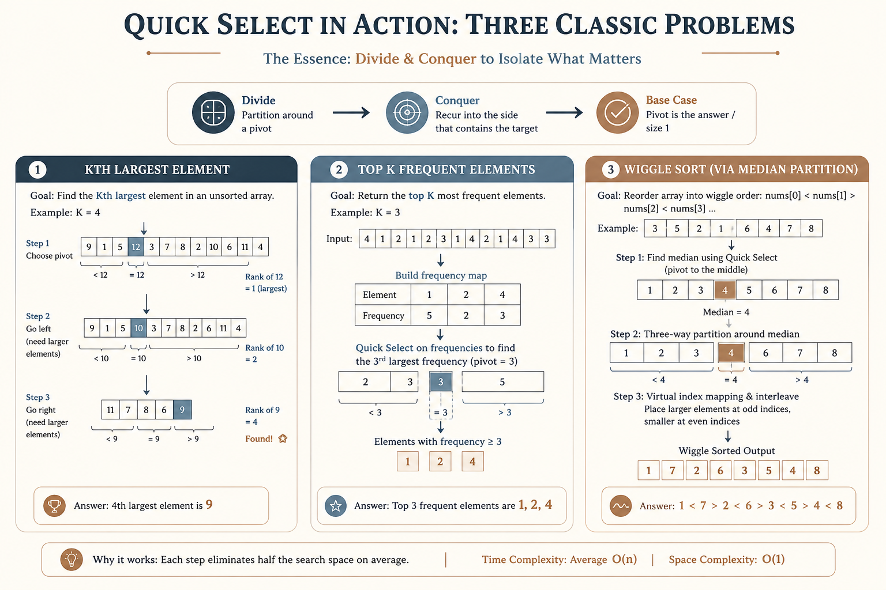

# ⚡ Quick Select

### *Master Quick Select — patterns, proofs, and code*

  
  

---

## 📊 Visual Overview

  

🔄 Partition Algorithm Visualization

  

---

---

---

## 🎯 At a Glance

| | |
|:---|:---|
| **Topic** | ⚡ Quick Select |
| **Difficulty** | Medium |
| **Problems** | 6+ |

> **How to use this page:** Start with the visual overview, scan **At a Glance**, then work through theory → walkthroughs → code.

---

## 🧭 Navigation

| ⬅️ Previous | 📂 Current | ➡️ Next |
|:------------|:----------:|--------:|
| [← 01. Merge Sort Pattern](../01_merge_sort_pattern/README.md) | **02. Quick Select** | [03. Binary Search D&C →](../03_binary_search_dc/README.md) |

---

## 📐 Mathematical Foundation
### 1️⃣ Quick Select Complexity

**Average case:**

$$T(n) = T(n/2) + O(n) = O(n)$$

**Worst case (bad pivots):**

$$T(n) = T(n-1) + O(n) = O(n^2)$$

---

### 2️⃣ Median of Medians

Guaranteed $O(n)$ by choosing better pivot:

1. Divide into groups of 5
2. Find median of each group

3. Recursively find median of medians

4. Use as pivot

---

### 3️⃣ Partition Invariant

After partition with pivot at index $p$:

- Elements $[0, p-1]$: all $\leq$ pivot

- Element $[p]$: pivot

- Elements $[p+1, n-1]$: all $\geq$ pivot

---

## 💻 Code Implementations

---

## 🏆 LeetCode Problems

### 🟡 Medium

| # | Problem | Pattern | Time | Space |
|:-:|---------|---------|:----:|:-----:|
| 215 | [Kth Largest](https://leetcode.com/problems/kth-largest-element-in-an-array/) | Quick Select | O(n) avg | O(1) |
| 324 | [Wiggle Sort II](https://leetcode.com/problems/wiggle-sort-ii/) | Median + Partition | O(n) | O(n) |
| 347 | [Top K Frequent](https://leetcode.com/problems/top-k-frequent-elements/) | Quick Select | O(n) avg | O(n) |
| 973 | [K Closest Points](https://leetcode.com/problems/k-closest-points-to-origin/) | Quick Select | O(n) avg | O(1) |

---

## 📚 References

| Resource | Link |
|----------|------|
| **Quick Select** | [Wikipedia](https://en.wikipedia.org/wiki/Quickselect) |
| **Median of Medians** | [Wikipedia](https://en.wikipedia.org/wiki/Median_of_medians) |

---

**Made with ❤️ by [Gaurav Goswami](https://github.com/Gaurav14cs17)**

---
