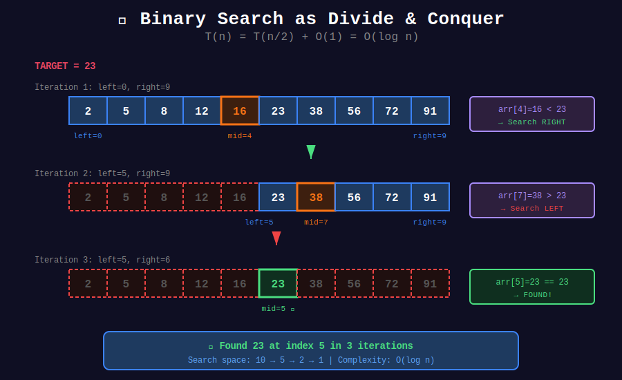
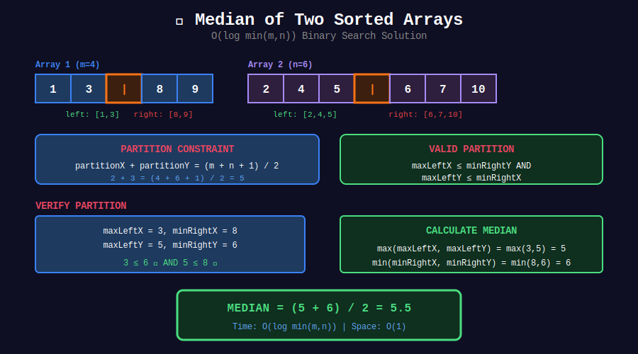

<div align="center">

# 🔍 Binary Search as D&C

<p>
  
  
</p>

</div>

---

## 🧭 Navigation

| ⬅️ Previous | 📂 Current | ➡️ Next Topic |
|:------------|:----------:|--------:|
| [← 02. Quick Select](../02_quick_select/README.md) | **03. Binary Search D&C** | [🏠 D&C Home](../README.md) → [Bit Manipulation](../../21_bit_manipulation/README.md) |

---

## 🖼️ Visual Overview

<div align="center">
  
</div>

<details>
<summary>📊 Median of Two Sorted Arrays Visualization</summary>

<div align="center">
  
</div>

</details>

---

## 📐 Mathematical Foundations

### 1️⃣ Binary Search Recurrence

```math
T(n) = T(n/2) + O(1) = O(\log n)

```

---

### 2️⃣ Median of Two Sorted Arrays

Find position where:

```math
\text{partitionX} + \text{partitionY} = \frac{m + n + 1}{2}

```

Such that:

```math
\max(\text{leftX}, \text{leftY}) \leq \min(\text{rightX}, \text{rightY})

```

---

### 3️⃣ Search Space Reduction

Each step eliminates half the search space:

```math
n \to \frac{n}{2} \to \frac{n}{4} \to \cdots \to 1

```

Steps: $\log_2 n$

---

## 💻 Code Implementations

```python
def findMedianSortedArrays(nums1: list[int], nums2: list[int]) -> float:
    """
    Median of Two Sorted Arrays (LeetCode 4).
    
    Time: O(log min(m,n)), Space: O(1)
    """
    if len(nums1) > len(nums2):
        nums1, nums2 = nums2, nums1
    
    m, n = len(nums1), len(nums2)
    left, right = 0, m
    
    while left <= right:
        partitionX = (left + right) // 2
        partitionY = (m + n + 1) // 2 - partitionX
        
        maxLeftX = float('-inf') if partitionX == 0 else nums1[partitionX - 1]
        minRightX = float('inf') if partitionX == m else nums1[partitionX]
        
        maxLeftY = float('-inf') if partitionY == 0 else nums2[partitionY - 1]
        minRightY = float('inf') if partitionY == n else nums2[partitionY]
        
        if maxLeftX <= minRightY and maxLeftY <= minRightX:
            if (m + n) % 2 == 0:
                return (max(maxLeftX, maxLeftY) + min(minRightX, minRightY)) / 2
            else:
                return max(maxLeftX, maxLeftY)
        elif maxLeftX > minRightY:
            right = partitionX - 1
        else:
            left = partitionX + 1
    
    return 0.0

def searchMatrix(matrix: list[list[int]], target: int) -> bool:
    """
    Search a 2D Matrix II (LeetCode 240).
    
    D&C approach: eliminate quadrants.
    
    Time: O(m + n), Space: O(1)
    """
    if not matrix or not matrix[0]:
        return False
    
    m, n = len(matrix), len(matrix[0])
    row, col = 0, n - 1
    
    while row < m and col >= 0:
        if matrix[row][col] == target:
            return True
        elif matrix[row][col] > target:
            col -= 1
        else:
            row += 1
    
    return False

def maxSubArray(nums: list[int]) -> int:
    """
    Maximum Subarray (LeetCode 53).
    
    D&C approach.
    
    Time: O(n log n), Space: O(log n)
    """
    def divide_conquer(left, right):
        if left > right:
            return float('-inf')
        if left == right:
            return nums[left]
        
        mid = (left + right) // 2
        
        # Maximum in left half
        left_max = divide_conquer(left, mid)
        
        # Maximum in right half
        right_max = divide_conquer(mid + 1, right)
        
        # Maximum crossing the middle
        cross_max = cross_sum(left, right, mid)
        
        return max(left_max, right_max, cross_max)
    
    def cross_sum(left, right, mid):
        # Left half contribution
        left_sum = float('-inf')
        curr_sum = 0
        for i in range(mid, left - 1, -1):
            curr_sum += nums[i]
            left_sum = max(left_sum, curr_sum)
        
        # Right half contribution
        right_sum = float('-inf')
        curr_sum = 0
        for i in range(mid + 1, right + 1):
            curr_sum += nums[i]
            right_sum = max(right_sum, curr_sum)
        
        return left_sum + right_sum
    
    return divide_conquer(0, len(nums) - 1)

```

---

## 🏆 LeetCode Problems

### 🟡 Medium

| # | Problem | Pattern | Time | Space |
|:-:|---------|---------|:----:|:-----:|
| 53 | [Maximum Subarray](https://leetcode.com/problems/maximum-subarray/) | D&C Cross | O(n log n) | O(log n) |
| 240 | [Search 2D Matrix II](https://leetcode.com/problems/search-a-2d-matrix-ii/) | Staircase | O(m+n) | O(1) |

### 🔴 Hard

| # | Problem | Pattern | Time | Space |
|:-:|---------|---------|:----:|:-----:|
| 4 | [Median of Two Sorted Arrays](https://leetcode.com/problems/median-of-two-sorted-arrays/) | Binary Partition | O(log min) | O(1) |

---

## 📚 References

| Resource | Link |
|----------|------|
| **Binary Search** | [Wikipedia](https://en.wikipedia.org/wiki/Binary_search_algorithm) |

---

<div align="center">

**Made with ❤️ by [Gaurav Goswami](https://github.com/Gaurav14cs17)**

</div>

---

## 🧭 Navigation

| ⬅️ Previous | 📂 Current | ➡️ Next Topic |
|:------------|:----------:|--------:|
| [← 02. Quick Select](../02_quick_select/README.md) | **03. Binary Search D&C** | [🏠 D&C Home](../README.md) → [Bit Manipulation](../../21_bit_manipulation/README.md) |
