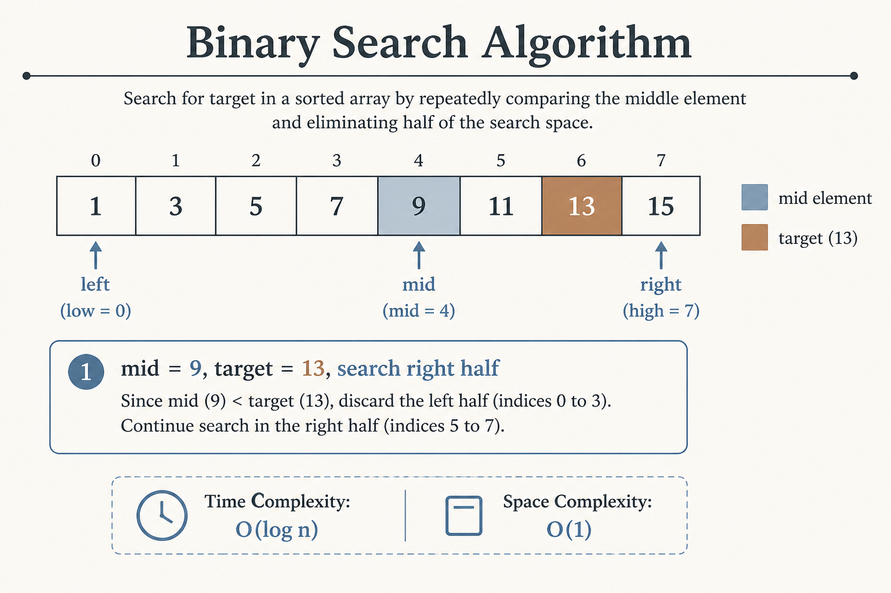
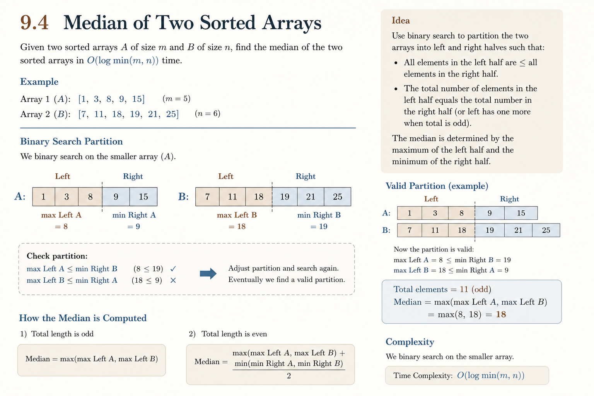
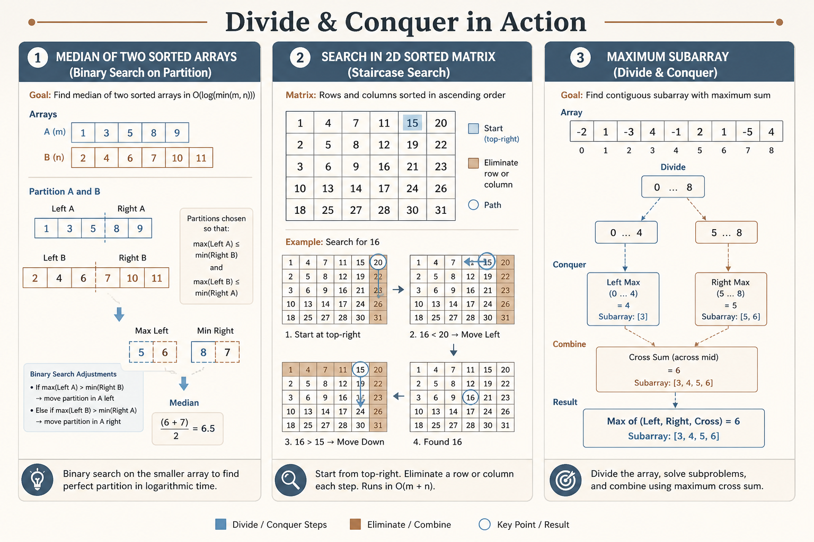

# 🔍 Binary Search as D&C

### *Master Binary Search as D&C — patterns, proofs, and code*

  
  

---

## 📊 Visual Overview

  

📊 Median of Two Sorted Arrays Visualization

  

---

---

---

## 🎯 At a Glance

| | |
|:---|:---|
| **Topic** | 🔍 Binary Search as D&C |
| **Difficulty** | Medium to Hard |
| **Problems** | 6+ |

{: .highlight }
> **How to use this page:** Start with the visual overview, scan **At a Glance**, then work through theory → walkthroughs → code.

---

## 🧭 Navigation

| ⬅️ Previous | 📂 Current | ➡️ Next Topic |
|:------------|:----------:|--------:|
| [← 02. Quick Select](../02_quick_select/README.md) | **03. Binary Search D&C** | [🏠 D&C Home](../README.md) → [Bit Manipulation](../../21_bit_manipulation/README.md) |

---

## 📐 Mathematical Foundation
### 1️⃣ Binary Search Recurrence

$$T(n) = T(n/2) + O(1) = O(\log n)$$

---

### 2️⃣ Median of Two Sorted Arrays

Find position where:

$$\text{partitionX} + \text{partitionY} = \frac{m + n + 1}{2}$$

Such that:

$$\max(\text{leftX}, \text{leftY}) \leq \min(\text{rightX}, \text{rightY})$$

---

### 3️⃣ Search Space Reduction

Each step eliminates half the search space:

$$n \to \frac{n}{2} \to \frac{n}{4} \to \cdots \to 1$$

Steps: $\log_2 n$

---

## 💻 Code Implementations

---

## 🏆 LeetCode Problems

### 🟡 Medium

| # | Problem | Pattern | Time | Space |
|:-:|---------|---------|:----:|:-----:|
| 53 | [Maximum Subarray](https://leetcode.com/problems/maximum-subarray/) | D&C Cross | O(n log n) | O(log n) |
| 240 | [Search 2D Matrix II](https://leetcode.com/problems/search-a-2d-matrix-ii/) | Staircase | O(m+n) | O(1) |

### 🔴 Hard

| # | Problem | Pattern | Time | Space |
|:-:|---------|---------|:----:|:-----:|
| 4 | [Median of Two Sorted Arrays](https://leetcode.com/problems/median-of-two-sorted-arrays/) | Binary Partition | O(log min) | O(1) |

---

## 📚 References

| Resource | Link |
|----------|------|
| **Binary Search** | [Wikipedia](https://en.wikipedia.org/wiki/Binary_search_algorithm) |

---

**Made with ❤️ by [Gaurav Goswami](https://github.com/Gaurav14cs17)**

---
