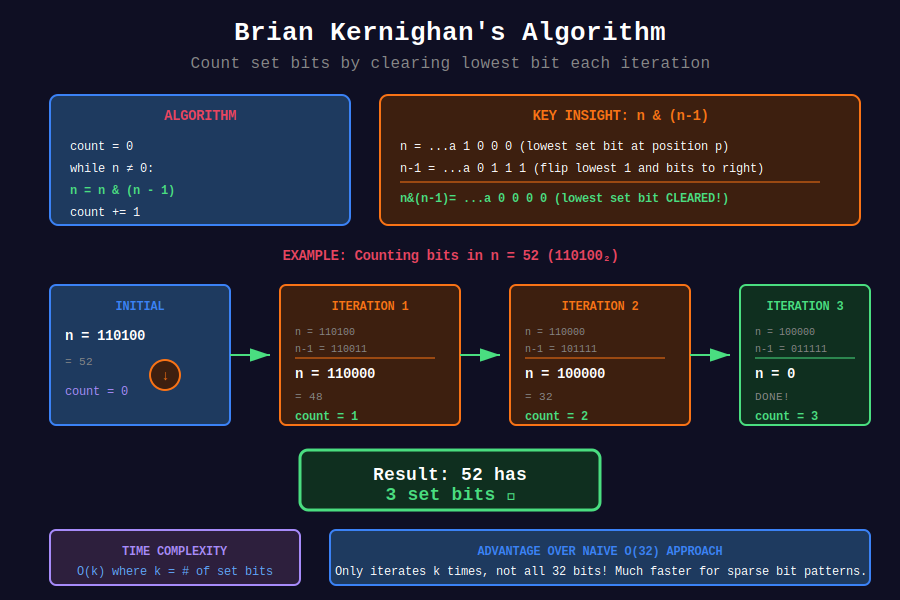
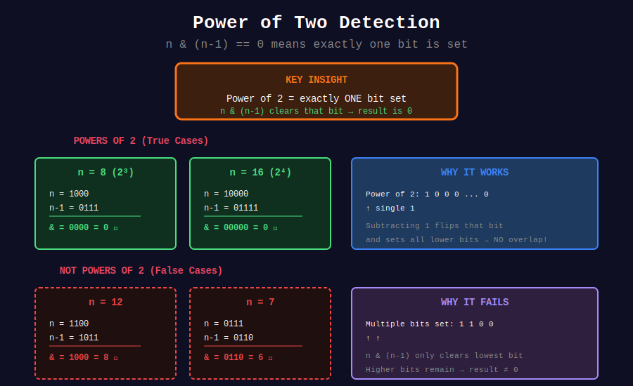
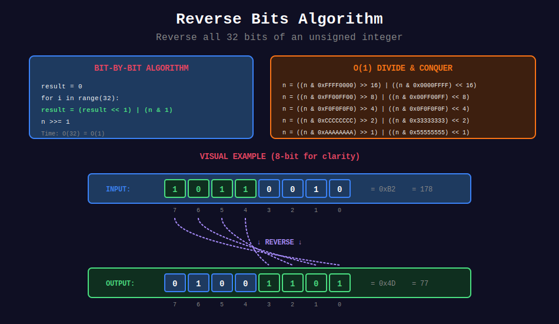

<div align="center">

# ⚙️ Basic Bit Operations

### *The Building Blocks of Binary Mastery*

<p>
  
  
  
</p>

</div>

---

## 🧭 Navigation

| ⬅️ Previous | 📂 Current | ➡️ Next |
|:------------|:----------:|--------:|
| [🏠 Bit Home](../README.md) | **01. Basic Operations** | [02. XOR Tricks →](../02_xor_tricks/README.md) |

---

## 🎨 Visual Diagrams

<div align="center">

### Brian Kernighan's Algorithm


### Power of Two Detection


### Reverse Bits


</div>

---

## 🎯 What You'll Learn

- Count set bits using Brian Kernighan's Algorithm

- Check if a number is a power of 2, 4, or any other base

- Reverse bits in a 32-bit integer

- Add numbers without using `+` operator

- Find the bitwise AND of a range

---

## 📐 Mathematical Foundations

### 1️⃣ Brian Kernighan's Algorithm

{: .highlight }
> **The Key Insight**: `n & (n-1)` clears the lowest set bit in O(1)

#### The Algorithm

```
count = 0
while n ≠ 0:
    n = n & (n - 1)
    count = count + 1
return count

```

**Time Complexity**: \( O(k) \) where \( k \) = number of set bits (not 32!)

#### 🔍 Mathematical Proof

Let \( n \) have binary representation with lowest set bit at position \( p \):

$$n = b_{31}b_{30}...b_{p+1}1\underbrace{00...0}_{p \text{ zeros}}$$

Then:

$$n - 1 = b_{31}b_{30}...b_{p+1}0\underbrace{11...1}_{p \text{ ones}}$$

Therefore:

$$n \land (n-1) = b_{31}b_{30}...b_{p+1}0\underbrace{00...0}_{p+1 \text{ zeros}}$$

The lowest set bit is cleared! ✓

#### 📊 Visual Example

```
Counting set bits in n = 52 (110100₂)

Iteration 1:          Iteration 2:          Iteration 3:
n    = 1 1 0 1 0 0    n    = 1 1 0 0 0 0    n    = 1 0 0 0 0 0
n-1  = 1 1 0 0 1 1    n-1  = 1 0 1 1 1 1    n-1  = 0 1 1 1 1 1
-----------------     -----------------     -----------------
n&(n-1) = 1 1 0 0 0 0    = 1 0 0 0 0 0        = 0 0 0 0 0 0
count = 1             count = 2             count = 3

Result: 3 set bits ✓

```

---

### 2️⃣ Power of Two Detection

{: .important }
> A number is a power of 2 if and only if it has exactly one bit set.

#### The Formula

$$n \text{ is power of 2} \Leftrightarrow n > 0 \land n \land (n-1) = 0$$

#### 🔍 Proof

**If \( n = 2^k \)**:

- \( n \) has only one bit set (at position \( k \))

- \( n - 1 \) has all bits set below position \( k \)

- \( n \land (n-1) = 0 \) (no overlap)

```
n = 16:     1 0 0 0 0
n - 1 = 15: 0 1 1 1 1
n & (n-1):  0 0 0 0 0 = 0 ✓

```

**If \( n \neq 2^k \)**:

- \( n \) has at least two bits set

- \( n \land (n-1) \) clears only the lowest bit

- Result is non-zero

```
n = 12:     1 1 0 0
n - 1 = 11: 1 0 1 1
n & (n-1):  1 0 0 0 = 8 ≠ 0 ✗

```

---

### 3️⃣ Power of Four Detection

A number \( n \) is a power of 4 if:

1. It's a power of 2: `n & (n-1) == 0`
2. The single bit is at an even position: `n & 0x55555555 == n`

#### 🔍 Understanding the Magic Number

```
0x55555555 = 01010101010101010101010101010101₂
                 ↑   ↑   ↑   ↑   ↑   ↑   ↑   ↑
              Positions: 0, 2, 4, 6, 8, 10, 12, 14...

Powers of 4:
4⁰ =   1 = bit 0  ✓
4¹ =   4 = bit 2  ✓
4² =  16 = bit 4  ✓
4³ =  64 = bit 6  ✓
4⁴ = 256 = bit 8  ✓

```

#### Alternative Method: Modulo Check

$$n \text{ is power of 4} \Leftrightarrow n > 0 \land n \land (n-1) = 0 \land (n - 1) \mod 3 = 0$$

This works because \( 4^k - 1 = (4-1)(4^{k-1} + 4^{k-2} + ... + 1) \) is always divisible by 3.

---

### 4️⃣ Counting Bits DP

Build an array where `dp[i]` = number of 1 bits in \( i \).

#### Recurrence Relation

$$\text{dp}[i] = \text{dp}[i \land (i-1)] + 1$$

Or equivalently:

$$\text{dp}[i] = \text{dp}[i >> 1] + (i \land 1)$$

#### 🔍 Proof of the Second Formula

The number of set bits in \( i \) equals:

- The set bits in \( \lfloor i/2 \rfloor \) (all bits shifted right)

- Plus 1 if the least significant bit was set

```
i = 13 = 1101₂
i >> 1 = 6 = 110₂
i & 1 = 1 (LSB is set)

bits(13) = bits(6) + 1 = 2 + 1 = 3 ✓

```

---

### 5️⃣ Reverse Bits

Reverse the bits of a 32-bit unsigned integer.

#### Algorithm (Bit by Bit)

```
For each of 32 bits:
    1. Extract LSB from input
    2. Append to result (shift result left, OR with bit)
    3. Shift input right

```

#### 📊 Visual Example

```
Input:  43261596 = 00000010100101000001111010011100
Output: 964176192 = 00111001011110000010100101000000
                    ←--------- reversed ----------→

```

#### 🚀 O(1) Divide and Conquer

For production code, swap in groups of 16, 8, 4, 2, 1:

```python
n = ((n & 0xFFFF0000) >> 16) | ((n & 0x0000FFFF) << 16)  # Swap 16-bit halves
n = ((n & 0xFF00FF00) >> 8)  | ((n & 0x00FF00FF) << 8)   # Swap 8-bit pairs
n = ((n & 0xF0F0F0F0) >> 4)  | ((n & 0x0F0F0F0F) << 4)   # Swap nibbles
n = ((n & 0xCCCCCCCC) >> 2)  | ((n & 0x33333333) << 2)   # Swap bit pairs
n = ((n & 0xAAAAAAAA) >> 1)  | ((n & 0x55555555) << 1)   # Swap adjacent bits

```

---

### 6️⃣ Add Without + Operator

{: .note }
> This is a classic interview question at companies like Google and Amazon!

#### The Algorithm

1. **XOR** gives sum without carry: \( a \oplus b \)

2. **AND + shift** gives carry: \( (a \land b) << 1 \)

3. Repeat until no carry

#### 📊 Visual Example: 5 + 7 = 12

```
Step 1:                    Step 2:                    Step 3:
a = 5 = 0101               a = 2 = 0010               a = 12 = 1100
b = 7 = 0111               b = 10 = 1010              b = 0  = 0000
                                                       
sum = a XOR b              sum = a XOR b              No carry!
    = 0010 (2)                 = 1000 (8)             Result = 12 ✓
                                                       
carry = (a AND b) << 1     carry = (a AND b) << 1
      = (0101 & 0111)<<1         = (0010 & 1010)<<1
      = 0101 << 1                = 0010 << 1
      = 1010 (10)                = 0100 (4)

```

#### ⚠️ Handling Negative Numbers (Python)

Python integers have arbitrary precision, so we need to mask to 32 bits:

```python
MASK = 0xFFFFFFFF
MAX_INT = 0x7FFFFFFF

# During calculation, mask to 32 bits
a = (a ^ b) & MASK
b = ((a_prev & b) << 1) & MASK

# At the end, convert back if negative
if a > MAX_INT:
    a = ~(a ^ MASK)  # Convert from unsigned to signed

```

---

### 7️⃣ Bitwise AND of Range

Find \( \text{left} \land (\text{left}+1) \land ... \land \text{right} \)

#### Key Insight

The result is the **common prefix** of `left` and `right` in binary.

#### 🔍 Proof

For any bit position where `left` and `right` differ:

- There must be some number in the range with 0 at that position

- AND of 1 and 0 gives 0

So only the common prefix (where they're identical) survives!

#### 📊 Visual Example: AND of [5, 7]

```
5 = 1 0 1
6 = 1 1 0
7 = 1 1 1
    -----
&   1 0 0 = 4

Finding common prefix:
left  = 5 = 101
right = 7 = 111
              ↓ differ here

After shifting until equal:
left = right = 1 (shifted 2 times)
Result: 1 << 2 = 4 ✓

```

---

## 💻 Code Implementations

```python
def hammingWeight(n: int) -> int:
    """
    Number of 1 Bits (LeetCode 191).
    Brian Kernighan's Algorithm.
    
    Time: O(k) where k is number of set bits
    Space: O(1)
    
    Example:
    >>> hammingWeight(11)  # 1011 binary
    3
    """
    count = 0
    while n:
        n &= (n - 1)  # Clear lowest set bit
        count += 1
    return count

def isPowerOfTwo(n: int) -> bool:
    """
    Power of Two (LeetCode 231).
    
    A power of 2 has exactly one bit set.
    n & (n-1) clears that bit → result is 0.
    
    Time: O(1), Space: O(1)
    
    Example:
    >>> isPowerOfTwo(16)
    True
    >>> isPowerOfTwo(15)
    False
    """
    return n > 0 and (n & (n - 1)) == 0

def isPowerOfFour(n: int) -> bool:
    """
    Power of Four (LeetCode 342).
    
    Must be:
    1. Power of 2 (single bit set)
    2. Bit at even position (0, 2, 4, ...)
    
    0x55555555 = 01010101... (1s at even positions)
    
    Time: O(1), Space: O(1)
    
    Example:
    >>> isPowerOfFour(16)  # 4^2
    True
    >>> isPowerOfFour(8)   # 2^3, not power of 4
    False
    """
    return (n > 0 and 
            (n & (n - 1)) == 0 and 
            (n & 0x55555555) == n)

def reverseBits(n: int) -> int:
    """
    Reverse Bits (LeetCode 190).
    
    Reverse bits of a 32-bit unsigned integer.
    
    Time: O(32) = O(1), Space: O(1)
    
    Example:
    >>> reverseBits(43261596)
    964176192
    """
    result = 0
    for _ in range(32):
        # Shift result left to make room
        result = (result << 1) | (n & 1)
        # Move to next bit
        n >>= 1
    return result

def reverseBitsOptimized(n: int) -> int:
    """
    Reverse Bits - O(1) with constant operations.
    
    Divide and conquer: swap halves recursively.
    """
    n = ((n & 0xFFFF0000) >> 16) | ((n & 0x0000FFFF) << 16)
    n = ((n & 0xFF00FF00) >> 8) | ((n & 0x00FF00FF) << 8)
    n = ((n & 0xF0F0F0F0) >> 4) | ((n & 0x0F0F0F0F) << 4)
    n = ((n & 0xCCCCCCCC) >> 2) | ((n & 0x33333333) << 2)
    n = ((n & 0xAAAAAAAA) >> 1) | ((n & 0x55555555) << 1)
    return n

def countBits(n: int) -> list[int]:
    """
    Counting Bits (LeetCode 338).
    
    Build DP array: dp[i] = number of 1 bits in i.
    
    Recurrence: dp[i] = dp[i & (i-1)] + 1
    (i & (i-1) removes one bit, so add 1)
    
    Time: O(n), Space: O(n)
    
    Example:
    >>> countBits(5)
    [0, 1, 1, 2, 1, 2]
    """
    dp = [0] * (n + 1)
    for i in range(1, n + 1):
        dp[i] = dp[i & (i - 1)] + 1
    return dp

def countBitsAlt(n: int) -> list[int]:
    """
    Alternative using right shift.
    
    dp[i] = dp[i >> 1] + (i & 1)
    """
    dp = [0] * (n + 1)
    for i in range(1, n + 1):
        dp[i] = dp[i >> 1] + (i & 1)
    return dp

def getSum(a: int, b: int) -> int:
    """
    Sum of Two Integers (LeetCode 371).
    
    Add two integers without using + or -.
    
    Key insight:
    - XOR gives sum without carry
    - AND << 1 gives carry
    - Repeat until no carry
    
    Time: O(32) = O(1), Space: O(1)
    
    Example:
    >>> getSum(5, 7)
    12
    """
    MASK = 0xFFFFFFFF  # 32-bit mask
    MAX_INT = 0x7FFFFFFF  # Max positive 32-bit int
    
    while b != 0:
        # Calculate sum and carry
        carry = ((a & b) << 1) & MASK
        a = (a ^ b) & MASK
        b = carry
    
    # Convert from unsigned to signed if needed
    return a if a <= MAX_INT else ~(a ^ MASK)

def rangeBitwiseAnd(left: int, right: int) -> int:
    """
    Bitwise AND of Numbers Range (LeetCode 201).
    
    Find common prefix of left and right.
    
    Key insight: Any differing bit position will
    have both 0 and 1 in the range, so AND = 0.
    Only the common prefix survives.
    
    Time: O(32) = O(1), Space: O(1)
    
    Example:
    >>> rangeBitwiseAnd(5, 7)
    4
    """
    shift = 0
    
    # Right shift until left == right (common prefix)
    while left < right:
        left >>= 1
        right >>= 1
        shift += 1
    
    # Left shift back to original position
    return left << shift

def rangeBitwiseAndAlt(left: int, right: int) -> int:
    """
    Alternative: Clear rightmost different bits from right.
    """
    while left < right:
        right &= (right - 1)  # Clear lowest set bit
    return right

```

---

## 🎨 Pattern Visualization

### Brian Kernighan Flow

```
+--------------------------------------------------------+
|                 BRIAN KERNIGHAN                        |
+--------------------------------------------------------+
|                                                        |
|     n = 52 (110100)                                   |
|         |                                              |
|         ▼                                              |
|     +--------------+                                  |
|     | n & (n - 1)  | --→ 48 (110000), count = 1      |
|     +--------------+                                  |
|         |                                              |
|         ▼                                              |
|     +--------------+                                  |
|     | n & (n - 1)  | --→ 32 (100000), count = 2      |
|     +--------------+                                  |
|         |                                              |
|         ▼                                              |
|     +--------------+                                  |
|     | n & (n - 1)  | --→ 0 (000000), count = 3       |
|     +--------------+                                  |
|         |                                              |
|         ▼                                              |
|     Return 3 ✓                                        |
|                                                        |
+--------------------------------------------------------+

```

### Power Detection Decision Tree

```
              Is n a power of?
                    |
        +-----------+-----------+
        ▼           ▼           ▼
    Power of 2  Power of 4  Power of 8
        |           |           |
        ▼           ▼           ▼
    n & (n-1)   (Power of 2)  (Power of 2)
      == 0           AND         AND
        |      n & 0x55555555  n & 0x49249249
        |         == n           == n

```

---

## 🏆 LeetCode Problems

### 🟢 Easy

| # | Problem | Pattern | Time | Space | Key Trick |
|:-:|---------|---------|:----:|:-----:|-----------|
| 190 | [Reverse Bits](https://leetcode.com/problems/reverse-bits/) | Bit by Bit | O(32) | O(1) | Build from LSB |
| 191 | [Number of 1 Bits](https://leetcode.com/problems/number-of-1-bits/) | Kernighan | O(k) | O(1) | n & (n-1) |
| 231 | [Power of Two](https://leetcode.com/problems/power-of-two/) | Single bit | O(1) | O(1) | n & (n-1) == 0 |
| 338 | [Counting Bits](https://leetcode.com/problems/counting-bits/) | DP | O(n) | O(n) | dp[i] = dp[i&(i-1)] + 1 |
| 342 | [Power of Four](https://leetcode.com/problems/power-of-four/) | Mask | O(1) | O(1) | 0x55555555 |
| 326 | [Power of Three](https://leetcode.com/problems/power-of-three/) | Math | O(1) | O(1) | 3^19 % n == 0 |

### 🟡 Medium

| # | Problem | Pattern | Time | Space | Key Trick |
|:-:|---------|---------|:----:|:-----:|-----------|
| 201 | [Bitwise AND of Range](https://leetcode.com/problems/bitwise-and-of-numbers-range/) | Common Prefix | O(32) | O(1) | Find prefix |
| 371 | [Sum of Two Integers](https://leetcode.com/problems/sum-of-two-integers/) | XOR + Carry | O(32) | O(1) | a^b, (a&b)<<1 |

---

## 💡 Common Interview Follow-ups

### Q: "What if we need to count bits for many numbers?"

**A**: Use DP approach with `countBits()` - precompute all values in O(n).

### Q: "Can you do reverse bits in O(1)?"

**A**: Yes! Use divide-and-conquer with magic numbers to swap halves recursively.

### Q: "What about negative numbers in getSum?"

**A**: Use 32-bit masking and convert back to signed representation at the end.

### Q: "How would you extend power of 4 to power of k?"

**A**: For power of \( k \):

- If \( k \) is power of 2: Check if bit position is multiple of \( \log_2(k) \)

- Otherwise: Use \( \log \) or repeated division

---

## 📚 References

| Resource | Description | Link |
|----------|-------------|------|
| **Brian Kernighan** | Original algorithm paper | [🔗 Archive](https://graphics.stanford.edu/~seander/bithacks.html#CountBitsSetKernighan) |
| **Bit Twiddling Hacks** | Stanford's collection | [🔗 Stanford](https://graphics.stanford.edu/~seander/bithacks.html) |
| **Hacker's Delight** | Chapter 5: Counting Bits | [🔗 Book](https://www.amazon.com/Hackers-Delight-2nd-Henry-Warren/dp/0321842685) |
| **Wikipedia** | Hamming Weight | [🔗 Wiki](https://en.wikipedia.org/wiki/Hamming_weight) |
| **CP-Algorithms** | Bit Manipulation | [🔗 CP](https://cp-algorithms.com/algebra/bit-manipulation.html) |

---

<div align="center">

**Made with ❤️ by [Gaurav Goswami](https://github.com/Gaurav14cs17)**

*"Every bit you master brings you closer to algorithmic enlightenment."*

</div>

---

## 🧭 Navigation

| ⬅️ Previous | 📂 Current | ➡️ Next |
|:------------|:----------:|--------:|
| [🏠 Bit Home](../README.md) | **01. Basic Operations** | [02. XOR Tricks →](../02_xor_tricks/README.md) |
