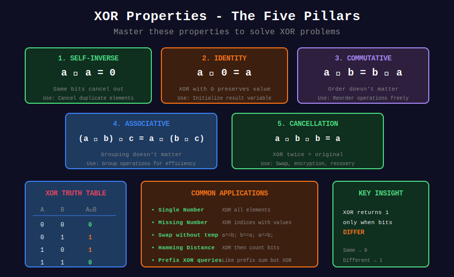
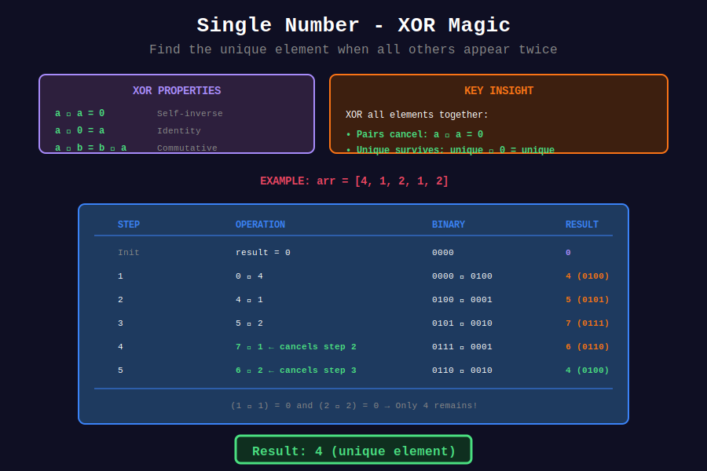
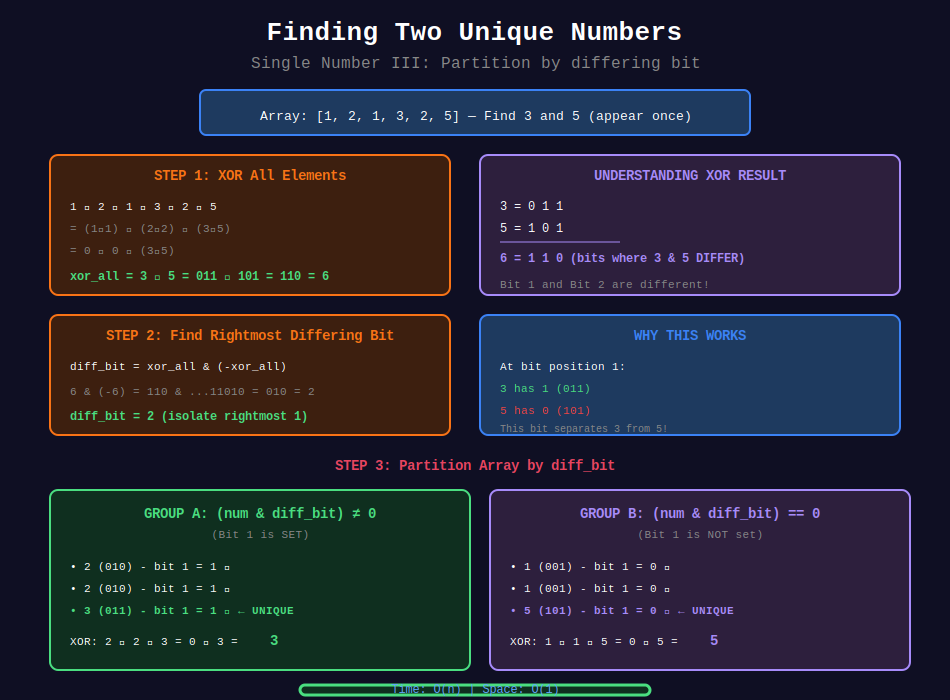

<div align="center">

# ⊕ XOR Tricks

### *The Swiss Army Knife of Bit Manipulation*

<p>
  
  
  
</p>

*"XOR is the most versatile bitwise operator — master it, and half your bit problems are solved."*

</div>

---

## 🧭 Navigation

| ⬅️ Previous | 📂 Current | ➡️ Next |
|:------------|:----------:|--------:|
| [← 01. Basic Operations](../01_basic_operations/README.md) | **02. XOR Tricks** | [03. Bitmask →](../03_bitmask/README.md) |

---

## 🎨 Visual Diagrams

<div align="center">

### XOR Properties - The Five Pillars


### Single Number - XOR Magic


### Finding Two Unique Numbers


</div>

---

## 🎯 What You'll Master

- All 5 fundamental XOR properties with proofs
- Finding unique elements in arrays (Single Number variants)
- XOR-based range queries
- Bit partitioning techniques
- Maximum XOR problems with Tries

---

## 📐 Mathematical Foundations

### 1️⃣ The Five Pillars of XOR

{: .highlight }
> XOR (exclusive or) returns 1 when inputs differ, 0 when they're the same.

| Property | Formula | Proof | Use Case |
|----------|---------|-------|----------|
| **Self-Inverse** | $a \oplus a = 0$ | Same bits → 0 | Cancel duplicates |
| **Identity** | $a \oplus 0 = a$ | 0 changes nothing | Initialize result |
| **Commutative** | $a \oplus b = b \oplus a$ | Order doesn't matter | Reorder freely |
| **Associative** | $(a \oplus b) \oplus c = a \oplus (b \oplus c)$ | Grouping doesn't matter | Group freely |
| **Cancellation** | $a \oplus b \oplus b = a$ | b cancels itself | Recover original |

#### 🔍 Deep Dive: Why $a \oplus a = 0$?

For each bit position:
- If bit is 0: $0 \oplus 0 = 0$
- If bit is 1: $1 \oplus 1 = 0$

Every bit becomes 0, so $a \oplus a = 0$.

---

### 2️⃣ The Single Number Theorem

{: .important }
> **Theorem**: If all elements appear twice except one, XOR of all elements gives the unique element.

#### Formal Statement

Given array $[a_1, a_2, ..., a_n]$ where every element appears exactly twice except one element $x$:

```math
\bigoplus_{i=1}^{n} a_i = x
```

#### 🔍 Proof

Let pairs be $\{(p_1, p_1), (p_2, p_2), ..., (p_k, p_k), x\}$:

```math
\bigoplus_{i=1}^{n} a_i = (p_1 \oplus p_1) \oplus (p_2 \oplus p_2) \oplus ... \oplus (p_k \oplus p_k) \oplus x
```

By self-inverse: $p_i \oplus p_i = 0$

```math
= 0 \oplus 0 \oplus ... \oplus 0 \oplus x = x \quad \square
```

---

### 3️⃣ Missing Number Using XOR

{: .note }
> For array $[0, n]$ missing one number, XOR indices with values!

#### The Formula

```math
\text{missing} = \left(\bigoplus_{i=0}^{n} i\right) \oplus \left(\bigoplus_{j=0}^{n-1} \text{nums}[j]\right)
```

#### 🔍 Proof

Every number except the missing one appears twice (once as index, once as value):

```math
= \underbrace{(0 \oplus 0) \oplus (1 \oplus 1) \oplus ... \oplus (\text{missing skipped})}_{\text{paired}} \oplus \text{missing}
= 0 \oplus \text{missing} = \text{missing} \quad \square
```

---

### 4️⃣ Two Unique Numbers (Single Number III)

{: .highlight }
> When two numbers appear once and others twice, we can split them using their XOR!

#### The Algorithm

1. **XOR all elements** → Get $a \oplus b$
2. **Find any differing bit** → $\text{diff} = \text{xor} \land (-\text{xor})$
3. **Partition by this bit** → Separate $a$ and $b$

#### 🔍 Mathematical Proof

**Step 1**: Since $a \neq b$, there exists some bit position where they differ.

**Step 2**: $\text{xor} \land (-\text{xor})$ isolates the rightmost set bit in $a \oplus b$.

This bit is 1 in exactly one of $a, b$ (say $a$) and 0 in the other (say $b$).

**Step 3**: Partitioning by this bit:
- Group 1: Contains $a$ and some pairs → XOR = $a$
- Group 2: Contains $b$ and some pairs → XOR = $b$

Each pair goes entirely into one group (both elements have same bit value).

---

### 5️⃣ Three Times (Single Number II)

When every element appears three times except one:

{: .important }
> **Key Insight**: Count each bit position modulo 3!

#### The Formula

For each bit position $i$:

```math
\text{bit}_i = \left(\sum_{j} \text{bit}_i(\text{nums}[j])\right) \mod 3
```

If the count is 1, the unique number has this bit set.

#### 🔍 Proof

For elements appearing 3 times:
- Their contribution to bit count at any position is 3k (multiple of 3)
- This becomes 0 after mod 3

For the unique element:
- Its contribution is either 0 or 1
- After mod 3, we recover its original bits

---

### 6️⃣ XOR Prefix Sum

Just like regular prefix sums, but with XOR:

```math
\text{prefix}[i] = \text{nums}[0] \oplus \text{nums}[1] \oplus ... \oplus \text{nums}[i]
```

#### Range XOR Query

```math
\text{XOR}[L, R] = \text{prefix}[R] \oplus \text{prefix}[L-1]
```

#### 🔍 Proof

```math
\text{prefix}[R] \oplus \text{prefix}[L-1]
= (\text{nums}[0] \oplus ... \oplus \text{nums}[R]) \oplus (\text{nums}[0] \oplus ... \oplus \text{nums}[L-1])
```

By cancellation, elements $[0, L-1]$ cancel out:

```math
= \text{nums}[L] \oplus ... \oplus \text{nums}[R] \quad \square
```

---

### 7️⃣ Maximum XOR with Tries

{: .highlight }
> To maximize $a \oplus b$, for each bit of $a$, choose opposite bit in $b$ if possible.

#### Greedy Strategy

For each number, traverse a binary trie:
- At each bit position (high to low), try to go opposite
- This maximizes the XOR bit by bit

#### Time Complexity

- Build trie: $O(n \times 32)$
- Query each number: $O(32)$
- Total: $O(n)$

---

## 📊 Visual Explanations

### Single Number Visualization

```
Array: [4, 1, 2, 1, 2]

XOR all elements step by step:

  0100  (4)
⊕ 0001  (1)
------
  0101  (5)
⊕ 0010  (2)
------
  0111  (7)
⊕ 0001  (1)  ← cancels with earlier 1
------
  0110  (6)
⊕ 0010  (2)  ← cancels with earlier 2
------
  0100  (4)  ✓ The unique element!

Why it works:
  1 ⊕ 1 = 0   (cancelled)
  2 ⊕ 2 = 0   (cancelled)
  4 ⊕ 0 = 4   (unique remains)
```

---

### Missing Number Visualization

```
Array: [3, 0, 1]  (missing 2 from [0,1,2,3])

XOR indices:     0 ⊕ 1 ⊕ 2 ⊕ 3 = ?
XOR values:      3 ⊕ 0 ⊕ 1     = ?
                 -----------------
                 missing = 2

Detailed calculation:
  Index: 0 ⊕ 1 ⊕ 2 ⊕ 3 = 00 ⊕ 01 ⊕ 10 ⊕ 11 = 00
  Value: 3 ⊕ 0 ⊕ 1     = 11 ⊕ 00 ⊕ 01     = 10

  Combined:
  (0 ⊕ 3) ⊕ (1 ⊕ 0) ⊕ (2 ⊕ 1) ⊕ 3
  = 3 ⊕ 1 ⊕ 3 ⊕ 3 ⊕ 0 ⊕ 1 ⊕ 2
  
  Rearranging: (0⊕0) ⊕ (1⊕1) ⊕ (3⊕3) ⊕ 2 = 0 ⊕ 0 ⊕ 0 ⊕ 2 = 2 ✓
```

---

### Two Unique Numbers — Step by Step

```
Array: [1, 2, 1, 3, 2, 5]
Find: 3 and 5 (appear once)

+===============================================================+
| STEP 1: XOR Everything                                        |
+===============================================================+
|   1 ⊕ 2 ⊕ 1 ⊕ 3 ⊕ 2 ⊕ 5                                     |
| = (1⊕1) ⊕ (2⊕2) ⊕ (3⊕5)                                      |
| = 0 ⊕ 0 ⊕ 6                                                   |
| = 6 (binary: 110)                                             |
|                                                                |
|   3 = 011                                                      |
|   5 = 101                                                      |
| XOR = 110  ← bits where 3 and 5 differ                        |
+===============================================================+

+===============================================================+
| STEP 2: Find Rightmost Differing Bit                          |
+===============================================================+
|   xor = 6 = 110                                               |
|  -xor = -6 = ...11111010 (two's complement)                   |
|   xor & (-xor) = 010 = 2                                      |
|                    ↑                                          |
|   Bit position 1 differs between 3 and 5                      |
|   (3 has 1, 5 has 0 at this position)                         |
+===============================================================+

+===============================================================+
| STEP 3: Partition by Bit 1                                    |
+===============================================================+
|                                                                |
|   Bit 1 = 1:           |   Bit 1 = 0:                         |
|   -----------          |   -----------                        |
|   2 (010) ✓           |   1 (001)                             |
|   2 (010) ✓           |   1 (001)                             |
|   3 (011) ✓           |   5 (101)                             |
|                        |                                       |
|   XOR: 2⊕2⊕3 = 3 ✓   |   XOR: 1⊕1⊕5 = 5 ✓                  |
|                                                                |
+===============================================================+

Result: [3, 5] ✓
```

---

### XOR Prefix Sum Visualization

```
Array: [1, 3, 4, 8]

Building prefix XOR:
+--------+------------------------+---------+
| Index  | Calculation            | Prefix  |
+--------+------------------------+---------+
|   0    | 1                      |  0001   |
|   1    | 1 ⊕ 3 = 0001 ⊕ 0011   |  0010   |
|   2    | 2 ⊕ 4 = 0010 ⊕ 0100   |  0110   |
|   3    | 6 ⊕ 8 = 0110 ⊕ 1000   |  1110   |
+--------+------------------------+---------+

Query: XOR[1, 3] = ?
  prefix[3] ⊕ prefix[0] = 1110 ⊕ 0001 = 1111 = 15

Verify: 3 ⊕ 4 ⊕ 8 = 0011 ⊕ 0100 ⊕ 1000 = 1111 = 15 ✓
```

---

### Maximum XOR with Trie

```
Array: [3, 10, 5, 25, 2, 8]

Building Trie (5-bit for clarity):

                    ROOT
                   /    \
                 0        1
                /          \
               0            1
              / \            \
             0   1            0
            /   / \            \
           1   0   1            0
          /   /     \            \
         0   1       0            1
         |   |       |            |
         2   5       3           25
         (00010)(00101)(00011) (11001)

Finding max XOR for 5 (00101):
  Bit 4: 5 has 0, go 1 if exists → YES (XOR += 16)
  Bit 3: 5 has 0, go 1 if exists → YES (XOR += 8)
  Bit 2: 5 has 1, go 0 if exists → YES (XOR += 4)
  Bit 1: 5 has 0, go 1 if exists → NO, go 0
  Bit 0: 5 has 1, go 0 if exists → YES (XOR += 1)
  
  Path leads to 25 (11001)
  Max XOR = 5 ⊕ 25 = 00101 ⊕ 11001 = 11100 = 28

Overall max: 5 ⊕ 25 = 28 ✓
```

---

## 💻 Code Implementations

```python
def singleNumber(nums: list[int]) -> int:
    """
    Single Number (LeetCode 136).
    
    Find element appearing once (others appear twice).
    
    Mathematical basis: a ⊕ a = 0, so pairs cancel.
    
    Time: O(n), Space: O(1)
    
    Example:
    >>> singleNumber([4, 1, 2, 1, 2])
    4
    """
    result = 0
    for num in nums:
        result ^= num
    return result

def missingNumber(nums: list[int]) -> int:
    """
    Missing Number (LeetCode 268).
    
    Find missing number in [0, n].
    
    Key: XOR indices with values. Non-missing numbers
    appear twice (as index and value), so they cancel.
    
    Time: O(n), Space: O(1)
    
    Example:
    >>> missingNumber([3, 0, 1])
    2
    """
    result = len(nums)  # Include n as "index"
    
    for i, num in enumerate(nums):
        result ^= i ^ num
    
    return result

def singleNumberII(nums: list[int]) -> int:
    """
    Single Number II (LeetCode 137).
    
    Every element appears three times except one.
    Count each bit position mod 3.
    
    Time: O(32n) = O(n), Space: O(1)
    
    Example:
    >>> singleNumberII([2, 2, 3, 2])
    3
    """
    result = 0
    
    for i in range(32):
        bit_sum = 0
        for num in nums:

            # Handle Python's arbitrary precision
            if num < 0:
                num = num & 0xFFFFFFFF
            bit_sum += (num >> i) & 1
        
        # If not divisible by 3, unique has this bit
        if bit_sum % 3:
            result |= (1 << i)
    
    # Handle negative result in 32-bit representation
    if result >= 2**31:
        result -= 2**32
    
    return result

def singleNumberII_elegant(nums: list[int]) -> int:
    """
    Elegant state machine approach.
    
    Track bit counts using two variables:
    - ones: bits that appeared 1 mod 3 times
    - twos: bits that appeared 2 mod 3 times
    
    When count reaches 3, reset to 0.
    """
    ones = twos = 0
    
    for num in nums:

        # ones keeps bits seen 1 time (not seen 2 times)
        ones = (ones ^ num) & ~twos

        # twos keeps bits seen 2 times (not reset by ones)
        twos = (twos ^ num) & ~ones
    
    return ones

def singleNumberIII(nums: list[int]) -> list[int]:
    """
    Single Number III (LeetCode 260).
    
    Two elements appear once, others appear twice.
    
    Algorithm:
    1. XOR all → get a ⊕ b
    2. Find rightmost differing bit
    3. Partition and XOR each group
    
    Time: O(n), Space: O(1)
    
    Example:
    >>> sorted(singleNumberIII([1, 2, 1, 3, 2, 5]))
    [3, 5]
    """

    # Step 1: XOR all numbers → a ⊕ b
    xor_all = 0
    for num in nums:
        xor_all ^= num
    
    # Step 2: Find rightmost set bit (where a and b differ)
    # Using two's complement trick: n & (-n) isolates rightmost 1
    diff_bit = xor_all & (-xor_all)
    
    # Step 3: Partition into two groups and XOR
    a = b = 0
    for num in nums:
        if num & diff_bit:
            a ^= num
        else:
            b ^= num
    
    return [a, b]

def hammingDistance(x: int, y: int) -> int:
    """
    Hamming Distance (LeetCode 461).
    
    Count positions where bits differ.
    XOR gives 1s at differing positions.
    
    Time: O(1), Space: O(1)
    
    Example:
    >>> hammingDistance(1, 4)  # 001 vs 100
    2
    """
    xor = x ^ y
    count = 0
    
    # Count set bits using Kernighan
    while xor:
        xor &= (xor - 1)
        count += 1
    
    return count

def totalHammingDistance(nums: list[int]) -> int:
    """
    Total Hamming Distance (LeetCode 477).
    
    Sum of Hamming distances between all pairs.
    
    Key insight: For each bit position, count pairs
    with different bits = (count of 1s) × (count of 0s)
    
    Time: O(32n) = O(n), Space: O(1)
    
    Example:
    >>> totalHammingDistance([4, 14, 2])
    6
    """
    total = 0
    n = len(nums)
    
    for i in range(32):

        # Count numbers with bit i set
        count_ones = sum(1 for num in nums if (num >> i) & 1)
        count_zeros = n - count_ones
        
        # Each 1 pairs with each 0 for this bit
        total += count_ones * count_zeros
    
    return total

def xorQueries(arr: list[int], queries: list[list[int]]) -> list[int]:
    """
    XOR Queries of a Subarray (LeetCode 1310).
    
    Answer XOR range queries using prefix XOR.
    
    prefix[i] = arr[0] ⊕ arr[1] ⊕ ... ⊕ arr[i-1]
    XOR[L,R] = prefix[R+1] ⊕ prefix[L]
    
    Time: O(n + q), Space: O(n)
    """
    n = len(arr)
    
    # Build prefix XOR (1-indexed for convenience)
    prefix = [0] * (n + 1)
    for i in range(n):
        prefix[i + 1] = prefix[i] ^ arr[i]
    
    # Answer queries
    result = []
    for left, right in queries:
        result.append(prefix[right + 1] ^ prefix[left])
    
    return result

def findErrorNums(nums: list[int]) -> list[int]:
    """
    Set Mismatch (LeetCode 645).
    
    Find duplicate and missing number.
    
    XOR approach: Like Single Number III,
    but XOR with expected range [1, n].
    
    Time: O(n), Space: O(1)
    
    Example:
    >>> findErrorNums([1, 2, 2, 4])
    [2, 3]
    """
    n = len(nums)
    
    # XOR all: nums XOR [1..n]
    xor_all = 0
    for i in range(1, n + 1):
        xor_all ^= i
    for num in nums:
        xor_all ^= num
    
    # xor_all = duplicate ^ missing
    diff_bit = xor_all & (-xor_all)
    
    # Partition
    a = b = 0
    for i in range(1, n + 1):
        if i & diff_bit:
            a ^= i
        else:
            b ^= i
    for num in nums:
        if num & diff_bit:
            a ^= num
        else:
            b ^= num
    
    # Determine which is duplicate
    for num in nums:
        if num == a:
            return [a, b]
    return [b, a]

def maximumXOR(nums: list[int]) -> int:
    """
    Maximum XOR of Two Numbers (LeetCode 421).
    
    Use Trie for greedy bit selection.
    
    For each number, traverse trie choosing
    opposite bits when possible to maximize XOR.
    
    Time: O(32n), Space: O(32n)
    
    Example:
    >>> maximumXOR([3, 10, 5, 25, 2, 8])
    28
    """

    # Build Trie
    root = {}
    
    for num in nums:
        node = root
        for i in range(31, -1, -1):
            bit = (num >> i) & 1
            if bit not in node:
                node[bit] = {}
            node = node[bit]
    
    # Find maximum XOR
    max_xor = 0
    
    for num in nums:
        node = root
        curr_xor = 0
        
        for i in range(31, -1, -1):
            bit = (num >> i) & 1
            opposite = 1 - bit
            
            # Greedily choose opposite bit if exists
            if opposite in node:
                curr_xor |= (1 << i)
                node = node[opposite]
            else:
                node = node[bit]
        
        max_xor = max(max_xor, curr_xor)
    
    return max_xor

def xorAllNums(nums1: list[int], nums2: list[int]) -> int:
    """
    XOR of All Pairings (LeetCode 2425).
    
    XOR all pairs (x, y) where x in nums1, y in nums2.
    
    Key insight:
    - Each element in nums1 appears len(nums2) times
    - Each element in nums2 appears len(nums1) times
    - XOR of same element even times = 0
    
    Time: O(n + m), Space: O(1)
    """
    result = 0
    n1, n2 = len(nums1), len(nums2)
    
    # If n2 is odd, each element in nums1 survives
    if n2 % 2:
        for num in nums1:
            result ^= num
    
    # If n1 is odd, each element in nums2 survives
    if n1 % 2:
        for num in nums2:
            result ^= num
    
    return result
```

---

## 🎯 Pattern Summary Table

| Pattern | When to Use | Key Insight | Time |
|---------|-------------|-------------|------|
| **XOR All** | One unique, rest twice | a⊕a = 0 | O(n) |
| **XOR Indices** | Missing number | Pair index with value | O(n) |
| **Bit Counting** | Three times others | Count mod k | O(32n) |
| **Diff Bit Split** | Two unique elements | Partition by XOR bit | O(n) |
| **Prefix XOR** | Range queries | Similar to prefix sum | O(1) query |
| **Trie + XOR** | Maximum XOR pair | Greedy opposite bits | O(32n) |

---

## 📊 Decision Flowchart

```
               +-----------------------------+
               |   XOR PROBLEM DETECTOR      |
               +--------------+--------------+
                              |
           +------------------+------------------+
           |                  |                  |
           ▼                  ▼                  ▼
   +---------------+  +---------------+  +---------------+
   | Finding unique|  | Range queries |  | Maximum XOR   |
   |   element(s)  |  |   on array    |  |   of pair     |
   +-------+-------+  +-------+-------+  +-------+-------+
           |                  |                  |
     +-----+-----+            |                  |
     |           |            |                  |
     ▼           ▼            ▼                  ▼
+---------+ +---------+  +---------+       +---------+
| One odd | | Two odd |  | Prefix  |       |  Trie   |
|  count  | |  count  |  |   XOR   |       | greedy  |
+----+----+ +----+----+  +---------+       +---------+
     |           |
     ▼           ▼
 XOR all    Partition
 elements   by diff bit
```

---

## 🏆 LeetCode Problems

### 🟢 Easy

| # | Problem | Pattern | Time | Space |
|:-:|---------|---------|:----:|:-----:|
| 136 | [Single Number](https://leetcode.com/problems/single-number/) | XOR All | O(n) | O(1) |
| 268 | [Missing Number](https://leetcode.com/problems/missing-number/) | XOR Indices | O(n) | O(1) |
| 461 | [Hamming Distance](https://leetcode.com/problems/hamming-distance/) | XOR + Count | O(1) | O(1) |
| 645 | [Set Mismatch](https://leetcode.com/problems/set-mismatch/) | XOR Partition | O(n) | O(1) |

### 🟡 Medium

| # | Problem | Pattern | Time | Space |
|:-:|---------|---------|:----:|:-----:|
| 137 | [Single Number II](https://leetcode.com/problems/single-number-ii/) | Bit Count mod 3 | O(n) | O(1) |
| 260 | [Single Number III](https://leetcode.com/problems/single-number-iii/) | Diff Bit Partition | O(n) | O(1) |
| 287 | [Find the Duplicate](https://leetcode.com/problems/find-the-duplicate-number/) | Floyd's Cycle | O(n) | O(1) |
| 421 | [Maximum XOR of Two](https://leetcode.com/problems/maximum-xor-of-two-numbers-in-an-array/) | Trie | O(n) | O(n) |
| 477 | [Total Hamming Distance](https://leetcode.com/problems/total-hamming-distance/) | Bit Position Count | O(n) | O(1) |
| 1310 | [XOR Queries](https://leetcode.com/problems/xor-queries-of-a-subarray/) | Prefix XOR | O(n+q) | O(n) |
| 2425 | [XOR of All Pairings](https://leetcode.com/problems/bitwise-xor-of-all-pairings/) | Parity Analysis | O(n+m) | O(1) |

### 🔴 Hard

| # | Problem | Pattern | Time | Space |
|:-:|---------|---------|:----:|:-----:|
| 1835 | [Find XOR Sum](https://leetcode.com/problems/find-xor-sum-of-all-pairs-bitwise-and/) | Bit Math | O(n+m) | O(1) |
| 1938 | [Maximum Genetic Difference](https://leetcode.com/problems/maximum-genetic-difference-query/) | Trie + DFS | O(nlogn) | O(n) |

---

## 💡 Interview Tips

### Common Questions & Answers

**Q: "Why does XOR cancel pairs?"**

A: XOR with same value gives 0 (self-inverse property). So a⊕a = 0, making duplicates "disappear."

**Q: "How do you handle negative numbers?"**

A: In Python, use `& 0xFFFFFFFF` to simulate 32-bit. At the end, check if result > MAX_INT and convert.

**Q: "Can you extend Single Number III to k unique elements?"**

A: Yes, but complexity increases. For k=3, would need to track more state or use bit counting approach.

### Edge Cases to Remember

| Edge Case | How to Handle |
|-----------|---------------|
| Empty array | Return 0 or handle specially |
| Single element | XOR = element itself |
| All same elements | XOR = 0 if even count |
| Negative numbers | Use masking for 32-bit |
| Large numbers | Check for overflow |

---

## 📚 References

| Resource | Description | Link |
|----------|-------------|------|
| **XOR Properties** | Wikipedia article | [🔗 Wiki](https://en.wikipedia.org/wiki/Exclusive_or) |
| **Bit Manipulation** | CP-Algorithms guide | [🔗 CP](https://cp-algorithms.com/algebra/bit-manipulation.html) |
| **Stanford Bit Hacks** | Classic reference | [🔗 Stanford](https://graphics.stanford.edu/~seander/bithacks.html) |
| **XOR Tricks Article** | Detailed explanations | [🔗 GFG](https://www.geeksforgeeks.org/tag/xor/) |
| **Trie for XOR** | Maximum XOR problems | [🔗 Tutorial](https://www.hackerearth.com/practice/notes/trie-and-xor-max-pair/) |

---

<div align="center">

**Made with ❤️ by [Gaurav Goswami](https://github.com/Gaurav14cs17)**

*"XOR: Where duplicates go to disappear."*

</div>

---

## 🧭 Navigation

| ⬅️ Previous | 📂 Current | ➡️ Next |
|:------------|:----------:|--------:|
| [← 01. Basic Operations](../01_basic_operations/README.md) | **02. XOR Tricks** | [03. Bitmask →](../03_bitmask/README.md) |
