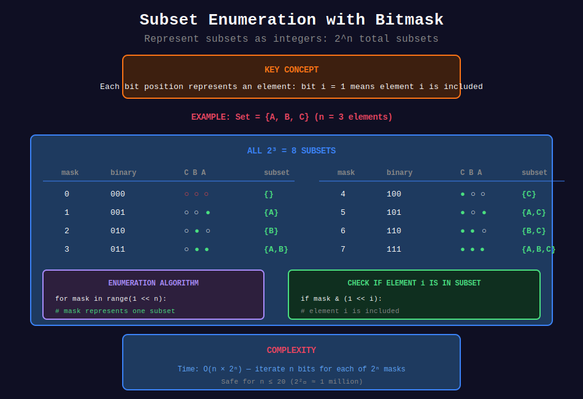
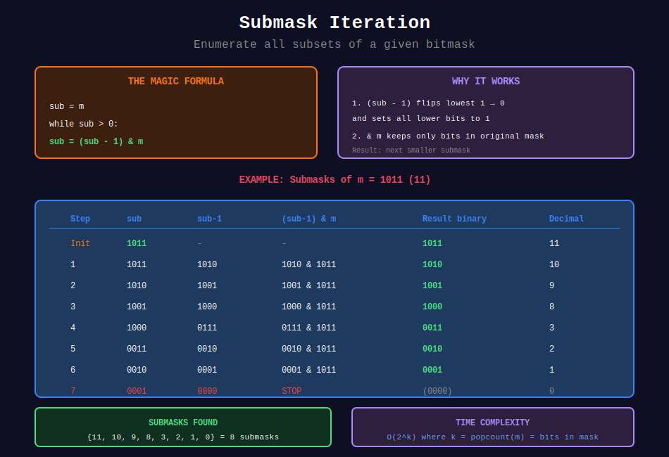
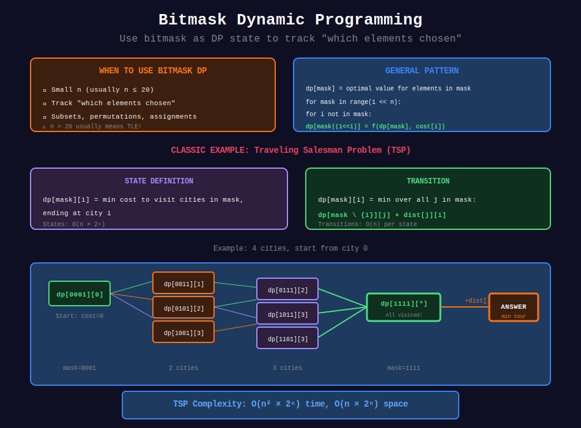

<div align="center">

# 🎭 Bitmask Techniques

### *Representing Sets and States with Bits*

<p>
  
  
  
</p>

*"When you need to track which elements are 'chosen', think bitmask."*

</div>

---

## 🧭 Navigation

| ⬅️ Previous | 📂 Current | ➡️ Next Topic |
|:------------|:----------:|--------:|
| [← 02. XOR Tricks](../02_xor_tricks/README.md) | **03. Bitmask** | [🏠 Bit Home](../README.md) → [Two Pointers](../../22_two_pointers/README.md) |

---

## 🎨 Visual Diagrams

<div align="center">

### Subset Enumeration with Bitmask


### Submask Iteration


### Bitmask Dynamic Programming


</div>

---

## 🎯 What You'll Master

- Representing subsets as integers
- Enumerating all \(2^n\) subsets
- Enumerating all subsets of a specific mask
- Bitmask Dynamic Programming
- Traveling Salesman and Partition problems

---

## 📐 Mathematical Foundations

### 1️⃣ Subset Representation

{: .highlight }
> Every subset of \(n\) elements can be represented as an \(n\)-bit integer!

For a set \(\{a_0, a_1, ..., a_{n-1}\}\), a subset \(S\) is represented by bitmask \(m\):

```math
i \in S \Leftrightarrow (m >> i) \land 1 = 1
```

#### 📊 Visual Example

```
Set: {apple, banana, cherry, date}
       a₀      a₁      a₂     a₃

Subset: {banana, date}

Bitmask: 1010₂ = 10₁₀

Position:  3   2   1   0
Bit:       1   0   1   0
           ↓       ↓
         date  banana

Check: (10 >> 1) & 1 = 5 & 1 = 1 → banana ∈ S ✓
       (10 >> 0) & 1 = 10 & 1 = 0 → apple ∉ S ✓
```

---

### 2️⃣ All Subsets Enumeration

For \(n\) elements, there are exactly \(2^n\) subsets (including empty set):

```math
\text{Subsets} = \{0, 1, 2, ..., 2^n - 1\}
```

#### The Algorithm

```python
for mask in range(1 << n):  # 0 to 2^n - 1
    # mask represents one subset
    for i in range(n):
        if mask & (1 << i):
            # Element i is in this subset
```

#### 📊 Complete Enumeration for n=3

```
mask | binary | subset
-----+--------+------------
  0  |  000   | {}
  1  |  001   | {a₀}
  2  |  010   | {a₁}
  3  |  011   | {a₀, a₁}
  4  |  100   | {a₂}
  5  |  101   | {a₀, a₂}
  6  |  110   | {a₁, a₂}
  7  |  111   | {a₀, a₁, a₂}
```

---

### 3️⃣ Submask Enumeration

{: .important }
> Given a bitmask \(m\), enumerate all its submasks (subsets of set bits).

#### The Magic Formula

```python
sub = m
while sub > 0:
    # Process submask 'sub'
    sub = (sub - 1) & m
# Don't forget to process empty set (0) if needed
```

#### 🔍 Mathematical Proof

**Why does `(sub - 1) & m` give the next smaller submask?**

1. `sub - 1` turns off the lowest set bit and sets all lower bits to 1
2. `& m` masks out bits not in original mask \(m\)
3. This gives the largest submask smaller than `sub`

#### 📊 Example: Submasks of m = 1011 (11)

```
Step 1: sub = 1011 (11)
        sub - 1 = 1010
        (sub - 1) & m = 1010 & 1011 = 1010 (10)

Step 2: sub = 1010 (10)  
        sub - 1 = 1001
        (sub - 1) & m = 1001 & 1011 = 1001 (9)

Step 3: sub = 1001 (9)
        sub - 1 = 1000
        (sub - 1) & m = 1000 & 1011 = 1000 (8)

Step 4: sub = 1000 (8)
        sub - 1 = 0111
        (sub - 1) & m = 0111 & 1011 = 0011 (3)

Step 5: sub = 0011 (3)
        sub - 1 = 0010
        (sub - 1) & m = 0010 & 1011 = 0010 (2)

Step 6: sub = 0010 (2)
        sub - 1 = 0001
        (sub - 1) & m = 0001 & 1011 = 0001 (1)

Step 7: sub = 0001 (1)
        sub - 1 = 0000
        Loop ends (sub = 0)

Submasks: {1011, 1010, 1001, 1000, 0011, 0010, 0001, 0000}
          = {11, 10, 9, 8, 3, 2, 1, 0}
```

#### ⏱️ Time Complexity

For all masks and their submasks:
```math
\sum_{m=0}^{2^n-1} 2^{\text{popcount}(m)} = 3^n
```

This is because each element has 3 choices: not in \(m\), in \(m\) but not in \(sub\), or in both.

---

### 4️⃣ Character Bitmask

Represent a set of lowercase letters using 26 bits:

```math
\text{mask} = \sum_{c \in \text{word}} 2^{c - \text{'a'}}
```

#### Use Cases

| Operation | Code | Description |
|-----------|------|-------------|
| Build mask | `mask \|= 1 << (c - 'a')` | Add character to set |
| Check letter | `mask & (1 << (c - 'a'))` | Is letter in set? |
| No overlap | `mask1 & mask2 == 0` | No common letters |
| Union | `mask1 \| mask2` | All letters from both |
| Intersection | `mask1 & mask2` | Common letters |

#### 📊 Example

```
word = "abc"

Building mask:
  'a' → bit 0 → mask |= 0001 → mask = 0001
  'b' → bit 1 → mask |= 0010 → mask = 0011
  'c' → bit 2 → mask |= 0100 → mask = 0111

Final: mask = 7 (binary: 111)

Checking "abc" and "def" have no common letters:
  mask_abc = 0000111 (7)
  mask_def = 0111000 (56)
  
  mask_abc & mask_def = 0 → No overlap! ✓
```

---

### 5️⃣ Bitmask DP Framework

{: .note }
> Bitmask DP uses the bitmask as part of the DP state.

#### General Pattern

```python
# State: dp[mask] = optimal value for chosen elements in mask
dp = [infinity] * (1 << n)
dp[0] = base_case

for mask in range(1 << n):
    for i in range(n):
        if not (mask & (1 << i)):  # i not yet chosen
            new_mask = mask | (1 << i)
            dp[new_mask] = optimize(dp[new_mask], dp[mask] + cost(mask, i))
```

#### Time Complexity
- States: \(O(2^n)\)
- Transitions per state: \(O(n)\)
- Total: \(O(n \cdot 2^n)\)

---

### 6️⃣ Traveling Salesman Problem (TSP)

{: .highlight }
> Classic bitmask DP: Visit all cities exactly once with minimum cost.

#### State Definition

```math
\text{dp}[\text{mask}][i] = \text{minimum cost to visit cities in mask, ending at } i
```

#### Recurrence

```math
\text{dp}[\text{mask}][i] = \min_{j \in \text{mask}, j \neq i} \left( \text{dp}[\text{mask} \setminus \{i\}][j] + \text{dist}[j][i] \right)
```

#### Base Case

```math
\text{dp}[1 << \text{start}][\text{start}] = 0
```

#### Answer

```math
\text{answer} = \min_{i} \left( \text{dp}[(1 << n) - 1][i] + \text{dist}[i][\text{start}] \right)
```

---

### 7️⃣ Subset Sum Partition

Partition array into \(k\) subsets of equal sum.

#### State Definition

```math
\text{dp}[\text{mask}] = \text{current bucket sum} \mod \text{target}
```

If we can partition elements in mask into complete buckets:
- `dp[mask] = 0` means we have exactly filled some buckets
- `dp[mask] = x > 0` means current partial bucket has sum x

---

## 📊 Visual Diagrams

### Subset Lattice (n=3)

```
                    111 ({a,b,c})
                   /   |   \
              011    101    110
            ({a,b}) ({a,c}) ({b,c})
              |  \  / |  \  / |
              |   \/  |   \/  |
              |   /\  |   /\  |
              |  /  \ |  /  \ |
              001    010    100
             ({a})  ({b})  ({c})
                \     |     /
                 \    |    /
                  \   |   /
                   \  |  /
                    000
                    ({})

Arrows represent "is subset of" relation
```

### TSP State Transitions

```
Start: City 0

dp[0001][0] = 0  (at city 0, visited {0})
      |
      +--→ dp[0011][1] = dist(0,1)  (visited {0,1}, at 1)
      |         |
      |         +--→ dp[0111][2] = dp[0011][1] + dist(1,2)
      |         +--→ dp[1011][3] = dp[0011][1] + dist(1,3)
      |
      +--→ dp[0101][2] = dist(0,2)  (visited {0,2}, at 2)
      |         |
      |         +--→ dp[0111][1] = dp[0101][2] + dist(2,1)
      |         +--→ dp[1101][3] = dp[0101][2] + dist(2,3)
      |
      +--→ dp[1001][3] = dist(0,3)  (visited {0,3}, at 3)
                |
                +--→ dp[1011][1] = dp[1001][3] + dist(3,1)
                +--→ dp[1101][2] = dp[1001][3] + dist(3,2)

Final: dp[1111][i] + dist(i, 0) for all i
```

---

## 💻 Code Implementations

```python
def subsets(nums: list[int]) -> list[list[int]]:
    """
    Generate all subsets using bitmask (LeetCode 78).
    
    For n elements, iterate 0 to 2^n - 1.
    Each bit position indicates element inclusion.
    
    Time: O(n × 2^n), Space: O(n × 2^n)
    
    Example:
    >>> subsets([1, 2, 3])
    [[], [1], [2], [1,2], [3], [1,3], [2,3], [1,2,3]]
    """
    n = len(nums)
    result = []
    
    for mask in range(1 << n):
        subset = []
        for i in range(n):
            if mask & (1 << i):
                subset.append(nums[i])
        result.append(subset)
    
    return result

def subsetXORSum(nums: list[int]) -> int:
    """
    Sum of All Subset XOR Totals (LeetCode 1863).
    
    Enumerate all subsets, compute XOR of each.
    
    Time: O(n × 2^n), Space: O(1)
    """
    total = 0
    n = len(nums)
    
    for mask in range(1 << n):
        xor_total = 0
        for i in range(n):
            if mask & (1 << i):
                xor_total ^= nums[i]
        total += xor_total
    
    return total

def subsetXORSum_optimized(nums: list[int]) -> int:
    """
    Optimized O(n) solution using math.
    
    Key insight: Each bit appears in exactly 2^(n-1) subsets.
    The contribution of each bit to final sum is bit × 2^(n-1).
    
    Time: O(n), Space: O(1)
    """
    # OR all numbers to get bits that contribute
    or_all = 0
    for num in nums:
        or_all |= num
    
    # Each bit contributes bit × 2^(n-1) to sum
    return or_all * (1 << (len(nums) - 1))

def maxProduct(words: list[str]) -> int:
    """
    Maximum Product of Word Lengths (LeetCode 318).
    
    Find max len(w1) × len(w2) where w1 and w2 share no letters.
    Use 26-bit mask for character set.
    
    Time: O(L + n²) where L = total chars, Space: O(n)
    
    Example:
    >>> maxProduct(["abcw","baz","foo","bar","xtfn","abcdef"])
    16
    """
    n = len(words)
    
    # Build character masks
    masks = []
    for word in words:
        mask = 0
        for c in word:
            mask |= (1 << (ord(c) - ord('a')))
        masks.append(mask)
    
    # Find max product with no overlap
    max_prod = 0
    for i in range(n):
        for j in range(i + 1, n):
            if masks[i] & masks[j] == 0:  # No common letters
                max_prod = max(max_prod, len(words[i]) * len(words[j]))
    
    return max_prod

def canPartitionKSubsets(nums: list[int], k: int) -> bool:
    """
    Partition to K Equal Sum Subsets (LeetCode 698).
    
    Bitmask DP approach.
    dp[mask] = sum of current incomplete bucket (mod target).
    
    Time: O(n × 2^n), Space: O(2^n)
    
    Example:
    >>> canPartitionKSubsets([4, 3, 2, 3, 5, 2, 1], 4)
    True
    """
    total = sum(nums)
    if total % k != 0:
        return False
    
    target = total // k
    n = len(nums)
    
    # Sort descending for early pruning
    nums.sort(reverse=True)
    if nums[0] > target:
        return False
    
    # dp[mask] = current bucket sum (mod target)
    # None means invalid/unreachable
    dp = {0: 0}
    
    for mask in range(1 << n):
        if mask not in dp:
            continue
        
        curr_sum = dp[mask]
        
        for i in range(n):
            # Skip if already used
            if mask & (1 << i):
                continue
            
            new_sum = curr_sum + nums[i]
            
            # Pruning: can't exceed target
            if new_sum > target:
                continue
            
            new_mask = mask | (1 << i)
            
            # Complete bucket: reset to 0
            if new_sum == target:
                dp[new_mask] = 0
            else:
                dp[new_mask] = new_sum
    
    return (1 << n) - 1 in dp

def shortestPathLength(graph: list[list[int]]) -> int:
    """
    Shortest Path Visiting All Nodes (LeetCode 847).
    
    BFS with state = (node, visited_mask).
    
    Time: O(n × 2^n), Space: O(n × 2^n)
    """
    from collections import deque
    
    n = len(graph)
    if n == 1:
        return 0
    
    # BFS: (node, visited_mask)
    # Start from all nodes simultaneously
    queue = deque()
    visited = set()
    
    for i in range(n):
        mask = 1 << i
        queue.append((i, mask, 0))  # (node, mask, distance)
        visited.add((i, mask))
    
    target = (1 << n) - 1
    
    while queue:
        node, mask, dist = queue.popleft()
        
        for neighbor in graph[node]:
            new_mask = mask | (1 << neighbor)
            
            if new_mask == target:
                return dist + 1
            
            if (neighbor, new_mask) not in visited:
                visited.add((neighbor, new_mask))
                queue.append((neighbor, new_mask, dist + 1))
    
    return -1

def findNumOfValidWords(words: list[str], puzzles: list[str]) -> list[int]:
    """
    Number of Valid Words for Each Puzzle (LeetCode 1178).
    
    A word is valid for a puzzle if:
    1. Contains puzzle's first letter
    2. All letters are in puzzle
    
    Enumerate submasks of puzzle (7 letters → 2^7 = 128 submasks).
    
    Time: O(W×L + P×2^7), Space: O(min(W, 2^26))
    
    Example:
    >>> findNumOfValidWords(["aaaa","asas","able","ability","actt","actor","access"],
    ...                     ["aboveyz","abrodyz","abslute","absoryz","acteli","abpeli"])
    [1, 1, 3, 2, 4, 0]
    """
    from collections import Counter
    
    # Count word masks
    word_masks = Counter()
    for word in words:
        mask = 0
        for c in word:
            mask |= (1 << (ord(c) - ord('a')))
        word_masks[mask] += 1
    
    result = []
    
    for puzzle in puzzles:
        first_bit = 1 << (ord(puzzle[0]) - ord('a'))
        
        # Build puzzle mask
        puzzle_mask = 0
        for c in puzzle:
            puzzle_mask |= (1 << (ord(c) - ord('a')))
        
        # Enumerate all submasks containing first letter
        count = 0
        sub = puzzle_mask
        
        while sub:
            if sub & first_bit:  # Must contain first letter
                count += word_masks.get(sub, 0)
            sub = (sub - 1) & puzzle_mask
        
        result.append(count)
    
    return result

def minStickers(stickers: list[str], target: str) -> int:
    """
    Stickers to Spell Word (LeetCode 691).
    
    Bitmask DP where mask represents letters of target covered.
    
    Time: O(2^n × m × L) where n=len(target), m=stickers, L=sticker length
    Space: O(2^n)
    """
    from functools import lru_cache
    
    n = len(target)
    
    # Precompute which target letters each sticker can provide
    def get_contribution(sticker: str, mask: int) -> int:
        """Return new mask after using this sticker."""
        target_count = {}
        for i in range(n):
            if not (mask & (1 << i)):
                c = target[i]
                target_count[c] = target_count.get(c, 0) + 1
        
        new_mask = mask
        for c in sticker:
            if c in target_count and target_count[c] > 0:
                # Find first uncovered position with this char
                for i in range(n):
                    if not (new_mask & (1 << i)) and target[i] == c:
                        new_mask |= (1 << i)
                        target_count[c] -= 1
                        break
        
        return new_mask
    
    @lru_cache(maxsize=None)
    def dp(mask: int) -> int:
        if mask == (1 << n) - 1:
            return 0
        
        result = float('inf')
        for sticker in stickers:
            # Only try stickers that can contribute
            new_mask = get_contribution(sticker, mask)
            if new_mask != mask:
                sub_result = dp(new_mask)
                if sub_result != float('inf'):
                    result = min(result, 1 + sub_result)
        
        return result
    
    ans = dp(0)
    return ans if ans != float('inf') else -1

def countArrangement(n: int) -> int:
    """
    Beautiful Arrangement (LeetCode 526).
    
    Count permutations where either:
    - perm[i] divides i, or
    - i divides perm[i]
    
    Bitmask DP: dp[mask] = arrangements using numbers in mask.
    
    Time: O(n × 2^n), Space: O(2^n)
    
    Example:
    >>> countArrangement(3)
    3
    """
    from functools import lru_cache
    
    @lru_cache(maxsize=None)
    def dp(mask: int, pos: int) -> int:
        if pos > n:
            return 1
        
        count = 0
        for num in range(1, n + 1):
            if not (mask & (1 << num)):  # num not used
                if num % pos == 0 or pos % num == 0:  # Beautiful condition
                    count += dp(mask | (1 << num), pos + 1)
        
        return count
    
    return dp(0, 1)

def maxStudents(seats: list[list[str]]) -> int:
    """
    Maximum Students Taking Exam (LeetCode 1349).
    
    Each row's valid seating is a bitmask.
    DP between rows checking no adjacent cheating.
    
    Time: O(m × 4^n), Space: O(2^n)
    """
    m, n = len(seats), len(seats[0])
    
    # Precompute valid masks for each row
    valid_masks = []
    for row in seats:
        mask = 0
        for j in range(n):
            if row[j] == '.':
                mask |= (1 << j)
        valid_masks.append(mask)
    
    def count_bits(x):
        return bin(x).count('1')
    
    def no_adjacent(mask):
        """Check no two adjacent bits set."""
        return (mask & (mask >> 1)) == 0
    
    def no_diagonal_cheat(prev_mask, curr_mask):
        """Check no diagonal cheating between rows."""
        # Left diagonal: curr's j can see prev's j-1
        # Right diagonal: curr's j can see prev's j+1
        return ((curr_mask & (prev_mask >> 1)) == 0 and 
                (curr_mask & (prev_mask << 1)) == 0)
    
    # DP: dp[mask] = max students with this row ending in mask
    prev_dp = {0: 0}
    
    for i in range(m):
        curr_dp = {}
        valid = valid_masks[i]
        
        # Enumerate all submasks of valid seats
        sub = valid
        while True:
            if no_adjacent(sub):
                students = count_bits(sub)
                
                for prev_mask, prev_count in prev_dp.items():
                    if no_diagonal_cheat(prev_mask, sub):
                        key = sub
                        curr_dp[key] = max(curr_dp.get(key, 0), 
                                          prev_count + students)
            
            if sub == 0:
                break
            sub = (sub - 1) & valid
        
        # Handle empty row case
        if 0 not in curr_dp:
            curr_dp[0] = max(prev_dp.values()) if prev_dp else 0
        
        prev_dp = curr_dp
    
    return max(prev_dp.values()) if prev_dp else 0
```

---

## 🎯 Pattern Summary

| Pattern | Problem Type | State | Complexity |
|---------|-------------|-------|------------|
| **All Subsets** | Generate combinations | mask = subset | O(2^n) |
| **Submask Enum** | Subset of subset | (sub-1) & mask | O(3^n) total |
| **Char Mask** | String comparison | 26-bit int | O(1) compare |
| **TSP** | Visit all nodes | dp[mask][last] | O(n² × 2^n) |
| **Partition** | Split into groups | dp[mask] | O(n × 2^n) |
| **Row State** | Grid problems | dp[row][mask] | O(m × 2^n) |

---

## 📊 When to Use Bitmask DP

```
+---------------------------------------------------------+
|                   BITMASK DP DETECTOR                   |
+---------------------------------------------------------+
|                                                         |
|  ✓ Small n (usually n ≤ 20)                            |
|  ✓ Need to track "which elements chosen"               |
|  ✓ Order may or may not matter                         |
|  ✓ Problems involving:                                 |
|    • Subsets / Combinations                            |
|    • Permutations with constraints                     |
|    • Visiting all nodes (TSP-like)                     |
|    • Partitioning into groups                          |
|    • Assignment problems                               |
|                                                         |
|  Complexity: O(n × 2^n) or O(n² × 2^n)                 |
|  Memory: O(2^n)                                         |
|                                                         |
|  Warning: n > 20 usually means TLE/MLE!                |
|                                                         |
+---------------------------------------------------------+
```

---

## 🏆 LeetCode Problems

### 🟡 Medium

| # | Problem | Pattern | Time | Space |
|:-:|---------|---------|:----:|:-----:|
| 78 | [Subsets](https://leetcode.com/problems/subsets/) | Enumerate 2^n | O(n×2^n) | O(2^n) |
| 318 | [Max Product Word Lengths](https://leetcode.com/problems/maximum-product-of-word-lengths/) | Char Mask | O(n²) | O(n) |
| 526 | [Beautiful Arrangement](https://leetcode.com/problems/beautiful-arrangement/) | Bitmask DP | O(n×2^n) | O(2^n) |
| 698 | [Partition to K Equal Sum](https://leetcode.com/problems/partition-to-k-equal-sum-subsets/) | Bitmask DP | O(n×2^n) | O(2^n) |
| 847 | [Shortest Path All Nodes](https://leetcode.com/problems/shortest-path-visiting-all-nodes/) | BFS + Mask | O(n×2^n) | O(n×2^n) |
| 1863 | [Subset XOR Sum](https://leetcode.com/problems/sum-of-all-subset-xor-totals/) | All Subsets | O(n×2^n) | O(1) |

### 🔴 Hard

| # | Problem | Pattern | Time | Space |
|:-:|---------|---------|:----:|:-----:|
| 691 | [Stickers to Spell Word](https://leetcode.com/problems/stickers-to-spell-word/) | Bitmask DP | O(2^n×m×L) | O(2^n) |
| 943 | [Shortest Superstring](https://leetcode.com/problems/find-the-shortest-superstring/) | TSP | O(n²×2^n) | O(n×2^n) |
| 1125 | [Smallest Sufficient Team](https://leetcode.com/problems/smallest-sufficient-team/) | Bitmask DP | O(p×2^n) | O(2^n) |
| 1178 | [Number of Valid Words](https://leetcode.com/problems/number-of-valid-words-for-each-puzzle/) | Submask Enum | O(W×L+P×2^7) | O(W) |
| 1349 | [Max Students Taking Exam](https://leetcode.com/problems/maximum-students-taking-exam/) | Row DP | O(m×4^n) | O(2^n) |

---

## 💡 Interview Tips

### Key Observations to Make

1. **"The constraint is n ≤ 20"** → Think bitmask!
2. **"Track which items are used"** → Bitmask DP
3. **"All permutations/subsets"** → Enumerate with mask
4. **"No common elements"** → Use AND to check overlap

### Common Optimizations

| Technique | When to Use | Benefit |
|-----------|-------------|---------|
| Sort descending | Partition problems | Early pruning |
| Precompute masks | String problems | Avoid recomputation |
| Submask iteration | Need subsets of subsets | O(3^n) not O(4^n) |
| Meet in middle | n up to 40 | Split into two halves |

---

## 📚 References

| Resource | Description | Link |
|----------|-------------|------|
| **Bitmask DP** | CP-Algorithms tutorial | [🔗 CP](https://cp-algorithms.com/algebra/all-submasks.html) |
| **TSP Tutorial** | Classic bitmask problem | [🔗 GFG](https://www.geeksforgeeks.org/travelling-salesman-problem-set-1/) |
| **SOS DP** | Sum over Subsets technique | [🔗 Codeforces](https://codeforces.com/blog/entry/45223) |
| **Submask Enumeration** | Mathematical analysis | [🔗 CSES](https://cses.fi/book/book.pdf) |
| **LeetCode Patterns** | Bitmask problems collection | [🔗 Discuss](https://leetcode.com/tag/bitmask/) |

---

## 🧮 Complexity Cheat Sheet

```
+--------------------------------------------------------+
|              BITMASK COMPLEXITY REFERENCE              |
+--------------------------------------------------------+
|                                                        |
|  2^10 = 1,024          ≈ 1K                           |
|  2^15 = 32,768         ≈ 32K                          |
|  2^20 = 1,048,576      ≈ 1M    ← Usually safe limit   |
|  2^25 = 33,554,432     ≈ 33M   ← May TLE              |
|  2^30 = 1,073,741,824  ≈ 1B    ← Definitely TLE       |
|                                                        |
|  3^10 = 59,049         ≈ 59K                          |
|  3^15 = 14,348,907     ≈ 14M                          |
|  3^20 = 3,486,784,401  ≈ 3.5B  ← TLE for submask     |
|                                                        |
|  Rule of thumb:                                        |
|  • n ≤ 15: Safe for O(n × 2^n)                        |
|  • n ≤ 20: Possible with optimizations                |
|  • n ≤ 25: Need meet-in-middle                        |
|  • n > 25: Look for different approach                |
|                                                        |
+--------------------------------------------------------+
```

---

<div align="center">

**Made with ❤️ by [Gaurav Goswami](https://github.com/Gaurav14cs17)**

*"When in doubt, bitmask it out!"*

</div>

---

## 🧭 Navigation

| ⬅️ Previous | 📂 Current | ➡️ Next Topic |
|:------------|:----------:|--------:|
| [← 02. XOR Tricks](../02_xor_tricks/README.md) | **03. Bitmask** | [🏠 Bit Home](../README.md) → [Two Pointers](../../22_two_pointers/README.md) |
