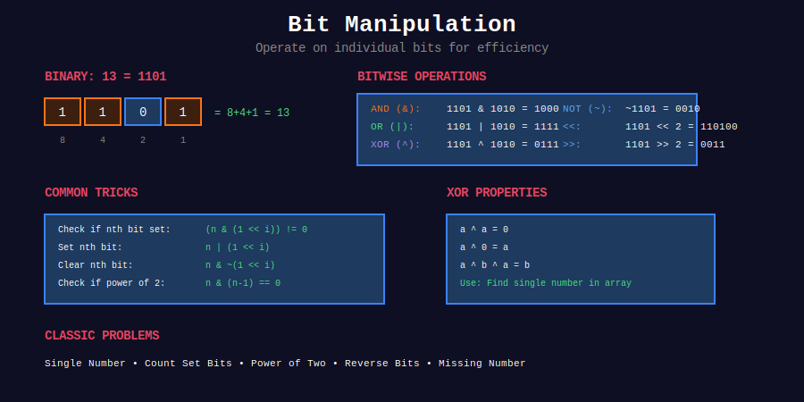

<div align="center">

# 🔢 Bit Manipulation



### *The Art of Speaking Binary*

<p>
  
  
  
  
</p>

**Master the lowest level of computation for blazingly fast O(1) operations**

[⬅️ Previous: Divide & Conquer](../20_divide_and_conquer/README.md) | [🏠 Home](../README.md) | [Next: Two Pointers ➡️](../22_two_pointers/README.md)

</div>

---

<div align="center">

</div>

---

## 🌟 Why Bit Manipulation?

> *"At the heart of every computer lies binary - the language of 0s and 1s. Mastering bit manipulation is mastering the machine itself."*

| Advantage | Description |
|-----------|-------------|
| ⚡ **Speed** | Bitwise operations execute in a single CPU cycle |
| 💾 **Memory** | Represent multiple boolean states in a single integer |
| 🎯 **Elegance** | Solve complex problems with minimal code |
| 🏆 **Interviews** | A favorite topic at FAANG companies |

---

## 📐 Mathematical Foundation

### 1️⃣ Binary Number System

Every positive integer \( n \) can be uniquely represented as a sum of powers of 2:

```math
n = \sum_{i=0}^{k} b_i \cdot 2^i = b_k \cdot 2^k + b_{k-1} \cdot 2^{k-1} + \cdots + b_1 \cdot 2 + b_0
```

where each \( b_i \in \{0, 1\} \) is called a **bit**.

#### 📝 Example: Converting 42 to Binary

```math
42 = 32 + 8 + 2 = 2^5 + 2^3 + 2^1 = \texttt{101010}_2
```

```
Position:  5   4   3   2   1   0
Power:    32  16   8   4   2   1
Bit:       1   0   1   0   1   0
           ↓       ↓       ↓
          32  +   8   +   2  = 42
```

---

### 2️⃣ Bitwise Operators

| Operator | Symbol | Description | Truth Table |
|----------|:------:|-------------|-------------|
| **AND** | `&` | 1 if both bits are 1 | `1&1=1`, `1&0=0`, `0&0=0` |
| **OR** | `\|` | 1 if either bit is 1 | `1\|1=1`, `1\|0=1`, `0\|0=0` |
| **XOR** | `^` | 1 if bits are different | `1^1=0`, `1^0=1`, `0^0=0` |
| **NOT** | `~` | Flip all bits | `~1=0`, `~0=1` |
| **Left Shift** | `<<` | Multiply by \(2^k\) | `n << k = n × 2^k` |
| **Right Shift** | `>>` | Divide by \(2^k\) | `n >> k = ⌊n / 2^k⌋` |

#### 🎨 Visual: Bitwise Operations

```
       AND (&)              OR (|)              XOR (^)
    1 0 1 1 (11)        1 0 1 1 (11)        1 0 1 1 (11)
  & 1 1 0 1 (13)      | 1 1 0 1 (13)      ^ 1 1 0 1 (13)
  -------------       -------------       -------------
    1 0 0 1 (9)         1 1 1 1 (15)        0 1 1 0 (6)
```

---

### 3️⃣ Essential Bit Tricks

| Operation | Code | Mathematical Formula | Example |
|-----------|------|---------------------|---------|
| Get bit at position i | `(n >> i) & 1` | \((n \div 2^i) \mod 2\) | `(5 >> 1) & 1 = 0` |
| Set bit at position i | `n \| (1 << i)` | \(n \lor 2^i\) | `5 \| (1 << 1) = 7` |
| Clear bit at position i | `n & ~(1 << i)` | \(n \land \lnot 2^i\) | `7 & ~(1 << 1) = 5` |
| Toggle bit at position i | `n ^ (1 << i)` | \(n \oplus 2^i\) | `5 ^ (1 << 1) = 7` |
| Clear lowest set bit | `n & (n - 1)` | Removes rightmost 1 | `12 & 11 = 8` |
| Isolate lowest set bit | `n & (-n)` | \(n \land (\sim n + 1)\) | `12 & (-12) = 4` |
| Check power of 2 | `n & (n - 1) == 0` | Only one bit set | `8 & 7 = 0 → True` |
| Count set bits | Brian Kernighan | Loop: `n &= (n-1)` | See below |

---

### 4️⃣ The Magic of `n & (n-1)`

This is the most powerful bit trick! It clears the lowest set bit.

#### 🔍 Proof

When we subtract 1 from \( n \):
- All bits to the right of the lowest set bit become 1
- The lowest set bit becomes 0
- All other bits remain unchanged

```
n     = ...a 1 0 0 0    (where 'a' are higher bits)
n-1   = ...a 0 1 1 1    (flip the lowest 1 and all bits to its right)
n&(n-1) = ...a 0 0 0 0    (lowest set bit is cleared!)
```

#### 📊 Example: n = 12

```
n     = 1 1 0 0   (12)
n-1   = 1 0 1 1   (11)
n&(n-1) = 1 0 0 0   (8)
            ↑
        Lowest 1 cleared!
```

#### 💡 Applications
- **Count set bits** (Brian Kernighan's Algorithm): O(number of set bits)
- **Check power of 2**: `n & (n-1) == 0` means only one bit is set

---

### 5️⃣ XOR Properties — The Swiss Army Knife

| Property | Formula | Use Case |
|----------|---------|----------|
| Self-Inverse | \(a \oplus a = 0\) | Cancel duplicates |
| Identity | \(a \oplus 0 = a\) | Initialize result |
| Commutative | \(a \oplus b = b \oplus a\) | Reorder freely |
| Associative | \((a \oplus b) \oplus c = a \oplus (b \oplus c)\) | Group freely |
| Swap | \(a \oplus b \oplus b = a\) | Swap without temp |

#### 🎯 Key Insight: Finding Unique Elements

If every element appears twice except one:

```math
\bigoplus_{i=0}^{n-1} \text{nums}[i] = \text{unique element}
```

All pairs cancel out (\(a \oplus a = 0\)), leaving only the unique element!

---

### 6️⃣ Two's Complement — Negative Numbers

In computers, negative numbers are represented using **two's complement**:

```math
-n = \sim n + 1 = 2^k - n
```

where \( k \) is the number of bits.

```
For 8-bit representation:
  5 = 0000 0101
 ~5 = 1111 1010
 -5 = 1111 1011  (add 1)
```

#### 🔑 Key Insight: `n & (-n)` isolates the lowest set bit

```
 n  = 0...01100  (12)
-n  = 1...10100  (-12 in two's complement)
n&-n = 0...00100  (4) — only lowest set bit remains!
```

---

## 📂 Subtopics Navigation

| # | Topic | Key Concepts | Problems | Link |
|:-:|-------|--------------|:--------:|------|
| 1 | **Basic Operations** | Kernighan, Power of 2, Reverse Bits | 10+ | [📖 Go →](./01_basic_operations/README.md) |
| 2 | **XOR Tricks** | Single Number, Missing Number, Partition | 10+ | [📖 Go →](./02_xor_tricks/README.md) |
| 3 | **Bitmask** | Subset Generation, State Compression, DP | 8+ | [📖 Go →](./03_bitmask/README.md) |

---

## 🎯 Pattern Recognition

```
                        +---------------------------------+
                        |        BIT MANIPULATION         |
                        |           PROBLEM               |
                        +---------------+-----------------+
                                        |
          +-----------------------------+-----------------------------+
          |                             |                             |
          ▼                             ▼                             ▼
   +--------------+            +--------------+            +--------------+
   | Find unique  |            | Count/Check  |            |   Subsets/   |
   |   element?   |            |    bits?     |            |    States    |
   +------+-------+            +------+-------+            +------+-------+
          |                           |                           |
          ▼                           ▼                           ▼
   +--------------+            +--------------+            +--------------+
   |   XOR All    |            |   n & (n-1)  |            |   Bitmask    |
   |   Elements   |            |  Kernighan   |            |   2^n enum   |
   +--------------+            +--------------+            +--------------+
          |                           |                           |
          ▼                           ▼                           ▼
   +--------------+            +--------------+            +--------------+
   | • Single Num |            | • Count Bits |            | • Subsets    |
   | • Missing Num|            | • Power of 2 |            | • TSP        |
   | • XOR Queries|            | • Power of 4 |            | • Partition  |
   +--------------+            +--------------+            +--------------+
```

---

## 🏆 LeetCode Problems

### 🟢 Easy

| # | Problem | Pattern | Time | Space | Key Insight |
|:-:|---------|---------|:----:|:-----:|-------------|
| 136 | [Single Number](https://leetcode.com/problems/single-number/) | XOR | O(n) | O(1) | a ⊕ a = 0 |
| 190 | [Reverse Bits](https://leetcode.com/problems/reverse-bits/) | Bit by Bit | O(32) | O(1) | Build from LSB |
| 191 | [Number of 1 Bits](https://leetcode.com/problems/number-of-1-bits/) | Kernighan | O(k) | O(1) | n & (n-1) |
| 231 | [Power of Two](https://leetcode.com/problems/power-of-two/) | n & (n-1) | O(1) | O(1) | Single bit set |
| 268 | [Missing Number](https://leetcode.com/problems/missing-number/) | XOR | O(n) | O(1) | XOR indices & values |
| 338 | [Counting Bits](https://leetcode.com/problems/counting-bits/) | DP | O(n) | O(n) | dp[i] = dp[i&(i-1)] + 1 |
| 342 | [Power of Four](https://leetcode.com/problems/power-of-four/) | Bit Mask | O(1) | O(1) | 0x55555555 pattern |
| 461 | [Hamming Distance](https://leetcode.com/problems/hamming-distance/) | XOR + Count | O(32) | O(1) | XOR then count |

### 🟡 Medium

| # | Problem | Pattern | Time | Space | Key Insight |
|:-:|---------|---------|:----:|:-----:|-------------|
| 137 | [Single Number II](https://leetcode.com/problems/single-number-ii/) | Bit Count | O(n) | O(1) | Count bits mod 3 |
| 201 | [Bitwise AND of Range](https://leetcode.com/problems/bitwise-and-of-numbers-range/) | Common Prefix | O(32) | O(1) | Find common prefix |
| 260 | [Single Number III](https://leetcode.com/problems/single-number-iii/) | XOR + Partition | O(n) | O(1) | Split by diff bit |
| 318 | [Maximum Product of Word Lengths](https://leetcode.com/problems/maximum-product-of-word-lengths/) | Bitmask | O(n²) | O(n) | Char mask comparison |
| 371 | [Sum of Two Integers](https://leetcode.com/problems/sum-of-two-integers/) | Bit Add | O(32) | O(1) | Carry propagation |
| 421 | [Maximum XOR](https://leetcode.com/problems/maximum-xor-of-two-numbers-in-an-array/) | Trie | O(n) | O(n) | Greedy bit selection |

### 🔴 Hard

| # | Problem | Pattern | Time | Space | Key Insight |
|:-:|---------|---------|:----:|:-----:|-------------|
| 1178 | [Number of Valid Words](https://leetcode.com/problems/number-of-valid-words-for-each-puzzle/) | Bitmask + Subset | O(n × 2^7) | O(n) | Enumerate submasks |

---

## 💡 Pro Tips for Interviews

{: .important }
> **Always verify edge cases**: What happens with n = 0? What about negative numbers? What about INT_MIN?

### Common Pitfalls

| ❌ Mistake | ✅ Solution |
|-----------|------------|
| Forgetting negative numbers | Use `& 0xFFFFFFFF` for 32-bit |
| Left shift overflow | Check bounds before shifting |
| Assuming 32-bit | Clarify with interviewer |
| Ignoring n = 0 | Handle as special case |

### Interview Script

1. **Clarify**: "Are we dealing with 32-bit integers? Can numbers be negative?"
2. **Pattern Match**: Identify XOR/Count/Bitmask pattern
3. **Verbalize**: "I'll use `n & (n-1)` to clear bits because..."
4. **Edge Cases**: Test with 0, 1, -1, INT_MAX, INT_MIN

---

## 🧠 Real-World Applications

| Application | How Bits Help |
|-------------|--------------|
| **Bloom Filters** | Fast set membership using bit arrays |
| **Compression** | Huffman coding, LZ77 use bit manipulation |
| **Cryptography** | XOR is fundamental in encryption |
| **Graphics** | Pixel manipulation, color blending |
| **Networking** | IP subnet masks, MAC address matching |
| **Databases** | Bitmap indexes for fast queries |
| **OS Kernels** | Permission flags, process states |

---

## 📊 Time Complexity Comparison

| Operation | Bit Method | Alternative | Speedup |
|-----------|------------|-------------|---------|
| Multiply by 2 | `n << 1` | `n * 2` | ~2-5x |
| Divide by 2 | `n >> 1` | `n // 2` | ~2-5x |
| Check even/odd | `n & 1` | `n % 2` | ~3-10x |
| Check power of 2 | `n & (n-1)` | Loop/Log | ~10-100x |
| Swap values | `a ^= b ^= a ^= b` | Temp var | ~2x |

---

## 📚 References & Further Reading

### 📖 Essential Reading

| Resource | Description | Link |
|----------|-------------|------|
| **Bit Twiddling Hacks** | Stanford's legendary bit manipulation resource | [🔗 Stanford](https://graphics.stanford.edu/~seander/bithacks.html) |
| **Hacker's Delight** | The bible of bit manipulation | [🔗 Book](https://www.amazon.com/Hackers-Delight-2nd-Henry-Warren/dp/0321842685) |
| **CP-Algorithms** | Competitive programming bit techniques | [🔗 Site](https://cp-algorithms.com/algebra/bit-manipulation.html) |

### 📺 Video Resources

| Channel | Topic | Link |
|---------|-------|------|
| **NeetCode** | Bit Manipulation Playlist | [🔗 YouTube](https://www.youtube.com/watch?v=5Km3utixwZs) |
| **Abdul Bari** | Bit Manipulation Basics | [🔗 YouTube](https://www.youtube.com/watch?v=mesu75PTDC8) |
| **William Fiset** | Bit Manipulation Tutorial | [🔗 YouTube](https://www.youtube.com/watch?v=NLKQEOgBLAY) |

### 📝 Articles

| Source | Title | Link |
|--------|-------|------|
| **GeeksforGeeks** | Complete Bit Manipulation Guide | [🔗 GFG](https://www.geeksforgeeks.org/bits-manipulation-important-tactics/) |
| **LeetCode** | Bit Manipulation Patterns | [🔗 Discuss](https://leetcode.com/discuss/study-guide/1151183/) |
| **Wikipedia** | Bitwise Operations | [🔗 Wiki](https://en.wikipedia.org/wiki/Bitwise_operation) |
| **Wikipedia** | Two's Complement | [🔗 Wiki](https://en.wikipedia.org/wiki/Two%27s_complement) |

---

## 🎓 Quick Reference Card

```
+--------------------------------------------------------------+
|                    BIT MANIPULATION CHEAT SHEET              |
+--------------------------------------------------------------+
|  Get bit i:       (n >> i) & 1                               |
|  Set bit i:       n | (1 << i)                               |
|  Clear bit i:     n & ~(1 << i)                              |
|  Toggle bit i:    n ^ (1 << i)                               |
|  Clear lowest 1:  n & (n - 1)                                |
|  Isolate lowest:  n & (-n)                                   |
|  Is power of 2:   n > 0 && (n & (n - 1)) == 0                |
|  Count bits:      while n: n &= n-1; count++                 |
+--------------------------------------------------------------+
|  XOR:  a^a=0   a^0=a   a^b=b^a   (a^b)^c=a^(b^c)            |
+--------------------------------------------------------------+
|  Two's Complement:  -n = ~n + 1                              |
|  Swap:  a ^= b; b ^= a; a ^= b;                              |
+--------------------------------------------------------------+
```

---

<div align="center">

**Made with ❤️ by [Gaurav Goswami](https://github.com/Gaurav14cs17)**

*"In the world of algorithms, every bit counts."*

[⬅️ Previous: Divide & Conquer](../20_divide_and_conquer/README.md) | [🏠 Home](../README.md) | [Next: Two Pointers ➡️](../22_two_pointers/README.md)

</div>
