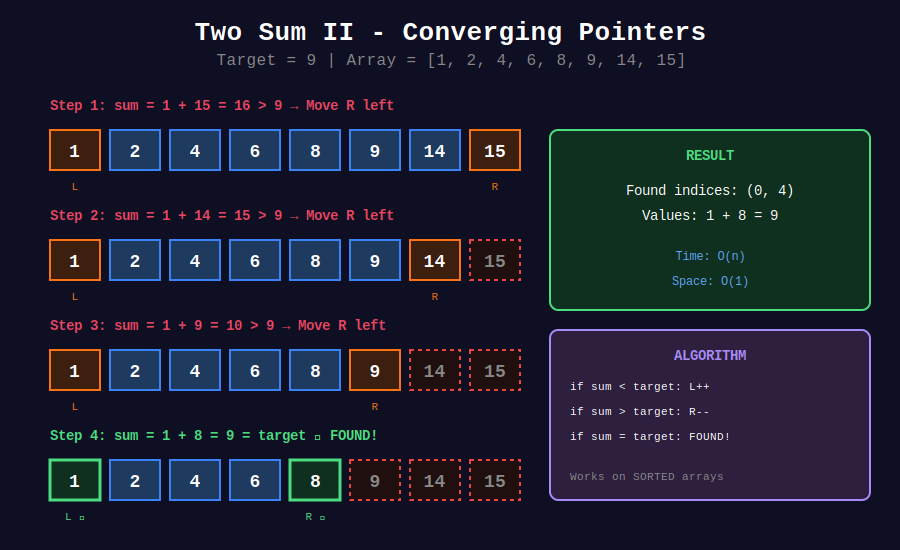
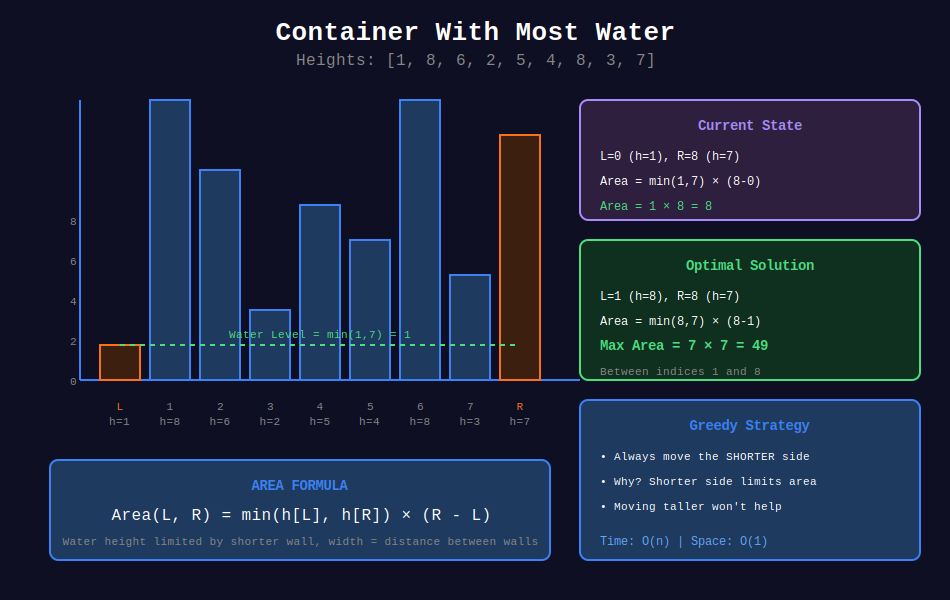
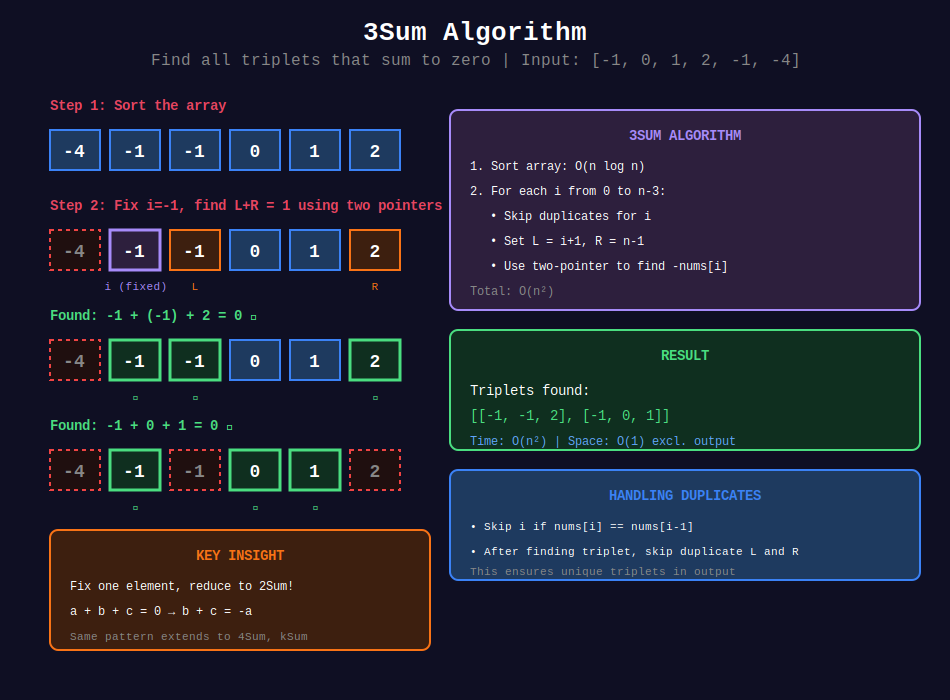

<div align="center">

# ↔️ Opposite Direction Pointers

### *When Two Become One — The Art of Convergence*

<p>
  
  
  
</p>

*"Start at opposite ends, converge to the answer."*

</div>

---

## 🧭 Navigation

| ⬅️ Previous | 📂 Current | ➡️ Next |
|:------------|:----------:|--------:|
| [🏠 Two Pointers Home](../README.md) | **01. Opposite Direction** | [02. Same Direction →](../02_same_direction/README.md) |

---

## 🎯 What You'll Master

- Two Sum in sorted arrays with mathematical proof
- 3Sum and 4Sum reduction techniques
- Container With Most Water with optimality proof
- Trapping Rain Water with dual-max approach
- Palindrome verification patterns

---

## 📊 Visual Diagrams

### Two Sum Convergence


### Container With Most Water


### 3Sum Algorithm


---

## 📐 Mathematical Foundations

### 1️⃣ The Convergence Principle

{: .highlight }
> Two pointers start at opposite ends and move towards each other, eliminating search space at each step.

#### Initial State

```math
left = 0, \quad right = n - 1
```

#### Loop Invariant

The solution, if it exists, lies within the range $[left, right]$.

#### Termination

The loop ends when $left \geq right$, having checked all necessary pairs.

---

### 2️⃣ Two Sum II — Complete Proof

{: .important }
> **Problem**: Given a **sorted** array and target, find two indices such that their values sum to target.

#### The Algorithm

```
while left < right:
    sum = arr[left] + arr[right]
    if sum == target: return (left, right)
    if sum < target: left++
    if sum > target: right--
```

#### 🔍 Proof of Correctness

**Theorem**: If a valid pair $(i, j)$ with $i < j$ exists, the algorithm finds it.

**Proof**:

We prove by induction on the number of iterations.

**Base case**: Initially, if solution $(i, j)$ exists, then $0 \leq i < j \leq n-1$, so it's in $[left, right]$.

**Inductive step**: Assume solution is in $[left, right]$. We show it remains after one iteration.

**Case 1**: $arr[left] + arr[right] < target$

We claim $left$ cannot be part of any valid pair in the current range.

For any $k \in [left, right]$:

```math
arr[left] + arr[k] \leq arr[left] + arr[right] < target
```

Since the array is sorted, $arr[k] \leq arr[right]$.

Therefore, $left$ is not the left index of any solution, so we safely increment it.

**Case 2**: $arr[left] + arr[right] > target$

By symmetric argument, $right$ cannot be the right index of any solution.

For any $k \in [left, right]$:

```math
arr[k] + arr[right] \geq arr[left] + arr[right] > target
```

We safely decrement $right$.

**Case 3**: $arr[left] + arr[right] = target$

Found the solution. ∎

#### ⏱️ Time Complexity

Each iteration moves at least one pointer. Maximum $n$ moves before $left \geq right$.

```math
T(n) = O(n)
```

---

### 3️⃣ Container With Most Water — Optimality Proof

{: .note }
> **Problem**: Find two lines that together with x-axis form a container holding the most water.

#### The Formula

```math
\text{Area}(l, r) = \min(h[l], h[r]) \times (r - l)
```

The area is limited by the **shorter** line.

#### 🔍 Proof: Greedy Choice is Optimal

**Claim**: Moving the pointer at the shorter line never misses the optimal solution.

**Proof by contradiction**:

Suppose $h[l] < h[r]$ and the optimal solution involves $l$ with some $k$ where $l < k < r$.

Then:

```math
\text{Area}(l, k) = \min(h[l], h[k]) \times (k - l)
```

Since $h[l]$ is the minimum (given $h[l] < h[r]$ and we're looking at containers with $l$):

```math
\text{Area}(l, k) \leq h[l] \times (k - l) < h[l] \times (r - l)
```

Because $k < r$, we have $k - l < r - l$.

But:

```math
h[l] \times (r - l) = \min(h[l], h[r]) \times (r - l) = \text{Area}(l, r)
```

So $\text{Area}(l, k) < \text{Area}(l, r)$.

Therefore, no container involving $l$ with a position $< r$ can beat $(l, r)$.

We've already recorded $\text{Area}(l, r)$, so we can safely discard $l$. ∎

#### 📊 Visual Proof

```
Heights: [1, 8, 6, 2, 5, 4, 8, 3, 7]
          ↑                       ↑
          L                       R

Area = min(1, 7) × 8 = 1 × 8 = 8

Move L (shorter side):
Heights: [1, 8, 6, 2, 5, 4, 8, 3, 7]
             ↑                    ↑
             L                    R

Area = min(8, 7) × 7 = 7 × 7 = 49  ← Better!

Why moving L was correct:
- Any container with old L has height ≤ 1
- Width < 8 (current width)
- Area < 8 (already recorded)
- No loss in moving L
```

---

### 4️⃣ Trapping Rain Water — The Dual-Maximum Insight

{: .highlight }
> Water at position $i$ depends on the **minimum** of the **maximum** heights on both sides.

#### The Key Formula

```math
\text{water}[i] = \max(0, \min(\text{maxLeft}[i], \text{maxRight}[i]) - h[i])
```

#### 🔍 Proof of Two-Pointer Optimization

**Claim**: If $leftMax < rightMax$, the water at position $left$ is exactly $leftMax - h[left]$.

**Proof**:

We maintain:
- $leftMax = \max(h[0], h[1], ..., h[left])$
- $rightMax = \max(h[right], h[right+1], ..., h[n-1])$

Since $leftMax < rightMax$, and $rightMax$ only considers positions $\geq right$:

For position $left$, the actual maximum on the right side is:

```math
\text{actualRightMax} = \max(h[left+1], ..., h[n-1]) \geq rightMax > leftMax
```

Therefore:

```math
\min(leftMax, \text{actualRightMax}) = leftMax
```

The water level at $left$ is determined solely by $leftMax$! ∎

#### 📊 Visual Example

```
Height:     [0, 1, 0, 2, 1, 0, 1, 3, 2, 1, 2, 1]
             L                                R

leftMax = 0, rightMax = 1

Since leftMax ≤ rightMax:
  Water at L = max(0, leftMax - h[L]) = max(0, 0 - 0) = 0
  Move L right

Height:     [0, 1, 0, 2, 1, 0, 1, 3, 2, 1, 2, 1]
                L                             R

leftMax = 1, rightMax = 1

Continue until L meets R...

Total water = 6 units
```

---

### 5️⃣ 3Sum Reduction

{: .important }
> Reduce 3Sum to 2Sum by fixing one element.

#### Mathematical Framework

Find $a + b + c = 0$ where $a \leq b \leq c$.

1. Sort the array: $O(n \log n)$
2. For each $a = nums[i]$:
   - Find $b + c = -a$ using two pointers: $O(n)$
3. Total: $O(n^2)$

#### Handling Duplicates

Skip duplicate values for $a$:
```python
if i > 0 and nums[i] == nums[i-1]:
    continue
```

Skip duplicate $b$ and $c$ after finding a valid triplet.

---

### 6️⃣ kSum Generalization

For $k$-Sum problem:

```math
T(k, n) = O(n^{k-1})
```

Reduction: Fix one element, solve $(k-1)$-Sum on remaining.

- 2Sum: $O(n)$
- 3Sum: $O(n^2)$
- 4Sum: $O(n^3)$

---

## 📊 Visual Diagrams

### Two Sum Convergence

```
Target = 9

Initial:
[1, 2, 3, 4, 5, 6, 7, 8, 9]
 ↑                       ↑
 L                       R
 sum = 1 + 9 = 10 > 9, move R

Step 2:
[1, 2, 3, 4, 5, 6, 7, 8, 9]
 ↑                    ↑
 L                    R
 sum = 1 + 8 = 9 = target ✓

Found: indices (0, 7)
```

### Container Area Visualization

```
    |
8   |     █           █
7   |     █     █     █   █
6   |     █ █   █     █   █
5   |     █ █   █ █   █   █
4   |     █ █   █ █ █ █   █
3   |     █ █ █ █ █ █ █ █ █
2   | █   █ █ █ █ █ █ █ █ █
1   | █   █ █ █ █ █ █ █ █ █
    +-+-+-+-+-+-+-+-+-+-+-
      0 1 2 3 4 5 6 7 8

Max container: between indices 1 and 8
Area = min(8, 7) × (8 - 1) = 7 × 7 = 49

Water fills up to height 7 (the shorter of 8 and 7)
```

### 3Sum Reduction Flow

```
+-------------------------------------------------------------+
|                    3SUM ALGORITHM                           |
+-------------------------------------------------------------+
|                                                             |
|  Input: [-4, -1, -1, 0, 1, 2]                              |
|  Target: 0                                                  |
|                                                             |
|  Step 1: Sort → [-4, -1, -1, 0, 1, 2]  ✓ (already sorted)  |
|                                                             |
|  Step 2: Fix each element, solve 2Sum                       |
|                                                             |
|  i = 0: a = -4                                              |
|  Find b + c = 4 in [-1, -1, 0, 1, 2]                       |
|    L = -1, R = 2 → sum = 1 < 4, move L                     |
|    L = -1, R = 2 → sum = 1 < 4, move L                     |
|    L = 0, R = 2 → sum = 2 < 4, move L                      |
|    L = 1, R = 2 → sum = 3 < 4, move L                      |
|    L crosses R → no solution with a = -4                   |
|                                                             |
|  i = 1: a = -1                                              |
|  Find b + c = 1 in [-1, 0, 1, 2]                           |
|    L = -1, R = 2 → sum = 1 = 1 ✓                           |
|    → Triplet: [-1, -1, 2]                                  |
|    Move both L and R                                        |
|    L = 0, R = 1 → sum = 1 = 1 ✓                            |
|    → Triplet: [-1, 0, 1]                                   |
|                                                             |
|  i = 2: a = -1 (duplicate, skip)                           |
|                                                             |
|  i = 3: a = 0                                               |
|  Find b + c = 0 in [1, 2]                                  |
|    L = 1, R = 2 → sum = 3 > 0, move R                      |
|    L crosses R → no solution                               |
|                                                             |
|  Result: [[-1, -1, 2], [-1, 0, 1]]                         |
|                                                             |
+-------------------------------------------------------------+
```

---

## 💻 Code Implementations

```python
def twoSum(numbers: list[int], target: int) -> list[int]:
    """
    Two Sum II - Sorted Array (LeetCode 167).
    
    Given a 1-indexed sorted array, find two numbers that sum to target.
    
    Time: O(n), Space: O(1)
    
    Example:
    >>> twoSum([2, 7, 11, 15], 9)
    [1, 2]
    """
    left, right = 0, len(numbers) - 1
    
    while left < right:
        current_sum = numbers[left] + numbers[right]
        
        if current_sum == target:
            return [left + 1, right + 1]  # 1-indexed
        elif current_sum < target:
            left += 1      # Need larger sum
        else:
            right -= 1     # Need smaller sum
    
    return []  # No solution (shouldn't happen per problem)

def threeSum(nums: list[int]) -> list[list[int]]:
    """
    3Sum (LeetCode 15).
    
    Find all unique triplets that sum to zero.
    
    Time: O(n²), Space: O(1) excluding output
    
    Example:
    >>> threeSum([-1, 0, 1, 2, -1, -4])
    [[-1, -1, 2], [-1, 0, 1]]
    """
    nums.sort()  # Sort to enable two-pointer technique
    result = []
    n = len(nums)
    
    for i in range(n - 2):

        # Skip duplicates for first element
        if i > 0 and nums[i] == nums[i - 1]:
            continue
        
        # Early termination: if smallest is positive, no solution
        if nums[i] > 0:
            break
        
        # Two-pointer for remaining two elements
        left, right = i + 1, n - 1
        target = -nums[i]
        
        while left < right:
            current_sum = nums[left] + nums[right]
            
            if current_sum == target:
                result.append([nums[i], nums[left], nums[right]])
                
                # Skip duplicates for second element
                while left < right and nums[left] == nums[left + 1]:
                    left += 1

                # Skip duplicates for third element
                while left < right and nums[right] == nums[right - 1]:
                    right -= 1
                
                left += 1
                right -= 1
            elif current_sum < target:
                left += 1
            else:
                right -= 1
    
    return result

def threeSumClosest(nums: list[int], target: int) -> int:
    """
    3Sum Closest (LeetCode 16).
    
    Find triplet sum closest to target.
    
    Time: O(n²), Space: O(1)
    
    Example:
    >>> threeSumClosest([-1, 2, 1, -4], 1)
    2
    """
    nums.sort()
    n = len(nums)
    closest = float('inf')
    
    for i in range(n - 2):
        left, right = i + 1, n - 1
        
        while left < right:
            current_sum = nums[i] + nums[left] + nums[right]
            
            # Update closest if this is better
            if abs(current_sum - target) < abs(closest - target):
                closest = current_sum
            
            if current_sum == target:
                return target  # Can't get closer than exact match
            elif current_sum < target:
                left += 1
            else:
                right -= 1
    
    return closest

def fourSum(nums: list[int], target: int) -> list[list[int]]:
    """
    4Sum (LeetCode 18).
    
    Find all unique quadruplets that sum to target.
    
    Time: O(n³), Space: O(1) excluding output
    """
    nums.sort()
    result = []
    n = len(nums)
    
    for i in range(n - 3):

        # Skip duplicates
        if i > 0 and nums[i] == nums[i - 1]:
            continue
        
        for j in range(i + 1, n - 2):

            # Skip duplicates
            if j > i + 1 and nums[j] == nums[j - 1]:
                continue
            
            left, right = j + 1, n - 1
            remaining = target - nums[i] - nums[j]
            
            while left < right:
                current_sum = nums[left] + nums[right]
                
                if current_sum == remaining:
                    result.append([nums[i], nums[j], nums[left], nums[right]])
                    
                    while left < right and nums[left] == nums[left + 1]:
                        left += 1
                    while left < right and nums[right] == nums[right - 1]:
                        right -= 1
                    
                    left += 1
                    right -= 1
                elif current_sum < remaining:
                    left += 1
                else:
                    right -= 1
    
    return result

def maxArea(height: list[int]) -> int:
    """
    Container With Most Water (LeetCode 11).
    
    Find two lines that form container with most water.
    Move the shorter line inward (greedy).
    
    Time: O(n), Space: O(1)
    
    Example:
    >>> maxArea([1, 8, 6, 2, 5, 4, 8, 3, 7])
    49
    """
    left, right = 0, len(height) - 1
    max_area = 0
    
    while left < right:

        # Calculate current area
        width = right - left
        h = min(height[left], height[right])
        area = width * h
        max_area = max(max_area, area)
        
        # Move the shorter side (greedy choice)
        if height[left] < height[right]:
            left += 1
        else:
            right -= 1
    
    return max_area

def trap(height: list[int]) -> int:
    """
    Trapping Rain Water (LeetCode 42).
    
    Calculate water trapped after rain.
    
    Key insight: Water at position i = min(leftMax, rightMax) - height[i]
    
    Two-pointer approach: Process from the side with smaller max.
    
    Time: O(n), Space: O(1)
    
    Example:
    >>> trap([0, 1, 0, 2, 1, 0, 1, 3, 2, 1, 2, 1])
    6
    """
    if not height:
        return 0
    
    left, right = 0, len(height) - 1
    left_max = right_max = 0
    water = 0
    
    while left < right:
        if height[left] < height[right]:

            # Left side is limiting factor
            if height[left] >= left_max:
                left_max = height[left]
            else:
                water += left_max - height[left]
            left += 1
        else:

            # Right side is limiting factor
            if height[right] >= right_max:
                right_max = height[right]
            else:
                water += right_max - height[right]
            right -= 1
    
    return water

def isPalindrome(s: str) -> bool:
    """
    Valid Palindrome (LeetCode 125).
    
    Check if string is palindrome (alphanumeric only, case-insensitive).
    
    Time: O(n), Space: O(1)
    
    Example:
    >>> isPalindrome("A man, a plan, a canal: Panama")
    True
    """
    left, right = 0, len(s) - 1
    
    while left < right:

        # Skip non-alphanumeric from left
        while left < right and not s[left].isalnum():
            left += 1
        
        # Skip non-alphanumeric from right
        while left < right and not s[right].isalnum():
            right -= 1
        
        # Compare (case-insensitive)
        if s[left].lower() != s[right].lower():
            return False
        
        left += 1
        right -= 1
    
    return True

def validPalindromeII(s: str) -> bool:
    """
    Valid Palindrome II (LeetCode 680).
    
    Can string become palindrome by removing at most one character?
    
    Time: O(n), Space: O(1)
    
    Example:
    >>> validPalindromeII("abca")
    True
    """
    def is_palindrome_range(s: str, left: int, right: int) -> bool:
        while left < right:
            if s[left] != s[right]:
                return False
            left += 1
            right -= 1
        return True
    
    left, right = 0, len(s) - 1
    
    while left < right:
        if s[left] != s[right]:

            # Try skipping either left or right character
            return (is_palindrome_range(s, left + 1, right) or 
                    is_palindrome_range(s, left, right - 1))
        left += 1
        right -= 1
    
    return True

def reverseString(s: list[str]) -> None:
    """
    Reverse String (LeetCode 344).
    
    Reverse in-place.
    
    Time: O(n), Space: O(1)
    """
    left, right = 0, len(s) - 1
    
    while left < right:
        s[left], s[right] = s[right], s[left]
        left += 1
        right -= 1

def reverseVowels(s: str) -> str:
    """
    Reverse Vowels of a String (LeetCode 345).
    
    Time: O(n), Space: O(n) for string conversion
    """
    vowels = set('aeiouAEIOU')
    chars = list(s)
    left, right = 0, len(chars) - 1
    
    while left < right:
        while left < right and chars[left] not in vowels:
            left += 1
        while left < right and chars[right] not in vowels:
            right -= 1
        
        chars[left], chars[right] = chars[right], chars[left]
        left += 1
        right -= 1
    
    return ''.join(chars)
```

---

## 🎯 Pattern Summary

| Problem Type | Key Insight | Time |
|--------------|-------------|------|
| **Two Sum (sorted)** | Sum too small → move left, too big → move right | O(n) |
| **3Sum** | Fix one, solve 2Sum | O(n²) |
| **Container** | Move shorter side (greedy) | O(n) |
| **Trapping Rain** | Water = min(leftMax, rightMax) - height | O(n) |
| **Palindrome** | Compare ends, move inward | O(n) |

---

## 🏆 LeetCode Problems

### 🟢 Easy

| # | Problem | Key Insight | Time | Space |
|:-:|---------|-------------|:----:|:-----:|
| 125 | [Valid Palindrome](https://leetcode.com/problems/valid-palindrome/) | Skip non-alnum, compare | O(n) | O(1) |
| 167 | [Two Sum II](https://leetcode.com/problems/two-sum-ii-input-array-is-sorted/) | Sorted → converge | O(n) | O(1) |
| 344 | [Reverse String](https://leetcode.com/problems/reverse-string/) | Swap ends | O(n) | O(1) |
| 345 | [Reverse Vowels](https://leetcode.com/problems/reverse-vowels-of-a-string/) | Find vowels, swap | O(n) | O(n) |
| 680 | [Valid Palindrome II](https://leetcode.com/problems/valid-palindrome-ii/) | Skip one char | O(n) | O(1) |

### 🟡 Medium

| # | Problem | Key Insight | Time | Space |
|:-:|---------|-------------|:----:|:-----:|
| 11 | [Container With Most Water](https://leetcode.com/problems/container-with-most-water/) | Move shorter side | O(n) | O(1) |
| 15 | [3Sum](https://leetcode.com/problems/3sum/) | Sort + fix + 2ptr | O(n²) | O(1) |
| 16 | [3Sum Closest](https://leetcode.com/problems/3sum-closest/) | Track closest diff | O(n²) | O(1) |
| 18 | [4Sum](https://leetcode.com/problems/4sum/) | Double fix + 2ptr | O(n³) | O(1) |
| 611 | [Valid Triangle Number](https://leetcode.com/problems/valid-triangle-number/) | Fix largest, 2ptr | O(n²) | O(1) |

### 🔴 Hard

| # | Problem | Key Insight | Time | Space |
|:-:|---------|-------------|:----:|:-----:|
| 42 | [Trapping Rain Water](https://leetcode.com/problems/trapping-rain-water/) | min(maxL, maxR) - h | O(n) | O(1) |

---

## 💡 Interview Tips

### Common Variations

| Variation | Modification |
|-----------|--------------|
| Target sum | Standard two-pointer |
| Sum closest to target | Track minimum difference |
| Count pairs with property | Count instead of return |
| All pairs | Collect all, handle duplicates |

### Edge Cases

| Case | How to Handle |
|------|---------------|
| Empty array | Return early |
| Single element | Can't form pair |
| All same elements | Handle duplicates |
| No solution | Return appropriate sentinel |

---

## 📚 References

| Resource | Description | Link |
|----------|-------------|------|
| **Two Sum Problem** | Classic algorithm explanation | [🔗 Wikipedia](https://en.wikipedia.org/wiki/Two-sum_problem) |
| **Container Problem** | Visual explanation | [🔗 LeetCode](https://leetcode.com/problems/container-with-most-water/solution/) |
| **3Sum Variants** | Comprehensive guide | [🔗 GFG](https://www.geeksforgeeks.org/find-triplets-array-whose-sum-equal-zero/) |
| **Rain Water** | Multiple approaches | [🔗 LeetCode](https://leetcode.com/problems/trapping-rain-water/solution/) |

---

<div align="center">

**Made with ❤️ by [Gaurav Goswami](https://github.com/Gaurav14cs17)**

*"When arrays are sorted, convergence is the answer."*

</div>

---

## 🧭 Navigation

| ⬅️ Previous | 📂 Current | ➡️ Next |
|:------------|:----------:|--------:|
| [🏠 Two Pointers Home](../README.md) | **01. Opposite Direction** | [02. Same Direction →](../02_same_direction/README.md) |
