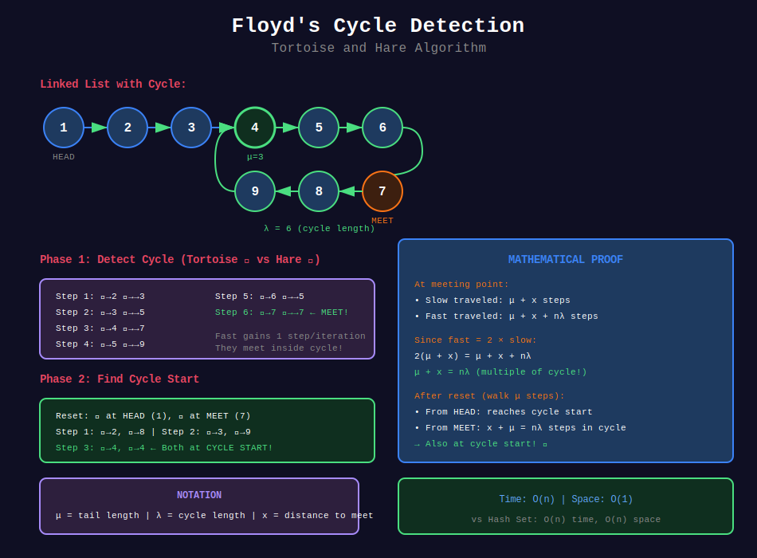
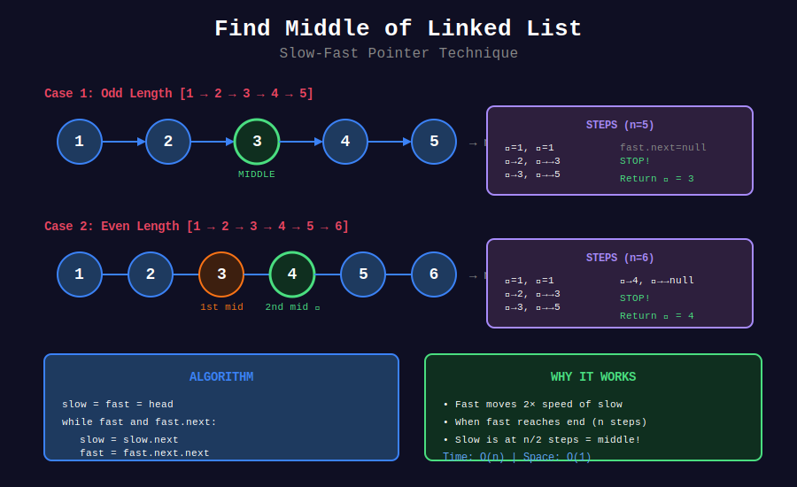
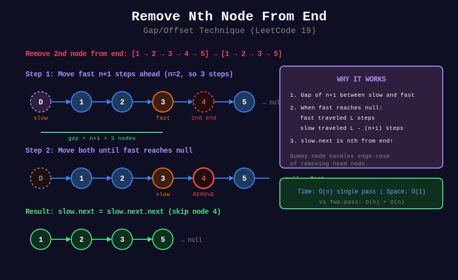

<div align="center">

# 🔗 Linked List Two Pointers

### *Floyd's Tortoise and Hare — A Mathematical Marvel*

<p>
  
  
  
</p>

*"The tortoise always catches the hare... in a cycle."*

</div>

---

## 🧭 Navigation

| ⬅️ Previous | 📂 Current | ➡️ Next Topic |
|:------------|:----------:|--------:|
| [← 02. Same Direction](../02_same_direction/README.md) | **03. Linked List** | [🏠 Two Pointers Home](../README.md) → [Sliding Window](../../23_sliding_window/README.md) |

---

## 🎯 What You'll Master

- Floyd's Cycle Detection with complete mathematical proof
- Finding the start of a cycle
- Finding the middle of a linked list
- Nth node from end in single pass
- Intersection of two linked lists

---

## 📊 Visual Diagrams

### Floyd's Cycle Detection


### Find Middle of Linked List


### Remove Nth Node From End


---

## 📐 Mathematical Foundations

### 1️⃣ Floyd's Cycle Detection — The Algorithm

{: .highlight }
> **The Tortoise and Hare**: Slow pointer moves 1 step, fast pointer moves 2 steps. If a cycle exists, they will meet.

#### Why They Must Meet

In a cycle of length $\lambda$:
- Fast gains 1 position on slow each step
- After at most $\lambda$ steps inside the cycle, they meet

---

### 2️⃣ Floyd's Algorithm — Complete Mathematical Proof

{: .important }
> **Theorem**: If a cycle exists, the slow and fast pointers will meet inside the cycle.

#### Setup and Notation

Let:
- $\mu$ = distance from head to cycle start (tail length)
- $\lambda$ = cycle length
- $x$ = meeting point's distance from cycle start (clockwise)

```
Head ------○------○------○------●
            ╲                  ╱ ↖
             ╲    Cycle       ╱   ↖ λ (cycle length)
     μ        ╲     ●       ╱      
(tail)         ╲   ╱ ╲    ╱
                ╲╱   ╲  ╱
                 ●----●
                   x (meeting point)
```

#### 🔍 Proof: They Will Meet

**Claim 1**: If there's a cycle, slow and fast will meet.

When slow enters the cycle:
- Slow has traveled $\mu$ steps
- Fast has traveled $2\mu$ steps

Fast is already in the cycle. Let $d$ be the distance between them (measured in direction of travel).

Each step:
- Slow moves 1 forward
- Fast moves 2 forward
- Gap decreases by 1

After $d$ more steps, gap becomes 0 — they meet! ∎

---

### 3️⃣ Finding Cycle Start — The Deep Mathematics

{: .note }
> After meeting, reset one pointer to head. Both move 1 step at a time. They meet at cycle start!

#### 🔍 Proof: Why This Works

**When they meet:**

Let slow have traveled $s$ steps:

$$
s = \mu + x + a\lambda
$$

where $a$ is the number of complete cycles slow made.

Fast traveled $2s$ steps:

$$
2s = \mu + x + b\lambda
$$

where $b$ is the number of complete cycles fast made.

Subtracting:

$$
s = (b - a)\lambda = k\lambda
$$

for some positive integer $k$.

So:

$$
\mu + x + a\lambda = k\lambda
\mu + x = (k - a)\lambda = m\lambda
$$

for some non-negative integer $m$.

**This means:** $\mu + x$ is a multiple of $\lambda$!

#### The Reset Phase

When we reset slow to head and move both one step at a time:

- Pointer from head travels $\mu$ steps to reach cycle start
- Pointer from meeting point travels $\mu$ steps

From meeting point (distance $x$ from cycle start):

$$
\text{Position after } \mu \text{ steps} = x + \mu \pmod{\lambda}
$$

Since $\mu + x = m\lambda$:

$$
x + \mu \equiv 0 \pmod{\lambda}
$$

This is exactly the cycle start position! ∎

#### 📊 Visual Proof

```
+--------------------------------------------------------------+
|                  FLOYD'S CYCLE START PROOF                   |
+--------------------------------------------------------------+
|                                                              |
|  Linked List with Cycle:                                     |
|                                                              |
|  HEAD --○--○--○--○--●                                       |
|              ↙        ↖                                      |
|           ↙            ↖                                     |
|         ●    CYCLE      ●                                   |
|          ↖            ↙                                      |
|           ↖        ↙                                         |
|              ●--●--●                                         |
|                 ↑                                            |
|            Meeting Point                                     |
|                                                              |
|  Key Relationship:                                           |
|  -------------------                                         |
|  μ = distance from head to cycle start                      |
|  x = distance from cycle start to meeting point             |
|  λ = cycle length                                           |
|                                                              |
|  At meeting: μ + x = kλ (some multiple of cycle length)     |
|                                                              |
|  After reset:                                                |
|  • Pointer 1: starts at head, walks μ steps → cycle start   |
|  • Pointer 2: starts at meeting, walks μ steps              |
|    = walks (μ mod λ) in cycle                               |
|    = walks (kλ - x) mod λ = λ - x from meeting point        |
|    = x steps before meeting point                           |
|    = cycle start!                                           |
|                                                              |
|  They meet at cycle start! ∎                                |
|                                                              |
+--------------------------------------------------------------+
```

---

### 4️⃣ Finding Middle — Why It Works

{: .highlight }
> When fast reaches end, slow is at middle.

#### Proof

- Slow moves 1 step per iteration
- Fast moves 2 steps per iteration
- When fast reaches position $n$, slow is at position $n/2$

For even length $n$: slow at $n/2$ (second middle)
For odd length $n$: slow at $\lfloor n/2 \rfloor + 1$ (true middle)

---

### 5️⃣ Nth From End — Gap Technique

{: .important }
> Fast starts $n$ steps ahead. When fast reaches end, slow is at $n$th from end.

#### Proof

Total length = $L$
- Fast starts at position $n$
- When fast at position $L$, fast traveled $L - n$ steps
- Slow also traveled $L - n$ steps, so slow at position $L - n$
- Position $L - n$ is $n$th from end (0-indexed) ∎

---

### 6️⃣ List Intersection — Path Length Equalization

{: .note }
> Two pointers traverse both lists. They meet at intersection (or both reach null).

#### The Insight

If list A has length $a + c$ and list B has length $b + c$ where $c$ is common:

- Pointer A: traverses A then B = $a + c + b + c$ steps
- Pointer B: traverses B then A = $b + c + a + c$ steps

At step $a + b + c$, both are at the intersection!

If no intersection ($c = 0$), both reach null at step $a + b$.

---

## 📊 Visual Diagrams

### Floyd's Detection in Action

```
List: 1 → 2 → 3 → 4 → 5 → 6
                  ↑       ↓
                  9 ← 8 ← 7

Initial:
🐢🐇 at 1

Step 1:  🐢→2    🐇→→3
Step 2:  🐢→3    🐇→→5
Step 3:  🐢→4    🐇→→7
Step 4:  🐢→5    🐇→→9
Step 5:  🐢→6    🐇→→5 (wrapped)
Step 6:  🐢→7    🐇→→7

🐢 = 🐇 at node 7! Cycle detected! ✓
```

### Finding Cycle Start

```
After detection (meeting at 7):

Reset slow to head:
🐢 at 1, 🐇 at 7

Move both one step:
Step 1: 🐢→2, 🐇→8
Step 2: 🐢→3, 🐇→9
Step 3: 🐢→4, 🐇→4

🐢 = 🐇 at node 4! Cycle starts here! ✓

Verification:
μ = 3 (steps from 1 to 4)
x = 3 (steps from 4 to 7 in cycle)
λ = 6 (cycle: 4→5→6→7→8→9→4)
μ + x = 6 = λ ✓
```

### Finding Middle

```
List: 1 → 2 → 3 → 4 → 5 → 6 → 7

🐢=1, 🐇=1
🐢→2, 🐇→→3
🐢→3, 🐇→→5
🐢→4, 🐇→→7
🐇 reaches end!

Middle = 🐢 = 4 ✓

List: 1 → 2 → 3 → 4 → 5 → 6

🐢=1, 🐇=1
🐢→2, 🐇→→3
🐢→3, 🐇→→5
🐇.next is end (6.next = null)

Middle = 🐢 = 4 (second of two middles) ✓
```

### List Intersection

```
List A:      1 → 2 ↘
                     → 5 → 6 → 7
List B:  3 → 4 ↗

Pointer A path: 1 → 2 → 5 → 6 → 7 → null → 3 → 4 → [5]
Pointer B path: 3 → 4 → 5 → 6 → 7 → null → 1 → 2 → [5]
                                                    ↑
                                                Meet here!

Distance traveled by each: 2 + 3 + 2 = 7 steps
They meet at intersection node 5 ✓
```

---

## 💻 Code Implementations

```python
class ListNode:
    def __init__(self, val=0, next=None):
        self.val = val
        self.next = next

def hasCycle(head: ListNode) -> bool:
    """
    Linked List Cycle (LeetCode 141).
    
    Detect if linked list has a cycle using Floyd's algorithm.
    
    Time: O(n), Space: O(1)
    
    Example:
    >>> # 1 → 2 → 3 → 4 → 2 (cycle)
    >>> hasCycle(head)
    True
    """
    if not head or not head.next:
        return False
    
    slow = fast = head
    
    while fast and fast.next:
        slow = slow.next          # Move 1 step
        fast = fast.next.next     # Move 2 steps
        
        if slow == fast:
            return True
    
    return False

def detectCycle(head: ListNode) -> ListNode:
    """
    Linked List Cycle II (LeetCode 142).
    
    Find the node where cycle begins.
    
    Algorithm:
    1. Detect meeting point using Floyd's
    2. Reset one pointer to head
    3. Move both one step at a time
    4. They meet at cycle start
    
    Time: O(n), Space: O(1)
    """
    if not head or not head.next:
        return None
    
    # Phase 1: Detect cycle and find meeting point
    slow = fast = head
    
    while fast and fast.next:
        slow = slow.next
        fast = fast.next.next
        
        if slow == fast:

            # Phase 2: Find cycle start
            # Reset slow to head, keep fast at meeting point
            slow = head
            
            while slow != fast:
                slow = slow.next
                fast = fast.next
            
            return slow  # Cycle start
    
    return None  # No cycle

def middleNode(head: ListNode) -> ListNode:
    """
    Middle of the Linked List (LeetCode 876).
    
    Find middle node (if two middles, return second).
    
    When fast reaches end, slow is at middle.
    
    Time: O(n), Space: O(1)
    """
    slow = fast = head
    
    while fast and fast.next:
        slow = slow.next
        fast = fast.next.next
    
    return slow

def removeNthFromEnd(head: ListNode, n: int) -> ListNode:
    """
    Remove Nth Node From End of List (LeetCode 19).
    
    Use gap technique: fast leads by n nodes.
    When fast reaches end, slow is at (n+1)th from end.
    
    Time: O(L), Space: O(1)
    """

    # Dummy node handles edge case of removing head
    dummy = ListNode(0)
    dummy.next = head
    
    slow = fast = dummy
    
    # Move fast n+1 steps ahead
    for _ in range(n + 1):
        fast = fast.next
    
    # Move both until fast reaches end
    while fast:
        slow = slow.next
        fast = fast.next
    
    # Now slow.next is the node to remove
    slow.next = slow.next.next
    
    return dummy.next

def findDuplicate(nums: list[int]) -> int:
    """
    Find the Duplicate Number (LeetCode 287).
    
    Array of n+1 integers in range [1, n] with one duplicate.
    Treat array as linked list: nums[i] points to nums[nums[i]].
    Duplicate causes a cycle; cycle start is the duplicate.
    
    Time: O(n), Space: O(1)
    
    Example:
    >>> findDuplicate([1, 3, 4, 2, 2])
    2
    """

    # Phase 1: Find meeting point in cycle
    slow = fast = nums[0]
    
    while True:
        slow = nums[slow]           # One hop
        fast = nums[nums[fast]]     # Two hops
        if slow == fast:
            break
    
    # Phase 2: Find cycle start (the duplicate)
    slow = nums[0]
    
    while slow != fast:
        slow = nums[slow]
        fast = nums[fast]
    
    return slow

def getIntersectionNode(headA: ListNode, headB: ListNode) -> ListNode:
    """
    Intersection of Two Linked Lists (LeetCode 160).
    
    Find node where two lists merge.
    
    Key insight: If we traverse A then B, and B then A,
    both paths have the same length (a + b).
    They meet at intersection or both reach null.
    
    Time: O(m + n), Space: O(1)
    """
    if not headA or not headB:
        return None
    
    ptrA, ptrB = headA, headB
    
    # Traverse A + B and B + A
    while ptrA != ptrB:

        # When reaching end, switch to other list's head
        ptrA = ptrA.next if ptrA else headB
        ptrB = ptrB.next if ptrB else headA
    
    return ptrA  # Either intersection node or None

def isPalindrome(head: ListNode) -> bool:
    """
    Palindrome Linked List (LeetCode 234).
    
    Check if linked list is palindrome in O(1) space.
    
    Algorithm:
    1. Find middle using slow-fast
    2. Reverse second half
    3. Compare first half with reversed second half
    
    Time: O(n), Space: O(1)
    """
    if not head or not head.next:
        return True
    
    # Step 1: Find middle
    slow = fast = head
    while fast.next and fast.next.next:
        slow = slow.next
        fast = fast.next.next
    
    # Step 2: Reverse second half
    prev = None
    curr = slow.next
    while curr:
        next_node = curr.next
        curr.next = prev
        prev = curr
        curr = next_node
    
    # Step 3: Compare halves
    first_half = head
    second_half = prev
    
    while second_half:
        if first_half.val != second_half.val:
            return False
        first_half = first_half.next
        second_half = second_half.next
    
    return True

def getDecimalValue(head: ListNode) -> int:
    """
    Convert Binary Number in a Linked List to Integer (LeetCode 1290).
    
    Traverse and build binary number.
    
    Time: O(n), Space: O(1)
    """
    result = 0
    
    while head:
        result = (result << 1) | head.val  # result * 2 + current bit
        head = head.next
    
    return result

def reorderList(head: ListNode) -> None:
    """
    Reorder List (LeetCode 143).
    
    L0 → L1 → L2 → ... → Ln becomes
    L0 → Ln → L1 → Ln-1 → L2 → Ln-2 → ...
    
    Algorithm:
    1. Find middle
    2. Reverse second half
    3. Merge alternately
    
    Time: O(n), Space: O(1)
    """
    if not head or not head.next:
        return
    
    # Step 1: Find middle
    slow = fast = head
    while fast.next and fast.next.next:
        slow = slow.next
        fast = fast.next.next
    
    # Step 2: Reverse second half
    prev = None
    curr = slow.next
    slow.next = None  # Split the list
    
    while curr:
        next_node = curr.next
        curr.next = prev
        prev = curr
        curr = next_node
    
    # Step 3: Merge alternately
    first = head
    second = prev
    
    while second:
        first_next = first.next
        second_next = second.next
        
        first.next = second
        second.next = first_next
        
        first = first_next
        second = second_next

def sortList(head: ListNode) -> ListNode:
    """
    Sort List (LeetCode 148).
    
    Merge sort on linked list.
    Uses slow-fast to find middle.
    
    Time: O(n log n), Space: O(log n) for recursion
    """
    if not head or not head.next:
        return head
    
    # Find middle
    slow, fast = head, head.next
    while fast and fast.next:
        slow = slow.next
        fast = fast.next.next
    
    # Split
    mid = slow.next
    slow.next = None
    
    # Recursively sort both halves
    left = sortList(head)
    right = sortList(mid)
    
    # Merge sorted halves
    dummy = ListNode(0)
    curr = dummy
    
    while left and right:
        if left.val < right.val:
            curr.next = left
            left = left.next
        else:
            curr.next = right
            right = right.next
        curr = curr.next
    
    curr.next = left or right
    
    return dummy.next
```

---

## 🎯 Pattern Summary

| Problem | Technique | Key Insight |
|---------|-----------|-------------|
| **Cycle Detection** | Floyd's (slow-fast) | Fast catches slow in cycle |
| **Cycle Start** | Reset + walk | μ + x = kλ |
| **Middle** | Slow-fast | Fast 2x speed |
| **Nth from End** | Gap | Fast leads by n |
| **Intersection** | Cross traverse | Equal total path length |
| **Palindrome** | Middle + reverse | Compare halves |

---

## 🏆 LeetCode Problems

### 🟢 Easy

| # | Problem | Technique | Time | Space |
|:-:|---------|-----------|:----:|:-----:|
| 141 | [Linked List Cycle](https://leetcode.com/problems/linked-list-cycle/) | Floyd's | O(n) | O(1) |
| 160 | [Intersection](https://leetcode.com/problems/intersection-of-two-linked-lists/) | Cross traverse | O(m+n) | O(1) |
| 234 | [Palindrome Linked List](https://leetcode.com/problems/palindrome-linked-list/) | Middle + reverse | O(n) | O(1) |
| 876 | [Middle of Linked List](https://leetcode.com/problems/middle-of-the-linked-list/) | Slow-fast | O(n) | O(1) |
| 1290 | [Binary Number](https://leetcode.com/problems/convert-binary-number-in-a-linked-list-to-integer/) | Traverse | O(n) | O(1) |

### 🟡 Medium

| # | Problem | Technique | Time | Space |
|:-:|---------|-----------|:----:|:-----:|
| 19 | [Remove Nth From End](https://leetcode.com/problems/remove-nth-node-from-end-of-list/) | Gap | O(n) | O(1) |
| 142 | [Linked List Cycle II](https://leetcode.com/problems/linked-list-cycle-ii/) | Floyd's | O(n) | O(1) |
| 143 | [Reorder List](https://leetcode.com/problems/reorder-list/) | Middle + reverse | O(n) | O(1) |
| 148 | [Sort List](https://leetcode.com/problems/sort-list/) | Merge sort | O(nlogn) | O(logn) |
| 287 | [Find Duplicate](https://leetcode.com/problems/find-the-duplicate-number/) | Floyd's | O(n) | O(1) |

---

## 💡 Interview Tips

### Common Follow-ups

| Question | Answer |
|----------|--------|
| "Why does Floyd's work?" | Fast gains 1 step per iteration, catches up in λ steps |
| "Why reset to head?" | μ + x = kλ means μ more steps from meeting = cycle start |
| "Can you find cycle length?" | After meeting, count steps until meeting again |

### Edge Cases

| Case | Handling |
|------|----------|
| Empty list | Return null/false early |
| Single node | No cycle possible (unless self-loop) |
| No cycle | Fast reaches null |
| Cycle at head | Works correctly (μ = 0) |

---

## 📚 References

| Resource | Description | Link |
|----------|-------------|------|
| **Floyd's Algorithm** | Original paper and analysis | [🔗 Wikipedia](https://en.wikipedia.org/wiki/Cycle_detection#Floyd's_tortoise_and_hare) |
| **Brent's Algorithm** | Alternative cycle detection | [🔗 Wikipedia](https://en.wikipedia.org/wiki/Cycle_detection#Brent's_algorithm) |
| **Mathematical Proof** | Detailed proof of Floyd's | [🔗 Stack Overflow](https://stackoverflow.com/questions/2936213) |
| **Linked List Algorithms** | Comprehensive guide | [🔗 GFG](https://www.geeksforgeeks.org/detect-loop-in-a-linked-list/) |

---

## 🧮 Floyd's Algorithm Complexity Analysis

```
+--------------------------------------------------------------+
|              FLOYD'S ALGORITHM ANALYSIS                      |
+--------------------------------------------------------------+
|                                                              |
|  Time Complexity:                                            |
|  -----------------                                           |
|  • Phase 1 (Detection):                                      |
|    - Slow travels at most μ + λ steps                       |
|    - Fast travels 2(μ + λ) steps                            |
|    - Time: O(μ + λ) = O(n)                                  |
|                                                              |
|  • Phase 2 (Finding start):                                  |
|    - Both travel μ steps                                    |
|    - Time: O(μ) ⊆ O(n)                                      |
|                                                              |
|  Total: O(n)                                                 |
|                                                              |
|  Space Complexity: O(1)                                      |
|  ---------------------                                       |
|  Only two pointers used regardless of list size              |
|                                                              |
|  Comparison with Hash Set Approach:                          |
|  -----------------------------------                         |
|  | Approach    | Time   | Space |                           |
|  +-------------+--------+-------+                           |
|  | Floyd's     | O(n)   | O(1)  | ← Winner                  |
|  | Hash Set    | O(n)   | O(n)  |                           |
|                                                              |
+--------------------------------------------------------------+
```

---

<div align="center">

**Made with ❤️ by [Gaurav Goswami](https://github.com/Gaurav14cs17)**

*"In the race of algorithms, Floyd's is the tortoise that always wins."*

</div>

---

## 🧭 Navigation

| ⬅️ Previous | 📂 Current | ➡️ Next Topic |
|:------------|:----------:|--------:|
| [← 02. Same Direction](../02_same_direction/README.md) | **03. Linked List** | [🏠 Two Pointers Home](../README.md) → [Sliding Window](../../23_sliding_window/README.md) |
