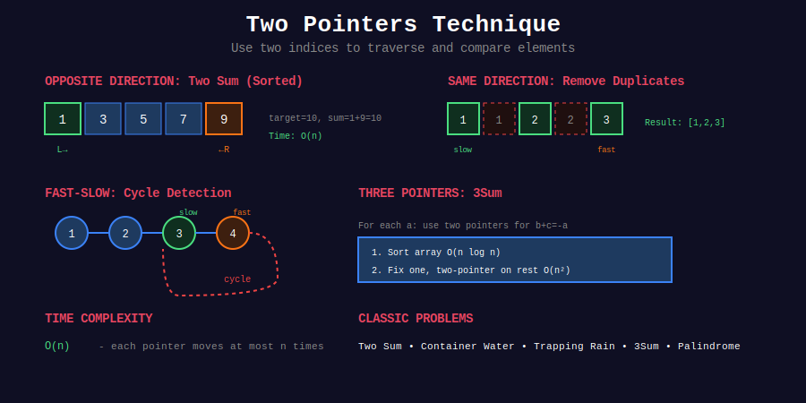

<div align="center">

# 👆👆 Two Pointers



### *The Elegant Dance of Indices*

<p>
  
  
  
  
</p>

**Transform quadratic brute-force into linear elegance**

[⬅️ Previous: Bit Manipulation](../21_bit_manipulation/README.md) | [🏠 Home](../README.md) | [Next: Sliding Window ➡️](../23_sliding_window/README.md)

</div>

---

## 🌟 Why Two Pointers?

> *"Two pointers is not just a technique—it's a way of thinking about array problems. Once you see it, you'll find it everywhere."*

| Advantage | Description |
|-----------|-------------|
| ⚡ **Speed** | Reduce O(n²) to O(n) by eliminating redundant comparisons |
| 💾 **Space** | In-place operations with O(1) extra space |
| 🎯 **Simplicity** | Clean, readable code that's easy to debug |
| 🏆 **Universality** | Works on arrays, strings, and linked lists |

---

## 📐 The Three Fundamental Patterns

### 🎭 Pattern Overview

```
+-----------------------------------------------------------------+
|                    TWO POINTER PATTERNS                         |
+-----------------------------------------------------------------+
|                                                                 |
|  1. OPPOSITE DIRECTION (Converging)                            |
|     +-----------------------------------+                      |
|     | L →               ← R             |                      |
|     | [■ □ □ □ □ □ □ □ □ ■]            |                      |
|     +-----------------------------------+                      |
|     Use: Sorted array sums, palindromes, container problems    |
|                                                                 |
|  2. SAME DIRECTION (Fast-Slow)                                 |
|     +-----------------------------------+                      |
|     | S → F →                           |                      |
|     | [■ ■ □ □ □ □ □ □ □ □]            |                      |
|     +-----------------------------------+                      |
|     Use: In-place removal, partitioning, subsequences          |
|                                                                 |
|  3. LINKED LIST (Tortoise & Hare)                              |
|     +-----------------------------------+                      |
|     | 🐢 → → 🐇 → → → →                |                      |
|     | ○ → ○ → ○ → ○ → ○ ↺              |                      |
|     +-----------------------------------+                      |
|     Use: Cycle detection, finding middle, nth from end         |
|                                                                 |
+-----------------------------------------------------------------+

```

---

## 📐 Mathematical Foundation

### 1️⃣ Opposite Direction — The Convergence Theorem

{: .highlight }
> For a **sorted array** and target sum, converging pointers find the answer in O(n).

#### The Algorithm

$$\text{Initialize: } left = 0, \quad right = n - 1
\text{While } left < right:
\begin{cases}
\text{sum} < \text{target} & \Rightarrow left := left + 1 \\
\text{sum} > \text{target} & \Rightarrow right := right - 1 \\
\text{sum} = \text{target} & \Rightarrow \text{Found!}
\end{cases}$$

#### 🔍 Proof of Correctness

**Claim**: If a valid pair \((i, j)\) exists where \(i < j\), the algorithm will find it.

**Proof by invariant**: At each step, if the solution exists in range \([left, right]\), it remains in the new range.

- If \(a[left] + a[right] < target\):
  - For all \(k < right\): \(a[left] + a[k] \leq a[left] + a[right] < target\)
  - So \(left\) cannot be part of any solution with indices \(< right\)
  - Safe to increment \(left\)

- If \(a[left] + a[right] > target\):
  - For all \(k > left\): \(a[k] + a[right] \geq a[left] + a[right] > target\)
  - So \(right\) cannot be part of any solution with indices \(> left\)
  - Safe to decrement \(right\)

**Termination**: Either we find the target, or \(left \geq right\) (no solution). ∎

---

### 2️⃣ Container With Most Water — Greedy Optimality

{: .important }
> Always move the pointer with the **shorter** height. This greedy choice is provably optimal.

#### The Formula

$$\text{Area}(l, r) = \min(h[l], h[r]) \times (r - l)$$

#### 🔍 Proof: Why Move the Shorter Side?

Suppose \(h[l] < h[r]\). Consider all containers involving position \(l\):

$$\text{Area}(l, k) = \min(h[l], h[k]) \times (k - l) \leq h[l] \times (k - l)$$

For any \(k < r\):

$$\text{Area}(l, k) \leq h[l] \times (k - l) < h[l] \times (r - l) = \text{Area}(l, r)$$

So \((l, r)\) is already the **best container involving position \(l\)**!

We can safely discard \(l\) and move to \(l+1\). ∎

---

### 3️⃣ Floyd's Cycle Detection — The Mathematics

{: .note }
> If a cycle exists, the fast pointer (moving 2 steps) will eventually catch the slow pointer (moving 1 step).

#### Phase 1: Meeting Point

Let:

- \(\mu\) = distance from head to cycle start

- \(\lambda\) = cycle length

- Meeting point is at distance \(k\) into the cycle

When they meet:

- Slow traveled: \(\mu + k\) steps

- Fast traveled: \(\mu + k + n\lambda\) steps (for some \(n \geq 1\))

Since fast moves twice as fast:

$$2(\mu + k) = \mu + k + n\lambda
\mu + k = n\lambda
\mu = n\lambda - k$$

#### Phase 2: Finding Cycle Start

After meeting, reset one pointer to head. Both move 1 step at a time.

- Pointer from head travels: \(\mu\) steps

- Pointer from meeting point travels: \(\mu = n\lambda - k\) steps
  - This equals \(n\) complete cycles minus \(k\) steps
  - Which brings it exactly to the cycle start!

They meet at the cycle start! ∎

---

### 4️⃣ Trapping Rain Water — The Insight

{: .highlight }
> Water at position \(i\) = \(\min(\text{maxLeft}[i], \text{maxRight}[i]) - h[i]\)

#### Two-Pointer Optimization

Instead of precomputing maxLeft and maxRight arrays (O(n) space), use two pointers:

- Maintain \(leftMax\) and \(rightMax\) as we go

- If \(leftMax < rightMax\): water at left is determined by \(leftMax\)

- If \(rightMax \leq leftMax\): water at right is determined by \(rightMax\)

**Why?** If \(leftMax < rightMax\), there exists some bar on the right ≥ \(rightMax\) > \(leftMax\), so the water level at left is exactly \(leftMax\).

---

## 📂 Subtopics Navigation

| # | Topic | Key Techniques | Problems | Link |
|:-:|-------|----------------|:--------:|------|
| 1 | **Opposite Direction** | Two Sum, 3Sum, Container, Palindrome | 15+ | [📖 Go →](./01_opposite_direction/README.md) |
| 2 | **Same Direction** | Remove Duplicates, Dutch Flag, Merge | 12+ | [📖 Go →](./02_same_direction/README.md) |
| 3 | **Linked List** | Floyd's Cycle, Middle, Nth from End | 10+ | [📖 Go →](./03_linked_list/README.md) |

---

## 🎯 Pattern Recognition Flowchart

```
                    +-----------------------------+
                    |    TWO POINTER PROBLEM?     |
                    +--------------+--------------+
                                   |
         +-------------------------+-------------------------+
         |                         |                         |
         ▼                         ▼                         ▼
  +--------------+         +--------------+         +--------------+
  |   Array is   |         |   In-place   |         |  Linked List |
  |   SORTED?    |         |  operation?  |         |   problem?   |
  +------+-------+         +------+-------+         +------+-------+
         |                        |                        |
    +----+----+              +----+----+              +----+----+
    |   YES   |              |   YES   |              |   YES   |
    ▼         ▼              ▼         ▼              ▼         ▼
+--------+ +--------+   +--------+ +--------+   +--------+ +--------+

|Two Sum | |3Sum,   |   |Remove  | |Partition|   | Cycle  | | Middle |
|Opposite| |4Sum    |   |In-place| |Dutch   |   | Floyd's| | Nth End|
+--------+ +--------+   +--------+ +--------+   +--------+ +--------+

```

---

## 🎨 Visual: The Three Patterns in Action

### Pattern 1: Opposite Direction (Two Sum)

```
Target = 9, Array = [1, 2, 4, 6, 8, 9, 14, 15]
                     L                    R

Step 1: 1 + 15 = 16 > 9  →  Move R left
        [1, 2, 4, 6, 8, 9, 14, 15]
         L                 R

Step 2: 1 + 14 = 15 > 9  →  Move R left
        [1, 2, 4, 6, 8, 9, 14, 15]
         L              R

Step 3: 1 + 9 = 10 > 9   →  Move R left
        [1, 2, 4, 6, 8, 9, 14, 15]
         L           R

Step 4: 1 + 8 = 9 = 9    →  FOUND! ✓

```

### Pattern 2: Same Direction (Remove Duplicates)

```
Array = [1, 1, 2, 2, 2, 3, 4, 4]
         S
         F

Step 1: nums[F] = 1 = nums[S-1]? No (first element)
        Write 1, S++
        [1, 1, 2, 2, 2, 3, 4, 4]
            S
            F

Step 2: nums[F] = 1 = nums[S-1] = 1? Yes, skip
        [1, 1, 2, 2, 2, 3, 4, 4]
            S  F

Step 3: nums[F] = 2 ≠ nums[S-1] = 1? Write 2, S++
        [1, 2, 2, 2, 2, 3, 4, 4]
               S  F

... continue until F reaches end

Result: [1, 2, 3, 4, _, _, _, _]
                     S
        Return S = 4 unique elements

```

### Pattern 3: Floyd's Cycle Detection

```
List: 1 → 2 → 3 → 4 → 5
                  ↑   ↓
                  8 ← 6

Initial:     🐢🐇 at 1

Step 1:      🐢 → 2      🐇 → → 3
Step 2:      🐢 → 3      🐇 → → 5
Step 3:      🐢 → 4      🐇 → → 8
Step 4:      🐢 → 5      🐇 → → 4
Step 5:      🐢 → 6      🐇 → → 6   ← MEET!

Phase 2: Reset 🐢 to head
         🐢 at 1, 🐇 at 6
         
Step 1:  🐢 → 2, 🐇 → 8
Step 2:  🐢 → 3, 🐇 → 4
Step 3:  🐢 → 4, 🐇 → 5
Step 4:  🐢 → 5, 🐇 → 6
         ... Wait, let me recalculate

Cycle start = 4 ✓

```

---

## 💻 Core Code Templates

### Template 1: Opposite Direction

```python
def two_sum_sorted(arr: list[int], target: int) -> tuple[int, int]:
    """
    Find two numbers in sorted array that sum to target.
    
    Time: O(n), Space: O(1)
    """
    left, right = 0, len(arr) - 1
    
    while left < right:
        current_sum = arr[left] + arr[right]
        
        if current_sum == target:
            return (left, right)
        elif current_sum < target:
            left += 1      # Need larger sum
        else:
            right -= 1     # Need smaller sum
    
    return (-1, -1)  # Not found

```

### Template 2: Same Direction (Partition)

```python
def partition(arr: list[int], predicate) -> int:
    """
    Move elements satisfying predicate to the front.
    Returns count of such elements.
    
    Time: O(n), Space: O(1)
    """
    slow = 0  # Position to write next valid element
    
    for fast in range(len(arr)):
        if predicate(arr[fast]):
            arr[slow], arr[fast] = arr[fast], arr[slow]
            slow += 1
    
    return slow

```

### Template 3: Floyd's Cycle Detection

```python
def find_cycle_start(head: ListNode) -> ListNode:
    """
    Find the start of cycle in linked list.
    Returns None if no cycle.
    
    Time: O(n), Space: O(1)
    """
    slow = fast = head
    
    # Phase 1: Detect cycle
    while fast and fast.next:
        slow = slow.next
        fast = fast.next.next
        
        if slow == fast:
            # Phase 2: Find cycle start
            slow = head
            while slow != fast:
                slow = slow.next
                fast = fast.next
            return slow
    
    return None  # No cycle

```

---

## 🏆 LeetCode Problems

### 🟢 Easy

| # | Problem | Pattern | Time | Space | Key Insight |
|:-:|---------|---------|:----:|:-----:|-------------|
| 26 | [Remove Duplicates](https://leetcode.com/problems/remove-duplicates-from-sorted-array/) | Same Dir | O(n) | O(1) | Write pointer lags |
| 27 | [Remove Element](https://leetcode.com/problems/remove-element/) | Same Dir | O(n) | O(1) | Skip unwanted |
| 88 | [Merge Sorted Array](https://leetcode.com/problems/merge-sorted-array/) | Reverse | O(m+n) | O(1) | Fill from end |
| 125 | [Valid Palindrome](https://leetcode.com/problems/valid-palindrome/) | Opposite | O(n) | O(1) | Skip non-alnum |
| 141 | [Linked List Cycle](https://leetcode.com/problems/linked-list-cycle/) | Floyd | O(n) | O(1) | Fast catches slow |
| 167 | [Two Sum II](https://leetcode.com/problems/two-sum-ii-input-array-is-sorted/) | Opposite | O(n) | O(1) | Sorted → converge |
| 283 | [Move Zeroes](https://leetcode.com/problems/move-zeroes/) | Same Dir | O(n) | O(1) | Swap to front |
| 344 | [Reverse String](https://leetcode.com/problems/reverse-string/) | Opposite | O(n) | O(1) | Swap ends |
| 876 | [Middle of Linked List](https://leetcode.com/problems/middle-of-the-linked-list/) | Floyd | O(n) | O(1) | Fast 2x speed |

### 🟡 Medium

| # | Problem | Pattern | Time | Space | Key Insight |
|:-:|---------|---------|:----:|:-----:|-------------|
| 11 | [Container With Most Water](https://leetcode.com/problems/container-with-most-water/) | Greedy | O(n) | O(1) | Move shorter |
| 15 | [3Sum](https://leetcode.com/problems/3sum/) | Fix + 2Ptr | O(n²) | O(1) | Sort + skip dups |
| 16 | [3Sum Closest](https://leetcode.com/problems/3sum-closest/) | Fix + 2Ptr | O(n²) | O(1) | Track closest |
| 19 | [Remove Nth From End](https://leetcode.com/problems/remove-nth-node-from-end-of-list/) | Gap | O(n) | O(1) | n-step head start |
| 75 | [Sort Colors](https://leetcode.com/problems/sort-colors/) | Dutch Flag | O(n) | O(1) | 3-way partition |
| 80 | [Remove Duplicates II](https://leetcode.com/problems/remove-duplicates-from-sorted-array-ii/) | Same Dir | O(n) | O(1) | Allow k copies |
| 142 | [Linked List Cycle II](https://leetcode.com/problems/linked-list-cycle-ii/) | Floyd | O(n) | O(1) | Reset + walk |
| 189 | [Rotate Array](https://leetcode.com/problems/rotate-array/) | Reverse 3x | O(n) | O(1) | Reverse trick |
| 287 | [Find Duplicate](https://leetcode.com/problems/find-the-duplicate-number/) | Floyd | O(n) | O(1) | Array as linked list |

### 🔴 Hard

| # | Problem | Pattern | Time | Space | Key Insight |
|:-:|---------|---------|:----:|:-----:|-------------|
| 42 | [Trapping Rain Water](https://leetcode.com/problems/trapping-rain-water/) | 2 Pointers | O(n) | O(1) | Min of maxes |

---

## 💡 Pro Tips for Interviews

### Common Patterns to Recognize

| Pattern | Signal Words | Example |
|---------|--------------|---------|
| Opposite Direction | "sorted", "pair", "sum to" | Two Sum II |
| Same Direction | "in-place", "remove", "move" | Remove Duplicates |
| Linked List | "cycle", "middle", "nth from end" | Floyd's problems |

### Edge Cases Checklist

| Edge Case | How to Handle |
|-----------|---------------|
| Empty array/list | Return early |
| Single element | Often trivially solved |
| All same elements | Skip duplicates carefully |
| No valid answer | Return sentinel (-1, None, etc.) |

### Interview Script

1. **Clarify**: "Is the array sorted?" "Can I modify in-place?"

2. **Pattern Match**: Identify which two-pointer variant applies

3. **Explain**: "I'll use two pointers because..."

4. **Implement**: Start with the template, customize

5. **Test**: Walk through with a simple example

---

## 🧠 Why Two Pointers Works

### The Invariant Principle

Two pointers maintain an **invariant** that eliminates possibilities:

| Pattern | Invariant | What's Eliminated |
|---------|-----------|-------------------|
| Opposite (sum) | Solution ∈ [left, right] | Elements outside range |
| Same (partition) | [0, slow) satisfies condition | Need to revisit [0, slow) |
| Floyd | If cycle, fast catches slow | Random traversal |

### Complexity Analysis

| Approach | Time | Why |
|----------|------|-----|
| Brute Force | O(n²) | Check all pairs |
| Two Pointers | O(n) | Each element visited once |
| Savings | O(n) | Eliminate redundant comparisons |

---

## 📚 References & Further Reading

### 📖 Essential Reading

| Resource | Description | Link |
|----------|-------------|------|
| **LeetCode Guide** | Official two-pointer tutorial | [🔗 LeetCode](https://leetcode.com/articles/two-pointer-technique/) |
| **Floyd's Algorithm** | Mathematical analysis of cycle detection | [🔗 Wikipedia](https://en.wikipedia.org/wiki/Cycle_detection#Floyd's_tortoise_and_hare) |
| **Dutch National Flag** | Dijkstra's 3-way partition | [🔗 Wikipedia](https://en.wikipedia.org/wiki/Dutch_national_flag_problem) |

### 📺 Video Resources

| Channel | Topic | Link |
|---------|-------|------|
| **NeetCode** | Two Pointers Playlist | [🔗 YouTube](https://www.youtube.com/watch?v=cQ1Oz4ckceM) |
| **Abdul Bari** | Two Pointer Technique | [🔗 YouTube](https://www.youtube.com/watch?v=VEPCm3BCtik) |
| **Back To Back SWE** | Two Pointers Explained | [🔗 YouTube](https://www.youtube.com/watch?v=ijKmiFqjzi4) |

### 📝 Articles

| Source | Title | Link |
|--------|-------|------|
| **GeeksforGeeks** | Two Pointer Technique | [🔗 GFG](https://www.geeksforgeeks.org/two-pointers-technique/) |
| **LeetCode Discuss** | Two Pointer Patterns | [🔗 Discuss](https://leetcode.com/discuss/study-guide/1688903/) |
| **Techie Delight** | Two Pointer Problems | [🔗 Site](https://www.techiedelight.com/two-pointers-technique/) |

---

## 🎓 Quick Reference Card

```
+--------------------------------------------------------------+
|                 TWO POINTERS CHEAT SHEET                     |
+--------------------------------------------------------------+
|                                                              |
|  OPPOSITE DIRECTION (Sorted Array)                          |
|  ---------------------------------                          |
|  left, right = 0, n-1                                       |
|  while left < right:                                        |
|      if condition: return result                            |
|      elif need_larger: left += 1                            |
|      else: right -= 1                                       |
|                                                              |
|  SAME DIRECTION (In-place)                                  |
|  -------------------------                                  |
|  slow = 0                                                   |
|  for fast in range(n):                                      |
|      if keep(arr[fast]):                                    |
|          arr[slow] = arr[fast]                              |
|          slow += 1                                          |
|  return slow                                                |
|                                                              |
|  FLOYD'S CYCLE (Linked List)                                |
|  ---------------------------                                |
|  slow = fast = head                                         |
|  while fast and fast.next:                                  |
|      slow = slow.next                                       |
|      fast = fast.next.next                                  |
|      if slow == fast: # CYCLE!                              |
|                                                              |
+--------------------------------------------------------------+

|  PATTERNS:                                                   |
|  • Sorted array + target sum → Opposite                     |
|  • In-place removal → Same direction                        |
|  • Cycle/middle/nth from end → Floyd's                      |
|  • Palindrome → Opposite                                    |
|  • Subsequence → Same direction                             |
+--------------------------------------------------------------+

```

---

<div align="center">

**Made with ❤️ by [Gaurav Goswami](https://github.com/Gaurav14cs17)**

*"Two pointers: because one pointer is never enough."*

[⬅️ Previous: Bit Manipulation](../21_bit_manipulation/README.md) | [🏠 Home](../README.md) | [Next: Sliding Window ➡️](../23_sliding_window/README.md)

</div>
