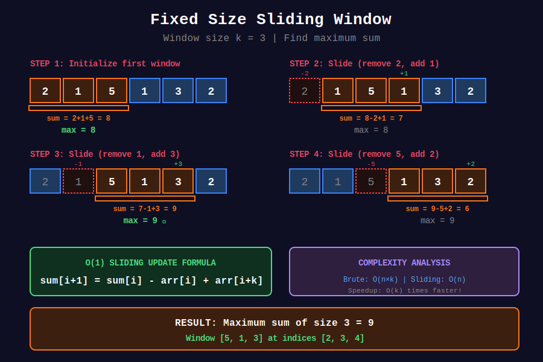
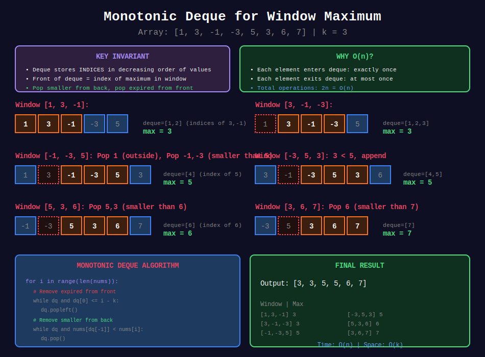

<div align="center">

# 📐 Fixed Size Sliding Window

### *Constant Width, Sliding Grace — The Power of Incremental Updates*

<p>
  
  
  
</p>

*"Why recalculate when you can slide and update?"*

</div>

---

## 🧭 Navigation

| ⬅️ Previous | 📂 Current | ➡️ Next |
|:------------|:----------:|--------:|
| [🏠 Sliding Window Home](../README.md) | **01. Fixed Size** | [02. Variable Size →](../02_variable_size/README.md) |

---

## 🎯 What You'll Master

- Fixed-size window sliding technique
- Incremental sum/product/count updates
- Monotonic deque for window maximum/minimum
- Anagram and permutation detection
- Rolling hash for substring matching

---

## 📊 Visual Diagrams

<div align="center">



*Step-by-step visualization of fixed window sliding technique*



*Monotonic deque for O(n) window maximum/minimum*

</div>

---

## 📐 Mathematical Foundations

### 1️⃣ The Sliding Update Formula

{: .highlight }
> Instead of recalculating the entire window, update by removing the outgoing element and adding the incoming element.

#### For Sum

```math
\text{sum}_{i+1} = \text{sum}_i - a_i + a_{i+k}
```

#### For Product

```math
\text{product}_{i+1} = \frac{\text{product}_i}{a_i} \times a_{i+k}
```

(Note: Handle zeros specially!)

#### For Count

```math
\text{count}_{i+1}[\text{new}]++, \quad \text{count}_{i+1}[\text{old}]--
```

---

### 2️⃣ Complexity Analysis

{: .important }
> Fixed window reduces O(n×k) to O(n) by reusing computation.

#### Brute Force

For each of \(n - k + 1\) windows, sum \(k\) elements:
```math
T(n) = (n - k + 1) \times k = O(nk)
```

#### Sliding Window

Initialize first window: \(O(k)\)
Slide \(n - k\) times, each update: \(O(1)\)
```math
T(n) = k + (n - k) \times 1 = O(n)
```

**Speedup**: \(O(k)\) times faster!

---

### 3️⃣ Monotonic Deque — Window Maximum

{: .note }
> Maintain a decreasing deque of indices. Front is always the maximum.

#### The Invariant

The deque stores indices in decreasing order of their values:
```math
a[\text{deque}[0]] \geq a[\text{deque}[1]] \geq ... \geq a[\text{deque}[n-1]]
```

#### Why It Works

1. **Smaller elements can't be maximum**: If \(a[j] \leq a[i]\) and \(j < i\), then \(j\) can never be maximum while \(i\) is in the window.
2. **Remove from back**: Pop elements smaller than incoming.
3. **Remove from front**: Pop elements outside window.

#### 🔍 Proof of O(n)

Each element:
- Enters deque: exactly once
- Exits deque: at most once

Total operations: \(2n = O(n)\) ∎

---

### 4️⃣ Anagram Detection — Character Count Matching

{: .highlight }
> Two strings are anagrams if they have the same character frequency.

#### The Approach

1. Create frequency map of pattern \(p\)
2. Slide window of size \(|p|\) over string \(s\)
3. Update window frequency incrementally
4. Check if frequencies match

#### Optimization: Match Counter

Instead of comparing 26 frequencies each time, track:
- `matches` = count of characters with equal frequency

When `matches == 26`, we found an anagram!

---

### 5️⃣ Rolling Hash — Rabin-Karp

{: .important }
> Compute hash of window in O(1) using polynomial rolling hash.

#### Hash Formula

For string \(s[i:i+k]\):
```math
H = s[i] \cdot b^{k-1} + s[i+1] \cdot b^{k-2} + ... + s[i+k-1] \cdot b^0
```

#### Rolling Update

```math
H_{i+1} = (H_i - s[i] \cdot b^{k-1}) \cdot b + s[i+k]
```

All operations mod a large prime to prevent overflow.

---

## 📊 Text Diagrams

### Fixed Window Sliding

```
Array: [1, 3, -1, -3, 5, 3, 6, 7]   k = 3

Initial Window:
+---+---+---+---+---+---+---+---+
| 1 | 3 |-1 |-3 | 5 | 3 | 6 | 7 |
+---+---+---+---+---+---+---+---+
  +---------+
  sum = 1 + 3 + (-1) = 3

Slide 1:
+---+---+---+---+---+---+---+---+
| 1 | 3 |-1 |-3 | 5 | 3 | 6 | 7 |
+---+---+---+---+---+---+---+---+
  ↓   +---------+
remove  add
  sum = 3 - 1 + (-3) = -1

Slide 2:
+---+---+---+---+---+---+---+---+
| 1 | 3 |-1 |-3 | 5 | 3 | 6 | 7 |
+---+---+---+---+---+---+---+---+
      ↓   +---------+
   remove    add
  sum = -1 - 3 + 5 = 1

...and so on
```

### Monotonic Deque for Maximum

```
Array: [1, 3, -1, -3, 5, 3, 6, 7]   k = 3

Window [1, 3, -1]:
  Add 1: deque = [0]          (index of 1)
  Add 3: 3 > 1, pop 0
         deque = [1]          (index of 3)
  Add -1: -1 < 3, append
         deque = [1, 2]       (indices of 3, -1)
  Max = arr[1] = 3 ✓

Window [3, -1, -3]:
  Remove: 0 not in deque (already gone)
  Add -3: -3 < -1, append
         deque = [1, 2, 3]    (3, -1, -3)
  Max = arr[1] = 3 ✓

Window [-1, -3, 5]:
  Remove: 1 is front, pop front
         deque = [2, 3]
  Add 5: 5 > -3, pop; 5 > -1, pop
         deque = [4]          (index of 5)
  Max = arr[4] = 5 ✓

Window [-3, 5, 3]:
  Remove: 2, 3 not front
  Add 3: 3 < 5, append
         deque = [4, 5]       (5, 3)
  Max = arr[4] = 5 ✓

Window [5, 3, 6]:
  Remove: 3 not front
  Add 6: 6 > 3, pop; 6 > 5, pop
         deque = [6]          (index of 6)
  Max = arr[6] = 6 ✓

Window [3, 6, 7]:
  Remove: 4, 5 not front
  Add 7: 7 > 6, pop
         deque = [7]          (index of 7)
  Max = arr[7] = 7 ✓

Result: [3, 3, 5, 5, 6, 7]
```

### Anagram Detection

```
s = "cbaebabacd"   p = "abc"

Pattern freq: {a:1, b:1, c:1}
Window size: 3

Window "cba":
  freq: {c:1, b:1, a:1}
  Match? Yes! → Index 0 ✓

Window "bae":
  Remove 'c': {b:1, a:1}
  Add 'e': {b:1, a:1, e:1}
  Match? No (missing c, extra e)

Window "aeb":
  Remove 'b': {a:1, e:1}
  Add 'b': {a:1, e:1, b:1}
  Match? No

...continue...

Window "bac":
  freq: {b:1, a:1, c:1}
  Match? Yes! → Index 6 ✓

Result: [0, 6]
```

---

## 💻 Code Implementations

```python
def maxSumSubarray(nums: list[int], k: int) -> int:
    """
    Maximum Sum of Subarray of Size K (Maximum Average Subarray I - LeetCode 643).
    
    Slide window and update sum incrementally.
    
    Time: O(n), Space: O(1)
    
    Example:
    >>> maxSumSubarray([1, 12, -5, -6, 50, 3], 4)
    51
    """
    n = len(nums)
    if n < k:
        return 0
    
    # Initialize first window
    window_sum = sum(nums[:k])
    max_sum = window_sum
    
    # Slide the window
    for i in range(k, n):
        window_sum += nums[i] - nums[i - k]
        max_sum = max(max_sum, window_sum)
    
    return max_sum

def findMaxAverage(nums: list[int], k: int) -> float:
    """
    Maximum Average Subarray I (LeetCode 643).
    
    Time: O(n), Space: O(1)
    """
    window_sum = sum(nums[:k])
    max_sum = window_sum
    
    for i in range(k, len(nums)):
        window_sum += nums[i] - nums[i - k]
        max_sum = max(max_sum, window_sum)
    
    return max_sum / k

def maxSlidingWindow(nums: list[int], k: int) -> list[int]:
    """
    Sliding Window Maximum (LeetCode 239).
    
    Use monotonic decreasing deque to track maximum.
    Deque stores indices, front is always the max.
    
    Time: O(n), Space: O(k)
    
    Example:
    >>> maxSlidingWindow([1, 3, -1, -3, 5, 3, 6, 7], 3)
    [3, 3, 5, 5, 6, 7]
    """
    from collections import deque
    
    result = []
    dq = deque()  # Stores indices
    
    for i in range(len(nums)):
        # Remove indices outside current window
        while dq and dq[0] <= i - k:
            dq.popleft()
        
        # Remove smaller elements (they can never be max)
        while dq and nums[dq[-1]] < nums[i]:
            dq.pop()
        
        dq.append(i)
        
        # Window is complete (i >= k - 1)
        if i >= k - 1:
            result.append(nums[dq[0]])
    
    return result

def minSlidingWindow(nums: list[int], k: int) -> list[int]:
    """
    Sliding Window Minimum.
    
    Same as maximum but with monotonic INCREASING deque.
    
    Time: O(n), Space: O(k)
    """
    from collections import deque
    
    result = []
    dq = deque()
    
    for i in range(len(nums)):
        while dq and dq[0] <= i - k:
            dq.popleft()
        
        # Key difference: remove LARGER elements
        while dq and nums[dq[-1]] > nums[i]:
            dq.pop()
        
        dq.append(i)
        
        if i >= k - 1:
            result.append(nums[dq[0]])
    
    return result

def findAnagrams(s: str, p: str) -> list[int]:
    """
    Find All Anagrams in a String (LeetCode 438).
    
    Slide window of size len(p), track character matches.
    
    Time: O(n), Space: O(1) - only 26 chars
    
    Example:
    >>> findAnagrams("cbaebabacd", "abc")
    [0, 6]
    """
    if len(p) > len(s):
        return []
    
    p_count = [0] * 26
    s_count = [0] * 26
    
    # Initialize pattern count
    for c in p:
        p_count[ord(c) - ord('a')] += 1
    
    result = []
    k = len(p)
    
    for i in range(len(s)):
        # Add current character
        s_count[ord(s[i]) - ord('a')] += 1
        
        # Remove leftmost character when window exceeds size
        if i >= k:
            s_count[ord(s[i - k]) - ord('a')] -= 1
        
        # Compare counts when window is complete
        if i >= k - 1 and s_count == p_count:
            result.append(i - k + 1)
    
    return result

def findAnagramsOptimized(s: str, p: str) -> list[int]:
    """
    Optimized version using match counter.
    
    Instead of comparing 26 counts each time, track number of matching characters.
    
    Time: O(n), Space: O(1)
    """
    if len(p) > len(s):
        return []
    
    p_count = {}
    for c in p:
        p_count[c] = p_count.get(c, 0) + 1
    
    result = []
    k = len(p)
    s_count = {}
    matches = 0  # Characters with matching count
    
    # How many unique chars need to match
    need_match = len(p_count)
    
    for i in range(len(s)):
        # Add current character
        char = s[i]
        s_count[char] = s_count.get(char, 0) + 1
        
        if char in p_count:
            if s_count[char] == p_count[char]:
                matches += 1
            elif s_count[char] == p_count[char] + 1:
                matches -= 1
        
        # Remove leftmost when window exceeds size
        if i >= k:
            left_char = s[i - k]
            if left_char in p_count:
                if s_count[left_char] == p_count[left_char]:
                    matches -= 1
                elif s_count[left_char] == p_count[left_char] + 1:
                    matches += 1
            s_count[left_char] -= 1
        
        # Check for anagram
        if matches == need_match:
            result.append(i - k + 1)
    
    return result

def checkInclusion(s1: str, s2: str) -> bool:
    """
    Permutation in String (LeetCode 567).
    
    Same as finding anagrams, but return True/False.
    
    Time: O(n), Space: O(1)
    
    Example:
    >>> checkInclusion("ab", "eidbaooo")
    True
    """
    if len(s1) > len(s2):
        return False
    
    count1 = [0] * 26
    count2 = [0] * 26
    
    for c in s1:
        count1[ord(c) - ord('a')] += 1
    
    k = len(s1)
    
    for i in range(len(s2)):
        count2[ord(s2[i]) - ord('a')] += 1
        
        if i >= k:
            count2[ord(s2[i - k]) - ord('a')] -= 1
        
        if count1 == count2:
            return True
    
    return False

def containsNearbyDuplicate(nums: list[int], k: int) -> bool:
    """
    Contains Duplicate II (LeetCode 219).
    
    Maintain a set of last k elements.
    
    Time: O(n), Space: O(k)
    
    Example:
    >>> containsNearbyDuplicate([1, 2, 3, 1], 3)
    True
    """
    seen = set()
    
    for i, num in enumerate(nums):
        if num in seen:
            return True
        
        seen.add(num)
        
        # Remove element outside window
        if len(seen) > k:
            seen.remove(nums[i - k])
    
    return False

def numOfSubarrays(arr: list[int], k: int, threshold: int) -> int:
    """
    Number of Sub-arrays of Size K and Average >= Threshold (LeetCode 1343).
    
    Count windows with sum >= k * threshold.
    
    Time: O(n), Space: O(1)
    """
    target = k * threshold
    window_sum = sum(arr[:k])
    count = 1 if window_sum >= target else 0
    
    for i in range(k, len(arr)):
        window_sum += arr[i] - arr[i - k]
        if window_sum >= target:
            count += 1
    
    return count

def grumpyBookstoreOwner(customers: list[int], grumpy: list[int], minutes: int) -> int:
    """
    Grumpy Bookstore Owner (LeetCode 1052).
    
    Find window of size 'minutes' that maximizes additional satisfied customers.
    
    Base satisfied = customers when not grumpy
    Window gain = customers when grumpy (within window)
    
    Time: O(n), Space: O(1)
    
    Example:
    >>> grumpyBookstoreOwner([1,0,1,2,1,1,7,5], [0,1,0,1,0,1,0,1], 3)
    16
    """
    n = len(customers)
    
    # Base: always satisfied when not grumpy
    base_satisfied = sum(c for c, g in zip(customers, grumpy) if g == 0)
    
    # Window: gain from making grumpy minutes happy
    window_gain = sum(customers[i] for i in range(minutes) if grumpy[i] == 1)
    max_gain = window_gain
    
    # Slide window
    for i in range(minutes, n):
        # Add new element if grumpy
        if grumpy[i] == 1:
            window_gain += customers[i]
        # Remove old element if grumpy
        if grumpy[i - minutes] == 1:
            window_gain -= customers[i - minutes]
        
        max_gain = max(max_gain, window_gain)
    
    return base_satisfied + max_gain

def maxVowels(s: str, k: int) -> int:
    """
    Maximum Number of Vowels in a Substring of Given Length (LeetCode 1456).
    
    Time: O(n), Space: O(1)
    """
    vowels = set('aeiou')
    
    # Initialize first window
    count = sum(1 for c in s[:k] if c in vowels)
    max_count = count
    
    # Slide window
    for i in range(k, len(s)):
        if s[i] in vowels:
            count += 1
        if s[i - k] in vowels:
            count -= 1
        max_count = max(max_count, count)
    
    return max_count
```

---

## 🎯 Pattern Summary

| Problem | Technique | Update Rule | Time |
|---------|-----------|-------------|------|
| **Max/Sum of k** | Sliding sum | sum += new - old | O(n) |
| **Window Max/Min** | Monotonic deque | Maintain sorted order | O(n) |
| **Anagram/Permutation** | Char count | count[new]++, count[old]-- | O(n) |
| **Duplicates in k** | HashSet | Add new, remove old | O(n) |
| **Rolling Hash** | Polynomial hash | hash = (hash - old×b^k)×b + new | O(n) |

---

## 🏆 LeetCode Problems

### 🟢 Easy

| # | Problem | Technique | Time | Space |
|:-:|---------|-----------|:----:|:-----:|
| 219 | [Contains Duplicate II](https://leetcode.com/problems/contains-duplicate-ii/) | HashSet | O(n) | O(k) |
| 643 | [Maximum Average Subarray I](https://leetcode.com/problems/maximum-average-subarray-i/) | Sliding Sum | O(n) | O(1) |
| 1456 | [Max Vowels in Substring](https://leetcode.com/problems/maximum-number-of-vowels-in-a-substring-of-given-length/) | Count | O(n) | O(1) |

### 🟡 Medium

| # | Problem | Technique | Time | Space |
|:-:|---------|-----------|:----:|:-----:|
| 438 | [Find All Anagrams](https://leetcode.com/problems/find-all-anagrams-in-a-string/) | Char Count | O(n) | O(1) |
| 567 | [Permutation in String](https://leetcode.com/problems/permutation-in-string/) | Char Count | O(n) | O(1) |
| 1052 | [Grumpy Bookstore Owner](https://leetcode.com/problems/grumpy-bookstore-owner/) | Gain Window | O(n) | O(1) |
| 1343 | [Subarray Avg ≥ Threshold](https://leetcode.com/problems/number-of-sub-arrays-of-size-k-and-average-greater-than-or-equal-to-threshold/) | Sliding Sum | O(n) | O(1) |
| 1176 | [Diet Plan Performance](https://leetcode.com/problems/diet-plan-performance/) | Sliding Sum | O(n) | O(1) |

### 🔴 Hard

| # | Problem | Technique | Time | Space |
|:-:|---------|-----------|:----:|:-----:|
| 239 | [Sliding Window Maximum](https://leetcode.com/problems/sliding-window-maximum/) | Monotonic Deque | O(n) | O(k) |
| 480 | [Sliding Window Median](https://leetcode.com/problems/sliding-window-median/) | Two Heaps | O(n log k) | O(k) |
| 30 | [Substring Concatenation](https://leetcode.com/problems/substring-with-concatenation-of-all-words/) | Word Count | O(n×m) | O(m) |

---

## 💡 Interview Tips

### Key Insight

> "Fixed window = O(1) update per slide"

### Common Mistakes

| Mistake | Fix |
|---------|-----|
| Forgetting initialization | First window: sum(arr[:k]) |
| Off-by-one in sliding | Start loop at index k, not k-1 |
| Not handling k > n | Check early and return |
| Deque index vs value | Store indices, access values |

---

## 📚 References

| Resource | Description | Link |
|----------|-------------|------|
| **Monotonic Deque** | Detailed explanation | [🔗 GFG](https://www.geeksforgeeks.org/sliding-window-maximum-maximum-of-all-subarrays-of-size-k/) |
| **Rabin-Karp** | Rolling hash algorithm | [🔗 Wikipedia](https://en.wikipedia.org/wiki/Rabin%E2%80%93Karp_algorithm) |
| **Deque in Python** | Collections.deque | [🔗 Python Docs](https://docs.python.org/3/library/collections.html#collections.deque) |

---

<div align="center">

**Made with ❤️ by [Gaurav Goswami](https://github.com/Gaurav14cs17)**

*"Fixed size, infinite possibilities."*

</div>

---

## 🧭 Navigation

| ⬅️ Previous | 📂 Current | ➡️ Next |
|:------------|:----------:|--------:|
| [🏠 Sliding Window Home](../README.md) | **01. Fixed Size** | [02. Variable Size →](../02_variable_size/README.md) |
