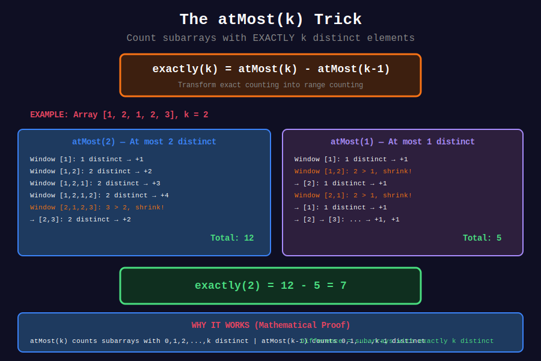

<div align="center">

# 📏 Variable Size Sliding Window

### *Expand to Explore, Shrink to Optimize — The Dynamic Dance*

<p>
  
  
  
</p>

*"The window breathes — expanding when it can, contracting when it must."*

</div>

---

## 🧭 Navigation

| ⬅️ Previous | 📂 Current | ➡️ Next |
|:------------|:----------:|--------:|
| [← 01. Fixed Size](../01_fixed_size/README.md) | **02. Variable Size** | [03. String Window →](../03_string_window/README.md) |

---

## 🎯 What You'll Master

- Longest subarray/substring problems

- Shortest subarray/substring problems  

- The "atMost(k) - atMost(k-1)" trick for counting

- Constraint-based window adjustment

- Amortized O(n) analysis

---

## 📊 Visual Diagrams

<div align="center">


*Expand to explore, shrink to optimize — Longest vs Shortest patterns*



*The powerful technique for counting exact distinct elements*

</div>

---

## 📐 Mathematical Foundations

### 1️⃣ The Two Goals

{: .highlight }
> Variable window problems ask for either the **longest** or **shortest** valid window.

| Goal | Shrink Condition | Update Time |
|------|------------------|-------------|
| **Longest** | While window is **INVALID** | After shrinking (window is valid) |
| **Shortest** | While window is **VALID** | Before/during shrinking |

---

### 2️⃣ Amortized O(n) Proof

{: .important }
> Every element enters and exits the window at most once.

#### Formal Proof

Let \(E_i\) = event "element \(i\) enters window"  
Let \(X_i\) = event "element \(i\) exits window"

**Claim**: \(\sum_{i=0}^{n-1} (E_i + X_i) \leq 2n\)

**Proof**:

- Each element enters exactly once (when `right` pointer reaches it)

- Each element exits at most once (when `left` pointer passes it)

- `left` pointer only moves right, never backwards

- Therefore: \(\sum E_i = n\) and \(\sum X_i \leq n\)

Total operations: \(\leq 2n = O(n)\) ∎

---

### 3️⃣ Longest Valid Window — The Pattern

{: .note }
> Shrink when **invalid**, update after shrinking.

#### Algorithm

```python
for right in range(n):
    add(arr[right])           # Expand
    
    while is_invalid():       # Shrink while INVALID
        remove(arr[left])
        left += 1
    
    # Window is now valid (or empty)
    max_len = max(max_len, right - left + 1)

```

#### 🔍 Why Shrink When Invalid?

We want the **longest** valid window. If invalid, we **must** shrink to make it valid. If valid, we keep expanding to find longer.

---

### 4️⃣ Shortest Valid Window — The Pattern

{: .highlight }
> Shrink while **valid**, update **before** shrinking.

#### Algorithm

```python
for right in range(n):
    add(arr[right])           # Expand
    
    while is_valid():         # Shrink while VALID
        min_len = min(min_len, right - left + 1)  # Update first!
        remove(arr[left])
        left += 1

```

#### 🔍 Why Shrink While Valid?

We want the **shortest** valid window. Once valid, we keep shrinking to find shorter while recording each valid length.

---

### 5️⃣ The atMost(k) Trick — Counting Exact

{: .important }
> Counting subarrays with **exactly** k property is hard. Use subtraction!

#### The Formula

```math
\text{exactly}(k) = \text{atMost}(k) - \text{atMost}(k-1)

```

#### 🔍 Proof

Let \(S_k\) = set of subarrays with exactly \(k\) property.

```math
\text{atMost}(k) = |S_0| + |S_1| + ... + |S_k|
\text{atMost}(k-1) = |S_0| + |S_1| + ... + |S_{k-1}|

```

Subtracting:

```math
\text{atMost}(k) - \text{atMost}(k-1) = |S_k| = \text{exactly}(k)

```

∎

#### Counting Subarrays in atMost

When window \([left, right]\) is valid, count subarrays ending at `right`:

```
\text{count} += right - left + 1

```math

This counts: \([right]\), \([right-1, right]\), ..., \([left, right]\)

---

### 6️⃣ The "Flip" Pattern

{: .note }
> Allow at most k "violations" in the window.

Examples:

- Max consecutive 1s with at most k flips (0→1)

- Longest substring with at most k replacements

#### The Insight

Instead of tracking valid characters, track **violations**:

- Window valid when: violations ≤ k

- Shrink when: violations > k

---

## 📊 Text Diagrams

### Longest Without Repeating Characters

```

String: "abcabcbb"

Step 1: Expand
"a"      set={a}, len=1
"ab"     set={a,b}, len=2
"abc"    set={a,b,c}, len=3 ⭐

Step 2: 'a' repeats! Shrink until valid
+---+---+---+---+---+---+---+---+

| a | b | c | a | b | c | b | b |
+---+---+---+---+---+---+---+---+
  L           R
  ↓
Remove 'a', move L
+---+---+---+---+---+---+---+---+

| a | b | c | a | b | c | b | b |
+---+---+---+---+---+---+---+---+
      L       R
set = {b,c,a}, len=3

Step 3: 'b' repeats!
+---+---+---+---+---+---+---+---+

| a | b | c | a | b | c | b | b |
+---+---+---+---+---+---+---+---+
      L           R
Remove 'b', move L
+---+---+---+---+---+---+---+---+

| a | b | c | a | b | c | b | b |
+---+---+---+---+---+---+---+---+
          L       R
set = {c,a,b}, len=3

...continue...

Maximum Length: 3

```

### Minimum Size Subarray Sum ≥ 7

```
Array: [2, 3, 1, 2, 4, 3]   Target: 7

Expand until valid:
+---+---+---+---+---+---+

| 2 | 3 | 1 | 2 | 4 | 3 |
+---+---+---+---+---+---+
  L
              R
sum = 2+3+1+2 = 8 ≥ 7 ✓
min_len = 4

Shrink while valid:
+---+---+---+---+---+---+

| 2 | 3 | 1 | 2 | 4 | 3 |
+---+---+---+---+---+---+
      L
              R
sum = 8-2 = 6 < 7 ✗
Stop shrinking, expand

+---+---+---+---+---+---+

| 2 | 3 | 1 | 2 | 4 | 3 |
+---+---+---+---+---+---+
      L
                  R
sum = 6+4 = 10 ≥ 7 ✓
min_len = 4

Shrink while valid:
sum = 10-3 = 7 ≥ 7 ✓, min_len = 3
sum = 7-1 = 6 < 7 ✗

+---+---+---+---+---+---+

| 2 | 3 | 1 | 2 | 4 | 3 |
+---+---+---+---+---+---+
              L
                      R
sum = 6+3 = 9 ≥ 7 ✓
Shrink: sum = 9-2 = 7 ≥ 7 ✓, min_len = 2
Shrink: sum = 7-4 = 3 < 7 ✗

Answer: 2 (subarray [4, 3])

```

### atMost(k) Counting

```
Array: [1, 2, 1, 2, 3]   Exactly 2 distinct

atMost(2):
Window [1]: 1 distinct → count += 1
Window [1,2]: 2 distinct → count += 2 (subarrays: [2], [1,2])
Window [1,2,1]: 2 distinct → count += 3
Window [1,2,1,2]: 2 distinct → count += 4
Window [2,1,2,3]: Shrink! 3 distinct > 2
  → [1,2,3]: still 3, shrink
  → [2,3]: 2 distinct → count += 2
Window [2,3]: count += 2

atMost(2) = 1+2+3+4+2 = 12

atMost(1):
Window [1]: 1 distinct → count += 1
Window [1,2]: 2 > 1, shrink → [2]: count += 1
Window [2,1]: 2 > 1, shrink → [1]: count += 1
Window [1,2]: 2 > 1, shrink → [2]: count += 1
Window [2,3]: 2 > 1, shrink → [3]: count += 1

atMost(1) = 5

exactly(2) = atMost(2) - atMost(1) = 12 - 5 = 7

```

---

## 💻 Code Implementations

```python
def lengthOfLongestSubstring(s: str) -> int:
    """
    Longest Substring Without Repeating Characters (LeetCode 3).
    
    Use HashSet to track characters in window.
    Shrink when duplicate found.
    
    Time: O(n), Space: O(min(n, alphabet))
    
    Example:
    >>> lengthOfLongestSubstring("abcabcbb")
    3
    """
    char_set = set()
    left = 0
    max_length = 0
    
    for right in range(len(s)):
        # Shrink while duplicate exists
        while s[right] in char_set:
            char_set.remove(s[left])
            left += 1
        
        char_set.add(s[right])
        max_length = max(max_length, right - left + 1)
    
    return max_length

def lengthOfLongestSubstringOptimized(s: str) -> int:
    """
    Optimized using HashMap to store last index.
    Jump left pointer directly to skip duplicates.
    
    Time: O(n), Space: O(min(n, alphabet))
    """
    last_seen = {}
    left = 0
    max_length = 0
    
    for right in range(len(s)):
        if s[right] in last_seen and last_seen[s[right]] >= left:
            left = last_seen[s[right]] + 1
        
        last_seen[s[right]] = right
        max_length = max(max_length, right - left + 1)
    
    return max_length

def minSubArrayLen(target: int, nums: list[int]) -> int:
    """
    Minimum Size Subarray Sum (LeetCode 209).
    
    Shrink while sum >= target (valid).
    
    Time: O(n), Space: O(1)
    
    Example:
    >>> minSubArrayLen(7, [2, 3, 1, 2, 4, 3])
    2
    """
    left = 0
    current_sum = 0
    min_length = float('inf')
    
    for right in range(len(nums)):
        current_sum += nums[right]
        
        # Shrink while valid
        while current_sum >= target:
            min_length = min(min_length, right - left + 1)
            current_sum -= nums[left]
            left += 1
    
    return min_length if min_length != float('inf') else 0

def longestOnes(nums: list[int], k: int) -> int:
    """
    Max Consecutive Ones III (LeetCode 1004).
    
    Allow flipping at most k zeros.
    Track zero count in window.
    
    Time: O(n), Space: O(1)
    
    Example:
    >>> longestOnes([1, 1, 1, 0, 0, 0, 1, 1, 1, 1, 0], 2)
    6
    """
    left = 0
    zeros = 0
    max_length = 0
    
    for right in range(len(nums)):
        if nums[right] == 0:
            zeros += 1
        
        # Shrink while too many zeros (invalid)
        while zeros > k:
            if nums[left] == 0:
                zeros -= 1
            left += 1
        
        max_length = max(max_length, right - left + 1)
    
    return max_length

def characterReplacement(s: str, k: int) -> int:
    """
    Longest Repeating Character Replacement (LeetCode 424).
    
    Window valid if: length - max_freq <= k
    (can replace non-dominant chars)
    
    Time: O(n), Space: O(26)
    
    Example:
    >>> characterReplacement("AABABBA", 1)
    4
    """
    count = {}
    left = 0
    max_freq = 0
    max_length = 0
    
    for right in range(len(s)):
        count[s[right]] = count.get(s[right], 0) + 1
        max_freq = max(max_freq, count[s[right]])
        
        # Window invalid if replacements needed > k
        while (right - left + 1) - max_freq > k:
            count[s[left]] -= 1
            left += 1
        
        max_length = max(max_length, right - left + 1)
    
    return max_length

def totalFruit(fruits: list[int]) -> int:
    """
    Fruit Into Baskets (LeetCode 904).
    
    Longest subarray with at most 2 distinct elements.
    
    Time: O(n), Space: O(1)
    
    Example:
    >>> totalFruit([1, 2, 1, 2, 3])
    4
    """
    count = {}
    left = 0
    max_length = 0
    
    for right in range(len(fruits)):
        count[fruits[right]] = count.get(fruits[right], 0) + 1
        
        # Shrink while more than 2 types
        while len(count) > 2:
            count[fruits[left]] -= 1
            if count[fruits[left]] == 0:
                del count[fruits[left]]
            left += 1
        
        max_length = max(max_length, right - left + 1)
    
    return max_length

def lengthOfLongestSubstringKDistinct(s: str, k: int) -> int:
    """
    Longest Substring with At Most K Distinct Characters (LeetCode 340).
    
    Generalization of Fruit Into Baskets.
    
    Time: O(n), Space: O(k)
    """
    if k == 0:
        return 0
    
    count = {}
    left = 0
    max_length = 0
    
    for right in range(len(s)):
        count[s[right]] = count.get(s[right], 0) + 1
        
        while len(count) > k:
            count[s[left]] -= 1
            if count[s[left]] == 0:
                del count[s[left]]
            left += 1
        
        max_length = max(max_length, right - left + 1)
    
    return max_length

def subarraysWithKDistinct(nums: list[int], k: int) -> int:
    """
    Subarrays with K Different Integers (LeetCode 992).
    
    exactly(k) = atMost(k) - atMost(k-1)
    
    Time: O(n), Space: O(k)
    
    Example:
    >>> subarraysWithKDistinct([1, 2, 1, 2, 3], 2)
    7
    """
    def at_most(k: int) -> int:
        if k < 0:
            return 0
        
        count = {}
        left = 0
        result = 0
        
        for right in range(len(nums)):
            count[nums[right]] = count.get(nums[right], 0) + 1
            
            while len(count) > k:
                count[nums[left]] -= 1
                if count[nums[left]] == 0:
                    del count[nums[left]]
                left += 1
            
            # All subarrays ending at right
            result += right - left + 1
        
        return result
    
    return at_most(k) - at_most(k - 1)

def numSubarrayProductLessThanK(nums: list[int], k: int) -> int:
    """
    Subarray Product Less Than K (LeetCode 713).
    
    Count subarrays with product < k.
    
    Time: O(n), Space: O(1)
    
    Example:
    >>> numSubarrayProductLessThanK([10, 5, 2, 6], 100)
    8
    """
    if k <= 1:
        return 0
    
    product = 1
    left = 0
    count = 0
    
    for right in range(len(nums)):
        product *= nums[right]
        
        while product >= k:
            product //= nums[left]
            left += 1
        
        # All subarrays ending at right with product < k
        count += right - left + 1
    
    return count

def longestSubarray(nums: list[int]) -> int:
    """
    Longest Subarray of 1's After Deleting One Element (LeetCode 1493).
    
    Same as Max Consecutive Ones III with k=1, minus 1 (must delete one).
    
    Time: O(n), Space: O(1)
    """
    left = 0
    zeros = 0
    max_length = 0
    
    for right in range(len(nums)):
        if nums[right] == 0:
            zeros += 1
        
        while zeros > 1:
            if nums[left] == 0:
                zeros -= 1
            left += 1
        
        max_length = max(max_length, right - left)  # -1 for deletion
    
    return max_length

def balancedString(s: str) -> int:
    """
    Replace the Substring for Balanced String (LeetCode 1234).
    
    Find shortest substring to replace so each of Q,W,E,R appears n/4 times.
    
    Time: O(n), Space: O(1)
    """
    n = len(s)
    target = n // 4
    
    count = {'Q': 0, 'W': 0, 'E': 0, 'R': 0}
    for c in s:
        count[c] += 1
    
    # Check if already balanced
    if all(v == target for v in count.values()):
        return 0
    
    min_length = n
    left = 0
    
    for right in range(n):
        count[s[right]] -= 1
        
        # Window valid if outside chars <= target for each
        while all(count[c] <= target for c in 'QWER'):
            min_length = min(min_length, right - left + 1)
            count[s[left]] += 1
            left += 1
    
    return min_length

```

---

## 🎯 Pattern Summary

| Problem Type | Shrink When | Track | Update |
|--------------|-------------|-------|--------|
| Longest no repeat | Duplicate found | Set/HashMap | After shrink |
| Longest k distinct | > k distinct | HashMap | After shrink |
| Shortest sum ≥ k | Valid (sum ≥ k) | Running sum | Before shrink |
| Exactly k distinct | Use atMost | HashMap | After shrink |
| At most k flips | > k violations | Violation count | After shrink |

---

## 🏆 LeetCode Problems

### 🟡 Medium

| # | Problem | Pattern | Time | Space |
|:-:|---------|---------|:----:|:-----:|
| 3 | [Longest No Repeat](https://leetcode.com/problems/longest-substring-without-repeating-characters/) | HashSet | O(n) | O(k) |
| 159 | [Two Distinct](https://leetcode.com/problems/longest-substring-with-at-most-two-distinct-characters/) | HashMap | O(n) | O(1) |
| 209 | [Min Size Sum ≥ k](https://leetcode.com/problems/minimum-size-subarray-sum/) | Shrink valid | O(n) | O(1) |
| 340 | [K Distinct](https://leetcode.com/problems/longest-substring-with-at-most-k-distinct-characters/) | HashMap | O(n) | O(k) |
| 424 | [Char Replacement](https://leetcode.com/problems/longest-repeating-character-replacement/) | Max freq | O(n) | O(26) |
| 713 | [Product < K](https://leetcode.com/problems/subarray-product-less-than-k/) | Product | O(n) | O(1) |
| 904 | [Fruit Baskets](https://leetcode.com/problems/fruit-into-baskets/) | 2 distinct | O(n) | O(1) |
| 1004 | [Max Ones III](https://leetcode.com/problems/max-consecutive-ones-iii/) | Flip count | O(n) | O(1) |
| 1493 | [Delete One 1s](https://leetcode.com/problems/longest-subarray-of-1s-after-deleting-one-element/) | Flip count | O(n) | O(1) |

### 🔴 Hard

| # | Problem | Pattern | Time | Space |
|:-:|---------|---------|:----:|:-----:|
| 76 | [Min Window Substring](https://leetcode.com/problems/minimum-window-substring/) | Have/Need | O(n) | O(k) |
| 992 | [K Different](https://leetcode.com/problems/subarrays-with-k-different-integers/) | atMost trick | O(n) | O(k) |
| 1234 | [Balanced String](https://leetcode.com/problems/replace-the-substring-for-balanced-string/) | Shortest | O(n) | O(1) |

---

## 💡 Interview Tips

### Key Questions to Ask

1. "Am I looking for longest or shortest?"
2. "What makes the window valid/invalid?"
3. "Do I need exact count or at-most?"

### Common Mistakes

| Mistake | Fix |
|---------|-----|
| Wrong shrink condition | Longest: while invalid; Shortest: while valid |
| Forgetting atMost trick | exactly(k) = atMost(k) - atMost(k-1) |
| Not counting subarrays | Add right - left + 1, not 1 |

---

## 📚 References

| Resource | Description | Link |
|----------|-------------|------|
| **Sliding Window Patterns** | LeetCode discuss | [🔗 LeetCode](https://leetcode.com/discuss/study-guide/657507/) |
| **atMost Trick** | Detailed explanation | [🔗 Medium](https://medium.com/outco/how-to-solve-sliding-window-problems-28d67601a66) |

---

<div align="center">

**Made with ❤️ by [Gaurav Goswami](https://github.com/Gaurav14cs17)**

*"Expand to explore, shrink to optimize."*

</div>

---

## 🧭 Navigation

| ⬅️ Previous | 📂 Current | ➡️ Next |
|:------------|:----------:|--------:|
| [← 01. Fixed Size](../01_fixed_size/README.md) | **02. Variable Size** | [03. String Window →](../03_string_window/README.md) |

```