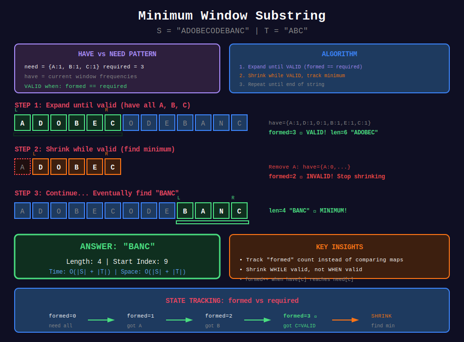
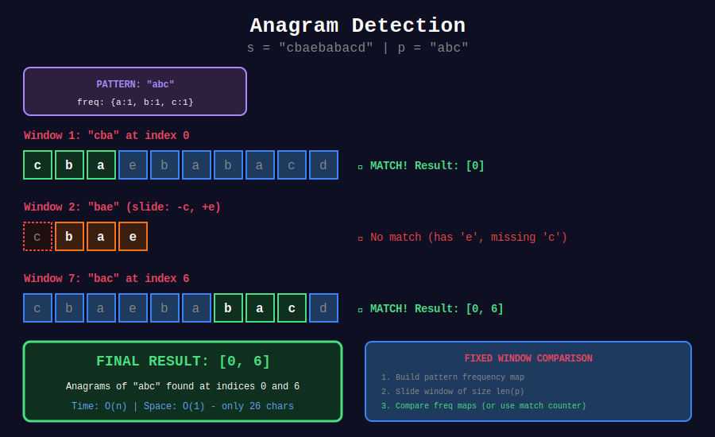

<div align="center">

# 🔤 String Sliding Window

### *Character Counting Mastery — From Anagrams to Substrings*

<p>
  
  
  
</p>

*"When strings meet sliding windows, character frequencies become your best friend."*

</div>

---

## 🧭 Navigation

| ⬅️ Previous | 📂 Current | ➡️ Next Topic |
|:------------|:----------:|--------:|
| [← 02. Variable Size](../02_variable_size/README.md) | **03. String Window** | [🏠 Sliding Window Home](../README.md) → [Graph Algorithms](../../24_graph_algorithms/README.md) |

---

## 🎯 What You'll Master

- Anagram and permutation detection
- Minimum window substring (the classic hard problem)
- Character frequency tracking techniques
- The "have vs need" pattern
- Optimizations with match counters

---

## 📊 Visual Diagrams

<div align="center">



*The classic "Have vs Need" pattern for minimum window problems*



*Fixed window character frequency matching*

</div>

---

## 📐 Mathematical Foundations

### 1️⃣ Anagram Definition

{: .highlight }
> Two strings are **anagrams** if they have the same character frequencies.

```math
\text{Anagram}(s, t) \Leftrightarrow \forall c: \text{freq}_s[c] = \text{freq}_t[c]

```

#### For Window Problems

A window is an anagram of pattern \(p\) if:
- Window size = \(|p|\)
- Character frequencies match

---

### 2️⃣ The "Have vs Need" Pattern

{: .important }
> For minimum window substring: track what you **have** vs what you **need**.

#### State Variables

- `need[c]` = frequency of character \(c\) required
- `have[c]` = frequency of character \(c\) in current window
- `formed` = count of characters satisfying `have[c] >= need[c]`
- `required` = count of unique characters in pattern

#### Validity Condition

```math
\text{Window valid} \Leftrightarrow \text{formed} = \text{required}

```

---

### 3️⃣ Match Counter Optimization

{: .note }
> Instead of comparing all 26 frequencies, track how many characters are "satisfied".

#### Before (O(26) per check)

```python
if window_count == pattern_count:  # Compare 26 values

```

#### After (O(1) per check)

```python
if matches == 26:  # Single comparison

```

#### Updating Matches

When adding character \(c\):

```python
if window[c] == pattern[c]:
    matches += 1
elif window[c] == pattern[c] + 1:  # Was matched, now over
    matches -= 1

```

---

### 4️⃣ Substring with Concatenation of All Words

{: .highlight }
> For word-based windows, treat each word as a "character".

#### The Approach

- Window size = `word_count × word_length`
- Slide by `word_length` at a time
- Track word frequencies instead of char frequencies

---

## 📊 Text Diagrams

### Minimum Window Substring

```
S = "ADOBECODEBANC"   T = "ABC"

Need: {A:1, B:1, C:1}   Required: 3

Step 1: Expand until valid
+-+-+-+-+-+-+-+-+-+-+-+-+-+
|A|D|O|B|E|C|O|D|E|B|A|N|C|
+-+-+-+-+-+-+-+-+-+-+-+-+-+
 L         R
 
Have: {A:1}         formed=1
...expand...
Have: {A:1,D:1,O:1,B:1,E:1,C:1}   formed=3 ✓

Window = "ADOBEC", length = 6

Step 2: Shrink while valid
+-+-+-+-+-+-+-+-+-+-+-+-+-+
|A|D|O|B|E|C|O|D|E|B|A|N|C|
+-+-+-+-+-+-+-+-+-+-+-+-+-+
   L       R

Remove A: Have={A:0,...} formed=2 ✗
Invalid! Stop shrinking, expand again.

...continue...

Step 3: Final answer
+-+-+-+-+-+-+-+-+-+-+-+-+-+
|A|D|O|B|E|C|O|D|E|B|A|N|C|
+-+-+-+-+-+-+-+-+-+-+-+-+-+
                   L     R

Window = "BANC", length = 4 ⭐

Answer: "BANC"

```

### Anagram Detection Flow

```
s = "cbaebabacd"   p = "abc"

Pattern: {a:1, b:1, c:1}
Window size: 3

Window 1: "cba"
+-+-+-+-+-+-+-+-+-+-+
|c|b|a|e|b|a|b|a|c|d|
+-+-+-+-+-+-+-+-+-+-+
 +-----+
freq: {c:1, b:1, a:1}
Match? ✓  → Result: [0]

Window 2: "bae" (slide: remove c, add e)
+-+-+-+-+-+-+-+-+-+-+
|c|b|a|e|b|a|b|a|c|d|
+-+-+-+-+-+-+-+-+-+-+
   +-----+
freq: {b:1, a:1, e:1}
Match? ✗

Window 3: "aeb"
freq: {a:1, e:1, b:1}
Match? ✗

...continue...

Window 7: "bac"
+-+-+-+-+-+-+-+-+-+-+
|c|b|a|e|b|a|b|a|c|d|
+-+-+-+-+-+-+-+-+-+-+
             +-----+
freq: {b:1, a:1, c:1}
Match? ✓  → Result: [0, 6]

Answer: [0, 6]

```

### Have vs Need State Machine

```
+---------------------------------------------------------------+
|                   HAVE vs NEED STATE                          |
+---------------------------------------------------------------+
|                                                               |
|   Need: {A:1, B:2, C:1}   Required: 3 unique chars           |
|                                                               |
|   State 1: formed = 0                                        |
|   Have: {}                                                    |
|   Status: ✗ Need all                                         |
|                                                               |
|   State 2: formed = 1                                        |
|   Have: {A:1, B:1}                                           |
|   Status: ✗ A satisfied, B needs 1 more, C missing          |
|                                                               |
|   State 3: formed = 2                                        |
|   Have: {A:2, B:2}                                           |
|   Status: ✗ A,B satisfied, C missing                        |
|                                                               |
|   State 4: formed = 3 ✓                                      |
|   Have: {A:2, B:2, C:1}                                      |
|   Status: ✓ VALID WINDOW                                     |
|                                                               |
|   When formed == required → Window is VALID                  |
|   Now shrink while still valid!                              |
|                                                               |
+---------------------------------------------------------------+

```

---

## 💻 Code Implementations

```python
def minWindow(s: str, t: str) -> str:
    """
    Minimum Window Substring (LeetCode 76).
    
    Find smallest window in s containing all chars of t.
    
    Algorithm:
    1. Build need map from t
    2. Expand window until valid (have all needed)
    3. Shrink while valid, tracking minimum
    
    Time: O(|s| + |t|), Space: O(|s| + |t|)
    
    Example:
    >>> minWindow("ADOBECODEBANC", "ABC")
    "BANC"
    """
    if not t or not s:
        return ""
    
    from collections import Counter
    
    # What we need
    need = Counter(t)
    required = len(need)
    
    # What we have in current window
    have = {}
    formed = 0  # How many chars satisfy have[c] >= need[c]
    
    # Window pointers
    left = 0
    min_len = float('inf')
    min_start = 0
    
    for right in range(len(s)):
        char = s[right]
        have[char] = have.get(char, 0) + 1
        
        # Check if this char is now satisfied
        if char in need and have[char] == need[char]:
            formed += 1
        
        # Shrink while window is valid
        while formed == required:
            # Update minimum
            if right - left + 1 < min_len:
                min_len = right - left + 1
                min_start = left
            
            # Remove leftmost character
            left_char = s[left]
            have[left_char] -= 1
            
            if left_char in need and have[left_char] < need[left_char]:
                formed -= 1
            
            left += 1
    
    return s[min_start:min_start + min_len] if min_len != float('inf') else ""

def findAnagrams(s: str, p: str) -> list[int]:
    """
    Find All Anagrams in a String (LeetCode 438).
    
    Fixed window of size len(p), compare frequencies.
    
    Time: O(n), Space: O(1) - only 26 chars
    
    Example:
    >>> findAnagrams("cbaebabacd", "abc")
    [0, 6]
    """
    if len(p) > len(s):
        return []
    
    p_count = [0] * 26
    s_count = [0] * 26
    
    # Initialize pattern count
    for c in p:
        p_count[ord(c) - ord('a')] += 1
    
    result = []
    k = len(p)
    
    for i in range(len(s)):
        # Add current character
        s_count[ord(s[i]) - ord('a')] += 1
        
        # Remove leftmost when window exceeds size
        if i >= k:
            s_count[ord(s[i - k]) - ord('a')] -= 1
        
        # Compare when window is complete
        if i >= k - 1 and s_count == p_count:
            result.append(i - k + 1)
    
    return result

def findAnagramsOptimized(s: str, p: str) -> list[int]:
    """
    Optimized with match counter.
    
    Instead of comparing 26 frequencies each time,
    track number of positions with matching count.
    
    Time: O(n), Space: O(1)
    """
    if len(p) > len(s):
        return []
    
    p_count = [0] * 26
    s_count = [0] * 26
    
    for c in p:
        p_count[ord(c) - ord('a')] += 1
    
    result = []
    k = len(p)
    matches = 0  # Count of positions where s_count == p_count
    
    # Initialize matches for all 26 positions
    for i in range(26):
        if s_count[i] == p_count[i]:
            matches += 1
    
    for i in range(len(s)):
        # Add current character
        idx = ord(s[i]) - ord('a')
        if s_count[idx] == p_count[idx]:
            matches -= 1  # Was matching, now won't
        s_count[idx] += 1
        if s_count[idx] == p_count[idx]:
            matches += 1  # Now matching
        
        # Remove leftmost when window exceeds size
        if i >= k:
            idx = ord(s[i - k]) - ord('a')
            if s_count[idx] == p_count[idx]:
                matches -= 1
            s_count[idx] -= 1
            if s_count[idx] == p_count[idx]:
                matches += 1
        
        # All 26 positions match
        if matches == 26:
            result.append(i - k + 1)
    
    return result

def checkInclusion(s1: str, s2: str) -> bool:
    """
    Permutation in String (LeetCode 567).
    
    Check if any permutation of s1 exists in s2.
    Same as findAnagrams but return boolean.
    
    Time: O(n), Space: O(1)
    
    Example:
    >>> checkInclusion("ab", "eidbaooo")
    True
    """
    if len(s1) > len(s2):
        return False
    
    count1 = [0] * 26
    count2 = [0] * 26
    
    for c in s1:
        count1[ord(c) - ord('a')] += 1
    
    k = len(s1)
    
    for i in range(len(s2)):
        count2[ord(s2[i]) - ord('a')] += 1
        
        if i >= k:
            count2[ord(s2[i - k]) - ord('a')] -= 1
        
        if count1 == count2:
            return True
    
    return False

def lengthOfLongestSubstringTwoDistinct(s: str) -> int:
    """
    Longest Substring with At Most Two Distinct Characters (LeetCode 159).
    
    Time: O(n), Space: O(1)
    
    Example:
    >>> lengthOfLongestSubstringTwoDistinct("eceba")
    3
    """
    count = {}
    left = 0
    max_length = 0
    
    for right in range(len(s)):
        count[s[right]] = count.get(s[right], 0) + 1
        
        while len(count) > 2:
            count[s[left]] -= 1
            if count[s[left]] == 0:
                del count[s[left]]
            left += 1
        
        max_length = max(max_length, right - left + 1)
    
    return max_length

def lengthOfLongestSubstringKDistinct(s: str, k: int) -> int:
    """
    Longest Substring with At Most K Distinct Characters (LeetCode 340).
    
    Time: O(n), Space: O(k)
    
    Example:
    >>> lengthOfLongestSubstringKDistinct("eceba", 2)
    3
    """
    if k == 0:
        return 0
    
    count = {}
    left = 0
    max_length = 0
    
    for right in range(len(s)):
        count[s[right]] = count.get(s[right], 0) + 1
        
        while len(count) > k:
            count[s[left]] -= 1
            if count[s[left]] == 0:
                del count[s[left]]
            left += 1
        
        max_length = max(max_length, right - left + 1)
    
    return max_length

def findSubstring(s: str, words: list[str]) -> list[int]:
    """
    Substring with Concatenation of All Words (LeetCode 30).
    
    Find all starting indices where a concatenation of all words exists.
    All words have the same length.
    
    Time: O(n × word_len), Space: O(word_count)
    
    Example:
    >>> findSubstring("barfoothefoobarman", ["foo", "bar"])
    [0, 9]
    """
    if not s or not words:
        return []
    
    from collections import Counter
    
    word_len = len(words[0])
    word_count = len(words)
    window_size = word_len * word_count
    word_freq = Counter(words)
    
    result = []
    
    # Try each starting offset (0 to word_len - 1)
    for offset in range(word_len):
        left = offset
        current_freq = {}
        count = 0  # Words matched
        
        for right in range(offset, len(s) - word_len + 1, word_len):
            word = s[right:right + word_len]
            
            if word in word_freq:
                current_freq[word] = current_freq.get(word, 0) + 1
                count += 1
                
                # Too many of this word
                while current_freq[word] > word_freq[word]:
                    left_word = s[left:left + word_len]
                    current_freq[left_word] -= 1
                    count -= 1
                    left += word_len
                
                # All words matched
                if count == word_count:
                    result.append(left)
                    # Slide window
                    left_word = s[left:left + word_len]
                    current_freq[left_word] -= 1
                    count -= 1
                    left += word_len
            else:
                # Invalid word, reset
                current_freq.clear()
                count = 0
                left = right + word_len
    
    return result

def longestSubstringWithAtLeastKRepeating(s: str, k: int) -> int:
    """
    Longest Substring with At Least K Repeating Characters (LeetCode 395).
    
    Every character in the substring appears at least k times.
    
    Use divide and conquer OR sliding window with unique char constraint.
    
    Time: O(26 × n), Space: O(26)
    """
    def longest_with_unique(s: str, k: int, unique_target: int) -> int:
        """Find longest substring with exactly unique_target unique chars,
        each appearing at least k times."""
        count = {}
        left = 0
        unique = 0  # Unique chars in window
        count_at_least_k = 0  # Chars appearing >= k times
        max_length = 0
        
        for right in range(len(s)):
            c = s[right]
            if count.get(c, 0) == 0:
                unique += 1
            count[c] = count.get(c, 0) + 1
            if count[c] == k:
                count_at_least_k += 1
            
            while unique > unique_target:
                c = s[left]
                if count[c] == k:
                    count_at_least_k -= 1
                count[c] -= 1
                if count[c] == 0:
                    unique -= 1
                left += 1
            
            if unique == unique_target and count_at_least_k == unique_target:
                max_length = max(max_length, right - left + 1)
        
        return max_length
    
    max_unique = len(set(s))
    result = 0
    
    for unique_target in range(1, max_unique + 1):
        result = max(result, longest_with_unique(s, k, unique_target))
    
    return result

def numberOfSubstrings(s: str) -> int:
    """
    Number of Substrings Containing All Three Characters (LeetCode 1358).
    
    Count substrings containing at least one a, b, and c.
    
    Time: O(n), Space: O(1)
    
    Example:
    >>> numberOfSubstrings("abcabc")
    10
    """
    count = {'a': 0, 'b': 0, 'c': 0}
    left = 0
    result = 0
    
    for right in range(len(s)):
        count[s[right]] += 1
        
        # While window is valid (has all three)
        while count['a'] > 0 and count['b'] > 0 and count['c'] > 0:
            # All substrings from left to end of string are valid
            result += len(s) - right
            count[s[left]] -= 1
            left += 1
    
    return result

```

---

## 🎯 Pattern Summary

| Problem | Window Type | State | Key Insight |
|---------|-------------|-------|-------------|
| **Anagram** | Fixed (len p) | Char count | Compare frequencies |
| **Min Window** | Variable | Have/Need | Shrink while valid |
| **K Distinct** | Variable | HashMap | Track distinct count |
| **All Words** | Fixed (words) | Word count | Treat word as unit |
| **K Repeating** | Variable | Multiple passes | Try each unique count |

---

## 🏆 LeetCode Problems

### 🟡 Medium

| # | Problem | Pattern | Time | Space |
|:-:|---------|---------|:----:|:-----:|
| 159 | [Two Distinct](https://leetcode.com/problems/longest-substring-with-at-most-two-distinct-characters/) | HashMap | O(n) | O(1) |
| 340 | [K Distinct](https://leetcode.com/problems/longest-substring-with-at-most-k-distinct-characters/) | HashMap | O(n) | O(k) |
| 395 | [K Repeating](https://leetcode.com/problems/longest-substring-with-at-least-k-repeating-characters/) | Multi-pass | O(26n) | O(26) |
| 438 | [Find Anagrams](https://leetcode.com/problems/find-all-anagrams-in-a-string/) | Fixed | O(n) | O(1) |
| 567 | [Permutation](https://leetcode.com/problems/permutation-in-string/) | Fixed | O(n) | O(1) |
| 1358 | [All Three Chars](https://leetcode.com/problems/number-of-substrings-containing-all-three-characters/) | Variable | O(n) | O(1) |

### 🔴 Hard

| # | Problem | Pattern | Time | Space |
|:-:|---------|---------|:----:|:-----:|
| 30 | [Concat Words](https://leetcode.com/problems/substring-with-concatenation-of-all-words/) | Word Window | O(n×m) | O(m) |
| 76 | [Min Window](https://leetcode.com/problems/minimum-window-substring/) | Have/Need | O(n) | O(k) |

---

## 💡 Interview Tips

### Key Techniques

| Technique | When to Use |
|-----------|-------------|
| **Count array [26]** | Only lowercase letters |
| **HashMap** | Any characters, words |
| **Match counter** | Optimize frequency comparison |
| **Have/Need** | Minimum window problems |

### Common Mistakes

| Mistake | Fix |
|---------|-----|
| Comparing arrays each time | Use match counter |
| Wrong formed update | Check before AND after freq change |
| Not handling empty string | Early return check |

---

## 📚 References

| Resource | Description | Link |
|----------|-------------|------|
| **Min Window Substring** | Official solution | [🔗 LeetCode](https://leetcode.com/problems/minimum-window-substring/solution/) |
| **Anagram Problems** | Pattern guide | [🔗 GFG](https://www.geeksforgeeks.org/anagram-substring-search-search-permutations/) |
| **String Hashing** | Rabin-Karp | [🔗 Wikipedia](https://en.wikipedia.org/wiki/Rabin%E2%80%93Karp_algorithm) |

---

<div align="center">

**Made with ❤️ by [Gaurav Goswami](https://github.com/Gaurav14cs17)**

*"Count characters, conquer strings."*

</div>

---

## 🧭 Navigation

| ⬅️ Previous | 📂 Current | ➡️ Next Topic |
|:------------|:----------:|--------:|
| [← 02. Variable Size](../02_variable_size/README.md) | **03. String Window** | [🏠 Sliding Window Home](../README.md) → [Graph Algorithms](../../24_graph_algorithms/README.md) |
