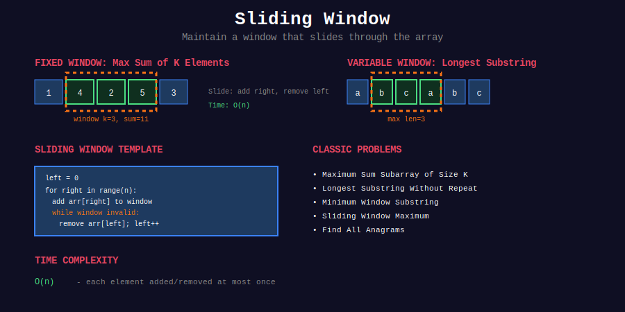

<div align="center">

# 🪟 Sliding Window



### *The Art of Moving Through Data — One Window at a Time*

<p>
  
  
  
  
</p>

**Transform brute-force subarray enumeration into elegant linear-time solutions**

[⬅️ Previous: Two Pointers](../22_two_pointers/README.md) | [🏠 Home](../README.md) | [Next: Graph Algorithms ➡️](../24_graph_algorithms/README.md)

</div>

---

## 🌟 Why Sliding Window?

> *"Instead of recalculating from scratch, we slide and adjust — turning O(n×k) into O(n)."*

| Advantage | Description |
|-----------|-------------|
| ⚡ **Speed** | Reduce O(n²) or O(n×k) to O(n) |
| 💾 **Incremental** | Reuse previous computation by adding/removing elements |
| 🎯 **Elegance** | Clean two-pointer-like structure |
| 🏆 **Versatility** | Works for sums, counts, substrings, and more |

---

## 📐 The Two Fundamental Patterns

### 🎭 Pattern Overview

```
+-----------------------------------------------------------------+

|                  SLIDING WINDOW PATTERNS                        |
+-----------------------------------------------------------------+
|                                                                 |
|  1. FIXED SIZE WINDOW                                          |
|     +---------------------------------------------+            |
|     | Array: [a, b, c, d, e, f, g, h, i, j]       |            |
|     |             +-------+                        |            |
|     |             | k = 3 |                        |            |
|     |        Window slides →→→                    |            |
|     +---------------------------------------------+            |
|     Window size is constant (k)                                |
|     Slide: Remove leftmost, add rightmost                      |
|                                                                 |
|  2. VARIABLE SIZE WINDOW                                       |
|     +---------------------------------------------+            |
|     | Array: [a, b, c, d, e, f, g, h, i, j]       |            |
|     |        +-------------+                       |            |
|     |        L             R                       |            |
|     |        ← shrink   expand →                   |            |
|     +---------------------------------------------+            |
|     Window expands/shrinks based on condition                  |
|     Find longest/shortest valid window                         |
|                                                                 |
+-----------------------------------------------------------------+

```

---

## 📐 Mathematical Foundation

### 1️⃣ Fixed Size Window — The Update Formula

{: .highlight }
> Slide a window of size \(k\) by removing the leftmost element and adding the next element.

#### Window Definition

```math
\text{Window at position } i = [a_i, a_{i+1}, ..., a_{i+k-1}]

```

#### Sliding Update

```math
\text{sum}_{i+1} = \text{sum}_i - a_i + a_{i+k}

```

#### 📊 Visual Proof

```
Window at i:     [a, b, c, d, e, f, g]
                  +-----+
                  sum = a + b + c

Window at i+1:   [a, b, c, d, e, f, g]
                     +-----+
                  sum' = b + c + d
                       = (a + b + c) - a + d
                       = sum - a + d  ✓

Instead of summing k elements each time: O(k)
We update in O(1)!

```

---

### 2️⃣ Variable Size Window — Amortized O(n) Proof

{: .important }
> Each element enters the window at most once and exits at most once.

#### The Algorithm

```python
left = 0
for right in range(n):
    # Add arr[right] to window
    while condition_violated():
        # Remove arr[left] from window
        left += 1
    # Process valid window

```

#### 🔍 Proof of O(n) Time Complexity

**Claim**: The total number of operations is O(n).

**Proof**:

Let's count pointer movements:

- `right` pointer: moves from 0 to n-1 exactly once = \(n\) moves

- `left` pointer: only moves right, never left
  - Can move at most \(n\) times total (can't exceed right)

Total pointer movements: \(n + n = 2n = O(n)\)

Each element:

- Added to window: exactly once (when `right` reaches it)

- Removed from window: at most once (when `left` passes it)

**Amortized cost**: \(O(1)\) per element ∎

---

### 3️⃣ The Shrink Condition — When to Contract

{: .note }
> The key insight is knowing when to shrink the window.

| Problem Type | Shrink When | Goal |
|--------------|-------------|------|
| **Maximum Length** | Window becomes invalid | Maintain validity, maximize |
| **Minimum Length** | Window is valid | Shrink while valid, track minimum |
| **Exact Count** | Use atMost(k) - atMost(k-1) | Count subarrays |

#### Maximum Length Pattern

```python
# Find LONGEST subarray/substring with some property
while window_is_INVALID:
    shrink()
# Window is now valid (or empty)
max_length = max(max_length, window_size)

```

#### Minimum Length Pattern

```python
# Find SHORTEST subarray/substring with some property
while window_is_VALID:
    min_length = min(min_length, window_size)
    shrink()  # Try to find shorter
# Window is now invalid

```

---

### 4️⃣ The atMost(k) Trick — Counting Subarrays

{: .highlight }
> To count subarrays with **exactly** k distinct elements: `exactly(k) = atMost(k) - atMost(k-1)`

#### 🔍 Proof

Let:

- \(f(k)\) = count of subarrays with at most \(k\) distinct elements

- \(g(k)\) = count of subarrays with exactly \(k\) distinct elements

Then:

```math
f(k) = g(1) + g(2) + ... + g(k)
f(k-1) = g(1) + g(2) + ... + g(k-1)

```

Subtracting:

```math
g(k) = f(k) - f(k-1)

```

So: `exactly(k) = atMost(k) - atMost(k-1)` ∎

---

### 5️⃣ Counting Valid Subarrays in a Window

{: .important }
> When the window \([left, right]\) is valid, it contributes \(right - left + 1\) valid subarrays.

#### 🔍 Proof

All subarrays ending at `right` that start anywhere in \([left, right]\) are valid:

- Starting at `left`: \([left, right]\)

- Starting at `left+1`: \([left+1, right]\)

- ...

- Starting at `right`: \([right, right]\)

Count = \(right - left + 1\) subarrays ∎

---

## 📂 Subtopics Navigation

| # | Topic | Key Techniques | Problems | Link |
|:-:|-------|----------------|:--------:|------|
| 1 | **Fixed Size Window** | Sum, Max, Count, Monotonic Deque | 10+ | [📖 Go →](./01_fixed_size/README.md) |
| 2 | **Variable Size Window** | Longest, Shortest, atMost(k) | 15+ | [📖 Go →](./02_variable_size/README.md) |
| 3 | **String Window** | Anagrams, Permutations, Distinct Chars | 10+ | [📖 Go →](./03_string_window/README.md) |

---

## 🎯 Pattern Recognition Flowchart

```
                    +-----------------------------+
                    |   SLIDING WINDOW PROBLEM?   |
                    +--------------+--------------+
                                   |
         +-------------------------+-------------------------+
         |                         |                         |
         ▼                         ▼                         ▼
  +--------------+         +--------------+         +--------------+
  |  Window size |         | Find optimal |         |    Count     |
  |   given (k)? |         |    length?   |         |  subarrays?  |
  +------+-------+         +------+-------+         +------+-------+
         |                        |                        |
         ▼                        |                        ▼
  +--------------+         +------+------+         +--------------+
  |    FIXED     |         |             |         |   atMost(k)  |
  |    SIZE      |         ▼             ▼         | - atMost(k-1)|
  +--------------+   +----------+ +----------+     +--------------+
                     | LONGEST? | |SHORTEST? |
                     +----+-----+ +----+-----+
                          |            |
                          ▼            ▼
                   +----------+ +----------+
                   |  Shrink  | |  Shrink  |
                   |  when    | |  while   |
                   | INVALID  | |  VALID   |
                   +----------+ +----------+

```

---

## 🎨 Visual: The Sliding Window in Motion

### Fixed Size Window (k=3)

```
Array: [2, 1, 5, 1, 3, 2]   Find: Max sum of size 3

Step 1: Initialize window
+-------------+

| 2 | 1 | 5 | 1 | 3 | 2 |
+---+---+---+---+---+---+
  +---------+
  sum = 2+1+5 = 8   max = 8

Step 2: Slide right (remove 2, add 1)
+-------------+

| 2 | 1 | 5 | 1 | 3 | 2 |
+---+---+---+---+---+---+
      +---------+
  sum = 8 - 2 + 1 = 7   max = 8

Step 3: Slide right (remove 1, add 3)
+-------------+

| 2 | 1 | 5 | 1 | 3 | 2 |
+---+---+---+---+---+---+
          +---------+
  sum = 7 - 1 + 3 = 9   max = 9 ⭐

Step 4: Slide right (remove 5, add 2)
+-------------+

| 2 | 1 | 5 | 1 | 3 | 2 |
+---+---+---+---+---+---+
              +---------+
  sum = 9 - 5 + 2 = 6   max = 9

Answer: 9 (window [5, 1, 3])

```

### Variable Size Window (Minimum Length with Sum ≥ 7)

```
Array: [2, 3, 1, 2, 4, 3]   Find: Shortest subarray with sum ≥ 7

Step 1: Expand until valid
+-------------+

| 2 | 3 | 1 | 2 | 4 | 3 |
+---+---+---+---+---+---+
  L
      R
  sum = 2+3 = 5 < 7, expand...

+-------------+

| 2 | 3 | 1 | 2 | 4 | 3 |
+---+---+---+---+---+---+
  L
          R
  sum = 2+3+1 = 6 < 7, expand...

+-------------+

| 2 | 3 | 1 | 2 | 4 | 3 |
+---+---+---+---+---+---+
  L
              R
  sum = 2+3+1+2 = 8 ≥ 7 ✓   min_len = 4

Step 2: Shrink while valid
+-------------+

| 2 | 3 | 1 | 2 | 4 | 3 |
+---+---+---+---+---+---+
      L
              R
  sum = 8-2 = 6 < 7 ✗, stop shrinking

Step 3: Expand again
+-------------+

| 2 | 3 | 1 | 2 | 4 | 3 |
+---+---+---+---+---+---+
      L
                  R
  sum = 6+4 = 10 ≥ 7 ✓   min_len = 4

Step 4: Shrink while valid
  sum = 10-3 = 7 ≥ 7 ✓   min_len = 3
  sum = 7-1 = 6 < 7 ✗

...continue...

Answer: 2 (window [4, 3])

```

---

## 💻 Core Code Templates

### Template 1: Fixed Size Window

```python
def fixed_window(arr: list, k: int) -> int:
    """
    Process all windows of size k.
    
    Time: O(n), Space: O(1)
    """
    n = len(arr)
    if n < k:
        return 0
    
    # Initialize first window
    window_sum = sum(arr[:k])
    result = window_sum
    
    # Slide the window
    for i in range(k, n):
        # Remove leftmost, add rightmost
        window_sum += arr[i] - arr[i - k]
        result = max(result, window_sum)  # or min, or other operation
    
    return result

```

### Template 2: Variable Window — Find Longest

```python
def longest_valid_window(arr: list) -> int:
    """
    Find longest subarray satisfying some condition.
    
    Time: O(n), Space: depends on state
    """
    left = 0
    max_length = 0
    state = initialize_state()
    
    for right in range(len(arr)):
        # Expand: add arr[right] to window
        update_state_add(state, arr[right])
        
        # Shrink: while window is INVALID
        while not is_valid(state):
            update_state_remove(state, arr[left])
            left += 1
        
        # Window [left, right] is now valid
        max_length = max(max_length, right - left + 1)
    
    return max_length

```

### Template 3: Variable Window — Find Shortest

```python
def shortest_valid_window(arr: list, target) -> int:
    """
    Find shortest subarray satisfying some condition.
    
    Time: O(n), Space: depends on state
    """
    left = 0
    min_length = float('inf')
    state = 0
    
    for right in range(len(arr)):
        # Expand: add arr[right] to window
        state += arr[right]
        
        # Shrink: while window is VALID (try to find shorter)
        while is_valid(state, target):
            min_length = min(min_length, right - left + 1)
            state -= arr[left]
            left += 1
    
    return min_length if min_length != float('inf') else 0

```

### Template 4: Count Subarrays with Exactly K

```python
def count_exact_k(arr: list, k: int) -> int:
    """
    Count subarrays with exactly k distinct elements.
    Uses: exactly(k) = atMost(k) - atMost(k-1)
    
    Time: O(n), Space: O(k)
    """
    def at_most(k: int) -> int:
        if k < 0:
            return 0
        
        left = 0
        count = 0
        freq = {}
        
        for right in range(len(arr)):
            # Add arr[right]
            freq[arr[right]] = freq.get(arr[right], 0) + 1
            
            # Shrink while too many distinct
            while len(freq) > k:
                freq[arr[left]] -= 1
                if freq[arr[left]] == 0:
                    del freq[arr[left]]
                left += 1
            
            # All subarrays ending at right are valid
            count += right - left + 1
        
        return count
    
    return at_most(k) - at_most(k - 1)

```

---

## 🏆 LeetCode Problems

### 🟢 Easy

| # | Problem | Pattern | Time | Space | Key Insight |
|:-:|---------|---------|:----:|:-----:|-------------|
| 219 | [Contains Duplicate II](https://leetcode.com/problems/contains-duplicate-ii/) | Fixed Set | O(n) | O(k) | HashSet of size k |
| 643 | [Maximum Average Subarray I](https://leetcode.com/problems/maximum-average-subarray-i/) | Fixed Sum | O(n) | O(1) | Sliding sum |
| 1876 | [Substrings Size Three](https://leetcode.com/problems/substrings-of-size-three-with-distinct-characters/) | Fixed Set | O(n) | O(1) | 3-char set |

### 🟡 Medium

| # | Problem | Pattern | Time | Space | Key Insight |
|:-:|---------|---------|:----:|:-----:|-------------|
| 3 | [Longest Substring No Repeat](https://leetcode.com/problems/longest-substring-without-repeating-characters/) | Variable | O(n) | O(k) | Set for uniqueness |
| 159 | [Longest Two Distinct](https://leetcode.com/problems/longest-substring-with-at-most-two-distinct-characters/) | Variable | O(n) | O(1) | HashMap count |
| 209 | [Minimum Size Subarray Sum](https://leetcode.com/problems/minimum-size-subarray-sum/) | Variable | O(n) | O(1) | Shrink while valid |
| 340 | [Longest K Distinct](https://leetcode.com/problems/longest-substring-with-at-most-k-distinct-characters/) | Variable | O(n) | O(k) | Generalized 159 |
| 424 | [Longest Repeating Replacement](https://leetcode.com/problems/longest-repeating-character-replacement/) | Variable | O(n) | O(26) | Max freq in window |
| 438 | [Find All Anagrams](https://leetcode.com/problems/find-all-anagrams-in-a-string/) | Fixed | O(n) | O(26) | Char count match |
| 567 | [Permutation in String](https://leetcode.com/problems/permutation-in-string/) | Fixed | O(n) | O(26) | Same as 438 |
| 904 | [Fruit Into Baskets](https://leetcode.com/problems/fruit-into-baskets/) | Variable | O(n) | O(1) | At most 2 types |
| 1004 | [Max Consecutive Ones III](https://leetcode.com/problems/max-consecutive-ones-iii/) | Variable | O(n) | O(1) | At most k zeros |
| 1052 | [Grumpy Bookstore Owner](https://leetcode.com/problems/grumpy-bookstore-owner/) | Fixed | O(n) | O(1) | Max gain in window |

### 🔴 Hard

| # | Problem | Pattern | Time | Space | Key Insight |
|:-:|---------|---------|:----:|:-----:|-------------|
| 76 | [Minimum Window Substring](https://leetcode.com/problems/minimum-window-substring/) | Variable | O(n) | O(k) | Have vs Need |
| 239 | [Sliding Window Maximum](https://leetcode.com/problems/sliding-window-maximum/) | Monotonic Deque | O(n) | O(k) | Decreasing deque |
| 480 | [Sliding Window Median](https://leetcode.com/problems/sliding-window-median/) | Two Heaps | O(n log k) | O(k) | Lazy deletion |
| 992 | [Subarrays K Different](https://leetcode.com/problems/subarrays-with-k-different-integers/) | atMost | O(n) | O(k) | exactly = atMost diff |

---

## 💡 Pro Tips for Interviews

### Pattern Recognition Signals

| Signal | Pattern |
|--------|---------|
| "subarray of size k" | Fixed window |
| "longest/shortest subarray" | Variable window |
| "contiguous" | Sliding window candidate |
| "at most k distinct" | Variable with HashMap |
| "count subarrays with exactly k" | atMost(k) - atMost(k-1) |
| "maximum in each window" | Monotonic deque |

### Common Mistakes

| Mistake | Fix |
|---------|-----|
| Not handling empty array | Check length first |
| Off-by-one in window size | Window = [left, right], size = right - left + 1 |
| Forgetting to shrink | Always check shrink condition |
| Wrong shrink condition | Longest: shrink when invalid; Shortest: shrink while valid |

### Interview Script

1. **Identify Pattern**: "This is a sliding window problem because..."

2. **Choose Type**: "I'll use fixed/variable size because..."

3. **Define State**: "My window will track..."

4. **Shrink Condition**: "I'll shrink when..."

5. **Edge Cases**: Empty input, single element, all same

---

## 📊 Complexity Comparison

| Approach | Time | Space | When to Use |
|----------|------|-------|-------------|
| Brute Force | O(n²) or O(n×k) | O(1) | Never in interviews |
| Fixed Window | O(n) | O(1) or O(k) | Window size given |
| Variable Window | O(n) | O(1) to O(n) | Find optimal length |
| Monotonic Deque | O(n) | O(k) | Min/Max in window |
| Two Heaps | O(n log k) | O(k) | Median in window |

---

## 📚 References & Further Reading

### 📖 Essential Reading

| Resource | Description | Link |
|----------|-------------|------|
| **LeetCode Patterns** | Comprehensive sliding window guide | [🔗 LeetCode](https://leetcode.com/discuss/study-guide/657507/) |
| **Sliding Window Guide** | Detailed pattern analysis | [🔗 Medium](https://medium.com/outco/how-to-solve-sliding-window-problems-28d67601a66) |
| **Monotonic Deque** | Advanced window technique | [🔗 GFG](https://www.geeksforgeeks.org/sliding-window-maximum-maximum-of-all-subarrays-of-size-k/) |

### 📺 Video Resources

| Channel | Topic | Link |
|---------|-------|------|
| **NeetCode** | Sliding Window Playlist | [🔗 YouTube](https://www.youtube.com/watch?v=wiGpQwVHdE0) |
| **Abdul Bari** | Sliding Window Explained | [🔗 YouTube](https://www.youtube.com/watch?v=p-ss2JNynmw) |
| **Back To Back SWE** | Variable Sliding Window | [🔗 YouTube](https://www.youtube.com/watch?v=MK-NZ4hN7rs) |

### 📝 Articles

| Source | Title | Link |
|--------|-------|------|
| **GeeksforGeeks** | Window Sliding Technique | [🔗 GFG](https://www.geeksforgeeks.org/window-sliding-technique/) |
| **CP-Algorithms** | Two Pointers Technique | [🔗 CP](https://cp-algorithms.com/others/two_pointer.html) |

---

## 🎓 Quick Reference Card

```
+--------------------------------------------------------------+

|                SLIDING WINDOW CHEAT SHEET                    |
+--------------------------------------------------------------+
|                                                              |
|  FIXED SIZE (window = k)                                     |
|  -------------------------                                   |
|  window = sum(arr[:k])                                       |
|  for i in range(k, n):                                       |
|      window += arr[i] - arr[i-k]                             |
|      result = max(result, window)                            |
|                                                              |
|  VARIABLE - LONGEST                                          |
|  ---------------------                                       |
|  for right in range(n):                                      |
|      add(arr[right])                                         |
|      while INVALID:        ← Shrink when invalid            |
|          remove(arr[left])                                   |
|          left++                                              |
|      max_len = max(max_len, right - left + 1)               |
|                                                              |
|  VARIABLE - SHORTEST                                         |
|  ----------------------                                      |
|  for right in range(n):                                      |
|      add(arr[right])                                         |
|      while VALID:          ← Shrink while valid             |
|          min_len = min(min_len, right - left + 1)           |
|          remove(arr[left])                                   |
|          left++                                              |
|                                                              |
|  EXACTLY K = atMost(k) - atMost(k-1)                        |
|                                                              |
|  SUBARRAYS ENDING AT right = right - left + 1              |
|                                                              |
+--------------------------------------------------------------+

```

---

<div align="center">

**Made with ❤️ by [Gaurav Goswami](https://github.com/Gaurav14cs17)**

*"The window slides, the answer glides."*

[⬅️ Previous: Two Pointers](../22_two_pointers/README.md) | [🏠 Home](../README.md) | [Next: Graph Algorithms ➡️](../24_graph_algorithms/README.md)

</div>
