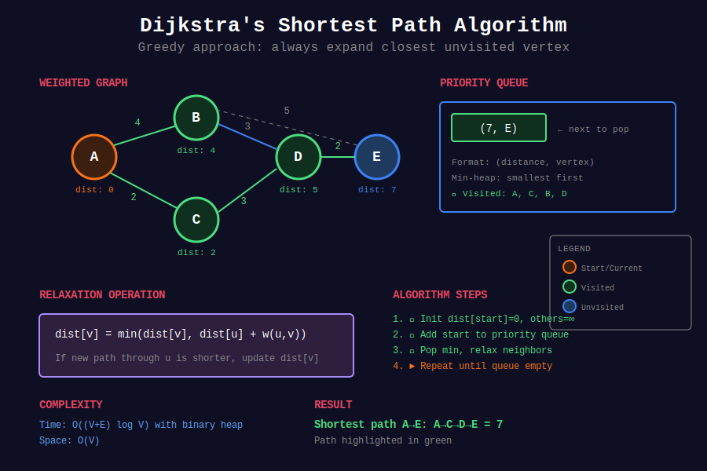

<div align="center">

# 🛤️ Advanced Shortest Path Algorithms

<p>
  
  
</p>

</div>

---

## 🧭 Navigation

| ⬅️ Previous | 📂 Current | ➡️ Next |
|:------------|:----------:|--------:|
| [← Graph Algorithms](../README.md) | **01. Shortest Path** | [02. MST →](../02_minimum_spanning_tree/README.md) |

---

## 🎨 Visual Overview

<div align="center">



</div>

---

## 📐 Mathematical Foundations

### 1️⃣ Algorithm Comparison

| Algorithm | Graph Type | Time | Space | Use Case |
|-----------|------------|:----:|:-----:|----------|
| BFS | Unweighted | O(V+E) | O(V) | Simple shortest path |
| Dijkstra | Non-negative | O((V+E) log V) | O(V) | GPS, network routing |
| Bellman-Ford | Any weights | O(VE) | O(V) | Negative edges, arbitrage |
| Floyd-Warshall | All pairs | O(V³) | O(V²) | Dense graphs, all pairs |
| A* | Heuristic | O(E) best | O(V) | Pathfinding with goal |
| SPFA | Any weights | O(VE) worst | O(V) | Sparse graphs |

---

### 2️⃣ Dijkstra's Algorithm

**Greedy approach:** Always expand the closest unvisited vertex.

**Relaxation Operation:**

```math
\text{dist}[v] = \min(\text{dist}[v], \text{dist}[u] + w(u,v))
```

**Correctness Proof:**
- When vertex $u$ is extracted from priority queue, $\text{dist}[u]$ is optimal
- No shorter path can exist (would require negative edge)

**Priority Queue Implementation:**

```math
T = O((V + E) \log V)
```

---

### 3️⃣ Bellman-Ford Algorithm

**Dynamic Programming:** Relax all edges $V-1$ times.

**Recurrence:**

```math
D^{(k)}[v] = \min_{(u,v) \in E}(D^{(k-1)}[u] + w(u,v))
```

**Meaning:** Shortest path to $v$ using at most $k$ edges.

**Negative Cycle Detection:**

If any edge can still be relaxed after $V-1$ iterations, negative cycle exists.

---

### 4️⃣ Floyd-Warshall Algorithm

**All-pairs shortest paths using DP:**

```math
D^{(k)}[i][j] = \min(D^{(k-1)}[i][j], D^{(k-1)}[i][k] + D^{(k-1)}[k][j])
```

**Meaning:** Shortest $i \to j$ using vertices $\{1, 2, \ldots, k\}$ as intermediates.

**Base case:**

```math
D^{(0)}[i][j] = \begin{cases} 
0 & \text{if } i = j \\
w(i,j) & \text{if } (i,j) \in E \\
\infty & \text{otherwise}
\end{cases}
```

---

### 5️⃣ A* Search Algorithm

**Heuristic-guided search:**

```math
f(n) = g(n) + h(n)
```

- $g(n)$: actual cost from start to $n$
- $h(n)$: heuristic estimate from $n$ to goal

**Admissible Heuristic:** $h(n) \leq h^*(n)$ (never overestimate)

**Consistent Heuristic:** $h(n) \leq c(n, n') + h(n')$ (triangle inequality)

---

### 6️⃣ 0-1 BFS

**For graphs with edge weights 0 or 1:**

- Weight 0 edges: add to **front** of deque
- Weight 1 edges: add to **back** of deque

```math
T = O(V + E), \quad S = O(V)
```

Faster than Dijkstra for this special case.

---

### 7️⃣ Shortest Path Faster Algorithm (SPFA)

**Optimization of Bellman-Ford:**

Only relax edges from vertices whose distance was updated in previous iteration.

**Average:** O(E)  
**Worst case:** O(VE) (same as Bellman-Ford)

---

## 💻 Code Implementations

```python
import heapq
from collections import deque, defaultdict
from typing import List, Dict, Tuple

def dijkstra(graph: Dict[int, List[Tuple[int, int]]], start: int) -> Dict[int, int]:
    """
    Dijkstra's algorithm for single-source shortest paths.
    
    Args:
        graph: adjacency list {u: [(v, weight), ...]}
        start: starting vertex
    
    Returns:
        Dictionary of shortest distances from start
    
    Time: O((V+E) log V), Space: O(V)
    """
    dist = {start: 0}
    pq = [(0, start)]  # (distance, vertex)
    
    while pq:
        d, u = heapq.heappop(pq)
        
        # Skip outdated entries
        if d > dist.get(u, float('inf')):
            continue
        
        for v, weight in graph.get(u, []):
            new_dist = d + weight
            if new_dist < dist.get(v, float('inf')):
                dist[v] = new_dist
                heapq.heappush(pq, (new_dist, v))
    
    return dist

def dijkstra_with_path(graph: Dict[int, List[Tuple[int, int]]], 
                       start: int, end: int) -> Tuple[int, List[int]]:
    """
    Dijkstra with path reconstruction.
    
    Returns: (distance, path)
    
    Time: O((V+E) log V), Space: O(V)
    """
    dist = {start: 0}
    parent = {start: None}
    pq = [(0, start)]
    
    while pq:
        d, u = heapq.heappop(pq)
        
        if u == end:
            break
        
        if d > dist.get(u, float('inf')):
            continue
        
        for v, weight in graph.get(u, []):
            new_dist = d + weight
            if new_dist < dist.get(v, float('inf')):
                dist[v] = new_dist
                parent[v] = u
                heapq.heappush(pq, (new_dist, v))
    
    # Reconstruct path
    if end not in dist:
        return float('inf'), []
    
    path = []
    current = end
    while current is not None:
        path.append(current)
        current = parent[current]
    path.reverse()
    
    return dist[end], path

def bellman_ford(n: int, edges: List[Tuple[int, int, int]], 
                 start: int) -> Tuple[List[int], bool]:
    """
    Bellman-Ford algorithm with negative cycle detection.
    
    Args:
        n: number of vertices (0 to n-1)
        edges: list of (u, v, weight)
        start: starting vertex
    
    Returns:
        (distances, has_negative_cycle)
    
    Time: O(VE), Space: O(V)
    """
    dist = [float('inf')] * n
    dist[start] = 0
    
    # Relax all edges V-1 times
    for _ in range(n - 1):
        for u, v, w in edges:
            if dist[u] != float('inf') and dist[u] + w < dist[v]:
                dist[v] = dist[u] + w
    
    # Check for negative cycle
    has_negative_cycle = False
    for u, v, w in edges:
        if dist[u] != float('inf') and dist[u] + w < dist[v]:
            has_negative_cycle = True
            break
    
    return dist, has_negative_cycle

def floyd_warshall(n: int, edges: List[Tuple[int, int, int]]) -> List[List[int]]:
    """
    Floyd-Warshall for all-pairs shortest paths.
    
    Args:
        n: number of vertices (0 to n-1)
        edges: list of (u, v, weight)
    
    Returns:
        2D array of shortest distances
    
    Time: O(V³), Space: O(V²)
    """
    INF = float('inf')
    dist = [[INF] * n for _ in range(n)]
    
    # Initialize
    for i in range(n):
        dist[i][i] = 0
    
    for u, v, w in edges:
        dist[u][v] = min(dist[u][v], w)
    
    # DP: try using each vertex as intermediate
    for k in range(n):
        for i in range(n):
            for j in range(n):
                if dist[i][k] != INF and dist[k][j] != INF:
                    dist[i][j] = min(dist[i][j], dist[i][k] + dist[k][j])
    
    return dist

def spfa(n: int, edges: List[Tuple[int, int, int]], start: int) -> List[int]:
    """
    Shortest Path Faster Algorithm (SPFA).
    
    Optimized Bellman-Ford using queue.
    
    Time: O(VE) worst, O(E) average
    Space: O(V)
    """
    graph = defaultdict(list)
    for u, v, w in edges:
        graph[u].append((v, w))
    
    dist = [float('inf')] * n
    dist[start] = 0
    in_queue = [False] * n
    queue = deque([start])
    in_queue[start] = True
    
    while queue:
        u = queue.popleft()
        in_queue[u] = False
        
        for v, w in graph[u]:
            if dist[u] + w < dist[v]:
                dist[v] = dist[u] + w
                if not in_queue[v]:
                    queue.append(v)
                    in_queue[v] = True
    
    return dist

def zero_one_bfs(graph: Dict[int, List[Tuple[int, int]]], 
                 start: int, n: int) -> List[int]:
    """
    0-1 BFS for graphs with edge weights 0 or 1.
    
    Uses deque: weight 0 → front, weight 1 → back
    
    Time: O(V+E), Space: O(V)
    """
    dist = [float('inf')] * n
    dist[start] = 0
    dq = deque([start])
    
    while dq:
        u = dq.popleft()
        
        for v, weight in graph.get(u, []):
            new_dist = dist[u] + weight
            if new_dist < dist[v]:
                dist[v] = new_dist
                if weight == 0:
                    dq.appendleft(v)  # Weight 0: front
                else:
                    dq.append(v)      # Weight 1: back
    
    return dist

# ============= LeetCode Problems =============

def networkDelayTime(times: List[List[int]], n: int, k: int) -> int:
    """
    LeetCode 743: Network Delay Time
    
    Find time for signal to reach all nodes from k.
    
    Time: O(E log V), Space: O(V+E)
    """
    graph = defaultdict(list)
    for u, v, w in times:
        graph[u].append((v, w))
    
    dist = dijkstra(graph, k)
    
    if len(dist) != n:
        return -1
    return max(dist.values())

def findCheapestPrice(n: int, flights: List[List[int]], 
                     src: int, dst: int, k: int) -> int:
    """
    LeetCode 787: Cheapest Flights Within K Stops
    
    Modified Bellman-Ford with K+1 iterations.
    
    Time: O(K·E), Space: O(V)
    """
    dist = [float('inf')] * n
    dist[src] = 0
    
    # Relax K+1 times (K stops = K+1 edges)
    for _ in range(k + 1):
        temp = dist.copy()
        for u, v, price in flights:
            if dist[u] != float('inf'):
                temp[v] = min(temp[v], dist[u] + price)
        dist = temp
    
    return dist[dst] if dist[dst] != float('inf') else -1

def swimInWater(grid: List[List[int]]) -> int:
    """
    LeetCode 778: Swim in Rising Water
    
    Modified Dijkstra: minimize maximum elevation on path.
    
    Time: O(n² log n), Space: O(n²)
    """
    n = len(grid)
    pq = [(grid[0][0], 0, 0)]  # (max_time, row, col)
    visited = set()
    
    while pq:
        time, r, c = heapq.heappop(pq)
        
        if (r, c) in visited:
            continue
        visited.add((r, c))
        
        if r == n - 1 and c == n - 1:
            return time
        
        for dr, dc in [(0, 1), (0, -1), (1, 0), (-1, 0)]:
            nr, nc = r + dr, c + dc
            if 0 <= nr < n and 0 <= nc < n and (nr, nc) not in visited:
                heapq.heappush(pq, (max(time, grid[nr][nc]), nr, nc))
    
    return -1

def minCostConnectPoints(points: List[List[int]]) -> int:
    """
    LeetCode 1584: Min Cost to Connect All Points
    
    Can use Dijkstra treating it as shortest path problem.
    (Also solvable with MST - Prim's algorithm)
    
    Time: O(n² log n), Space: O(n²)
    """
    n = len(points)
    
    def manhattan(i, j):
        return abs(points[i][0] - points[j][0]) + abs(points[i][1] - points[j][1])
    
    # Build complete graph
    graph = defaultdict(list)
    for i in range(n):
        for j in range(i + 1, n):
            dist = manhattan(i, j)
            graph[i].append((j, dist))
            graph[j].append((i, dist))
    
    # Prim's algorithm (similar to Dijkstra)
    visited = set([0])
    pq = [(dist, neighbor) for neighbor, dist in graph[0]]
    heapq.heapify(pq)
    total_cost = 0
    
    while len(visited) < n:
        cost, u = heapq.heappop(pq)
        if u in visited:
            continue
        
        visited.add(u)
        total_cost += cost
        
        for v, dist in graph[u]:
            if v not in visited:
                heapq.heappush(pq, (dist, v))
    
    return total_cost

def minimumEffortPath(heights: List[List[int]]) -> int:
    """
    LeetCode 1631: Path with Minimum Effort
    
    Modified Dijkstra: minimize maximum absolute difference.
    
    Time: O(mn log(mn)), Space: O(mn)
    """
    m, n = len(heights), len(heights[0])
    pq = [(0, 0, 0)]  # (effort, row, col)
    efforts = [[float('inf')] * n for _ in range(m)]
    efforts[0][0] = 0
    
    while pq:
        effort, r, c = heapq.heappop(pq)
        
        if r == m - 1 and c == n - 1:
            return effort
        
        if effort > efforts[r][c]:
            continue
        
        for dr, dc in [(0, 1), (0, -1), (1, 0), (-1, 0)]:
            nr, nc = r + dr, c + dc
            if 0 <= nr < m and 0 <= nc < n:
                new_effort = max(effort, abs(heights[nr][nc] - heights[r][c]))
                if new_effort < efforts[nr][nc]:
                    efforts[nr][nc] = new_effort
                    heapq.heappush(pq, (new_effort, nr, nc))
    
    return 0
```

---

## 🏆 LeetCode Problems

### 🟡 Medium

| # | Problem | Pattern | Time | Space |
|:-:|---------|---------|:----:|:-----:|
| 743 | [Network Delay Time](https://leetcode.com/problems/network-delay-time/) | Dijkstra | O(E log V) | O(V) |
| 787 | [Cheapest Flights Within K Stops](https://leetcode.com/problems/cheapest-flights-within-k-stops/) | Bellman-Ford | O(K·E) | O(V) |
| 1091 | [Shortest Path in Binary Matrix](https://leetcode.com/problems/shortest-path-in-binary-matrix/) | BFS | O(n²) | O(n²) |
| 1129 | [Shortest Path with Alternating Colors](https://leetcode.com/problems/shortest-path-with-alternating-colors/) | BFS | O(V+E) | O(V) |
| 1514 | [Path with Maximum Probability](https://leetcode.com/problems/path-with-maximum-probability/) | Modified Dijkstra | O(E log V) | O(V) |
| 1631 | [Path with Minimum Effort](https://leetcode.com/problems/path-with-minimum-effort/) | Dijkstra | O(mn log(mn)) | O(mn) |

### 🔴 Hard

| # | Problem | Pattern | Time | Space |
|:-:|---------|---------|:----:|:-----:|
| 778 | [Swim in Rising Water](https://leetcode.com/problems/swim-in-rising-water/) | Modified Dijkstra | O(n² log n) | O(n²) |
| 847 | [Shortest Path Visiting All Nodes](https://leetcode.com/problems/shortest-path-visiting-all-nodes/) | BFS + Bitmask | O(2ⁿ·n²) | O(2ⁿ·n) |
| 882 | [Reachable Nodes In Subdivided Graph](https://leetcode.com/problems/reachable-nodes-in-subdivided-graph/) | Dijkstra | O(E log V) | O(V) |

---

## 📊 Algorithm Selection Guide

```
Shortest Path Problem
     |
     +-- Unweighted graph? → BFS O(V+E)
     |
     +-- Non-negative weights?
     |   +-- Single source → Dijkstra O((V+E) log V)
     |   +-- All pairs (small graph) → Run Dijkstra V times
     |
     +-- Edge weights 0 or 1? → 0-1 BFS O(V+E)
     |
     +-- May have negative weights?
     |   +-- Single source → Bellman-Ford O(VE)
     |   +-- Sparse graph → SPFA O(E) average
     |   +-- All pairs → Floyd-Warshall O(V³)
     |
     +-- Known goal with heuristic? → A* Search
```

---

## 🎯 Key Insights

1. **Dijkstra requires non-negative weights** - use Bellman-Ford otherwise
2. **0-1 BFS is faster than Dijkstra** for binary weights
3. **Floyd-Warshall** good for dense graphs and all-pairs queries
4. **SPFA** often faster than Bellman-Ford in practice
5. **A*** optimal when good heuristic available

---

## 📚 References

| Resource | Link |
|----------|------|
| **Dijkstra's Algorithm** | [Wikipedia](https://en.wikipedia.org/wiki/Dijkstra%27s_algorithm) |
| **Bellman-Ford** | [Wikipedia](https://en.wikipedia.org/wiki/Bellman%E2%80%93Ford_algorithm) |
| **Floyd-Warshall** | [Wikipedia](https://en.wikipedia.org/wiki/Floyd%E2%80%93Warshall_algorithm) |
| **A* Search** | [Wikipedia](https://en.wikipedia.org/wiki/A*_search_algorithm) |

---

<div align="center">

**Made with ❤️ by [Gaurav Goswami](https://github.com/Gaurav14cs17)**

</div>

---

## 🧭 Navigation

| ⬅️ Previous | 📂 Current | ➡️ Next |
|:------------|:----------:|--------:|
| [← Graph Algorithms](../README.md) | **01. Shortest Path** | [02. MST →](../02_minimum_spanning_tree/README.md) |

