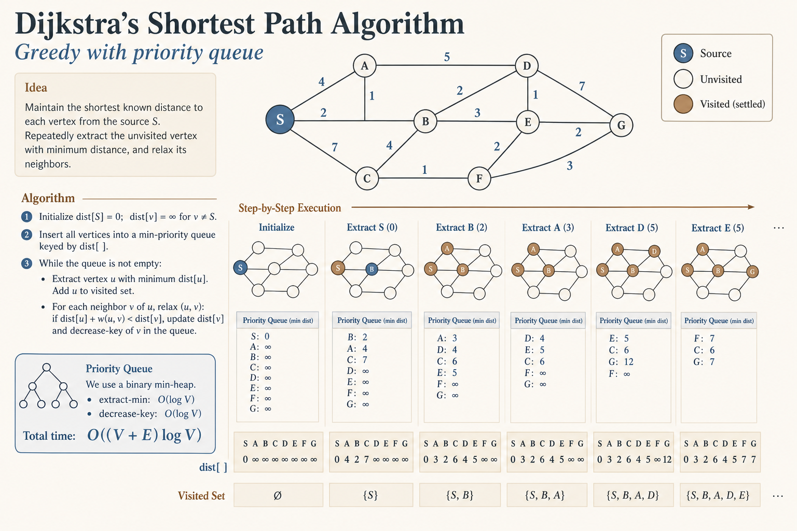
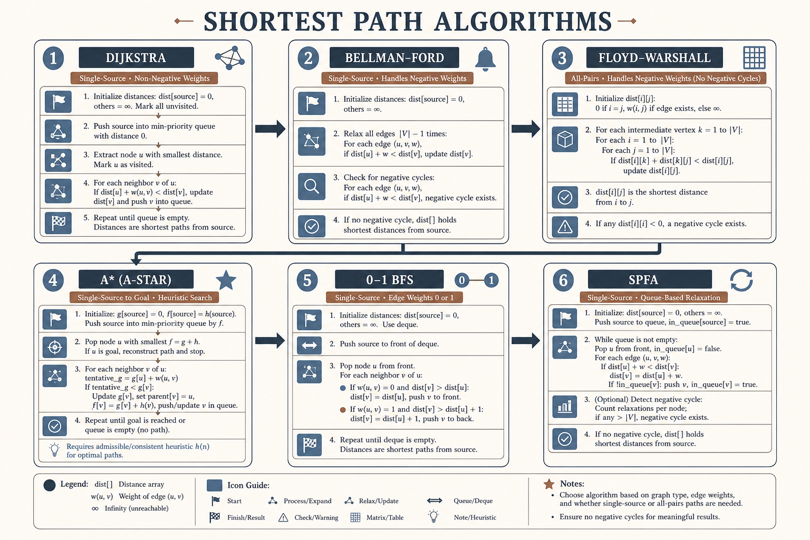
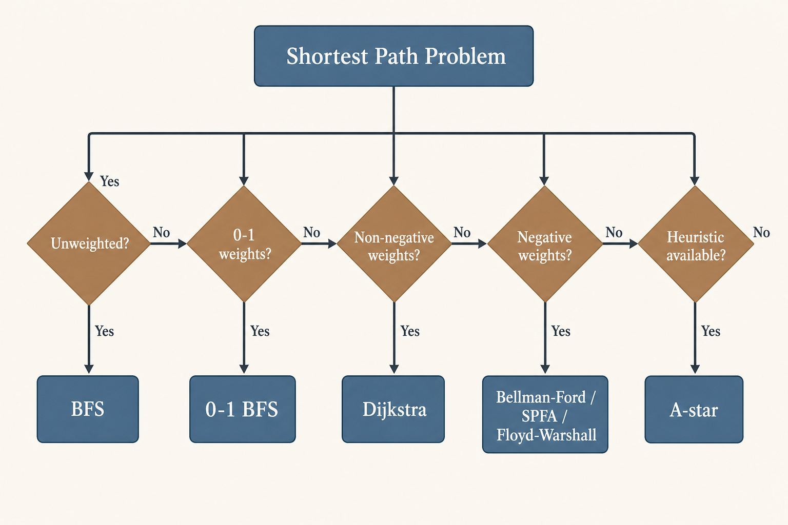

# 🛤️ Advanced Shortest Path Algorithms

### *🛤️ Advanced Shortest Path Algorithms*

  
  

---

## 📊 Visual Overview

---

## 🎯 At a Glance

| | |
|:---|:---|
| **Topic** | 🛤️ Advanced Shortest Path Algorithms |
| **Difficulty** | Medium to Hard |
| **Problems** | 12+ |

{: .highlight }
> **How to use this page:** Start with the visual overview, scan **At a Glance**, then work through theory → walkthroughs → code.

---

## 🧭 Navigation

| ⬅️ Previous | 📂 Current | ➡️ Next |
|:------------|:----------:|--------:|
| [← Graph Algorithms](../README.md) | **01. Shortest Path** | [02. MST →](../02_minimum_spanning_tree/README.md) |

---

## 📐 Mathematical Foundation
### 1️⃣ Algorithm Comparison

| Algorithm | Graph Type | Time | Space | Use Case |
|-----------|------------|:----:|:-----:|----------|
| BFS | Unweighted | O(V+E) | O(V) | Simple shortest path |
| Dijkstra | Non-negative | O((V+E) log V) | O(V) | GPS, network routing |
| Bellman-Ford | Any weights | O(VE) | O(V) | Negative edges, arbitrage |
| Floyd-Warshall | All pairs | O(V³) | O(V²) | Dense graphs, all pairs |
| A* | Heuristic | O(E) best | O(V) | Pathfinding with goal |
| SPFA | Any weights | O(VE) worst | O(V) | Sparse graphs |

---

### 2️⃣ Dijkstra's Algorithm

**Greedy approach:** Always expand the closest unvisited vertex.

**Relaxation Operation:**

$$\text{dist}[v] = \min(\text{dist}[v], \text{dist}[u] + w(u,v))$$

**Correctness Proof:**

- When vertex $u$ is extracted from priority queue, $\text{dist}[u]$ is optimal

- No shorter path can exist (would require negative edge)

**Priority Queue Implementation:**

$$T = O((V + E) \log V)$$

---

### 3️⃣ Bellman-Ford Algorithm

**Dynamic Programming:** Relax all edges $V-1$ times.

**Recurrence:**

$$D^{(k)}[v] = \min_{(u,v) \in E}(D^{(k-1)}[u] + w(u,v))$$

**Meaning:** Shortest path to $v$ using at most $k$ edges.

**Negative Cycle Detection:**

If any edge can still be relaxed after $V-1$ iterations, negative cycle exists.

---

### 4️⃣ Floyd-Warshall Algorithm

**All-pairs shortest paths using DP:**

$$D^{(k)}[i][j] = \min(D^{(k-1)}[i][j], D^{(k-1)}[i][k] + D^{(k-1)}[k][j])$$

**Meaning:** Shortest $i \to j$ using vertices $\{1, 2, \ldots, k\}$ as intermediates.

**Base case:**

$$D^{(0)}[i][j] = \begin{cases} 
0 & \text{if } i = j \\
w(i,j) & \text{if } (i,j) \in E \\
\infty & \text{otherwise}
\end{cases}$$

---

### 5️⃣ A* Search Algorithm

**Heuristic-guided search:**

$$f(n) = g(n) + h(n)$$

- $g(n)$: actual cost from start to $n$

- $h(n)$: heuristic estimate from $n$ to goal

**Admissible Heuristic:** $h(n) \leq h^*(n)$ (never overestimate)

**Consistent Heuristic:** $h(n) \leq c(n, n') + h(n')$ (triangle inequality)

---

### 6️⃣ 0-1 BFS

**For graphs with edge weights 0 or 1:**

- Weight 0 edges: add to **front** of deque

- Weight 1 edges: add to **back** of deque

$$T = O(V + E), \quad S = O(V)$$

Faster than Dijkstra for this special case.

---

### 7️⃣ Shortest Path Faster Algorithm (SPFA)

**Optimization of Bellman-Ford:**

Only relax edges from vertices whose distance was updated in previous iteration.

**Average:** O(E)  
**Worst case:** O(VE) (same as Bellman-Ford)

---

## 💻 Code Implementations

---

## 🏆 LeetCode Problems

### 🟡 Medium

| # | Problem | Pattern | Time | Space |
|:-:|---------|---------|:----:|:-----:|
| 743 | [Network Delay Time](https://leetcode.com/problems/network-delay-time/) | Dijkstra | O(E log V) | O(V) |
| 787 | [Cheapest Flights Within K Stops](https://leetcode.com/problems/cheapest-flights-within-k-stops/) | Bellman-Ford | O(K·E) | O(V) |
| 1091 | [Shortest Path in Binary Matrix](https://leetcode.com/problems/shortest-path-in-binary-matrix/) | BFS | O(n²) | O(n²) |
| 1129 | [Shortest Path with Alternating Colors](https://leetcode.com/problems/shortest-path-with-alternating-colors/) | BFS | O(V+E) | O(V) |
| 1514 | [Path with Maximum Probability](https://leetcode.com/problems/path-with-maximum-probability/) | Modified Dijkstra | O(E log V) | O(V) |
| 1631 | [Path with Minimum Effort](https://leetcode.com/problems/path-with-minimum-effort/) | Dijkstra | O(mn log(mn)) | O(mn) |

### 🔴 Hard

| # | Problem | Pattern | Time | Space |
|:-:|---------|---------|:----:|:-----:|
| 778 | [Swim in Rising Water](https://leetcode.com/problems/swim-in-rising-water/) | Modified Dijkstra | O(n² log n) | O(n²) |
| 847 | [Shortest Path Visiting All Nodes](https://leetcode.com/problems/shortest-path-visiting-all-nodes/) | BFS + Bitmask | O(2ⁿ·n²) | O(2ⁿ·n) |
| 882 | [Reachable Nodes In Subdivided Graph](https://leetcode.com/problems/reachable-nodes-in-subdivided-graph/) | Dijkstra | O(E log V) | O(V) |

---

## 📊 Algorithm Selection Guide

---

## 🎯 Key Insights

1. **Dijkstra requires non-negative weights** - use Bellman-Ford otherwise

2. **0-1 BFS is faster than Dijkstra** for binary weights

3. **Floyd-Warshall** good for dense graphs and all-pairs queries

4. **SPFA** often faster than Bellman-Ford in practice

5. **A*** optimal when good heuristic available

---

## 📚 References

| Resource | Link |
|----------|------|
| **Dijkstra's Algorithm** | [Wikipedia](https://en.wikipedia.org/wiki/Dijkstra%27s_algorithm) |
| **Bellman-Ford** | [Wikipedia](https://en.wikipedia.org/wiki/Bellman%E2%80%93Ford_algorithm) |
| **Floyd-Warshall** | [Wikipedia](https://en.wikipedia.org/wiki/Floyd%E2%80%93Warshall_algorithm) |
| **A* Search** | [Wikipedia](https://en.wikipedia.org/wiki/A*_search_algorithm) |

---

**Made with ❤️ by [Gaurav Goswami](https://github.com/Gaurav14cs17)**

---
