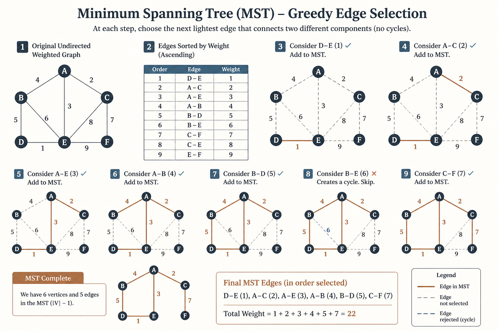
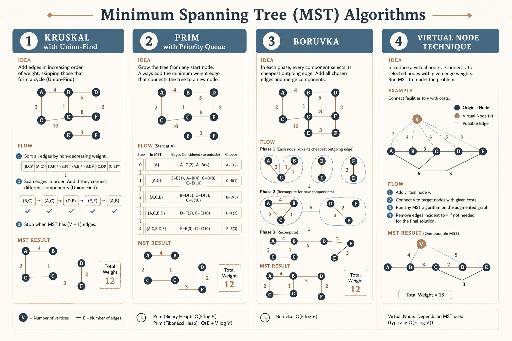
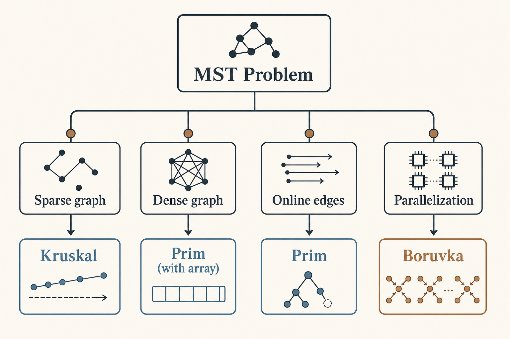

# 🌳 Minimum Spanning Tree (MST)

### *🌳 Minimum Spanning Tree (MST)*

  
  

---

## 📊 Visual Overview

---

## 🎯 At a Glance

| | |
|:---|:---|
| **Topic** | 🌳 Minimum Spanning Tree (MST) |
| **Difficulty** | Medium |
| **Problems** | 8+ |

{: .highlight }
> **How to use this page:** Start with the visual overview, scan **At a Glance**, then work through theory → walkthroughs → code.

---

## 🧭 Navigation

| ⬅️ Previous | 📂 Current | ➡️ Next |
|:------------|:----------:|--------:|
| [← 01. Shortest Path](../01_shortest_path/README.md) | **02. MST** | [03. Topological Sort →](../03_topological_sort/README.md) |

---

## 📐 Mathematical Foundation
### 1️⃣ MST Definition

**Spanning Tree:** Connected acyclic subgraph containing all vertices.

**Minimum Spanning Tree:** Spanning tree with minimum total edge weight.

$$\text{MST}(G) = \arg\min_{T \text{ spanning}} \sum_{e \in T} w(e)$$

**Properties:**

- Has exactly $V - 1$ edges

- Unique if all edge weights distinct

- May have multiple MSTs if edge weights repeat

---

### 2️⃣ Cut Property

**Cut:** Partition of vertices into two sets $(S, V \setminus S)$.

**Cut edges:** Edges with one endpoint in $S$, other in $V \setminus S$.

**Cut Property:** Minimum weight edge crossing any cut is in some MST.

This property proves correctness of both Kruskal's and Prim's.

---

### 3️⃣ Cycle Property

**Cycle Property:** Maximum weight edge in any cycle is NOT in any MST.

**Proof:** Removing it and adding lighter edge from cut creates lighter spanning tree.

---

### 4️⃣ Kruskal's Algorithm

**Greedy approach:** Sort edges, add if doesn't create cycle.

**Algorithm:**

1. Sort all edges by weight

2. Initialize Union-Find

3. For each edge $(u, v, w)$ in sorted order:
   - If $\text{find}(u) \neq \text{find}(v)$: add edge, union sets

**Time Complexity:**

$$T = O(E \log E) = O(E \log V)$$

- Sorting: $O(E \log E)$

- Union-Find operations: $O(E \cdot \alpha(V)) \approx O(E)$

---

### 5️⃣ Prim's Algorithm

**Greedy approach:** Grow tree from arbitrary vertex.

**Algorithm:**

1. Start with arbitrary vertex

2. Repeatedly add minimum weight edge connecting tree to non-tree vertex

**Time Complexity:**

| Implementation | Time |
|----------------|:----:|
| Array | O(V²) |
| Binary Heap | O(E log V) |
| Fibonacci Heap | O(E + V log V) |

---

### 6️⃣ Borůvka's Algorithm

**Parallel-friendly MST algorithm.**

**Algorithm:**

1. Each vertex is a component

2. Find cheapest edge from each component

3. Add all these edges (merge components)

4. Repeat until one component

**Time:** $O(E \log V)$

**Advantage:** Can be parallelized efficiently.

---

### 7️⃣ When to Use Which?

| Scenario | Algorithm | Reason |
|----------|-----------|--------|
| **Dense graph** | Prim's with array | O(V²) better than O(E log V) |
| **Sparse graph** | Kruskal's | Fewer edges to sort |
| **Online edges** | Prim's | Don't need all edges upfront |
| **Parallel** | Borůvka's | Parallelizable steps |

---

## 💻 Code Implementations

---

## 🏆 LeetCode Problems

### 🟡 Medium

| # | Problem | Algorithm | Time | Space |
|:-:|---------|-----------|:----:|:-----:|
| 1135 | [Connecting Cities With Minimum Cost](https://leetcode.com/problems/connecting-cities-with-minimum-cost/) | Kruskal's | O(E log E) | O(V) |
| 1168 | [Optimize Water Distribution](https://leetcode.com/problems/optimize-water-distribution-in-a-village/) | MST with virtual node | O(E log E) | O(V) |
| 1584 | [Min Cost to Connect All Points](https://leetcode.com/problems/min-cost-to-connect-all-points/) | Prim's | O(n² log n) | O(n²) |

### 🔴 Hard

| # | Problem | Algorithm | Time | Space |
|:-:|---------|-----------|:----:|:-----:|
| 1489 | [Critical and Pseudo-Critical Edges](https://leetcode.com/problems/find-critical-and-pseudo-critical-edges-in-minimum-spanning-tree/) | Multiple MSTs | O(E²·α(V)) | O(E) |
| 1579 | [Remove Max Edges Keep Traversable](https://leetcode.com/problems/remove-max-number-of-edges-to-keep-graph-fully-traversable/) | Two MSTs | O(E·α(V)) | O(V) |

---

## 📊 Algorithm Comparison

---

## 🎯 Key Insights

1. **MST is unique** if all edge weights are distinct

2. **Both Kruskal's and Prim's** are greedy and optimal

3. **Union-Find** essential for Kruskal's efficiency

4. **Prim's with heap** better for dense graphs when using array

5. **Cut property** proves correctness of both algorithms

---

## 📚 References

| Resource | Link |
|----------|------|
| **Kruskal's Algorithm** | [Wikipedia](https://en.wikipedia.org/wiki/Kruskal%27s_algorithm) |
| **Prim's Algorithm** | [Wikipedia](https://en.wikipedia.org/wiki/Prim%27s_algorithm) |
| **MST Algorithms** | [GeeksforGeeks](https://www.geeksforgeeks.org/minimum-spanning-tree/) |

---

**Made with ❤️ by [Gaurav Goswami](https://github.com/Gaurav14cs17)**

---
