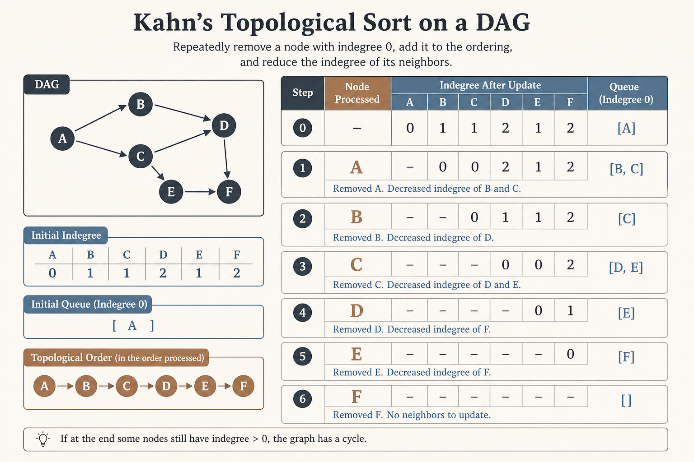
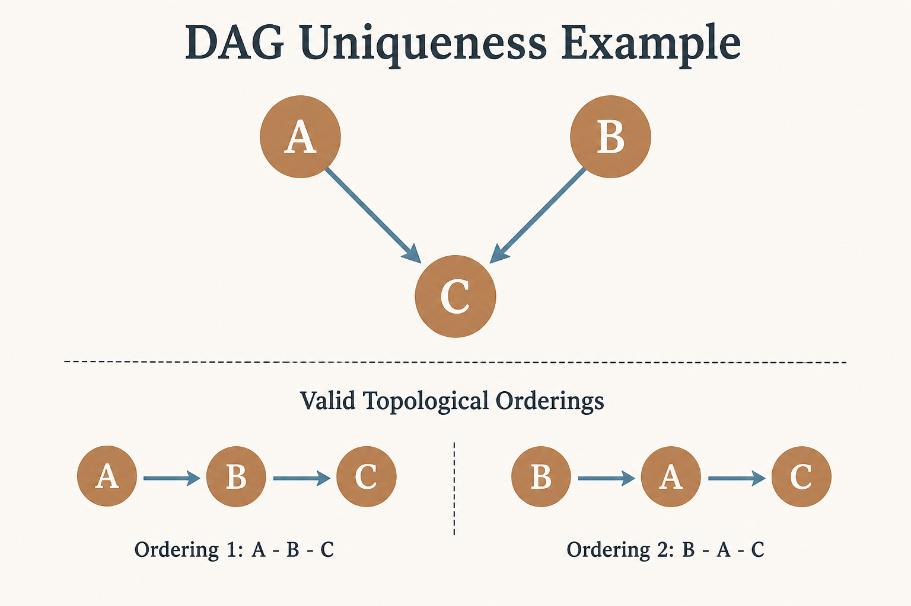
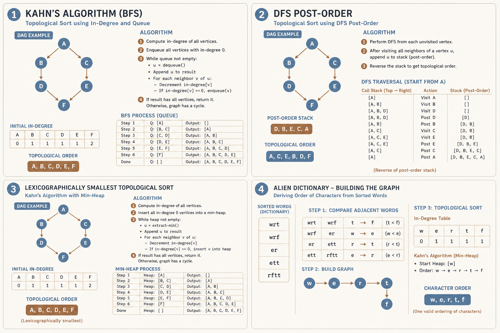
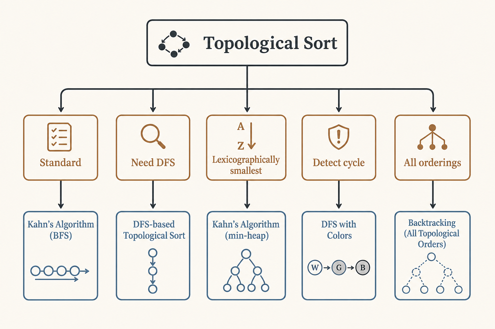

# 📋 Topological Sort

### *📋 Topological Sort*

  
  

---

## 📊 Visual Overview

---

## 🎯 At a Glance

| | |
|:---|:---|
| **Topic** | 📋 Topological Sort |
| **Difficulty** | Medium |
| **Problems** | 10+ |

{: .highlight }
> **How to use this page:** Start with the visual overview, scan **At a Glance**, then work through theory → walkthroughs → code.

---

## 🧭 Navigation

| ⬅️ Previous | 📂 Current | ➡️ Next |
|:------------|:----------:|--------:|
| [← 02. MST](../02_minimum_spanning_tree/README.md) | **03. Topological Sort** | [04. Network Flow →](../04_network_flow/README.md) |

---

## 📐 Mathematical Foundation
### 1️⃣ Definition

**Topological ordering** of DAG $G = (V, E)$:

$$\text{Linear ordering } v_1, v_2, \ldots, v_n \text{ where } (v_i, v_j) \in E \Rightarrow i < j$$

**Key property:** Every directed edge goes from earlier to later in the ordering.

**Existence:** Topological sort exists **if and only if** graph is a **DAG** (Directed Acyclic Graph).

---

### 2️⃣ Uniqueness

**Multiple orderings** may exist for same DAG.

**Example:**

Valid orderings: `[A, B, C]`, `[B, A, C]`

**Unique ordering** exists iff there's a Hamiltonian path.

---

### 3️⃣ Kahn's Algorithm (BFS-based)

**Intuition:** Process vertices with no incoming edges first.

**Algorithm:**

1. Compute in-degree for all vertices

2. Add all vertices with in-degree 0 to queue

3. While queue not empty:
   - Remove vertex $u$, add to result
   - Decrease in-degree of all neighbors
   - If neighbor's in-degree becomes 0, add to queue

**Time:** $O(V + E)$  
**Space:** $O(V)$

**Cycle Detection:** If result has fewer than $V$ vertices, cycle exists.

---

### 4️⃣ DFS-based Topological Sort

**Post-order DFS:** Vertex added to result after all descendants processed.

**Topological order = Reverse of finish order**

$$\text{topo order} = \text{reverse}(\text{post order})$$

**Proof:** If $(u, v) \in E$, then $\text{finish}[u] > \text{finish}[v]$ in DFS.

**States:**

- **White (0):** Unvisited

- **Gray (1):** Visiting (in current DFS path)

- **Black (2):** Visited (finished)

**Cycle Detection:** If we reach a **gray** vertex, cycle exists.

---

### 5️⃣ Applications

| Application | Description |
|-------------|-------------|
| **Course Prerequisites** | Schedule courses respecting prerequisites |
| **Build Systems** | Compile dependencies in order |
| **Task Scheduling** | Execute tasks with dependencies |
| **Deadlock Detection** | Find circular dependencies |
| **Spreadsheet Formulas** | Evaluate cells in dependency order |

---

### 6️⃣ Lexicographically Smallest Topological Sort

Use **min-heap** instead of queue in Kahn's algorithm.

**Time:** $O(V \log V + E)$

Always pick the smallest available vertex.

---

### 7️⃣ All Topological Sorts

**Backtracking approach:**

- Try each vertex with in-degree 0
- Recursively generate orderings

**Time:** $O(V! \times E)$ in worst case (exponential)

---

## 💻 Code Implementations

---

## 🏆 LeetCode Problems

### 🟡 Medium

| # | Problem | Pattern | Time | Space |
|:-:|---------|---------|:----:|:-----:|
| 207 | [Course Schedule](https://leetcode.com/problems/course-schedule/) | Kahn's Algorithm | O(V+E) | O(V+E) |
| 210 | [Course Schedule II](https://leetcode.com/problems/course-schedule-ii/) | Topological Sort | O(V+E) | O(V+E) |
| 310 | [Minimum Height Trees](https://leetcode.com/problems/minimum-height-trees/) | Leaf Removal | O(V) | O(V) |
| 444 | [Sequence Reconstruction](https://leetcode.com/problems/sequence-reconstruction/) | Unique Topo Sort | O(V+E) | O(V+E) |
| 802 | [Find Eventual Safe States](https://leetcode.com/problems/find-eventual-safe-states/) | Reverse Topological | O(V+E) | O(V) |
| 1136 | [Parallel Courses](https://leetcode.com/problems/parallel-courses/) | Level-wise Topo | O(V+E) | O(V+E) |

### 🔴 Hard

| # | Problem | Pattern | Time | Space |
|:-:|---------|---------|:----:|:-----:|
| 269 | [Alien Dictionary](https://leetcode.com/problems/alien-dictionary/) | Build Graph + Topo | O(C) | O(1) |
| 1203 | [Sort Items by Groups](https://leetcode.com/problems/sort-items-by-groups-respecting-dependencies/) | Two-level Topo | O(V+E) | O(V+E) |
| 1591 | [Strange Printer II](https://leetcode.com/problems/strange-printer-ii/) | Topological Sort | O(mnc) | O(c²) |

---

## 📊 Algorithm Selection

---

## 🎯 Key Insights

1. **Topological sort exists iff DAG** (no cycles)

2. **Kahn's algorithm** natural for level-by-level processing

3. **DFS approach** simpler code, post-order reversed

4. **Cycle detection** built into both algorithms

5. **Many applications** in scheduling and dependency resolution

---

## 📚 References

| Resource | Link |
|----------|------|
| **Topological Sort** | [Wikipedia](https://en.wikipedia.org/wiki/Topological_sorting) |
| **Kahn's Algorithm** | [GeeksforGeeks](https://www.geeksforgeeks.org/topological-sorting-indegree-based-solution/) |
| **DAG** | [Wikipedia](https://en.wikipedia.org/wiki/Directed_acyclic_graph) |

---

**Made with ❤️ by [Gaurav Goswami](https://github.com/Gaurav14cs17)**

---
