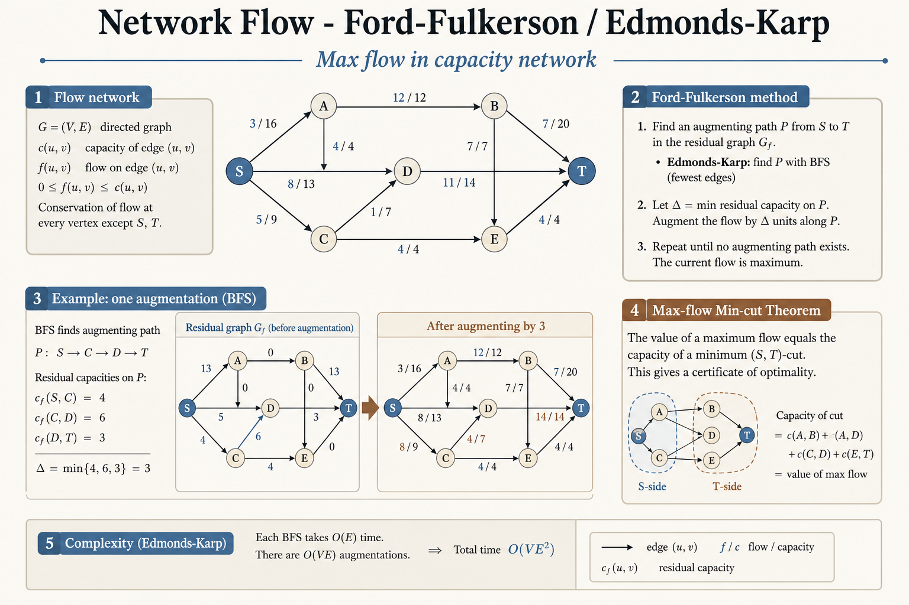
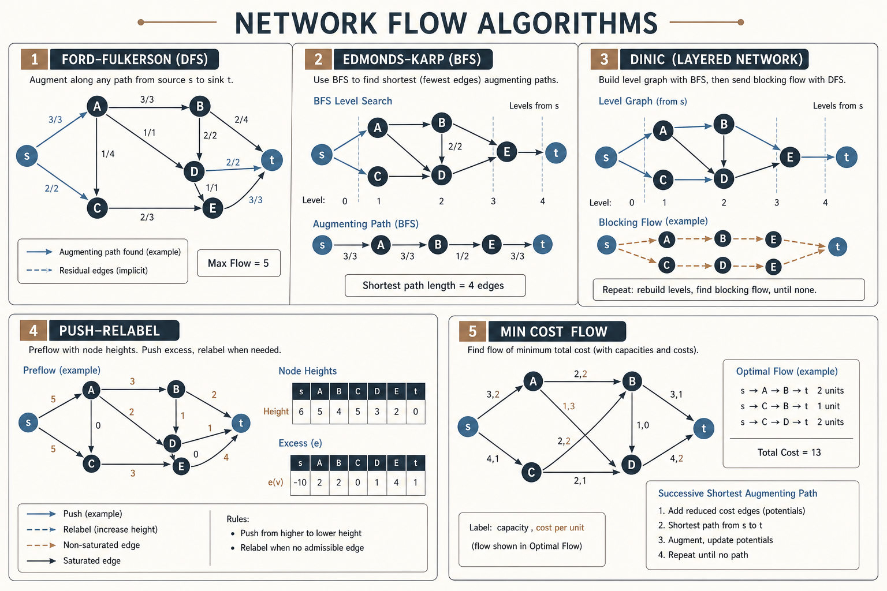
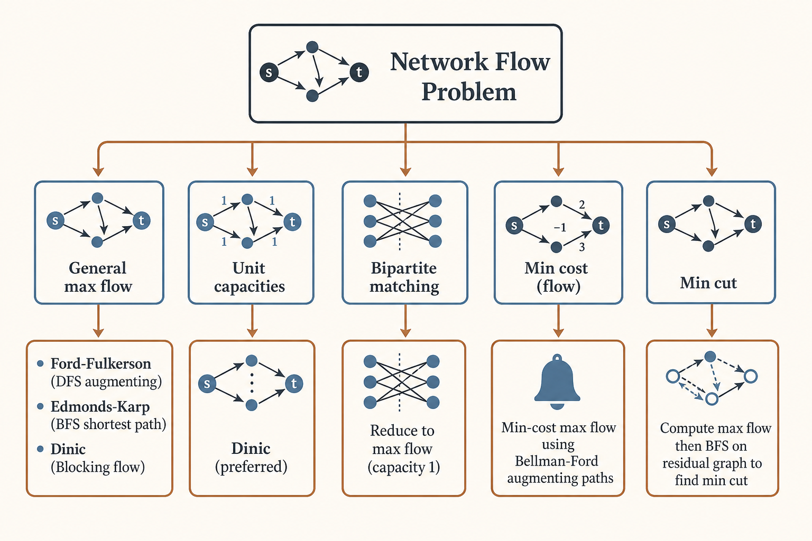

# 🌊 Network Flow Algorithms

### *🌊 Network Flow Algorithms*

  
  

---

## 📊 Visual Overview

---

## 🎯 At a Glance

| | |
|:---|:---|
| **Topic** | 🌊 Network Flow Algorithms |
| **Difficulty** | Hard |
| **Problems** | 10+ |

{: .highlight }
> **How to use this page:** Start with the visual overview, scan **At a Glance**, then work through theory → walkthroughs → code.

---

## 🧭 Navigation

| ⬅️ Previous | 📂 Current | ➡️ Next |
|:------------|:----------:|--------:|
| [← 03. Topological Sort](../03_topological_sort/README.md) | **04. Network Flow** | [🏠 Home](../README.md) |

---

## 📐 Mathematical Foundation
### 1️⃣ Flow Network

**Flow network** $G = (V, E)$ with:

- Source $s \in V$

- Sink $t \in V$

- Capacity function $c: E \rightarrow \mathbb{R}^+$

**Flow** $f: E \rightarrow \mathbb{R}$ satisfies:

**Capacity constraint:**

$$0 \leq f(u, v) \leq c(u, v) \quad \forall (u,v) \in E$$

**Flow conservation:**

$$\sum_{v:(u,v) \in E} f(u,v) = \sum_{v:(v,u) \in E} f(v,u) \quad \forall u \in V \setminus \{s,t\}$$

---

### 2️⃣ Maximum Flow Problem

**Goal:** Maximize $|f| = \sum_{v:(s,v) \in E} f(s,v)$

**Ford-Fulkerson Method:** Augment flow along paths until no augmenting path exists.

---

### 3️⃣ Residual Graph

**Residual capacity:**

$$c_f(u,v) = \begin{cases}
c(u,v) - f(u,v) & \text{if } (u,v) \in E \\
f(v,u) & \text{if } (v,u) \in E \\
0 & \text{otherwise}
\end{cases}$$

**Augmenting path:** Path from $s$ to $t$ in residual graph with positive capacity.

---

### 4️⃣ Max-Flow Min-Cut Theorem

**Cut** $(S, T)$: Partition of $V$ with $s \in S$, $t \in T$.

**Capacity of cut:**

$$c(S, T) = \sum_{u \in S, v \in T, (u,v) \in E} c(u,v)$$

**Theorem:**

$$\max_{f \text{ flow}} |f| = \min_{(S,T) \text{ cut}} c(S,T)$$

---

### 5️⃣ Ford-Fulkerson Algorithm

**Method:**

1. Start with zero flow

2. While augmenting path exists in residual graph:
   - Find augmenting path (BFS or DFS)
   - Compute bottleneck capacity
   - Augment flow along path

**Time:** $O(E \cdot |f^*|)$ where $|f^*|$ is max flow value

**Issue:** Can be slow if capacities are irrational.

---

### 6️⃣ Edmonds-Karp Algorithm

**Ford-Fulkerson using BFS** for shortest augmenting path.

**Time:** $O(VE^2)$

**Guarantee:** At most $VE$ augmentations.

---

### 7️⃣ Dinic's Algorithm

**Level graph:** Use BFS to assign levels to vertices.

**Blocking flow:** Augment along shortest paths until no more paths at current level.

**Time:** $O(V^2 E)$ general, $O(E \sqrt{V})$ for unit capacity

---

### 8️⃣ Push-Relabel Algorithm

**Preflow:** Relax flow conservation at intermediate steps.

**Operations:**

- **Push:** Send excess flow to neighbor

- **Relabel:** Increase height of vertex

**Time:** $O(V^2 E)$ generic, $O(V^3)$ with heuristics

---

### 9️⃣ Bipartite Matching

**Maximum matching** in bipartite graph = **Maximum flow** with:

- Source connected to left partition (capacity 1)

- Right partition connected to sink (capacity 1)

- Original edges (capacity 1)

$$\text{Max matching} = |f^*|$$

**König's Theorem:** In bipartite graph,

$$\text{Max matching} = \text{Min vertex cover}$$

---

### 🔟 Minimum Cut Applications

**Minimum cut** found by max-flow:

- After max-flow, run BFS/DFS from source in residual graph

- $S$ = reachable vertices, $T$ = unreachable vertices

- Cut edges: $(u, v)$ where $u \in S, v \in T$

---

## 💻 Code Implementations

---

## 🏆 LeetCode Problems

### 🟡 Medium

| # | Problem | Pattern | Time | Space |
|:-:|---------|---------|:----:|:-----:|
| 1820 | [Maximum Number of Accepted Invitations](https://leetcode.com/problems/maximum-number-of-accepted-invitations/) | Bipartite Matching | O(mn(m+n)) | O(m+n) |
| 2077 | [Paths in Maze That Lead to Same Room](https://leetcode.com/problems/paths-in-maze-that-lead-to-same-room/) | Graph Theory | O(E²/V) | O(V+E) |

### 🔴 Hard

| # | Problem | Pattern | Time | Space |
|:-:|---------|---------|:----:|:-----:|
| 1671 | [Minimum Number of Removals](https://leetcode.com/problems/minimum-number-of-removals-to-make-mountain-array/) | DP (not flow) | O(n log n) | O(n) |
| 2323 | [Find Minimum Time to Finish All Jobs II](https://leetcode.com/problems/find-minimum-time-to-finish-all-jobs-ii/) | Greedy | O(n log n) | O(1) |
| 2850 | [Minimum Moves to Spread Stones](https://leetcode.com/problems/minimum-moves-to-spread-stones-over-grid/) | Flow/Assignment | O(n!·n²) | O(n²) |

---

## 📊 Algorithm Selection

---

## 🎯 Key Insights

1. **Max-flow = Min-cut** fundamental theorem

2. **Bipartite matching** reduces to max flow

3. **Residual graph** crucial for finding augmenting paths

4. **Edmonds-Karp** guarantees polynomial time

5. **Dinic's algorithm** often fastest in practice

6. **Push-relabel** good for dense graphs

---

## 📚 References

| Resource | Link |
|----------|------|
| **Maximum Flow** | [Wikipedia](https://en.wikipedia.org/wiki/Maximum_flow_problem) |
| **Ford-Fulkerson** | [Wikipedia](https://en.wikipedia.org/wiki/Ford%E2%80%93Fulkerson_algorithm) |
| **Dinic's Algorithm** | [Wikipedia](https://en.wikipedia.org/wiki/Dinic%27s_algorithm) |
| **Bipartite Matching** | [Wikipedia](https://en.wikipedia.org/wiki/Matching_(graph_theory)) |
| **Min-Cut Max-Flow** | [Wikipedia](https://en.wikipedia.org/wiki/Max-flow_min-cut_theorem) |

---

**Made with ❤️ by [Gaurav Goswami](https://github.com/Gaurav14cs17)**

---
