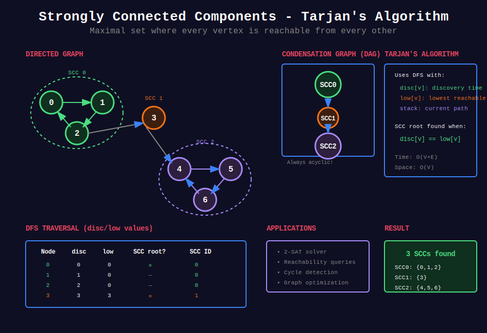

<div align="center">

# 🔄 Strongly Connected Components (SCC)

<p>
  
  
</p>

</div>

---

## 🧭 Navigation

| ⬅️ Previous | 📂 Current | ➡️ Next |
|:------------|:----------:|--------:|
| [← 04. Network Flow](../04_network_flow/README.md) | **05. SCC** | [06. Bridges & Articulation Points →](../06_bridges_articulation_points/README.md) |

---

## 🎨 Visual Overview

<div align="center">



</div>

---

## 📐 Mathematical Foundations

### 1️⃣ SCC Definition

**Strongly Connected Component:** Maximal set of vertices where every vertex is reachable from every other vertex.

**In directed graph $G = (V, E)$:**

```math
\text{SCC } C \subseteq V: \forall u, v \in C, \exists \text{ path } u \rightsquigarrow v \text{ and } v \rightsquigarrow u

```

**Key property:** SCCs partition the graph.

---

### 2️⃣ Algorithm Comparison

| Algorithm | Time | Space | Method |
|-----------|:----:|:-----:|--------|
| **Kosaraju** | O(V+E) | O(V) | Two DFS passes |
| **Tarjan** | O(V+E) | O(V) | Single DFS with stack |
| **Path-based** | O(V+E) | O(V) | Two stacks |

---

### 3️⃣ Kosaraju's Algorithm

**Steps:**
1. Run DFS on original graph, record finish times
2. Compute transpose graph $G^T$
3. Run DFS on $G^T$ in decreasing finish time order
4. Each DFS tree in step 3 is one SCC

**Why it works:** Second DFS visits nodes in topological order of SCC DAG.

---

### 4️⃣ Tarjan's Algorithm

**Single DFS with auxiliary information:**

- `disc[v]`: Discovery time

- `low[v]`: Lowest discovery time reachable from subtree of $v$

- Stack: Maintains current path

**SCC found when:** `disc[v] == low[v]`

**Advantage:** Single pass, online algorithm.

---

### 5️⃣ Condensation Graph

**DAG of SCCs:** Contract each SCC to single vertex.

**Properties:**

- Always acyclic

- Topological order exists

- Useful for many problems

```math
G^{SCC} = (V_{SCC}, E_{SCC})

```

---

### 6️⃣ Applications

| Problem | Solution |
|---------|----------|
| **2-SAT** | Find SCCs, check consistency |
| **Reachability** | Preprocess with SCC |
| **Maximum flow** | Identify bottlenecks |
| **Compiler optimization** | Identify strongly connected regions |

---

## 💻 Code Implementations

```python
from typing import List, Set
from collections import defaultdict, deque

class KosarajuSCC:
    """
    Kosaraju's algorithm for finding Strongly Connected Components.
    
    Uses two DFS passes.
    Time: O(V+E), Space: O(V)
    """
    
    def __init__(self, n: int, edges: List[List[int]]):
        """
        Args:
            n: number of vertices (0 to n-1)
            edges: directed edges [u, v]
        """
        self.n = n
        self.graph = defaultdict(list)
        self.graph_transpose = defaultdict(list)
        
        for u, v in edges:
            self.graph[u].append(v)
            self.graph_transpose[v].append(u)
        
        self.visited = [False] * n
        self.finish_order = []
        self.scc_id = [-1] * n
        self.scc_count = 0
    
    def _dfs1(self, u: int):
        """First DFS: record finish times."""
        self.visited[u] = True
        
        for v in self.graph[u]:
            if not self.visited[v]:
                self._dfs1(v)
        
        self.finish_order.append(u)
    
    def _dfs2(self, u: int, scc_id: int):
        """Second DFS: assign SCC IDs."""
        self.scc_id[u] = scc_id
        
        for v in self.graph_transpose[u]:
            if self.scc_id[v] == -1:
                self._dfs2(v, scc_id)
    
    def find_sccs(self) -> int:
        """
        Find all SCCs.
        
        Returns:
            Number of SCCs
        """
        # First DFS pass
        for i in range(self.n):
            if not self.visited[i]:
                self._dfs1(i)
        
        # Second DFS pass in reverse finish order
        for u in reversed(self.finish_order):
            if self.scc_id[u] == -1:
                self._dfs2(u, self.scc_count)
                self.scc_count += 1
        
        return self.scc_count
    
    def get_sccs(self) -> List[List[int]]:
        """Get list of SCCs (each SCC is list of vertices)."""
        sccs = [[] for _ in range(self.scc_count)]
        for v in range(self.n):
            sccs[self.scc_id[v]].append(v)
        return sccs

class TarjanSCC:
    """
    Tarjan's algorithm for finding SCCs.
    
    Single DFS pass with stack.
    Time: O(V+E), Space: O(V)
    """
    
    def __init__(self, n: int, edges: List[List[int]]):
        self.n = n
        self.graph = defaultdict(list)
        
        for u, v in edges:
            self.graph[u].append(v)
        
        self.disc = [-1] * n  # Discovery time
        self.low = [-1] * n   # Lowest reachable discovery time
        self.on_stack = [False] * n
        self.stack = []
        self.timer = 0
        
        self.scc_id = [-1] * n
        self.scc_count = 0
    
    def _dfs(self, u: int):
        """DFS with low-link calculation."""
        self.disc[u] = self.low[u] = self.timer
        self.timer += 1
        self.stack.append(u)
        self.on_stack[u] = True
        
        # Explore neighbors
        for v in self.graph[u]:
            if self.disc[v] == -1:
                # Not visited
                self._dfs(v)
                self.low[u] = min(self.low[u], self.low[v])
            elif self.on_stack[v]:
                # Back edge to ancestor
                self.low[u] = min(self.low[u], self.disc[v])
        
        # Root of SCC found
        if self.disc[u] == self.low[u]:
            # Pop SCC from stack
            while True:
                v = self.stack.pop()
                self.on_stack[v] = False
                self.scc_id[v] = self.scc_count
                if v == u:
                    break
            self.scc_count += 1
    
    def find_sccs(self) -> int:
        """Find all SCCs."""
        for i in range(self.n):
            if self.disc[i] == -1:
                self._dfs(i)
        return self.scc_count
    
    def get_sccs(self) -> List[List[int]]:
        """Get list of SCCs."""
        sccs = [[] for _ in range(self.scc_count)]
        for v in range(self.n):
            sccs[self.scc_id[v]].append(v)
        return sccs

def build_condensation_graph(n: int, edges: List[List[int]], 
                             scc_id: List[int], scc_count: int) -> dict:
    """
    Build condensation graph (DAG of SCCs).
    
    Args:
        n: number of vertices
        edges: original edges
        scc_id: SCC assignment for each vertex
        scc_count: number of SCCs
    
    Returns:
        Adjacency list of condensation graph
    
    Time: O(V+E), Space: O(V+E)
    """
    condensed = defaultdict(set)
    
    for u, v in edges:
        scc_u, scc_v = scc_id[u], scc_id[v]
        if scc_u != scc_v:
            condensed[scc_u].add(scc_v)
    
    # Convert sets to lists
    return {u: list(neighbors) for u, neighbors in condensed.items()}

# ============= LeetCode Problems =============

def findCircleNum(isConnected: List[List[int]]) -> int:
    """
    LeetCode 547: Number of Provinces
    
    Find number of connected components (undirected).
    Similar concept but for undirected graphs (use DFS/Union-Find).
    
    Time: O(n²), Space: O(n)
    """
    n = len(isConnected)
    visited = [False] * n
    provinces = 0
    
    def dfs(city: int):
        visited[city] = True
        for neighbor in range(n):
            if isConnected[city][neighbor] and not visited[neighbor]:
                dfs(neighbor)
    
    for i in range(n):
        if not visited[i]:
            dfs(i)
            provinces += 1
    
    return provinces

def canFinish(numCourses: int, prerequisites: List[List[int]]) -> bool:
    """
    LeetCode 207: Course Schedule
    
    Check if DAG (no cycles).
    Can use SCC: cycle exists iff SCC has size > 1.
    
    Time: O(V+E), Space: O(V+E)
    """
    # Build graph
    edges = [[b, a] for a, b in prerequisites]
    
    if not edges:
        return True
    
    # Find SCCs
    scc = TarjanSCC(numCourses, edges)
    scc.find_sccs()
    
    # Check if any SCC has more than one node (cycle)
    scc_sizes = [0] * scc.scc_count
    for v in range(numCourses):
        scc_sizes[scc.scc_id[v]] += 1
    
    return all(size == 1 for size in scc_sizes)

def findEventualSafeStates(graph: List[List[int]]) -> List[int]:
    """
    LeetCode 802: Find Eventual Safe States
    
    Safe nodes: all paths lead to terminal (no outgoing edges).
    
    Using SCC: safe iff can reach only terminal SCCs.
    
    Time: O(V+E), Space: O(V)
    """
    n = len(graph)
    
    # Build edge list
    edges = []
    for u in range(n):
        for v in graph[u]:
            edges.append([u, v])
    
    # Find SCCs
    scc = TarjanSCC(n, edges)
    scc.find_sccs()
    
    # Build condensation graph
    condensed = build_condensation_graph(n, edges, scc.scc_id, scc.scc_count)
    
    # Find terminal SCCs (no outgoing edges)
    terminal = [True] * scc.scc_count
    for u in condensed:
        if condensed[u]:
            terminal[u] = False
    
    # Check each SCC
    scc_safe = [False] * scc.scc_count
    
    def can_reach_terminal(scc_id: int, visited: Set[int]) -> bool:
        if scc_id in visited:
            return scc_safe[scc_id]
        
        if terminal[scc_id] and len(scc.scc_id) == 1:
            scc_safe[scc_id] = True
            return True
        
        visited.add(scc_id)
        
        if scc_id not in condensed:
            scc_safe[scc_id] = True
            return True
        
        for next_scc in condensed[scc_id]:
            if not can_reach_terminal(next_scc, visited):
                return False
        
        scc_safe[scc_id] = True
        return True
    
    # Check all SCCs
    for i in range(scc.scc_count):
        can_reach_terminal(i, set())
    
    # Collect safe nodes
    result = []
    for v in range(n):
        if scc_safe[scc.scc_id[v]]:
            result.append(v)
    
    return sorted(result)

def maxProbability(n: int, edges: List[List[int]], 
                   succProb: List[float], start: int, end: int) -> float:
    """
    LeetCode 1514: Path with Maximum Probability
    
    Modified Dijkstra on undirected graph.
    (Not directly SCC, but related graph algorithm)
    
    Time: O(E log V), Space: O(V+E)
    """
    import heapq
    
    graph = defaultdict(list)
    for i, (u, v) in enumerate(edges):
        graph[u].append((v, succProb[i]))
        graph[v].append((u, succProb[i]))
    
    # Max heap (use negative probabilities)
    pq = [(-1.0, start)]
    prob = [0.0] * n
    prob[start] = 1.0
    
    while pq:
        curr_prob, u = heapq.heappop(pq)
        curr_prob = -curr_prob
        
        if u == end:
            return curr_prob
        
        if curr_prob < prob[u]:
            continue
        
        for v, edge_prob in graph[u]:
            new_prob = curr_prob * edge_prob
            if new_prob > prob[v]:
                prob[v] = new_prob
                heapq.heappush(pq, (-new_prob, v))
    
    return 0.0

# ============= Example Usage =============

def example_kosaraju():
    """Example: Find SCCs using Kosaraju"""
    n = 8
    edges = [
        [0, 1], [1, 2], [2, 0],  # SCC 1: {0, 1, 2}
        [2, 3], [3, 4], [4, 5],  # Path
        [5, 6], [6, 7], [7, 5],  # SCC 2: {5, 6, 7}
    ]
    
    scc = KosarajuSCC(n, edges)
    count = scc.find_sccs()
    sccs = scc.get_sccs()
    
    print(f"Number of SCCs: {count}")
    print("SCCs:")
    for i, component in enumerate(sccs):
        print(f"  SCC {i}: {component}")

def example_tarjan():
    """Example: Find SCCs using Tarjan"""
    n = 5
    edges = [[0, 1], [1, 2], [2, 0], [1, 3], [3, 4]]
    
    scc = TarjanSCC(n, edges)
    count = scc.find_sccs()
    sccs = scc.get_sccs()
    
    print(f"Number of SCCs (Tarjan): {count}")
    print("SCCs:")
    for i, component in enumerate(sccs):
        print(f"  SCC {i}: {component}")

```

---

## 🏆 LeetCode Problems

### 🟡 Medium

| # | Problem | Pattern | Time | Space |
|:-:|---------|---------|:----:|:-----:|
| 207 | [Course Schedule](https://leetcode.com/problems/course-schedule/) | Cycle detection | O(V+E) | O(V) |
| 210 | [Course Schedule II](https://leetcode.com/problems/course-schedule-ii/) | Topological sort | O(V+E) | O(V) |
| 547 | [Number of Provinces](https://leetcode.com/problems/number-of-provinces/) | Connected components | O(n²) | O(n) |
| 802 | [Find Eventual Safe States](https://leetcode.com/problems/find-eventual-safe-states/) | SCC | O(V+E) | O(V) |
| 1319 | [Network Connections](https://leetcode.com/problems/number-of-operations-to-make-network-connected/) | Connected components | O(V+E) | O(V) |

### 🔴 Hard

| # | Problem | Pattern | Time | Space |
|:-:|---------|---------|:----:|:-----:|
| 1192 | [Critical Connections](https://leetcode.com/problems/critical-connections-in-a-network/) | Bridges (Tarjan) | O(V+E) | O(V) |
| 2360 | [Longest Cycle in Graph](https://leetcode.com/problems/longest-cycle-in-a-graph/) | SCC | O(V+E) | O(V) |

---

## 📊 Algorithm Selection

```
SCC Problem
     |
     +-- Need single pass? → Tarjan O(V+E)
     |
     +-- Easier to implement? → Kosaraju O(V+E)
     |
     +-- Just cycle detection?
         +-- DFS with 3 colors O(V+E)

```

---

## 🎯 Key Insights

1. **SCCs form DAG** when contracted
2. **Kosaraju: two DFS passes** - simpler to understand
3. **Tarjan: single pass** - more efficient in practice
4. **Applications:** 2-SAT, reachability, optimization
5. **Condensation graph** useful for many problems

---

## 📚 References

| Resource | Link |
|----------|------|
| **SCC** | [Wikipedia](https://en.wikipedia.org/wiki/Strongly_connected_component) |
| **Kosaraju** | [CP-Algorithms](https://cp-algorithms.com/graph/strongly-connected-components.html) |
| **Tarjan** | [CP-Algorithms](https://cp-algorithms.com/graph/strongly-connected-components.html) |

---

<div align="center">

**Made with ❤️ by [Gaurav Goswami](https://github.com/Gaurav14cs17)**

</div>

---

## 🧭 Navigation

| ⬅️ Previous | 📂 Current | ➡️ Next |
|:------------|:----------:|--------:|
| [← 04. Network Flow](../04_network_flow/README.md) | **05. SCC** | [06. Bridges & Articulation Points →](../06_bridges_articulation_points/README.md) |

