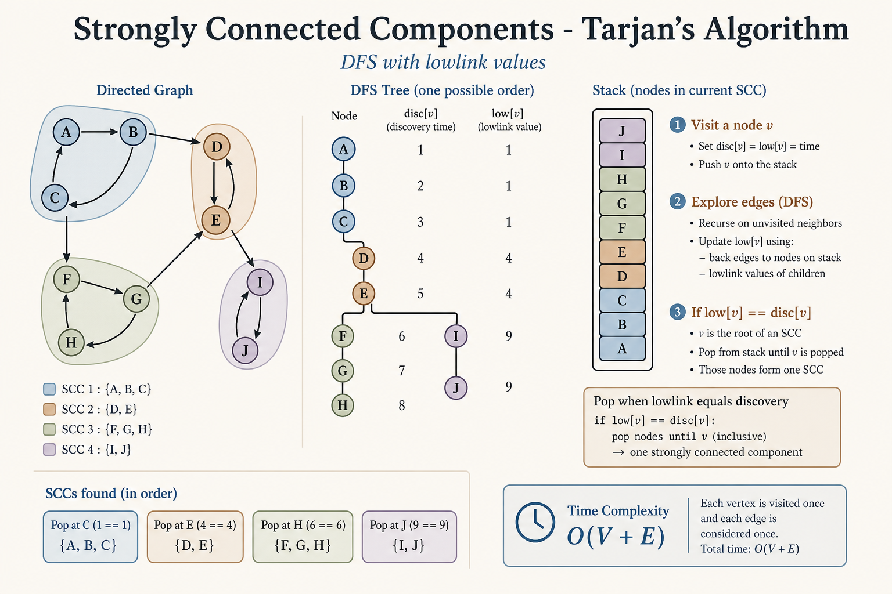
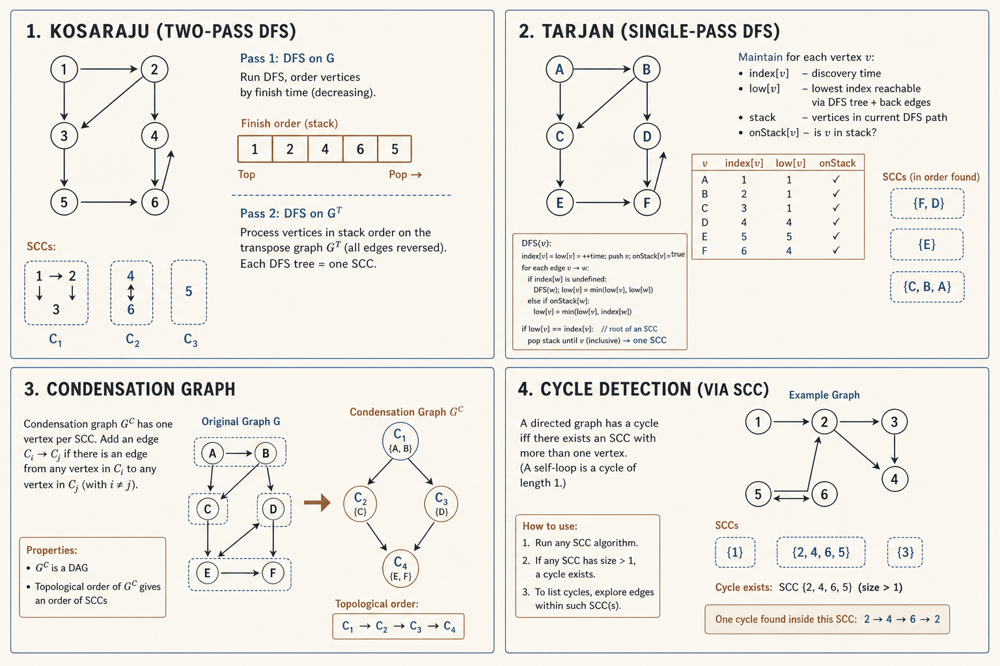
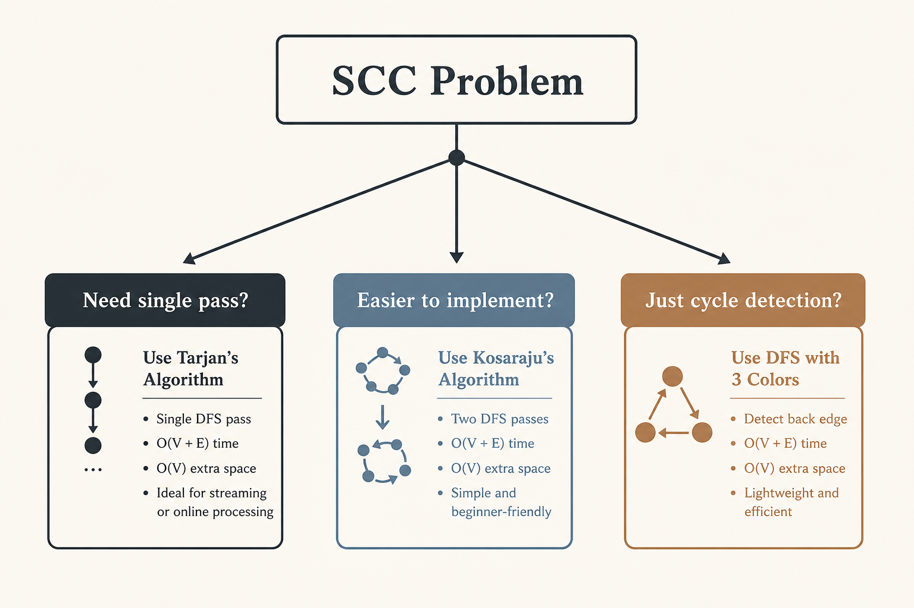

# 🔄 Strongly Connected Components (SCC)

### *🔄 Strongly Connected Components (SCC)*

  
  

---

## 📊 Visual Overview

---

## 🎯 At a Glance

| | |
|:---|:---|
| **Topic** | 🔄 Strongly Connected Components (SCC) |
| **Difficulty** | Medium to Hard |
| **Problems** | 10+ |

> **How to use this page:** Start with the visual overview, scan **At a Glance**, then work through theory → walkthroughs → code.

---

## 🧭 Navigation

| ⬅️ Previous | 📂 Current | ➡️ Next |
|:------------|:----------:|--------:|
| [← 04. Network Flow](../04_network_flow/README.md) | **05. SCC** | [06. Bridges & Articulation Points →](../06_bridges_articulation_points/README.md) |

---

## 📐 Mathematical Foundation
### 1️⃣ SCC Definition

**Strongly Connected Component:** Maximal set of vertices where every vertex is reachable from every other vertex.

**In directed graph $G = (V, E)$:**

$$\text{SCC } C \subseteq V: \forall u, v \in C, \exists \text{ path } u \rightsquigarrow v \text{ and } v \rightsquigarrow u$$

**Key property:** SCCs partition the graph.

---

### 2️⃣ Algorithm Comparison

| Algorithm | Time | Space | Method |
|-----------|:----:|:-----:|--------|
| **Kosaraju** | O(V+E) | O(V) | Two DFS passes |
| **Tarjan** | O(V+E) | O(V) | Single DFS with stack |
| **Path-based** | O(V+E) | O(V) | Two stacks |

---

### 3️⃣ Kosaraju's Algorithm

**Steps:**

1. Run DFS on original graph, record finish times

2. Compute transpose graph $G^T$

3. Run DFS on $G^T$ in decreasing finish time order

4. Each DFS tree in step 3 is one SCC

**Why it works:** Second DFS visits nodes in topological order of SCC DAG.

---

### 4️⃣ Tarjan's Algorithm

**Single DFS with auxiliary information:**

- `disc[v]`: Discovery time

- `low[v]`: Lowest discovery time reachable from subtree of $v$

- Stack: Maintains current path

**SCC found when:** `disc[v] == low[v]`

**Advantage:** Single pass, online algorithm.

---

### 5️⃣ Condensation Graph

**DAG of SCCs:** Contract each SCC to single vertex.

**Properties:**

- Always acyclic

- Topological order exists

- Useful for many problems

$$G^{SCC} = (V_{SCC}, E_{SCC})$$

---

### 6️⃣ Applications

| Problem | Solution |
|---------|----------|
| **2-SAT** | Find SCCs, check consistency |
| **Reachability** | Preprocess with SCC |
| **Maximum flow** | Identify bottlenecks |
| **Compiler optimization** | Identify strongly connected regions |

---

## 💻 Code Implementations

---

## 🏆 LeetCode Problems

### 🟡 Medium

| # | Problem | Pattern | Time | Space |
|:-:|---------|---------|:----:|:-----:|
| 207 | [Course Schedule](https://leetcode.com/problems/course-schedule/) | Cycle detection | O(V+E) | O(V) |
| 210 | [Course Schedule II](https://leetcode.com/problems/course-schedule-ii/) | Topological sort | O(V+E) | O(V) |
| 547 | [Number of Provinces](https://leetcode.com/problems/number-of-provinces/) | Connected components | O(n²) | O(n) |
| 802 | [Find Eventual Safe States](https://leetcode.com/problems/find-eventual-safe-states/) | SCC | O(V+E) | O(V) |
| 1319 | [Network Connections](https://leetcode.com/problems/number-of-operations-to-make-network-connected/) | Connected components | O(V+E) | O(V) |

### 🔴 Hard

| # | Problem | Pattern | Time | Space |
|:-:|---------|---------|:----:|:-----:|
| 1192 | [Critical Connections](https://leetcode.com/problems/critical-connections-in-a-network/) | Bridges (Tarjan) | O(V+E) | O(V) |
| 2360 | [Longest Cycle in Graph](https://leetcode.com/problems/longest-cycle-in-a-graph/) | SCC | O(V+E) | O(V) |

---

## 📊 Algorithm Selection

---

## 🎯 Key Insights

1. **SCCs form DAG** when contracted

2. **Kosaraju: two DFS passes** - simpler to understand

3. **Tarjan: single pass** - more efficient in practice

4. **Applications:** 2-SAT, reachability, optimization

5. **Condensation graph** useful for many problems

---

## 📚 References

| Resource | Link |
|----------|------|
| **SCC** | [Wikipedia](https://en.wikipedia.org/wiki/Strongly_connected_component) |
| **Kosaraju** | [CP-Algorithms](https://cp-algorithms.com/graph/strongly-connected-components.html) |
| **Tarjan** | [CP-Algorithms](https://cp-algorithms.com/graph/strongly-connected-components.html) |

---

**Made with ❤️ by [Gaurav Goswami](https://github.com/Gaurav14cs17)**

---
