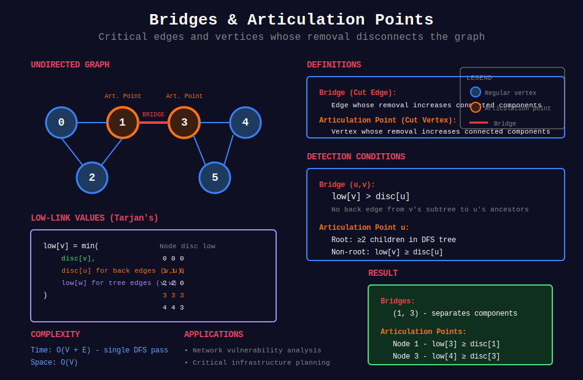

<div align="center">

# 🌉 Bridges & Articulation Points

<p>
  
  
</p>

</div>

---

## 🧭 Navigation

| ⬅️ Previous | 📂 Current | ➡️ Next |
|:------------|:----------:|--------:|
| [← 05. SCC](../05_strongly_connected_components/README.md) | **06. Bridges & Articulation** | [07. Eulerian Path →](../07_eulerian_path/README.md) |

---

## 🎨 Visual Overview

<div align="center">



</div>

---

## 📐 Mathematical Foundations

### 1️⃣ Definitions

**Bridge (Cut Edge):** Edge whose removal increases number of connected components.

**Articulation Point (Cut Vertex):** Vertex whose removal increases number of connected components.

**Biconnected Component:** Maximal subgraph with no articulation points.

---

### 2️⃣ Tarjan's Bridge-Finding Algorithm

**Uses DFS with low-link values:**

```math
\text{low}[v] = \min \begin{cases}
\text{disc}[v] \\
\text{disc}[u] & \text{for back edges } (v, u) \\
\text{low}[w] & \text{for tree edges } (v, w)
\end{cases}

```

**Bridge condition:** Edge $(u, v)$ is bridge iff:

```math
\text{low}[v] > \text{disc}[u]

```

**Time:** $O(V + E)$  
**Space:** $O(V)$

---

### 3️⃣ Articulation Point Condition

**Vertex $u$ is articulation point iff:**

1. **Root of DFS tree:** Has $\geq 2$ children

2. **Non-root:** Has child $v$ where $\text{low}[v] \geq \text{disc}[u]$

**Intuition:** No back edge from subtree of $v$ to ancestors of $u$.

---

### 4️⃣ 2-Edge-Connected Components

**2-edge-connected:** No bridges exist.

**Finding components:**

1. Find all bridges

2. Remove bridges temporarily

3. Connected components = 2-edge-connected components

**Applications:** Network reliability, road networks.

---

### 5️⃣ Biconnected Components

**Biconnected:** No articulation points.

**Finding:**

1. DFS with stack of edges

2. When articulation point found, pop edges to form component

**Property:** Biconnected components can overlap at articulation points.

---

## 💻 Code Implementations

```python
from typing import List, Set, Tuple
from collections import defaultdict

class BridgesFinder:
    """
    Find all bridges in undirected graph using Tarjan's algorithm.
    
    Time: O(V+E), Space: O(V)
    """
    
    def __init__(self, n: int, edges: List[List[int]]):
        """
        Args:
            n: number of vertices (0 to n-1)
            edges: undirected edges [u, v]
        """
        self.n = n
        self.graph = defaultdict(list)
        
        # Build adjacency list with edge indices
        for i, (u, v) in enumerate(edges):
            self.graph[u].append((v, i))
            self.graph[v].append((u, i))
        
        self.disc = [-1] * n  # Discovery time
        self.low = [-1] * n   # Low-link value
        self.timer = 0
        self.bridges = []
    
    def _dfs(self, u: int, parent: int, parent_edge: int):
        """DFS to find bridges."""
        self.disc[u] = self.low[u] = self.timer
        self.timer += 1
        
        for v, edge_id in self.graph[u]:
            # Skip edge to parent (but allow multiple edges)
            if edge_id == parent_edge:
                continue
            
            if self.disc[v] == -1:
                # Tree edge
                self._dfs(v, u, edge_id)
                self.low[u] = min(self.low[u], self.low[v])
                
                # Check bridge condition
                if self.low[v] > self.disc[u]:
                    self.bridges.append((min(u, v), max(u, v)))
            else:
                # Back edge
                self.low[u] = min(self.low[u], self.disc[v])
    
    def find_bridges(self) -> List[Tuple[int, int]]:
        """Find all bridges in graph."""
        for i in range(self.n):
            if self.disc[i] == -1:
                self._dfs(i, -1, -1)
        
        return self.bridges

class ArticulationPointsFinder:
    """
    Find all articulation points using Tarjan's algorithm.
    
    Time: O(V+E), Space: O(V)
    """
    
    def __init__(self, n: int, edges: List[List[int]]):
        self.n = n
        self.graph = defaultdict(list)
        
        for u, v in edges:
            self.graph[u].append(v)
            self.graph[v].append(u)
        
        self.disc = [-1] * n
        self.low = [-1] * n
        self.parent = [-1] * n
        self.timer = 0
        self.articulation_points = set()
    
    def _dfs(self, u: int):
        """DFS to find articulation points."""
        children = 0
        self.disc[u] = self.low[u] = self.timer
        self.timer += 1
        
        for v in self.graph[u]:
            if self.disc[v] == -1:
                # Tree edge
                children += 1
                self.parent[v] = u
                self._dfs(v)
                
                self.low[u] = min(self.low[u], self.low[v])
                
                # Articulation point conditions
                if self.parent[u] == -1 and children > 1:
                    # Root with multiple children
                    self.articulation_points.add(u)
                
                if self.parent[u] != -1 and self.low[v] >= self.disc[u]:
                    # Non-root condition
                    self.articulation_points.add(u)
            
            elif v != self.parent[u]:
                # Back edge
                self.low[u] = min(self.low[u], self.disc[v])
    
    def find_articulation_points(self) -> List[int]:
        """Find all articulation points."""
        for i in range(self.n):
            if self.disc[i] == -1:
                self._dfs(i)
        
        return sorted(list(self.articulation_points))

class BiconnectedComponents:
    """
    Find biconnected components in undirected graph.
    
    Time: O(V+E), Space: O(V+E)
    """
    
    def __init__(self, n: int, edges: List[List[int]]):
        self.n = n
        self.graph = defaultdict(list)
        self.edges = edges
        
        for i, (u, v) in enumerate(edges):
            self.graph[u].append((v, i))
            self.graph[v].append((u, i))
        
        self.disc = [-1] * n
        self.low = [-1] * n
        self.parent = [-1] * n
        self.timer = 0
        
        self.edge_stack = []
        self.components = []
    
    def _dfs(self, u: int):
        """DFS to find biconnected components."""
        self.disc[u] = self.low[u] = self.timer
        self.timer += 1
        
        for v, edge_id in self.graph[u]:
            if self.disc[v] == -1:
                # Tree edge
                self.parent[v] = u
                self.edge_stack.append(edge_id)
                
                self._dfs(v)
                
                self.low[u] = min(self.low[u], self.low[v])
                
                # If v is not connected to ancestors of u
                if self.low[v] >= self.disc[u]:
                    # Found biconnected component
                    component = []
                    while True:
                        eid = self.edge_stack.pop()
                        component.append(self.edges[eid])
                        if eid == edge_id:
                            break
                    self.components.append(component)
            
            elif v != self.parent[u] and self.disc[v] < self.disc[u]:
                # Back edge
                self.edge_stack.append(edge_id)
                self.low[u] = min(self.low[u], self.disc[v])
    
    def find_components(self) -> List[List[Tuple[int, int]]]:
        """Find all biconnected components."""
        for i in range(self.n):
            if self.disc[i] == -1:
                self._dfs(i)
                # Pop remaining edges for this component
                if self.edge_stack:
                    component = []
                    while self.edge_stack:
                        eid = self.edge_stack.pop()
                        component.append(self.edges[eid])
                    if component:
                        self.components.append(component)
        
        return self.components

# ============= LeetCode Problems =============

def criticalConnections(n: int, connections: List[List[int]]) -> List[List[int]]:
    """
    LeetCode 1192: Critical Connections in a Network
    
    Find all bridges (critical connections).
    
    Time: O(V+E), Space: O(V+E)
    """
    bf = BridgesFinder(n, connections)
    bridges = bf.find_bridges()
    return [[u, v] for u, v in bridges]

def minReorder(n: int, connections: List[List[int]]) -> int:
    """
    LeetCode 1466: Reorder Routes to Make All Paths Lead to City 0
    
    Uses graph traversal (not directly bridges).
    
    Time: O(V+E), Space: O(V+E)
    """
    graph = defaultdict(list)
    reverse_graph = defaultdict(list)
    
    for u, v in connections:
        graph[u].append(v)
        reverse_graph[v].append(u)
    
    visited = [False] * n
    changes = [0]
    
    def dfs(city: int):
        visited[city] = True
        
        # Check outgoing edges (need to reverse)
        for neighbor in graph[city]:
            if not visited[neighbor]:
                changes[0] += 1
                dfs(neighbor)
        
        # Check incoming edges (already correct)
        for neighbor in reverse_graph[city]:
            if not visited[neighbor]:
                dfs(neighbor)
    
    dfs(0)
    return changes[0]

# ============= Applications =============

def count_2_edge_connected_components(n: int, edges: List[List[int]]) -> int:
    """
    Count 2-edge-connected components.
    
    Components separated by bridges.
    
    Time: O(V+E), Space: O(V)
    """
    bf = BridgesFinder(n, edges)
    bridges = set(bf.find_bridges())
    
    # Build graph without bridges
    graph = defaultdict(list)
    for u, v in edges:
        edge = (min(u, v), max(u, v))
        if edge not in bridges:
            graph[u].append(v)
            graph[v].append(u)
    
    # Count connected components
    visited = [False] * n
    components = 0
    
    def dfs(node: int):
        visited[node] = True
        for neighbor in graph[node]:
            if not visited[neighbor]:
                dfs(neighbor)
    
    for i in range(n):
        if not visited[i]:
            dfs(i)
            components += 1
    
    return components

def is_network_reliable(n: int, edges: List[List[int]], 
                       critical_nodes: Set[int]) -> bool:
    """
    Check if network remains connected after removing critical nodes.
    
    Uses articulation points.
    
    Time: O(V+E), Space: O(V)
    """
    apf = ArticulationPointsFinder(n, edges)
    articulation_points = set(apf.find_articulation_points())
    
    # Check if any critical node is articulation point
    return len(articulation_points & critical_nodes) == 0

# ============= Example Usage =============

def example_bridges():
    """Example: Find bridges"""
    n = 5
    edges = [[0, 1], [1, 2], [2, 0], [1, 3], [3, 4]]
    
    bf = BridgesFinder(n, edges)
    bridges = bf.find_bridges()
    
    print("Bridges (critical connections):")
    for u, v in bridges:
        print(f"  {u} - {v}")

def example_articulation_points():
    """Example: Find articulation points"""
    n = 5
    edges = [[0, 1], [1, 2], [2, 0], [1, 3], [3, 4]]
    
    apf = ArticulationPointsFinder(n, edges)
    aps = apf.find_articulation_points()
    
    print("Articulation points:")
    for node in aps:
        print(f"  Node {node}")

def example_biconnected():
    """Example: Find biconnected components"""
    n = 6
    edges = [[0, 1], [1, 2], [2, 0], [1, 3], [3, 4], [4, 5], [5, 3]]
    
    bc = BiconnectedComponents(n, edges)
    components = bc.find_components()
    
    print("Biconnected components:")
    for i, comp in enumerate(components):
        print(f"  Component {i}: {comp}")

```

---

## 🏆 LeetCode Problems

### 🟡 Medium

| # | Problem | Pattern | Time | Space |
|:-:|---------|---------|:----:|:-----:|
| 1466 | [Reorder Routes](https://leetcode.com/problems/reorder-routes-to-make-all-paths-lead-to-the-city-zero/) | Graph traversal | O(V+E) | O(V) |

### 🔴 Hard

| # | Problem | Pattern | Time | Space |
|:-:|---------|---------|:----:|:-----:|
| 1192 | [Critical Connections](https://leetcode.com/problems/critical-connections-in-a-network/) | Bridges | O(V+E) | O(V) |
| 2556 | [Disconnect Path in Binary Matrix](https://leetcode.com/problems/disconnect-path-in-a-binary-matrix-by-at-most-one-flip/) | Cut vertices | O(mn) | O(mn) |

---

## 📊 Algorithm Selection

```
Graph Vulnerability Problem
     |
     +-- Find critical edges → Bridges (Tarjan) O(V+E)
     |
     +-- Find critical vertices → Articulation Points O(V+E)
     |
     +-- 2-edge-connected? → Find bridges, check if 0
     |
     +-- Biconnected components → Stack-based algorithm O(V+E)

```

---

## 🎯 Key Insights

1. **Bridges and articulation points** found in O(V+E) using Tarjan

2. **Low-link values** crucial for detection

3. **Bridge:** `low[v] > disc[u]` (strict inequality)

4. **Articulation:** `low[v] ≥ disc[u]` (non-strict)

5. **Applications:** Network reliability, vulnerability analysis

---

## 📚 References

| Resource | Link |
|----------|------|
| **Bridges** | [CP-Algorithms](https://cp-algorithms.com/graph/bridge-searching.html) |
| **Articulation Points** | [CP-Algorithms](https://cp-algorithms.com/graph/cutpoints.html) |
| **Biconnected Components** | [GeeksforGeeks](https://www.geeksforgeeks.org/biconnected-components/) |

---

<div align="center">

**Made with ❤️ by [Gaurav Goswami](https://github.com/Gaurav14cs17)**

</div>

---

## 🧭 Navigation

| ⬅️ Previous | 📂 Current | ➡️ Next |
|:------------|:----------:|--------:|
| [← 05. SCC](../05_strongly_connected_components/README.md) | **06. Bridges & Articulation** | [07. Eulerian Path →](../07_eulerian_path/README.md) |

