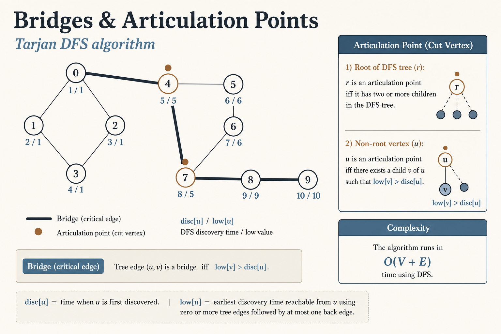
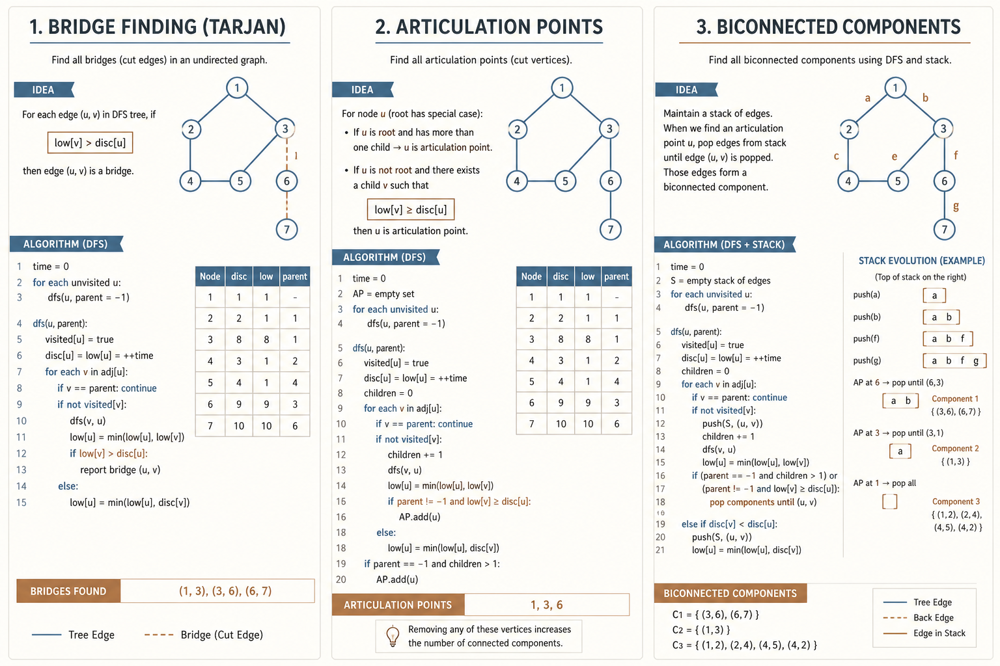
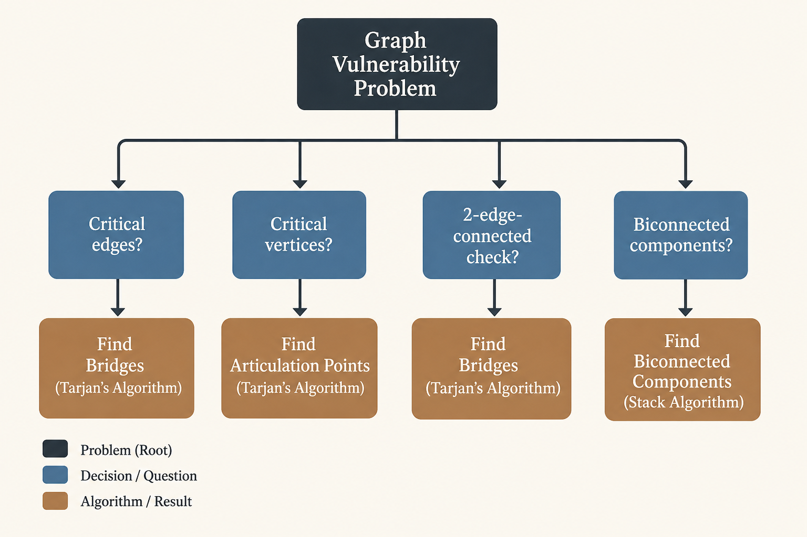

# 🌉 Bridges & Articulation Points

### *🌉 Bridges & Articulation Points*

  
  

---

## 📊 Visual Overview

---

## 🎯 At a Glance

| | |
|:---|:---|
| **Topic** | 🌉 Bridges & Articulation Points |
| **Difficulty** | Medium to Hard |
| **Problems** | 8+ |

{: .highlight }
> **How to use this page:** Start with the visual overview, scan **At a Glance**, then work through theory → walkthroughs → code.

---

## 🧭 Navigation

| ⬅️ Previous | 📂 Current | ➡️ Next |
|:------------|:----------:|--------:|
| [← 05. SCC](../05_strongly_connected_components/README.md) | **06. Bridges & Articulation** | [07. Eulerian Path →](../07_eulerian_path/README.md) |

---

## 📐 Mathematical Foundation
### 1️⃣ Definitions

**Bridge (Cut Edge):** Edge whose removal increases number of connected components.

**Articulation Point (Cut Vertex):** Vertex whose removal increases number of connected components.

**Biconnected Component:** Maximal subgraph with no articulation points.

---

### 2️⃣ Tarjan's Bridge-Finding Algorithm

**Uses DFS with low-link values:**

$$\text{low}[v] = \min \begin{cases}
\text{disc}[v] \\
\text{disc}[u] & \text{for back edges } (v, u) \\
\text{low}[w] & \text{for tree edges } (v, w)
\end{cases}$$

**Bridge condition:** Edge $(u, v)$ is bridge iff:

$$\text{low}[v] > \text{disc}[u]$$

**Time:** $O(V + E)$  
**Space:** $O(V)$

---

### 3️⃣ Articulation Point Condition

**Vertex $u$ is articulation point iff:**

1. **Root of DFS tree:** Has $\geq 2$ children

2. **Non-root:** Has child $v$ where $\text{low}[v] \geq \text{disc}[u]$

**Intuition:** No back edge from subtree of $v$ to ancestors of $u$.

---

### 4️⃣ 2-Edge-Connected Components

**2-edge-connected:** No bridges exist.

**Finding components:**

1. Find all bridges

2. Remove bridges temporarily

3. Connected components = 2-edge-connected components

**Applications:** Network reliability, road networks.

---

### 5️⃣ Biconnected Components

**Biconnected:** No articulation points.

**Finding:**

1. DFS with stack of edges

2. When articulation point found, pop edges to form component

**Property:** Biconnected components can overlap at articulation points.

---

## 💻 Code Implementations

---

## 🏆 LeetCode Problems

### 🟡 Medium

| # | Problem | Pattern | Time | Space |
|:-:|---------|---------|:----:|:-----:|
| 1466 | [Reorder Routes](https://leetcode.com/problems/reorder-routes-to-make-all-paths-lead-to-the-city-zero/) | Graph traversal | O(V+E) | O(V) |

### 🔴 Hard

| # | Problem | Pattern | Time | Space |
|:-:|---------|---------|:----:|:-----:|
| 1192 | [Critical Connections](https://leetcode.com/problems/critical-connections-in-a-network/) | Bridges | O(V+E) | O(V) |
| 2556 | [Disconnect Path in Binary Matrix](https://leetcode.com/problems/disconnect-path-in-a-binary-matrix-by-at-most-one-flip/) | Cut vertices | O(mn) | O(mn) |

---

## 📊 Algorithm Selection

---

## 🎯 Key Insights

1. **Bridges and articulation points** found in O(V+E) using Tarjan

2. **Low-link values** crucial for detection

3. **Bridge:** `low[v] > disc[u]` (strict inequality)

4. **Articulation:** `low[v] ≥ disc[u]` (non-strict)

5. **Applications:** Network reliability, vulnerability analysis

---

## 📚 References

| Resource | Link |
|----------|------|
| **Bridges** | [CP-Algorithms](https://cp-algorithms.com/graph/bridge-searching.html) |
| **Articulation Points** | [CP-Algorithms](https://cp-algorithms.com/graph/cutpoints.html) |
| **Biconnected Components** | [GeeksforGeeks](https://www.geeksforgeeks.org/biconnected-components/) |

---

**Made with ❤️ by [Gaurav Goswami](https://github.com/Gaurav14cs17)**

---
