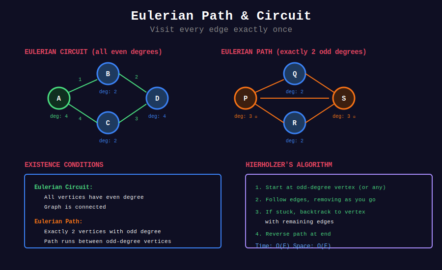

<div align="center">

# 🔄 Eulerian Path & Circuit

<p>
  
  
</p>

</div>

---

## 🧭 Navigation

| ⬅️ Previous | 📂 Current | ➡️ Next |
|:------------|:----------:|--------:|
| [← 06. Bridges & Articulation](../06_bridges_articulation_points/README.md) | **07. Eulerian Path** | [08. 2-SAT →](../08_2sat/README.md) |

---

## 🎨 Visual Overview

<div align="center">



</div>

---

## 📐 Mathematical Foundations

### 1️⃣ Definitions

**Eulerian Path:** Path that visits every **edge** exactly once.

**Eulerian Circuit/Cycle:** Eulerian path that starts and ends at same vertex.

**Historic:** Seven Bridges of Königsberg (Euler, 1736).

---

### 2️⃣ Existence Conditions

**Undirected Graph:**

| Condition | Result |
|-----------|--------|
| All vertices even degree | **Eulerian Circuit** exists |
| Exactly 2 vertices odd degree | **Eulerian Path** exists (between odd vertices) |
| More than 2 vertices odd degree | **No Eulerian path** |

**Directed Graph:**

| Condition | Result |
|-----------|--------|
| All vertices: in-degree = out-degree | **Eulerian Circuit** |
| One vertex: out-deg = in-deg + 1, one: in-deg = out-deg + 1 | **Eulerian Path** |
| Others: in-deg = out-deg | (from first to second) |

**Must also be connected** (weakly for directed).

---

### 3️⃣ Hierholzer's Algorithm

**Finds Eulerian path/circuit in O(E):**

1. Start at vertex with odd degree (or any if all even)
2. Follow edges, removing as you go
3. If stuck, backtrack and continue from vertex with remaining edges
4. Reverse path at end

**Uses stack for efficient backtracking.**

---

### 4️⃣ Complexity

**Time:** $O(E)$ - visit each edge once  
**Space:** $O(E)$ - store path

---

### 5️⃣ Applications

| Application | Description |
|-------------|-------------|
| **Route Planning** | Snowplow routes, mail delivery |
| **DNA Sequencing** | De Bruijn graphs |
| **Circuit Design** | Wiring paths |
| **Puzzles** | Seven Bridges problem |

---

## 💻 Code Implementations

```python
from typing import List, Optional
from collections import defaultdict, deque

class EulerianPath:
    """
    Find Eulerian path/circuit using Hierholzer's algorithm.
    
    Time: O(E), Space: O(E)
    """
    
    def __init__(self, n: int, edges: List[List[int]], directed: bool = False):
        """
        Args:
            n: number of vertices
            edges: list of edges [u, v]
            directed: whether graph is directed
        """
        self.n = n
        self.directed = directed
        self.graph = defaultdict(list)
        self.in_degree = [0] * n
        self.out_degree = [0] * n
        
        for u, v in edges:
            self.graph[u].append(v)
            self.out_degree[u] += 1
            self.in_degree[v] += 1
            
            if not directed:
                self.graph[v].append(u)
                self.out_degree[v] += 1
                self.in_degree[u] += 1
    
    def has_eulerian_path(self) -> tuple:
        """
        Check if Eulerian path exists.
        
        Returns:
            (exists, start_vertex, is_circuit)
        """
        if self.directed:
            return self._check_directed()
        else:
            return self._check_undirected()
    
    def _check_undirected(self) -> tuple:
        """Check for undirected graph."""
        odd_degree_vertices = []
        
        for v in range(self.n):
            degree = len(self.graph[v])
            if degree % 2 == 1:
                odd_degree_vertices.append(v)
        
        if len(odd_degree_vertices) == 0:

            # Eulerian circuit
            start = next((v for v in range(self.n) if len(self.graph[v]) > 0), 0)
            return (True, start, True)
        elif len(odd_degree_vertices) == 2:

            # Eulerian path
            return (True, odd_degree_vertices[0], False)
        else:
            return (False, -1, False)
    
    def _check_directed(self) -> tuple:
        """Check for directed graph."""
        start_vertices = []
        end_vertices = []
        
        for v in range(self.n):
            if self.out_degree[v] - self.in_degree[v] == 1:
                start_vertices.append(v)
            elif self.in_degree[v] - self.out_degree[v] == 1:
                end_vertices.append(v)
            elif self.in_degree[v] != self.out_degree[v]:
                return (False, -1, False)
        
        if len(start_vertices) == 0 and len(end_vertices) == 0:

            # Eulerian circuit
            start = next((v for v in range(self.n) if self.out_degree[v] > 0), 0)
            return (True, start, True)
        elif len(start_vertices) == 1 and len(end_vertices) == 1:

            # Eulerian path
            return (True, start_vertices[0], False)
        else:
            return (False, -1, False)
    
    def find_path(self) -> Optional[List[int]]:
        """
        Find Eulerian path using Hierholzer's algorithm.
        
        Returns None if no Eulerian path exists.
        
        Time: O(E), Space: O(E)
        """
        exists, start, is_circuit = self.has_eulerian_path()
        
        if not exists:
            return None
        
        # Make copy of adjacency list
        graph = defaultdict(list)
        for u in self.graph:
            graph[u] = self.graph[u][:]
        
        stack = [start]
        path = []
        
        while stack:
            v = stack[-1]
            
            if graph[v]:

                # Take next edge
                u = graph[v].pop()
                
                # Remove reverse edge if undirected
                if not self.directed:
                    graph[u].remove(v)
                
                stack.append(u)
            else:

                # No more edges, add to path
                path.append(stack.pop())
        
        path.reverse()
        return path

# ============= LeetCode Problems =============

def findItinerary(tickets: List[List[str]]) -> List[str]:
    """
    LeetCode 332: Reconstruct Itinerary
    
    Find Eulerian path in directed graph (lexicographically smallest).
    
    Time: O(E log E), Space: O(E)
    """
    graph = defaultdict(list)
    
    # Build graph and sort destinations
    for src, dst in tickets:
        graph[src].append(dst)
    
    for src in graph:
        graph[src].sort(reverse=True)  # Use reverse for efficient pop
    
    route = []
    stack = ["JFK"]
    
    while stack:
        while graph[stack[-1]]:

            # Take lexicographically smallest available
            next_dest = graph[stack[-1]].pop()
            stack.append(next_dest)
        
        # No more destinations
        route.append(stack.pop())
    
    return route[::-1]

def validArrangement(pairs: List[List[int]]) -> List[List[int]]:
    """
    LeetCode 2097: Valid Arrangement of Pairs
    
    Find Eulerian path in directed graph.
    
    Time: O(E log E), Space: O(E)
    """
    graph = defaultdict(list)
    in_degree = defaultdict(int)
    out_degree = defaultdict(int)
    
    for u, v in pairs:
        graph[u].append(v)
        out_degree[u] += 1
        in_degree[v] += 1
    
    # Find start vertex
    start = pairs[0][0]
    for node in graph:
        if out_degree[node] - in_degree[node] == 1:
            start = node
            break
    
    # Hierholzer's algorithm
    stack = [start]
    path = []
    
    while stack:
        while graph[stack[-1]]:
            next_node = graph[stack[-1]].pop()
            stack.append(next_node)
        path.append(stack.pop())
    
    path.reverse()
    
    # Convert to pairs
    result = []
    for i in range(len(path) - 1):
        result.append([path[i], path[i + 1]])
    
    return result

# ============= Applications =============

def count_eulerian_paths(n: int, edges: List[List[int]]) -> int:
    """
    Count number of Eulerian paths (if exists).
    
    For undirected graph, this can be complex.
    Simplified version checks existence only.
    
    Time: O(V+E), Space: O(V)
    """
    ep = EulerianPath(n, edges, directed=False)
    exists, _, _ = ep.has_eulerian_path()
    
    # Counting all Eulerian paths is complex (#P-complete)
    # Usually just check existence
    return 1 if exists else 0

def find_shortest_superstring_eulerian(words: List[str]) -> str:
    """
    Find shortest superstring using Eulerian path approach.
    
    Build De Bruijn-like graph and find Eulerian path.
    
    (Simplified version - actual implementation more complex)
    
    Time: O(n²), Space: O(n²)
    """
    n = len(words)
    
    # Build overlap graph
    overlap = [[0] * n for _ in range(n)]
    for i in range(n):
        for j in range(n):
            if i != j:

                # Find maximum overlap between words[i] suffix and words[j] prefix
                max_overlap = 0
                for k in range(1, min(len(words[i]), len(words[j])) + 1):
                    if words[i][-k:] == words[j][:k]:
                        max_overlap = k
                overlap[i][j] = max_overlap
    
    # This is simplified - full solution requires DP or other approach
    # Eulerian path approach works for De Bruijn graphs in DNA sequencing
    
    return ""  # Placeholder

# ============= Example Usage =============

def example_directed_eulerian():
    """Example: Find Eulerian path in directed graph"""
    n = 4
    edges = [[0, 1], [1, 2], [2, 3], [3, 1], [1, 0]]
    
    ep = EulerianPath(n, edges, directed=True)
    exists, start, is_circuit = ep.has_eulerian_path()
    
    if exists:
        path = ep.find_path()
        print(f"Eulerian {'circuit' if is_circuit else 'path'}: {path}")
    else:
        print("No Eulerian path exists")

def example_undirected_eulerian():
    """Example: Find Eulerian path in undirected graph"""
    n = 5
    edges = [[0, 1], [1, 2], [2, 3], [3, 4], [4, 1]]
    
    ep = EulerianPath(n, edges, directed=False)
    exists, start, is_circuit = ep.has_eulerian_path()
    
    if exists:
        path = ep.find_path()
        print(f"Eulerian {'circuit' if is_circuit else 'path'}: {path}")
    else:
        print("No Eulerian path exists")

def seven_bridges():
    """
    Famous Seven Bridges of Königsberg problem.
    
    Proves no Eulerian path exists (4 vertices with odd degree).
    """

    # Königsberg bridges graph
    n = 4  # 4 land masses
    edges = [
        [0, 1], [0, 1],  # 2 bridges
        [0, 2], [0, 2],  # 2 bridges
        [1, 3],          # 1 bridge
        [2, 3], [2, 3],  # 2 bridges
    ]
    
    ep = EulerianPath(n, edges, directed=False)
    exists, _, _ = ep.has_eulerian_path()
    
    print(f"Seven Bridges of Königsberg: {'Solvable' if exists else 'No solution'}")

    # Output: No solution (Euler proved this in 1736)
```

---

## 🏆 LeetCode Problems

### 🟡 Medium

| # | Problem | Pattern | Time | Space |
|:-:|---------|---------|:----:|:-----:|
| 753 | [Cracking the Safe](https://leetcode.com/problems/cracking-the-safe/) | De Bruijn graph | O(k^n) | O(k^n) |

### 🔴 Hard

| # | Problem | Pattern | Time | Space |
|:-:|---------|---------|:----:|:-----:|
| 332 | [Reconstruct Itinerary](https://leetcode.com/problems/reconstruct-itinerary/) | Eulerian path | O(E log E) | O(E) |
| 2097 | [Valid Arrangement of Pairs](https://leetcode.com/problems/valid-arrangement-of-pairs/) | Eulerian path | O(E) | O(E) |

---

## 📊 Algorithm Selection

```
Eulerian Problem
     |
     +-- Check existence
     |   +-- Undirected → Check vertex degrees O(V)
     |   +-- Directed → Check in/out degrees O(V)
     |
     +-- Find path → Hierholzer's algorithm O(E)
```

---

## 🎯 Key Insights

1. **Euler's theorem** (1736) - first graph theory result
2. **Check degrees** to determine existence in O(V)
3. **Hierholzer's algorithm** finds path in O(E)
4. **Must be connected** (weakly for directed)
5. **Applications:** routing, DNA sequencing, puzzles

---

## 📚 References

| Resource | Link |
|----------|------|
| **Eulerian Path** | [Wikipedia](https://en.wikipedia.org/wiki/Eulerian_path) |
| **Hierholzer** | [CP-Algorithms](https://cp-algorithms.com/graph/euler_path.html) |
| **Seven Bridges** | [Wikipedia](https://en.wikipedia.org/wiki/Seven_Bridges_of_K%C3%B6nigsberg) |

---

<div align="center">

**Made with ❤️ by [Gaurav Goswami](https://github.com/Gaurav14cs17)**

</div>

---

## 🧭 Navigation

| ⬅️ Previous | 📂 Current | ➡️ Next |
|:------------|:----------:|--------:|
| [← 06. Bridges & Articulation](../06_bridges_articulation_points/README.md) | **07. Eulerian Path** | [08. 2-SAT →](../08_2sat/README.md) |

