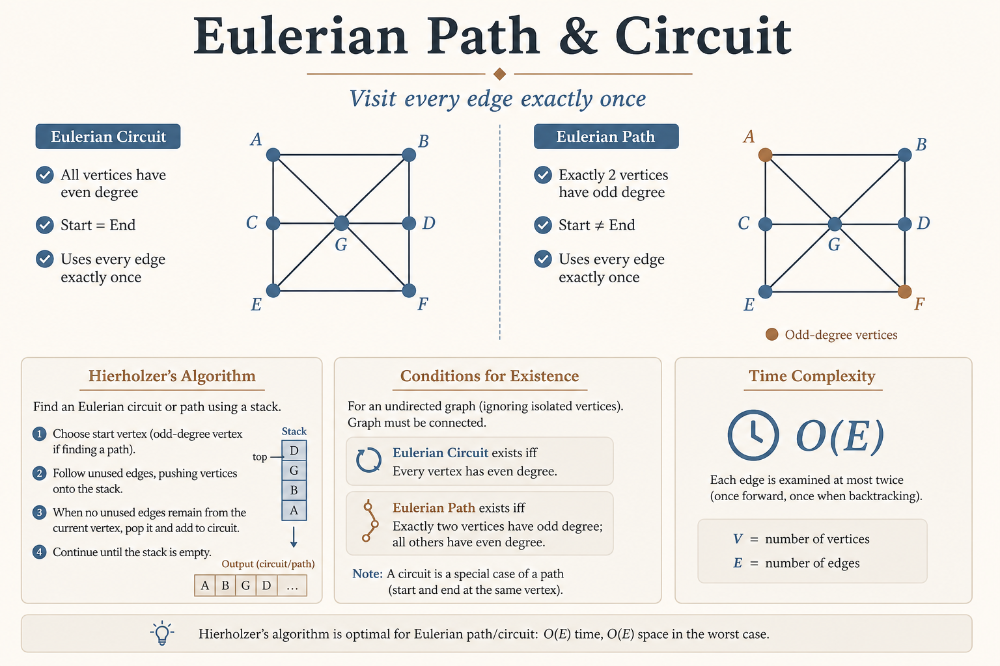
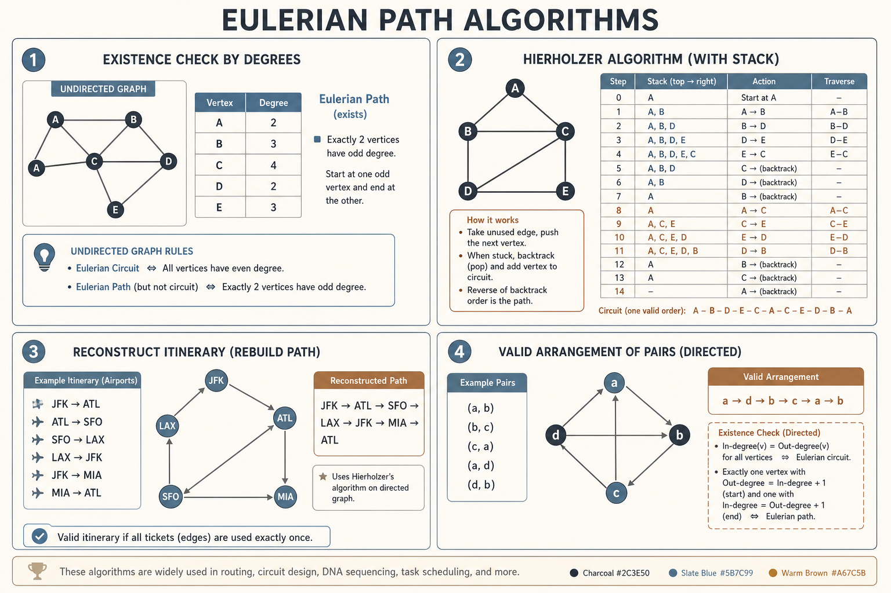
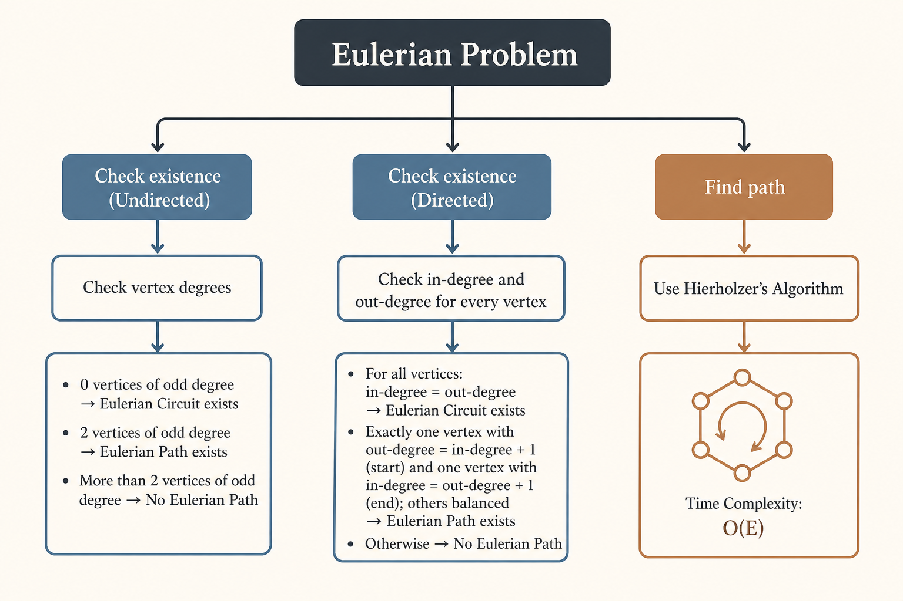

# 🔄 Eulerian Path & Circuit

### *🔄 Eulerian Path & Circuit*

  
  

---

## 📊 Visual Overview

---

## 🎯 At a Glance

| | |
|:---|:---|
| **Topic** | 🔄 Eulerian Path & Circuit |
| **Difficulty** | Medium |
| **Problems** | 6+ |

> **How to use this page:** Start with the visual overview, scan **At a Glance**, then work through theory → walkthroughs → code.

---

## 🧭 Navigation

| ⬅️ Previous | 📂 Current | ➡️ Next |
|:------------|:----------:|--------:|
| [← 06. Bridges & Articulation](../06_bridges_articulation_points/README.md) | **07. Eulerian Path** | [08. 2-SAT →](../08_2sat/README.md) |

---

## 📐 Mathematical Foundation
### 1️⃣ Definitions

**Eulerian Path:** Path that visits every **edge** exactly once.

**Eulerian Circuit/Cycle:** Eulerian path that starts and ends at same vertex.

**Historic:** Seven Bridges of Königsberg (Euler, 1736).

---

### 2️⃣ Existence Conditions

**Undirected Graph:**

| Condition | Result |
|-----------|--------|
| All vertices even degree | **Eulerian Circuit** exists |
| Exactly 2 vertices odd degree | **Eulerian Path** exists (between odd vertices) |
| More than 2 vertices odd degree | **No Eulerian path** |

**Directed Graph:**

| Condition | Result |
|-----------|--------|
| All vertices: in-degree = out-degree | **Eulerian Circuit** |
| One vertex: out-deg = in-deg + 1, one: in-deg = out-deg + 1 | **Eulerian Path** |
| Others: in-deg = out-deg | (from first to second) |

**Must also be connected** (weakly for directed).

---

### 3️⃣ Hierholzer's Algorithm

**Finds Eulerian path/circuit in O(E):**

1. Start at vertex with odd degree (or any if all even)

2. Follow edges, removing as you go

3. If stuck, backtrack and continue from vertex with remaining edges

4. Reverse path at end

**Uses stack for efficient backtracking.**

---

### 4️⃣ Complexity

**Time:** $O(E)$ - visit each edge once  
**Space:** $O(E)$ - store path

---

### 5️⃣ Applications

| Application | Description |
|-------------|-------------|
| **Route Planning** | Snowplow routes, mail delivery |
| **DNA Sequencing** | De Bruijn graphs |
| **Circuit Design** | Wiring paths |
| **Puzzles** | Seven Bridges problem |

---

## 💻 Code Implementations

---

## 🏆 LeetCode Problems

### 🟡 Medium

| # | Problem | Pattern | Time | Space |
|:-:|---------|---------|:----:|:-----:|
| 753 | [Cracking the Safe](https://leetcode.com/problems/cracking-the-safe/) | De Bruijn graph | O(k^n) | O(k^n) |

### 🔴 Hard

| # | Problem | Pattern | Time | Space |
|:-:|---------|---------|:----:|:-----:|
| 332 | [Reconstruct Itinerary](https://leetcode.com/problems/reconstruct-itinerary/) | Eulerian path | O(E log E) | O(E) |
| 2097 | [Valid Arrangement of Pairs](https://leetcode.com/problems/valid-arrangement-of-pairs/) | Eulerian path | O(E) | O(E) |

---

## 📊 Algorithm Selection

---

## 🎯 Key Insights

1. **Euler's theorem** (1736) - first graph theory result

2. **Check degrees** to determine existence in O(V)

3. **Hierholzer's algorithm** finds path in O(E)

4. **Must be connected** (weakly for directed)

5. **Applications:** routing, DNA sequencing, puzzles

---

## 📚 References

| Resource | Link |
|----------|------|
| **Eulerian Path** | [Wikipedia](https://en.wikipedia.org/wiki/Eulerian_path) |
| **Hierholzer** | [CP-Algorithms](https://cp-algorithms.com/graph/euler_path.html) |
| **Seven Bridges** | [Wikipedia](https://en.wikipedia.org/wiki/Seven_Bridges_of_K%C3%B6nigsberg) |

---

**Made with ❤️ by [Gaurav Goswami](https://github.com/Gaurav14cs17)**

---
