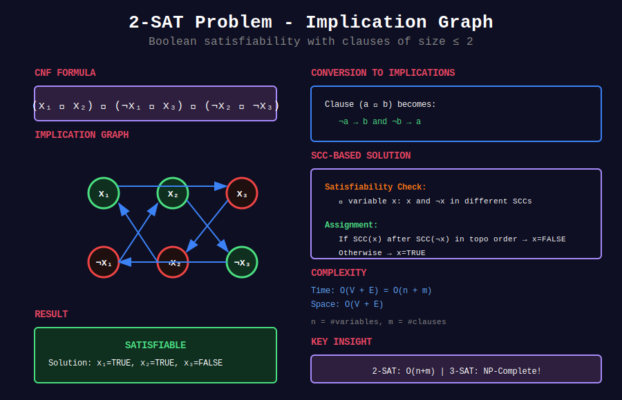

<div align="center">

# 🔀 2-SAT Problem

<p>
  
  
</p>

</div>

---

## 🧭 Navigation

| ⬅️ Previous | 📂 Current | ➡️ Next |
|:------------|:----------:|--------:|
| [← 07. Eulerian Path](../07_eulerian_path/README.md) | **08. 2-SAT** | [🏠 Home](../README.md) |

---

## 🎨 Visual Overview

<div align="center">



</div>

---

## 📐 Mathematical Foundations

### 1️⃣ SAT Problem

**Boolean Satisfiability:** Given boolean formula, find assignment making it TRUE.

**General SAT:** NP-complete

**2-SAT:** Special case with clauses of size ≤ 2 - **solvable in polynomial time!**

---

### 2️⃣ 2-SAT Definition

**Input:** Boolean formula in CNF with clauses of size ≤ 2:

$$(x_1 \lor x_2) \land (\neg x_1 \lor x_3) \land (\neg x_2 \lor \neg x_3) \land \ldots$$

**Output:** Assignment of variables to TRUE/FALSE, or "UNSATISFIABLE"

---

### 3️⃣ Implication Graph

**Convert to directed graph:**

Clause $(a \lor b)$ becomes:

- $\neg a \Rightarrow b$

- $\neg b \Rightarrow a$

**Example:** $(x_1 \lor x_2)$ creates edges:

- $\neg x_1 \to x_2$

- $\neg x_2 \to x_1$

---

### 4️⃣ Solution Using SCC

**Key theorem:** 2-SAT is satisfiable **iff** for all variables $x_i$:

$$x_i \text{ and } \neg x_i \text{ are in different SCCs}$$

**Why?** If in same SCC, then $x_i \Rightarrow \neg x_i$ and $\neg x_i \Rightarrow x_i$ (contradiction).

---

### 5️⃣ Finding Assignment

**After checking satisfiability:**

1. Find SCCs and topological order

2. For each variable $x_i$:
   - If SCC($x_i$) comes after SCC($\neg x_i$) in topo order → $x_i$ = FALSE
   - Otherwise → $x_i$ = TRUE

**Intuition:** Assign FALSE to implications that come first.

---

### 6️⃣ Complexity

**Time:** $O(V + E)$

- Build implication graph: $O(n + m)$

- Find SCCs: $O(V + E)$

- Extract assignment: $O(n)$

**Space:** $O(V + E)$

where $n$ = #variables, $m$ = #clauses

---

## 💻 Code Implementations

```python
from typing import List, Tuple, Optional
from collections import defaultdict

class TwoSAT:
    """
    2-SAT solver using SCC (Strongly Connected Components).
    
    Time: O(V+E), Space: O(V+E)
    """
    
    def __init__(self, n: int):
        """
        Args:
            n: number of variables (1 to n)
        """
        self.n = n
        # Graph: 2*n vertices (x_i and ¬x_i for each variable)
        # Index: 2*i = x_i, 2*i+1 = ¬x_i
        self.graph = defaultdict(list)
        self.graph_rev = defaultdict(list)
    
    def _var_to_node(self, var: int, negated: bool) -> int:
        """Convert variable to node index."""
        return 2 * abs(var) + (1 if negated else 0)
    
    def add_clause(self, a: int, b: int):
        """
        Add clause (a OR b).
        
        Variables are 1-indexed.
        Negative values indicate negation.
        
        Examples:
            add_clause(1, 2)     -> (x₁ OR x₂)
            add_clause(-1, 2)    -> (¬x₁ OR x₂)
            add_clause(1, -2)    -> (x₁ OR ¬x₂)
        """
        # (a OR b) = (¬a => b) AND (¬b => a)
        
        a_neg = a < 0
        b_neg = b < 0
        a_node = self._var_to_node(abs(a), a_neg)
        b_node = self._var_to_node(abs(b), b_neg)
        
        not_a = self._var_to_node(abs(a), not a_neg)
        not_b = self._var_to_node(abs(b), not b_neg)
        
        # ¬a => b
        self.graph[not_a].append(b_node)
        self.graph_rev[b_node].append(not_a)
        
        # ¬b => a
        self.graph[not_b].append(a_node)
        self.graph_rev[a_node].append(not_b)
    
    def add_implication(self, a: int, b: int):
        """
        Add implication a => b.
        
        Equivalent to (¬a OR b).
        """
        self.add_clause(-a, b)
    
    def add_at_most_one(self, variables: List[int]):
        """
        Add constraint: at most one of variables can be true.
        
        For each pair (i, j): ¬i OR ¬j
        """
        for i in range(len(variables)):
            for j in range(i + 1, len(variables)):
                self.add_clause(-variables[i], -variables[j])
    
    def add_exactly_one(self, variables: List[int]):
        """
        Add constraint: exactly one of variables must be true.
        
        At least one: (v1 OR v2 OR ... OR vn)
        At most one: for all pairs (i,j): ¬vi OR ¬vj
        """
        # At least one (requires breaking into pairs for 2-SAT)
        # Simplified: use sequential encoding
        # (This is approximation - exact encoding more complex)
        
        # At most one
        self.add_at_most_one(variables)
        
        # Force at least one (add all as clause)
        # Note: This breaks 2-SAT if len > 2
        # For proper exactly-one, use auxiliary variables
    
    def _kosaraju_scc(self) -> Tuple[int, List[int]]:
        """Find SCCs using Kosaraju's algorithm."""
        num_nodes = 2 * self.n + 2
        visited = [False] * num_nodes
        finish_order = []
        
        def dfs1(u: int):
            visited[u] = True
            for v in self.graph[u]:
                if not visited[v]:
                    dfs1(v)
            finish_order.append(u)
        
        # First DFS
        for i in range(num_nodes):
            if not visited[i]:
                dfs1(i)
        
        # Second DFS on reversed graph
        scc_id = [-1] * num_nodes
        scc_count = 0
        
        def dfs2(u: int, comp_id: int):
            scc_id[u] = comp_id
            for v in self.graph_rev[u]:
                if scc_id[v] == -1:
                    dfs2(v, comp_id)
        
        for u in reversed(finish_order):
            if scc_id[u] == -1:
                dfs2(u, scc_count)
                scc_count += 1
        
        return scc_count, scc_id
    
    def solve(self) -> Optional[List[bool]]:
        """
        Solve 2-SAT problem.
        
        Returns:
            Assignment (1-indexed, True/False for each variable)
            None if unsatisfiable
        
        Time: O(V+E), Space: O(V)
        """
        scc_count, scc_id = self._kosaraju_scc()
        
        # Check satisfiability
        for i in range(1, self.n + 1):
            pos = 2 * i
            neg = 2 * i + 1
            
            if scc_id[pos] == scc_id[neg]:
                return None  # Unsatisfiable
        
        # Build assignment
        assignment = [False] * (self.n + 1)  # 1-indexed
        
        for i in range(1, self.n + 1):
            pos = 2 * i
            neg = 2 * i + 1
            
            # If positive literal in earlier SCC (higher ID), assign False
            # Kosaraju gives reverse topological order
            if scc_id[pos] > scc_id[neg]:
                assignment[i] = True
            else:
                assignment[i] = False
        
        return assignment

# ============= Applications =============

def solve_2sat_problem(n: int, clauses: List[Tuple[int, int]]) -> Optional[List[bool]]:
    """
    Solve general 2-SAT problem.
    
    Args:
        n: number of variables
        clauses: list of (a, b) where each is variable (negative = negated)
    
    Returns:
        Assignment or None if unsatisfiable
    
    Time: O(n + m), Space: O(n + m)
    """
    sat = TwoSAT(n)
    
    for a, b in clauses:
        sat.add_clause(a, b)
    
    return sat.solve()

def graph_coloring_2colors(n: int, edges: List[List[int]]) -> Optional[List[int]]:
    """
    2-coloring of graph using 2-SAT.
    
    For each edge (u, v): (u is color A OR v is color A) AND
                         (u is color B OR v is color B)
    Simplifies to: u and v must have different colors.
    
    Time: O(V+E), Space: O(V+E)
    """
    # Actually, 2-coloring is just bipartite check (simpler than 2-SAT)
    # But we can model it with 2-SAT:
    
    sat = TwoSAT(n)
    
    for u, v in edges:
        # If u is white, v must be black: u => ¬v
        # If v is white, u must be black: v => ¬u
        sat.add_implication(u + 1, -(v + 1))
        sat.add_implication(v + 1, -(u + 1))
    
    assignment = sat.solve()
    
    if assignment is None:
        return None
    
    # Convert to colors (0 or 1)
    colors = [0] * n
    for i in range(n):
        colors[i] = 1 if assignment[i + 1] else 0
    
    return colors

# ============= Example Usage =============

def example_simple_2sat():
    """Example: Simple 2-SAT problem"""
    # (x1 OR x2) AND (¬x1 OR x3) AND (¬x2 OR ¬x3) AND (x1 OR ¬x3)
    
    sat = TwoSAT(3)
    sat.add_clause(1, 2)      # x1 OR x2
    sat.add_clause(-1, 3)     # ¬x1 OR x3
    sat.add_clause(-2, -3)    # ¬x2 OR ¬x3
    sat.add_clause(1, -3)     # x1 OR ¬x3
    
    assignment = sat.solve()
    
    if assignment:
        print("Satisfiable! Assignment:")
        for i in range(1, 4):
            print(f"  x{i} = {assignment[i]}")
    else:
        print("Unsatisfiable")

def example_implications():
    """Example: Using implications"""
    # If it rains (1), ground is wet (2)
    # If ground is wet, cannot play outside (3)
    # It rained
    # Therefore: cannot play outside
    
    sat = TwoSAT(3)
    sat.add_implication(1, 2)  # rain => wet
    sat.add_implication(2, -3) # wet => ¬play
    sat.add_clause(1, 1)       # rains (force true)
    
    assignment = sat.solve()
    
    if assignment:
        print("Rain scenario:")
        print(f"  Rains: {assignment[1]}")
        print(f"  Ground wet: {assignment[2]}")
        print(f"  Can play: {assignment[3]}")

```

---

## 🏆 Related LeetCode Problems

### 🔴 Hard

| # | Problem | Pattern | Time | Space |
|:-:|---------|---------|:----:|:-----:|
| 1834 | [Single-Threaded CPU](https://leetcode.com/problems/single-threaded-cpu/) | Can model with constraints | O(n log n) | O(n) |

---

## 📊 When to Use 2-SAT

```
Boolean Constraint Problem
     |
     +-- Each clause has ≤ 2 literals? → 2-SAT O(n+m)
     |
     +-- Each clause has ≤ 3 literals? → 3-SAT (NP-complete)
     |
     +-- Implications and constraints
         +-- Model as 2-SAT if possible

```

---

## 🎯 Key Insights

1. **2-SAT polynomial**, 3-SAT NP-complete (dramatic difference!)

2. **Reduce to graph problem** using implications

3. **SCC-based solution** elegant and efficient

4. **Many problems** can be modeled as 2-SAT

5. **Assignment from SCC topological order**

---

## 📚 References

| Resource | Link |
|----------|------|
| **2-SAT** | [Wikipedia](https://en.wikipedia.org/wiki/2-satisfiability) |
| **Tutorial** | [CP-Algorithms](https://cp-algorithms.com/graph/2SAT.html) |
| **Blog** | [Codeforces](https://codeforces.com/blog/entry/16205) |

---

<div align="center">

**Made with ❤️ by [Gaurav Goswami](https://github.com/Gaurav14cs17)**

</div>

---

## 🧭 Navigation

| ⬅️ Previous | 📂 Current | ➡️ Next |
|:------------|:----------:|--------:|
| [← 07. Eulerian Path](../07_eulerian_path/README.md) | **08. 2-SAT** | [🏠 Home](../README.md) |

