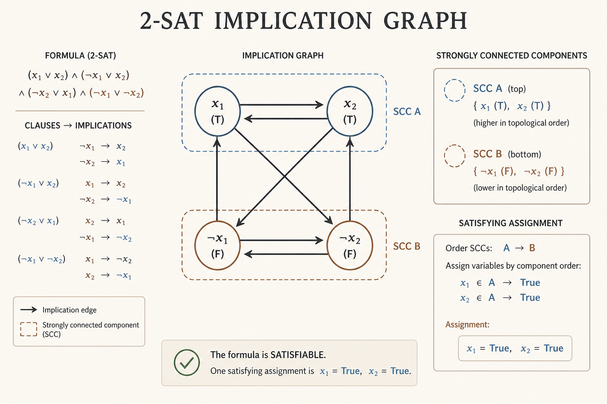
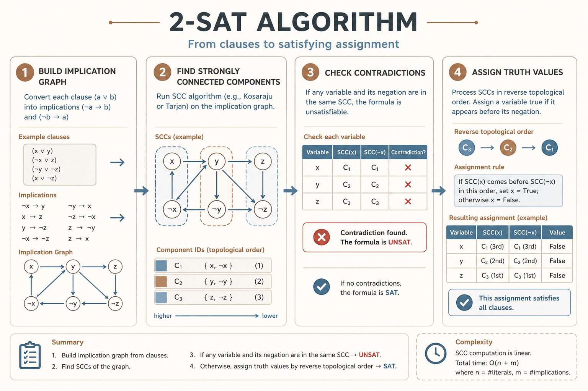
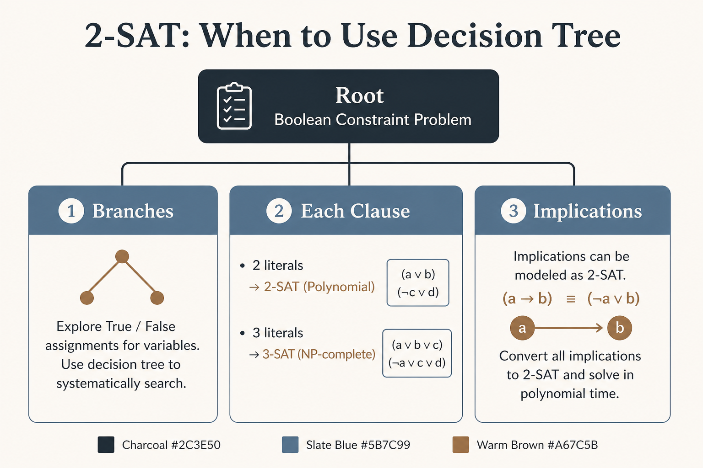

# 🔀 2-SAT Problem

### *🔀 2-SAT Problem*

  
  

---

## 📊 Visual Overview

---

## 🎯 At a Glance

| | |
|:---|:---|
| **Topic** | 🔀 2-SAT Problem |
| **Difficulty** | Hard |
| **Problems** | 5+ |

> **How to use this page:** Start with the visual overview, scan **At a Glance**, then work through theory → walkthroughs → code.

---

## 🧭 Navigation

| ⬅️ Previous | 📂 Current | ➡️ Next |
|:------------|:----------:|--------:|
| [← 07. Eulerian Path](../07_eulerian_path/README.md) | **08. 2-SAT** | [🏠 Home](../README.md) |

---

## 📐 Mathematical Foundation
### 1️⃣ SAT Problem

**Boolean Satisfiability:** Given boolean formula, find assignment making it TRUE.

**General SAT:** NP-complete

**2-SAT:** Special case with clauses of size ≤ 2 - **solvable in polynomial time!**

---

### 2️⃣ 2-SAT Definition

**Input:** Boolean formula in CNF with clauses of size ≤ 2:

$$(x_1 \lor x_2) \land (\neg x_1 \lor x_3) \land (\neg x_2 \lor \neg x_3) \land \ldots$$

**Output:** Assignment of variables to TRUE/FALSE, or "UNSATISFIABLE"

---

### 3️⃣ Implication Graph

**Convert to directed graph:**

Clause $(a \lor b)$ becomes:

- $\neg a \Rightarrow b$

- $\neg b \Rightarrow a$

**Example:** $(x_1 \lor x_2)$ creates edges:

- $\neg x_1 \to x_2$

- $\neg x_2 \to x_1$

---

### 4️⃣ Solution Using SCC

**Key theorem:** 2-SAT is satisfiable **iff** for all variables $x_i$:

$$x_i \text{ and } \neg x_i \text{ are in different SCCs}$$

**Why?** If in same SCC, then $x_i \Rightarrow \neg x_i$ and $\neg x_i \Rightarrow x_i$ (contradiction).

---

### 5️⃣ Finding Assignment

**After checking satisfiability:**

1. Find SCCs and topological order

2. For each variable $x_i$:
   - If SCC($x_i$) comes after SCC($\neg x_i$) in topo order → $x_i$ = FALSE
   - Otherwise → $x_i$ = TRUE

**Intuition:** Assign FALSE to implications that come first.

---

### 6️⃣ Complexity

**Time:** $O(V + E)$

- Build implication graph: $O(n + m)$

- Find SCCs: $O(V + E)$

- Extract assignment: $O(n)$

**Space:** $O(V + E)$

where $n$ = number of variables, $m$ = number of clauses

---

## 💻 Code Implementations

---

## 🏆 Related LeetCode Problems

### 🔴 Hard

| # | Problem | Pattern | Time | Space |
|:-:|---------|---------|:----:|:-----:|
| 1834 | [Single-Threaded CPU](https://leetcode.com/problems/single-threaded-cpu/) | Can model with constraints | O(n log n) | O(n) |

---

## 📊 When to Use 2-SAT

---

## 🎯 Key Insights

1. **2-SAT polynomial**, 3-SAT NP-complete (dramatic difference!)

2. **Reduce to graph problem** using implications

3. **SCC-based solution** elegant and efficient

4. **Many problems** can be modeled as 2-SAT

5. **Assignment from SCC topological order**

---

## 📚 References

| Resource | Link |
|----------|------|
| **2-SAT** | [Wikipedia](https://en.wikipedia.org/wiki/2-satisfiability) |
| **Tutorial** | [CP-Algorithms](https://cp-algorithms.com/graph/2SAT.html) |
| **Blog** | [Codeforces](https://codeforces.com/blog/entry/16205) |

---

**Made with ❤️ by [Gaurav Goswami](https://github.com/Gaurav14cs17)**

---
