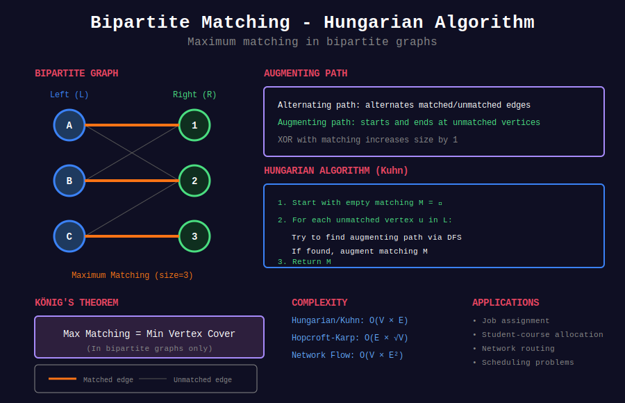

<div align="center">

# 🔗 Bipartite Matching

<p>
  
  
  
</p>

</div>

---

## 🧭 Navigation

| ⬅️ Previous | 📂 Current | ➡️ Next |
|:------------|:----------:|--------:|
| [← 2-SAT](../08_2sat/README.md) | **Bipartite Matching** | [🏠 Graph Algorithms](../README.md) |

---

## 🎨 Visual Overview

<div align="center">



</div>

---

## 📐 Mathematical Foundations

### 1️⃣ Bipartite Graph Definition

**Bipartite Graph:** Graph $G = (V, E)$ where $V = L \cup R$ and $L \cap R = \emptyset$, and all edges connect vertices in $L$ to vertices in $R$.

**2-Colorable:** Can color vertices with 2 colors such that no adjacent vertices share color.

**No Odd Cycles:** Bipartite iff no cycles of odd length.

**Detection:** Use BFS/DFS coloring - if conflict, not bipartite.

---

### 2️⃣ Matching Definition

**Matching:** Set of edges $M \subseteq E$ where no two edges share a vertex.

**Matched vertex:** Incident to edge in $M$.

**Unmatched (free) vertex:** Not incident to any edge in $M$.

**Maximum Matching:** Matching with maximum number of edges.

**Perfect Matching:** Matching where all vertices are matched.

---

### 3️⃣ Augmenting Path

**Alternating Path:** Path alternating between edges in $M$ and not in $M$.

**Augmenting Path:** Alternating path starting and ending at unmatched vertices.

**Key Theorem (Berge's Lemma):** Matching $M$ is maximum iff no augmenting path exists.

**Augmentation:** If augmenting path $P$ exists, create larger matching by XORing $M$ with edges in $P$:

$$M' = M \oplus P = (M \setminus P) \cup (P \setminus M)$$

This increases matching size by 1.

---

### 4️⃣ Hungarian Algorithm (Kuhn's Algorithm)

**Time Complexity:** $O(VE)$ for bipartite matching.

**Algorithm:**

```
1. Start with empty matching M = ∅

2. For each unmatched vertex u in L:
    3. Try to find augmenting path starting from u using DFS
    4. If found, augment matching M

5. Return M

```

**Key Insight:** Each augmenting path increases matching size by 1.

---

### 5️⃣ Hopcroft-Karp Algorithm

**Time Complexity:** $O(E\sqrt{V})$ - significant improvement!

**Key Ideas:**

1. Find **maximal set** of shortest augmenting paths using BFS

2. Augment all paths simultaneously using DFS

3. Repeat until no augmenting paths exist

**Improvement:** Processes multiple augmenting paths per iteration.

**Phases:** At most $O(\sqrt{V})$ phases, each taking $O(E)$ time.

---

### 6️⃣ König's Theorem

**Vertex Cover:** Set of vertices $C$ such that every edge has at least one endpoint in $C$.

**Minimum Vertex Cover:** Vertex cover with minimum size.

**König's Theorem:** In bipartite graph:

$$\text{Maximum Matching} = \text{Minimum Vertex Cover}$$

**Application:** After finding max matching, can find min vertex cover efficiently.

---

## 💻 Code Implementations

### Check if Bipartite

```python
from collections import deque

def is_bipartite(n, edges):
    """
    Check if graph is bipartite using BFS coloring.
    
    Args:
        n: Number of vertices
        edges: List of edges [[u, v], ...]
    
    Returns:
        (is_bipartite, partition) where partition = (L, R)
    """
    graph = [[] for _ in range(n)]
    for u, v in edges:
        graph[u].append(v)
        graph[v].append(u)
    
    color = [-1] * n
    partition_L = []
    partition_R = []
    
    for start in range(n):
        if color[start] != -1:
            continue
        
        queue = deque([start])
        color[start] = 0
        
        while queue:
            u = queue.popleft()
            
            for v in graph[u]:
                if color[v] == -1:
                    color[v] = 1 - color[u]
                    queue.append(v)
                elif color[v] == color[u]:
                    return False, ([], [])
    
    for i in range(n):
        if color[i] == 0:
            partition_L.append(i)
        else:
            partition_R.append(i)
    
    return True, (partition_L, partition_R)

```

### Maximum Bipartite Matching (Hungarian/Kuhn)

```python
def max_bipartite_matching(L, R, edges):
    """
    Find maximum matching in bipartite graph.
    
    Args:
        L: Left partition vertices (list)
        R: Right partition vertices (list)
        edges: List of edges [[u, v], ...] where u in L, v in R
    
    Returns:
        Dictionary {left_vertex: right_vertex} representing matching
    """
    # Build adjacency list
    graph = {u: [] for u in L}
    for u, v in edges:
        if u in graph:
            graph[u].append(v)
    
    match_L = {}  # L -> R
    match_R = {}  # R -> L
    
    def dfs(u, visited):
        """Try to find augmenting path from u."""
        for v in graph[u]:
            if v in visited:
                continue
            visited.add(v)
            
            # If v is unmatched or we can find augmenting path from match[v]
            if v not in match_R or dfs(match_R[v], visited):
                match_L[u] = v
                match_R[v] = u
                return True
        
        return False
    
    # Try to find augmenting path from each vertex in L
    for u in L:
        visited = set()
        dfs(u, visited)
    
    return match_L

# Example usage
L = [0, 1, 2]
R = [3, 4, 5]
edges = [[0,3], [0,4], [1,4], [1,5], [2,5]]
matching = max_bipartite_matching(L, R, edges)
print(f"Maximum Matching: {matching}")
print(f"Matching size: {len(matching)}")

```

### Hopcroft-Karp Algorithm

```python
from collections import deque

def hopcroft_karp(L, R, edges):
    """
    Maximum bipartite matching using Hopcroft-Karp algorithm.
    Time: O(E√V)
    """
    graph = {u: [] for u in L}
    for u, v in edges:
        if u in graph:
            graph[u].append(v)
    
    match_L = {}
    match_R = {}
    
    def bfs():
        """Find shortest augmenting paths using BFS."""
        queue = deque()
        dist = {}
        
        # Start from all unmatched vertices in L
        for u in L:
            if u not in match_L:
                dist[u] = 0
                queue.append(u)
        
        dist[None] = float('inf')
        
        while queue:
            u = queue.popleft()
            if u is not None and dist[u] < dist[None]:
                for v in graph[u]:
                    w = match_R.get(v)
                    if w not in dist:
                        dist[w] = dist[u] + 1
                        queue.append(w)
        
        return dist[None] != float('inf'), dist
    
    def dfs(u, dist):
        """Find augmenting path using DFS."""
        if u is None:
            return True
        
        for v in graph[u]:
            w = match_R.get(v)
            if w not in dist or dist[w] != dist[u] + 1:
                continue
            
            if dfs(w, dist):
                match_L[u] = v
                match_R[v] = u
                return True
        
        dist[u] = float('inf')
        return False
    
    # Repeatedly find and augment shortest paths
    while True:
        found, dist = bfs()
        if not found:
            break
        
        for u in L:
            if u not in match_L:
                dfs(u, dist)
    
    return match_L

```

### Minimum Vertex Cover (König's Theorem)

```python
def min_vertex_cover(L, R, edges):
    """
    Find minimum vertex cover in bipartite graph.
    Uses König's theorem: min vertex cover = max matching
    """
    # Find maximum matching
    matching = max_bipartite_matching(L, R, edges)
    
    # Build residual graph
    graph = {u: [] for u in L}
    for u, v in edges:
        if u in graph:
            graph[u].append(v)
    
    # Find vertices reachable from unmatched L vertices via alternating paths
    matched_L = set(matching.keys())
    unmatched_L = set(L) - matched_L
    
    visited_L = set()
    visited_R = set()
    
    def dfs(u, from_R):
        if from_R:
            if u in visited_L:
                return
            visited_L.add(u)
            # From R vertex, follow matching edge to L
            for l in L:
                if matching.get(l) == u:
                    dfs(l, False)
        else:
            # From L vertex, follow non-matching edges to R
            for v in graph[u]:
                if v not in visited_R:
                    visited_R.add(v)
                    dfs(v, True)
    
    # Start DFS from unmatched L vertices
    for u in unmatched_L:
        dfs(u, False)
    
    # Vertex cover = (L \ visited_L) ∪ visited_R
    cover = (set(L) - visited_L) | visited_R
    
    return list(cover)

```

---

## 📝 LeetCode Problems

| # | Problem | Difficulty | Key Technique |
|---|---------|:----------:|---------------|
| 1 | [Is Graph Bipartite?](https://leetcode.com/problems/is-graph-bipartite/) | 🟡 Medium | BFS/DFS Coloring |
| 2 | [Maximum Students Taking Exam](https://leetcode.com/problems/maximum-students-taking-exam/) | 🔴 Hard | Bipartite Matching |
| 3 | [Couples Holding Hands](https://leetcode.com/problems/couples-holding-hands/) | 🔴 Hard | Cycle Detection |
| 4 | [Possible Bipartition](https://leetcode.com/problems/possible-bipartition/) | 🟡 Medium | Graph Coloring |
| 5 | [Divide Nodes Into the Maximum Number of Groups](https://leetcode.com/problems/divide-nodes-into-the-maximum-number-of-groups/) | 🔴 Hard | Bipartite Check + BFS |
| 6 | [Find All People With Secret](https://leetcode.com/problems/find-all-people-with-secret/) | 🔴 Hard | Union Find + Sorting |
| 7 | [Maximum Compatibility Score Sum](https://leetcode.com/problems/maximum-compatibility-score-sum/) | 🟡 Medium | Backtracking/Matching |
| 8 | [Count Nodes With the Highest Score](https://leetcode.com/problems/count-nodes-with-the-highest-score/) | 🟡 Medium | Tree DP |

---

## 📊 Complexity Summary

| Algorithm | Time | Space | Notes |
|-----------|:----:|:-----:|-------|
| **Is Bipartite** | O(V + E) | O(V) | BFS/DFS coloring |
| **Hungarian (Kuhn)** | O(VE) | O(V + E) | Simple DFS-based |
| **Hopcroft-Karp** | O(E√V) | O(V + E) | Optimal for matching |
| **Min Vertex Cover** | O(VE) | O(V + E) | After max matching |
| **Network Flow** | O(VE²) | O(V + E) | Reduction to max flow |

---

## 💡 Key Insights

1. **Bipartite Check:** Use 2-coloring with BFS/DFS - no odd cycles

2. **Augmenting Path:** Alternating path between unmatched vertices

3. **Berge's Lemma:** Matching is maximum iff no augmenting path exists

4. **Hungarian Algorithm:** Repeatedly find augmenting paths - O(VE)

5. **Hopcroft-Karp:** Find multiple shortest augmenting paths - O(E√V)

6. **König's Theorem:** Max matching = min vertex cover in bipartite graphs

7. **Flow Reduction:** Bipartite matching reduces to max flow problem

---

## 🧭 Navigation

| ⬅️ Previous | 📂 Current | ➡️ Next |
|:------------|:----------:|--------:|
| [← 2-SAT](../08_2sat/README.md) | **Bipartite Matching** | [🏠 Graph Algorithms](../README.md) |

