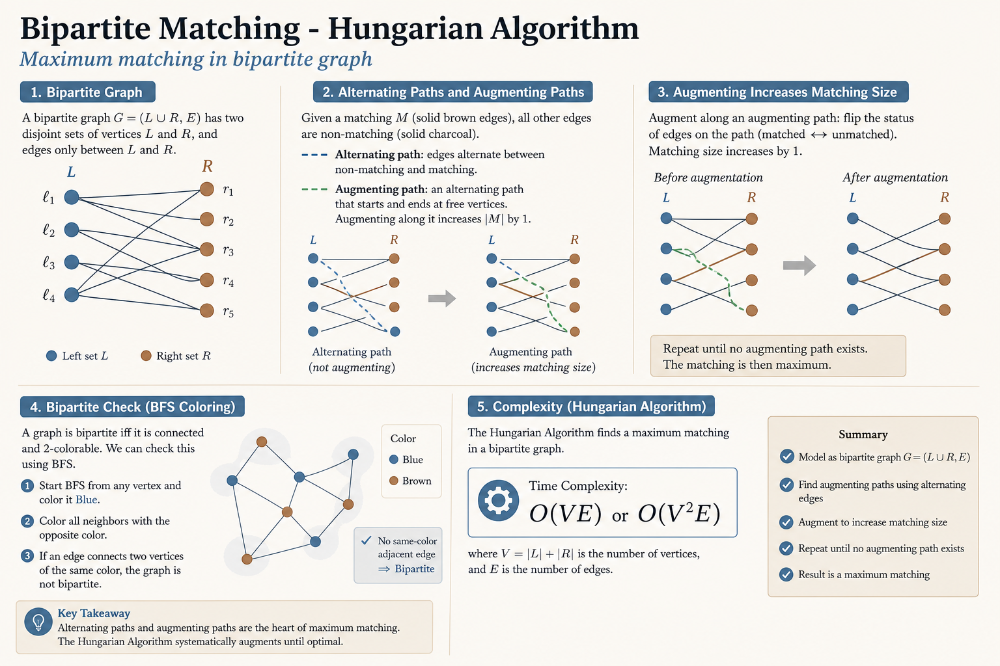
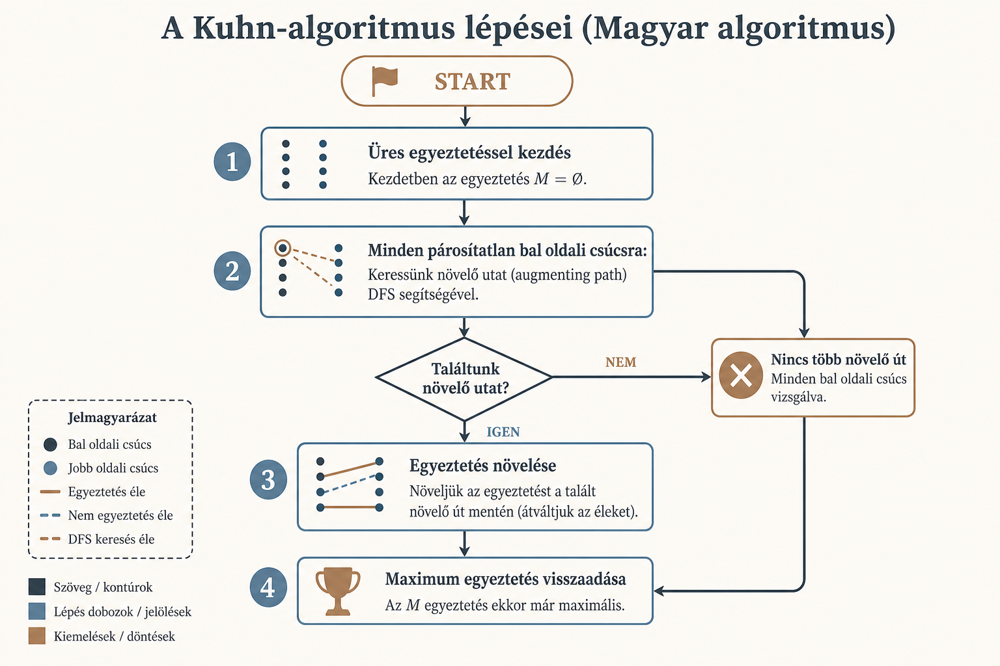
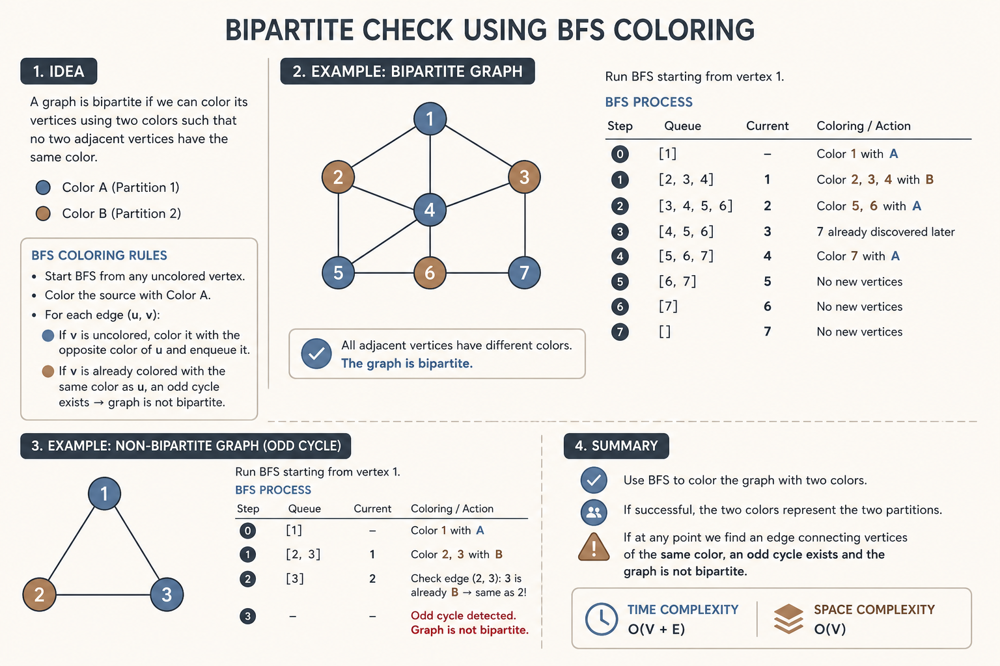
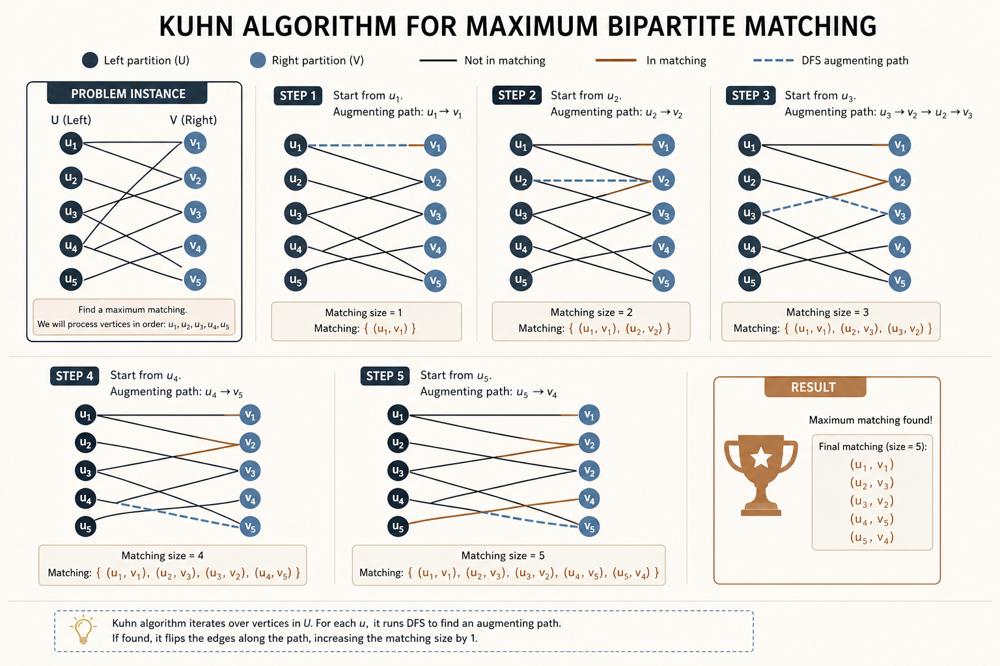
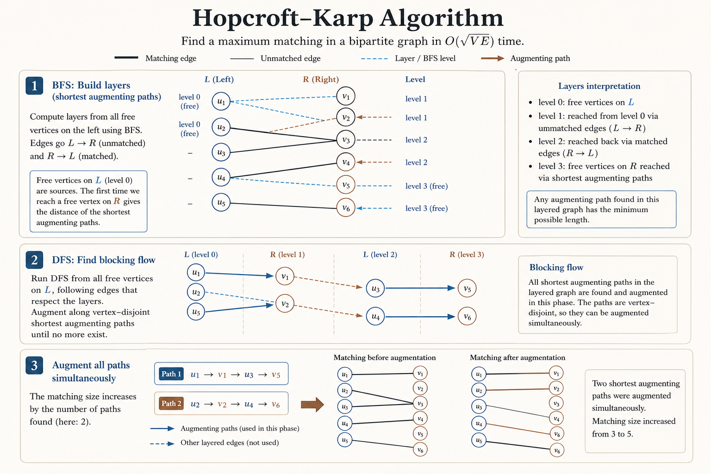
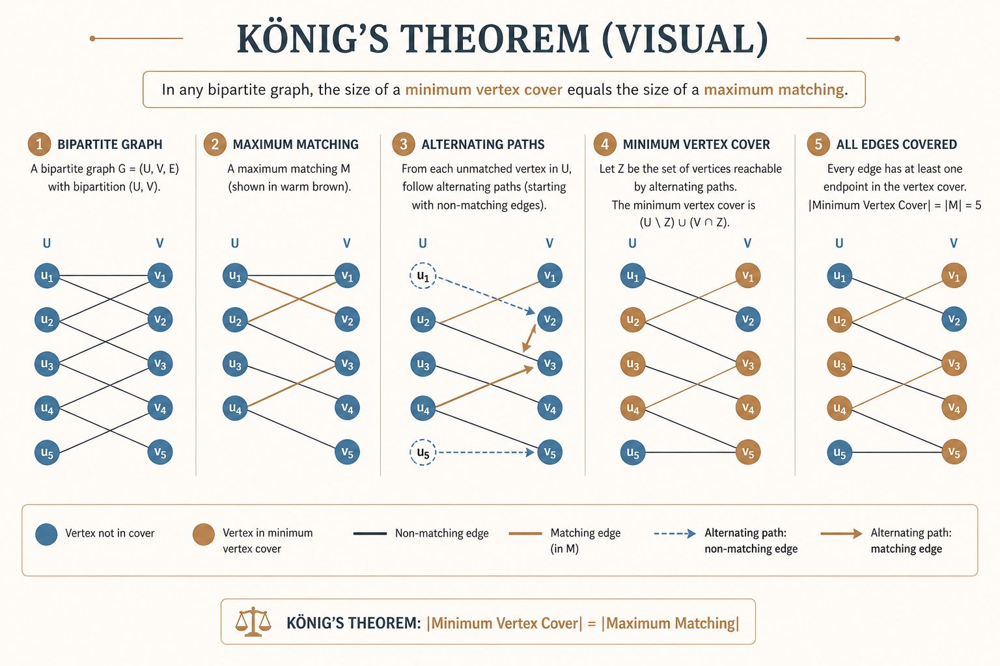

# 🔗 Bipartite Matching

### *🔗 Bipartite Matching*

  
  
  

---

## 📊 Visual Overview

---

## 🎯 At a Glance

| | |
|:---|:---|
| **Topic** | 🔗 Bipartite Matching |
| **Difficulty** | Hard |
| **Problems** | 8 |

{: .highlight }
> **How to use this page:** Start with the visual overview, scan **At a Glance**, then work through theory → walkthroughs → code.

---

## 🧭 Navigation

| ⬅️ Previous | 📂 Current | ➡️ Next |
|:------------|:----------:|--------:|
| [← 2-SAT](../08_2sat/README.md) | **Bipartite Matching** | [🏠 Graph Algorithms](../README.md) |

---

## 📐 Mathematical Foundation
### 1️⃣ Bipartite Graph Definition

**Bipartite Graph:** Graph $G = (V, E)$ where $V = L \cup R$ and $L \cap R = \emptyset$, and all edges connect vertices in $L$ to vertices in $R$.

**2-Colorable:** Can color vertices with 2 colors such that no adjacent vertices share color.

**No Odd Cycles:** Bipartite iff no cycles of odd length.

**Detection:** Use BFS/DFS coloring - if conflict, not bipartite.

---

### 2️⃣ Matching Definition

**Matching:** Set of edges $M \subseteq E$ where no two edges share a vertex.

**Matched vertex:** Incident to edge in $M$.

**Unmatched (free) vertex:** Not incident to any edge in $M$.

**Maximum Matching:** Matching with maximum number of edges.

**Perfect Matching:** Matching where all vertices are matched.

---

### 3️⃣ Augmenting Path

**Alternating Path:** Path alternating between edges in $M$ and not in $M$.

**Augmenting Path:** Alternating path starting and ending at unmatched vertices.

**Key Theorem (Berge's Lemma):** Matching $M$ is maximum iff no augmenting path exists.

**Augmentation:** If augmenting path $P$ exists, create larger matching by XORing $M$ with edges in $P$:

$$M' = M \oplus P = (M \setminus P) \cup (P \setminus M)$$

This increases matching size by 1.

---

### 4️⃣ Hungarian Algorithm (Kuhn's Algorithm)

**Time Complexity:** $O(VE)$ for bipartite matching.

**Algorithm:**

**Key Insight:** Each augmenting path increases matching size by 1.

---

### 5️⃣ Hopcroft-Karp Algorithm

**Time Complexity:** $O(E\sqrt{V})$ - significant improvement!

**Key Ideas:**

1. Find **maximal set** of shortest augmenting paths using BFS

2. Augment all paths simultaneously using DFS

3. Repeat until no augmenting paths exist

**Improvement:** Processes multiple augmenting paths per iteration.

**Phases:** At most $O(\sqrt{V})$ phases, each taking $O(E)$ time.

---

### 6️⃣ König's Theorem

**Vertex Cover:** Set of vertices $C$ such that every edge has at least one endpoint in $C$.

**Minimum Vertex Cover:** Vertex cover with minimum size.

**König's Theorem:** In bipartite graph:

$$\text{Maximum Matching} = \text{Minimum Vertex Cover}$$

**Application:** After finding max matching, can find min vertex cover efficiently.

---

## 💻 Code Implementations

### Check if Bipartite

### Maximum Bipartite Matching (Hungarian/Kuhn)

### Hopcroft-Karp Algorithm

### Minimum Vertex Cover (König's Theorem)

---

## 📝 LeetCode Problems

| # | Problem | Difficulty | Key Technique |
|---|---------|:----------:|---------------|
| 1 | [Is Graph Bipartite?](https://leetcode.com/problems/is-graph-bipartite/) | 🟡 Medium | BFS/DFS Coloring |
| 2 | [Maximum Students Taking Exam](https://leetcode.com/problems/maximum-students-taking-exam/) | 🔴 Hard | Bipartite Matching |
| 3 | [Couples Holding Hands](https://leetcode.com/problems/couples-holding-hands/) | 🔴 Hard | Cycle Detection |
| 4 | [Possible Bipartition](https://leetcode.com/problems/possible-bipartition/) | 🟡 Medium | Graph Coloring |
| 5 | [Divide Nodes Into the Maximum Number of Groups](https://leetcode.com/problems/divide-nodes-into-the-maximum-number-of-groups/) | 🔴 Hard | Bipartite Check + BFS |
| 6 | [Find All People With Secret](https://leetcode.com/problems/find-all-people-with-secret/) | 🔴 Hard | Union Find + Sorting |
| 7 | [Maximum Compatibility Score Sum](https://leetcode.com/problems/maximum-compatibility-score-sum/) | 🟡 Medium | Backtracking/Matching |
| 8 | [Count Nodes With the Highest Score](https://leetcode.com/problems/count-nodes-with-the-highest-score/) | 🟡 Medium | Tree DP |

---

## 📊 Complexity Summary

| Algorithm | Time | Space | Notes |
|-----------|:----:|:-----:|-------|
| **Is Bipartite** | O(V + E) | O(V) | BFS/DFS coloring |
| **Hungarian (Kuhn)** | O(VE) | O(V + E) | Simple DFS-based |
| **Hopcroft-Karp** | O(E√V) | O(V + E) | Optimal for matching |
| **Min Vertex Cover** | O(VE) | O(V + E) | After max matching |
| **Network Flow** | O(VE²) | O(V + E) | Reduction to max flow |

---

## 💡 Key Insights

1. **Bipartite Check:** Use 2-coloring with BFS/DFS - no odd cycles

2. **Augmenting Path:** Alternating path between unmatched vertices

3. **Berge's Lemma:** Matching is maximum iff no augmenting path exists

4. **Hungarian Algorithm:** Repeatedly find augmenting paths - O(VE)

5. **Hopcroft-Karp:** Find multiple shortest augmenting paths - O(E√V)

6. **König's Theorem:** Max matching = min vertex cover in bipartite graphs

7. **Flow Reduction:** Bipartite matching reduces to max flow problem

---
