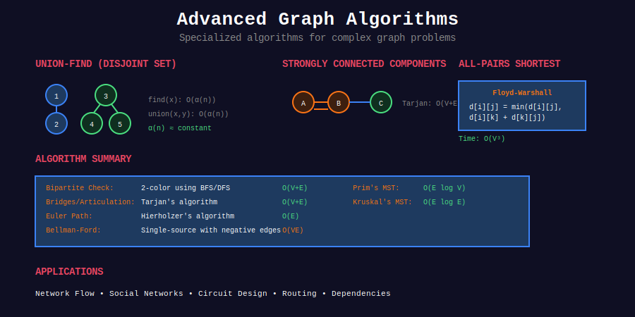
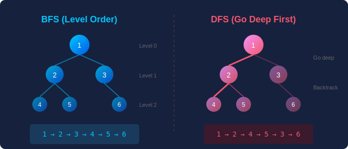

<div align="center">

# 🗺️ Advanced Graph Algorithms



<p>
  
  
  
</p>

**Complete Collection of Advanced Graph Algorithms**

*From Shortest Paths to Network Flow - Master Every Graph Technique*

</div>

---

## 🧭 Navigation

| ⬅️ Previous | 📂 Current | ➡️ Next |
|:------------|:----------:|--------:|
| [← Sliding Window](../23_sliding_window/README.md) | **Graph Algorithms** | [Tree Algorithms →](../25_tree_algorithms/README.md) |

---

## 🎨 Visual Overview

<div align="center">



</div>

---

## 📋 Overview

Comprehensive collection of **advanced graph algorithms** including:
- 🎯 Shortest Path Algorithms (Dijkstra, Bellman-Ford, Floyd-Warshall, A*)
- 🌲 Minimum Spanning Trees (Kruskal, Prim, Borůvka)
- 📊 Topological Sorting (Kahn's, DFS-based)
- 💧 Network Flow (Ford-Fulkerson, Dinic, Push-Relabel)
- 🔄 Strongly Connected Components (Kosaraju, Tarjan)
- 🌉 Bridges & Articulation Points (Critical edges/vertices)
- 🔗 Eulerian & Hamiltonian Paths
- ⚖️ 2-SAT (Boolean Satisfiability)
- 🎭 Bipartite Matching (Hungarian, Hopcroft-Karp)

---

## 📂 Subtopics

<table>
<tr>
<td width="33%" valign="top">

### [01. Shortest Path](./01_shortest_path/)

**Core Algorithms:**
- Dijkstra's Algorithm
- Bellman-Ford Algorithm
- Floyd-Warshall Algorithm
- A* Search
- SPFA (Shortest Path Faster)
- 0-1 BFS

**Complexity:**
- Dijkstra: O((V+E) log V)
- Bellman-Ford: O(VE)
- Floyd-Warshall: O(V³)

**Key Problems:**
- Single-source shortest path
- All-pairs shortest path
- Negative weight edges
- Path reconstruction

</td>
<td width="33%" valign="top">

### [02. MST](./02_minimum_spanning_tree/)

**Core Algorithms:**
- Kruskal's Algorithm
- Prim's Algorithm
- Borůvka's Algorithm

**Complexity:**
- Kruskal: O(E log E)
- Prim: O(E log V)

**Applications:**
- Network design
- Clustering
- Critical connections
- Pseudo-critical edges

</td>
<td width="33%" valign="top">

### [03. Topological Sort](./03_topological_sort/)

**Core Algorithms:**
- Kahn's Algorithm (BFS)
- DFS-based approach
- Lexicographic ordering

**Complexity:** O(V + E)

**Applications:**
- Course scheduling
- Build systems
- Task dependencies
- Cycle detection in DAGs

</td>
</tr>
<tr>
<td width="33%" valign="top">

### [04. Network Flow](./04_network_flow/)

**Core Algorithms:**
- Ford-Fulkerson Method
- Edmonds-Karp Algorithm
- Dinic's Algorithm
- Push-Relabel Algorithm

**Complexity:**
- Edmonds-Karp: O(VE²)
- Dinic: O(V²E)
- Push-Relabel: O(V³)

**Applications:**
- Maximum flow
- Minimum cut
- Bipartite matching
- Circulation problems

</td>
<td width="33%" valign="top">

### [05. SCC](./05_strongly_connected_components/)

**Core Algorithms:**
- Kosaraju's Algorithm
- Tarjan's Algorithm
- Condensation Graph

**Complexity:** O(V + E)

**Applications:**
- Graph decomposition
- Finding cycles
- Module dependencies
- Web page ranking

</td>
<td width="33%" valign="top">

### [06. Bridges & Articulation](./06_bridges_articulation_points/)

**Core Concepts:**
- Cut edges (Bridges)
- Cut vertices (Articulation points)
- Tarjan's Bridge Detection
- 2-Connected Components

**Complexity:** O(V + E)

**Applications:**
- Critical connections
- Network vulnerability
- Redundancy analysis

</td>
</tr>
<tr>
<td width="33%" valign="top">

### [07. Eulerian Paths](./07_eulerian_path/)

**Core Algorithms:**
- Hierholzer's Algorithm
- Eulerian Circuit Detection
- Hamiltonian Path (NP-Complete)

**Complexity:**
- Eulerian: O(E)
- Hamiltonian: O(n! × n)

**Applications:**
- Route planning
- DNA sequencing
- Chinese Postman Problem

</td>
<td width="33%" valign="top">

### [08. 2-SAT](./08_2sat/)

**Core Algorithms:**
- Implication Graph
- SCC-based Solution
- Kosaraju/Tarjan

**Complexity:** O(V + E)

**Applications:**
- Boolean satisfiability
- Logic puzzles
- Resource allocation
- Constraint satisfaction

</td>
<td width="33%" valign="top">

### [09. Bipartite Matching](./09_bipartite_matching/)

**Core Algorithms:**
- Hungarian Algorithm
- Hopcroft-Karp Algorithm
- Ford-Fulkerson for matching
- Kuhn's Algorithm

**Complexity:**
- Hungarian: O(V³)
- Hopcroft-Karp: O(E√V)

**Applications:**
- Job assignment
- Maximum matching
- Minimum vertex cover
- Hall's Marriage Theorem

</td>
</tr>
</table>

---

## 🏆 Key Problems by Category

### 🟢 Easy (Foundation)

| # | Problem | Category | Key Algorithm |
|:-:|---------|----------|---------------|
| 997 | [Find the Town Judge](https://leetcode.com/problems/find-the-town-judge/) | Graph basics | Degree counting |
| 1791 | [Find Center of Star Graph](https://leetcode.com/problems/find-center-of-star-graph/) | Graph basics | Degree analysis |

### 🟡 Medium (Core Skills)

| # | Problem | Category | Key Algorithm |
|:-:|---------|----------|---------------|
| 743 | [Network Delay Time](https://leetcode.com/problems/network-delay-time/) | Shortest Path | Dijkstra |
| 787 | [Cheapest Flights Within K Stops](https://leetcode.com/problems/cheapest-flights-within-k-stops/) | Shortest Path | Bellman-Ford/DP |
| 1584 | [Min Cost to Connect All Points](https://leetcode.com/problems/min-cost-to-connect-all-points/) | MST | Kruskal/Prim |
| 1489 | [Find Critical/Pseudo-Critical Edges](https://leetcode.com/problems/find-critical-and-pseudo-critical-edges-in-minimum-spanning-tree/) | MST | Kruskal variations |
| 207 | [Course Schedule](https://leetcode.com/problems/course-schedule/) | Topological Sort | Kahn's/DFS |
| 210 | [Course Schedule II](https://leetcode.com/problems/course-schedule-ii/) | Topological Sort | Kahn's algorithm |
| 310 | [Minimum Height Trees](https://leetcode.com/problems/minimum-height-trees/) | Graph centers | Topological sort |
| 1514 | [Path with Max Probability](https://leetcode.com/problems/path-with-maximum-probability/) | Modified Dijkstra | Probability paths |
| 1334 | [Find City With Smallest Number](https://leetcode.com/problems/find-the-city-with-the-smallest-number-of-neighbors-at-a-threshold-distance/) | All-pairs | Floyd-Warshall |

### 🔴 Hard (Advanced)

| # | Problem | Category | Key Algorithm |
|:-:|---------|----------|---------------|
| 778 | [Swim in Rising Water](https://leetcode.com/problems/swim-in-rising-water/) | Modified Dijkstra | Binary search + BFS |
| 1368 | [Minimum Cost to Make Valid Path](https://leetcode.com/problems/minimum-cost-to-make-at-least-one-valid-path-in-a-grid/) | 0-1 BFS | Deque optimization |
| 1976 | [Number of Ways to Arrive](https://leetcode.com/problems/number-of-ways-to-arrive-at-destination/) | Shortest paths | Dijkstra + counting |
| 2203 | [Minimum Weighted Subgraph](https://leetcode.com/problems/minimum-weighted-subgraph-with-the-required-paths/) | Multi-source | Dijkstra (3 times) |
| 269 | [Alien Dictionary](https://leetcode.com/problems/alien-dictionary/) | Topological Sort | DFS/Kahn's |
| 1192 | [Critical Connections](https://leetcode.com/problems/critical-connections-in-a-network/) | Bridges | Tarjan's algorithm |
| 332 | [Reconstruct Itinerary](https://leetcode.com/problems/reconstruct-itinerary/) | Eulerian Path | Hierholzer |
| 753 | [Cracking the Safe](https://leetcode.com/problems/cracking-the-safe/) | Eulerian Circuit | De Bruijn graph |

---

## 💻 Core Implementation Templates

### Template 1: Dijkstra's Algorithm

```python
import heapq
from typing import List, Dict

def dijkstra(graph: Dict[int, List[tuple[int, int]]], 
            start: int, n: int) -> List[int]:
    """
    Dijkstra's shortest path algorithm.
    
    Args:
        graph: Adjacency list {node: [(neighbor, weight), ...]}
        start: Starting node
        n: Number of nodes
    
    Returns:
        List of shortest distances from start
    
    Time: O((V + E) log V)
    Space: O(V)
    """
    dist = [float('inf')] * n
    dist[start] = 0
    
    pq = [(0, start)]  # (distance, node)
    
    while pq:
        d, u = heapq.heappop(pq)
        
        if d > dist[u]:
            continue
        
        for v, weight in graph.get(u, []):
            if dist[u] + weight < dist[v]:
                dist[v] = dist[u] + weight
                heapq.heappush(pq, (dist[v], v))
    
    return dist
```

---

### Template 2: Kruskal's MST with Union-Find

```python
class UnionFind:
    def __init__(self, n: int):
        self.parent = list(range(n))
        self.rank = [0] * n
    
    def find(self, x: int) -> int:
        if self.parent[x] != x:
            self.parent[x] = self.find(self.parent[x])
        return self.parent[x]
    
    def union(self, x: int, y: int) -> bool:
        px, py = self.find(x), self.find(y)
        if px == py:
            return False
        if self.rank[px] < self.rank[py]:
            px, py = py, px
        self.parent[py] = px
        if self.rank[px] == self.rank[py]:
            self.rank[px] += 1
        return True

def kruskal_mst(n: int, edges: List[tuple[int, int, int]]) -> int:
    """
    Kruskal's algorithm for MST.
    
    Args:
        n: Number of nodes
        edges: List of (u, v, weight)
    
    Returns:
        Total weight of MST
    
    Time: O(E log E)
    """
    edges.sort(key=lambda x: x[2])  # Sort by weight
    uf = UnionFind(n)
    
    mst_weight = 0
    edges_used = 0
    
    for u, v, weight in edges:
        if uf.union(u, v):
            mst_weight += weight
            edges_used += 1
            if edges_used == n - 1:
                break
    
    return mst_weight if edges_used == n - 1 else -1
```

---

### Template 3: Topological Sort (Kahn's Algorithm)

```python
from collections import deque, defaultdict

def topological_sort(n: int, edges: List[tuple[int, int]]) -> List[int]:
    """
    Kahn's algorithm for topological sorting.
    
    Args:
        n: Number of nodes
        edges: List of directed edges (u, v)
    
    Returns:
        Topological order or empty list if cycle exists
    
    Time: O(V + E)
    """
    graph = defaultdict(list)
    indegree = [0] * n
    
    for u, v in edges:
        graph[u].append(v)
        indegree[v] += 1
    
    queue = deque([i for i in range(n) if indegree[i] == 0])
    result = []
    
    while queue:
        u = queue.popleft()
        result.append(u)
        
        for v in graph[u]:
            indegree[v] -= 1
            if indegree[v] == 0:
                queue.append(v)
    
    return result if len(result) == n else []
```

---

### Template 4: Tarjan's SCC

```python
def tarjan_scc(graph: Dict[int, List[int]], n: int) -> List[List[int]]:
    """
    Tarjan's algorithm for finding strongly connected components.
    
    Time: O(V + E)
    Space: O(V)
    """
    index_counter = [0]
    stack = []
    lowlinks = [0] * n
    index = [0] * n
    on_stack = [False] * n
    index_initialized = [False] * n
    sccs = []
    
    def strongconnect(v):
        index[v] = index_counter[0]
        lowlinks[v] = index_counter[0]
        index_counter[0] += 1
        index_initialized[v] = True
        stack.append(v)
        on_stack[v] = True
        
        for w in graph.get(v, []):
            if not index_initialized[w]:
                strongconnect(w)
                lowlinks[v] = min(lowlinks[v], lowlinks[w])
            elif on_stack[w]:
                lowlinks[v] = min(lowlinks[v], index[w])
        
        if lowlinks[v] == index[v]:
            scc = []
            while True:
                w = stack.pop()
                on_stack[w] = False
                scc.append(w)
                if w == v:
                    break
            sccs.append(scc)
    
    for v in range(n):
        if not index_initialized[v]:
            strongconnect(v)
    
    return sccs
```

---

## 🎓 Common Patterns & Techniques

### Pattern 1: Graph Transformation

```python
# Transform problem into graph problem
# Example: Course prerequisites → Directed graph
def build_graph(n: int, prerequisites: List[List[int]]):
    graph = defaultdict(list)
    for a, b in prerequisites:
        graph[b].append(a)  # b must come before a
    return graph
```

### Pattern 2: State Space Search

```python
# Model states as nodes, transitions as edges
# Example: Word ladder → BFS on transformation graph
```

### Pattern 3: Binary Search + Graph

```python
# Binary search on answer + graph validation
# Example: Minimum effort path → Binary search + BFS
```

---

## 💡 Key Insights

> **Shortest Path Selection:**  
> - Single-source, non-negative: **Dijkstra**
> - Single-source, negative edges: **Bellman-Ford**
> - All-pairs: **Floyd-Warshall**
> - Unweighted: **BFS**

> **MST Selection:**  
> - Sparse graph (E ≈ V): **Kruskal**
> - Dense graph (E ≈ V²): **Prim**
> - Parallel algorithms: **Borůvka**

> **Cycle Detection:**  
> - Undirected: DFS with parent tracking
> - Directed: DFS with recursion stack or topological sort

> **Critical Connections:**  
> - Bridges: Tarjan's algorithm O(V + E)
> - Articulation points: Similar to bridges
> - Don't use DFS alone - need low-link values!

---

## 📚 References

| Topic | Resource | Link |
|-------|----------|------|
| **Shortest Path** | CP-Algorithms | [Link](https://cp-algorithms.com/graph/dijkstra.html) |
| **MST** | Wikipedia | [Kruskal](https://en.wikipedia.org/wiki/Kruskal%27s_algorithm) |
| **Network Flow** | Stanford CS | [Max Flow](https://web.stanford.edu/class/cs97si/08-network-flow-problems.pdf) |
| **SCC** | CP-Algorithms | [Tarjan](https://cp-algorithms.com/graph/strongly-connected-components.html) |
| **Bridges** | CP-Algorithms | [Link](https://cp-algorithms.com/graph/bridge-searching.html) |

---

## 💭 Common Interview Questions

**Q: When to use Dijkstra vs Bellman-Ford?**  
A: Dijkstra for non-negative weights (faster). Bellman-Ford can handle negative weights and detect negative cycles.

**Q: Why does Dijkstra fail with negative weights?**  
A: Greedy selection assumes once a node is visited with minimum distance, it won't be updated. Negative edges violate this.

**Q: What's the difference between Kruskal and Prim?**  
A: Kruskal works on edges (sort + union-find). Prim works on nodes (priority queue). Kruskal better for sparse graphs.

**Q: How to detect cycles in directed vs undirected graphs?**  
A: Directed: Use recursion stack in DFS or try topological sort. Undirected: DFS with parent tracking or union-find.

**Q: What's the most efficient algorithm for all-pairs shortest path?**  
A: Depends. Floyd-Warshall O(V³) is simple. For sparse graphs, run Dijkstra from each node: O(V(E + V) log V).

---

<div align="center">

### 🎯 Master Graph Algorithms

*"Graphs are everywhere - master them to solve any network problem"*

**From theory to practice - comprehensive guide to graph algorithms**

**Made with ❤️ by [Gaurav Goswami](https://github.com/Gaurav14cs17)**

</div>

---

## 🧭 Navigation

| ⬅️ Previous | 📂 Current | ➡️ Next |
|:------------|:----------:|--------:|
| [← Sliding Window](../23_sliding_window/README.md) | **Graph Algorithms** | [Tree Algorithms →](../25_tree_algorithms/README.md) |
