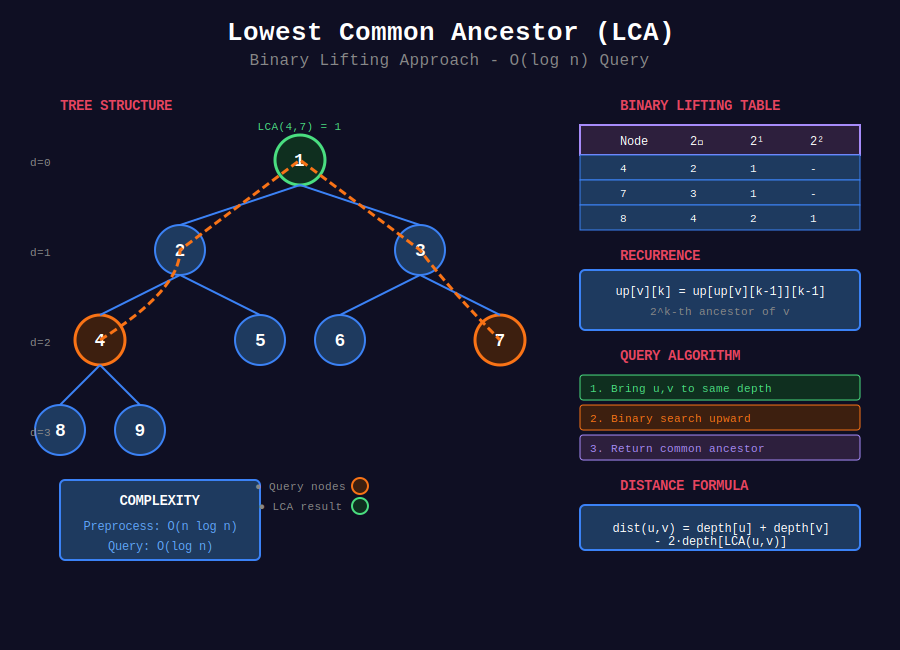

<div align="center">

# 🔍 Lowest Common Ancestor (LCA)

<p>
  
  
</p>

</div>

---

## 🧭 Navigation

| ⬅️ Previous | 📂 Current | ➡️ Next |
|:------------|:----------:|--------:|
| [← Tree Algorithms](../README.md) | **01. LCA** | [02. Tree DP →](../02_tree_dp/README.md) |

---

## 📊 Visual Overview

<div align="center">

</div>

---

## 📐 Mathematical Foundations

### 1️⃣ LCA Definition

**Lowest Common Ancestor** of nodes $u$ and $v$ in tree $T$:

```math
\text{LCA}(u, v) = w \text{ where } w \text{ is ancestor of both } u, v \text{ and deepest such node}

```

**Properties:**
- $\text{LCA}(u, u) = u$
- $\text{LCA}(u, v) = \text{LCA}(v, u)$ (symmetric)
- If $u$ is ancestor of $v$, then $\text{LCA}(u, v) = u$

---

### 2️⃣ Algorithm Comparison

| Algorithm | Preprocessing | Query | Space | Notes |
|-----------|:-------------:|:-----:|:-----:|-------|
| **Naive DFS** | O(1) | O(n) | O(n) | Simple, slow queries |
| **Parent Pointers** | O(n) | O(h) | O(n) | Good for balanced trees |
| **Binary Lifting** | O(n log n) | O(log n) | O(n log n) | Most common |
| **Euler Tour + RMQ** | O(n) | O(1) | O(n) | Optimal, complex |
| **Tarjan's Offline** | O(n α(n)) | - | O(n) | All queries at once |

---

### 3️⃣ Binary Lifting

**Idea:** Precompute ancestors at powers of 2 distances.

**Table:** $\text{up}[v][k] = 2^k$-th ancestor of $v$

**Recurrence:**

```math
\text{up}[v][k] = \begin{cases}
\text{parent}[v] & \text{if } k = 0 \\
\text{up}[\text{up}[v][k-1]][k-1] & \text{if } k > 0
\end{cases}

```

**Query Algorithm:**
1. Bring $u$ and $v$ to same level
2. Binary search for LCA by jumping up in powers of 2

**Complexity:**
- Preprocess: $O(n \log n)$
- Query: $O(\log n)$
- Space: $O(n \log n)$

---

### 4️⃣ Euler Tour + RMQ

**Euler Tour:** Visit nodes in DFS, recording each entry/exit.

**Properties:**
- Length $= 2n - 1$
- LCA$(u, v)$ = node with minimum depth in tour between first occurrences of $u$ and $v$

**Steps:**
1. Build Euler tour with depths
2. Record first occurrence of each node
3. LCA query = RMQ (Range Minimum Query) on depths

**Complexity:**
- Preprocess: $O(n)$ with RMQ
- Query: $O(1)$
- Space: $O(n)$

---

### 5️⃣ Tarjan's Offline Algorithm

**Union-Find based approach** for all queries at once.

**Algorithm:**
1. DFS through tree
2. Union visited nodes
3. Answer queries when both nodes visited

**Complexity:** $O(n \cdot \alpha(n))$ for all queries

---

### 6️⃣ Distance Between Nodes

**Distance** between $u$ and $v$:

```math
\text{dist}(u, v) = \text{depth}[u] + \text{depth}[v] - 2 \cdot \text{depth}[\text{LCA}(u, v)]

```

---

### 7️⃣ Path Queries

**Check if $w$ is on path from $u$ to $v$:**

```math
w \text{ on path} \iff \text{LCA}(u, v) = \text{LCA}(u, w) = \text{LCA}(w, v)

```

or equivalently:

```math
\text{dist}(u, v) = \text{dist}(u, w) + \text{dist}(w, v)

```

---

## 💻 Code Implementations

```python
from typing import List, Optional
from collections import defaultdict, deque
import math

class TreeNode:
    def __init__(self, val=0, left=None, right=None):
        self.val = val
        self.left = left
        self.right = right

class LCA_Simple:
    """Simple LCA using parent pointers."""
    
    def __init__(self, root: TreeNode):
        """
        Build parent and depth maps.
        
        Time: O(n), Space: O(n)
        """
        self.parent = {}
        self.depth = {}
        self._build(root, None, 0)
    
    def _build(self, node: Optional[TreeNode], par: Optional[TreeNode], d: int):
        """DFS to build parent and depth."""
        if not node:
            return
        self.parent[node] = par
        self.depth[node] = d
        self._build(node.left, node, d + 1)
        self._build(node.right, node, d + 1)
    
    def lca(self, p: TreeNode, q: TreeNode) -> TreeNode:
        """
        Find LCA using parent pointers.
        
        Time: O(h), Space: O(h)
        """
        # Bring to same level
        while self.depth[p] > self.depth[q]:
            p = self.parent[p]
        while self.depth[q] > self.depth[p]:
            q = self.parent[q]
        
        # Move up until same node
        while p != q:
            p = self.parent[p]
            q = self.parent[q]
        
        return p

class LCA_BinaryLifting:
    """LCA using Binary Lifting (Jump Pointers)."""
    
    def __init__(self, n: int, edges: List[List[int]], root: int = 0):
        """
        Initialize binary lifting for tree.
        
        Args:
            n: number of nodes (0 to n-1)
            edges: list of [u, v] edges
            root: root node
        
        Time: O(n log n), Space: O(n log n)
        """
        self.n = n
        self.LOG = math.ceil(math.log2(n)) + 1
        
        # Build adjacency list
        self.graph = defaultdict(list)
        for u, v in edges:
            self.graph[u].append(v)
            self.graph[v].append(u)
        
        # up[v][k] = 2^k-th ancestor of v
        self.up = [[-1] * self.LOG for _ in range(n)]
        self.depth = [0] * n
        
        # Build with DFS
        self._dfs(root, -1, 0)
        
        # Precompute binary lifting table
        for k in range(1, self.LOG):
            for v in range(n):
                if self.up[v][k - 1] != -1:
                    self.up[v][k] = self.up[self.up[v][k - 1]][k - 1]
    
    def _dfs(self, u: int, parent: int, d: int):
        """DFS to build parent and depth."""
        self.up[u][0] = parent
        self.depth[u] = d
        
        for v in self.graph[u]:
            if v != parent:
                self._dfs(v, u, d + 1)
    
    def lca(self, u: int, v: int) -> int:
        """
        Find LCA of u and v.
        
        Time: O(log n), Space: O(1)
        """
        # Make u deeper
        if self.depth[u] < self.depth[v]:
            u, v = v, u
        
        # Bring u to same level as v
        diff = self.depth[u] - self.depth[v]
        for k in range(self.LOG):
            if (diff >> k) & 1:
                u = self.up[u][k]
        
        if u == v:
            return u
        
        # Binary search for LCA
        for k in range(self.LOG - 1, -1, -1):
            if self.up[u][k] != self.up[v][k]:
                u = self.up[u][k]
                v = self.up[v][k]
        
        return self.up[u][0]
    
    def kth_ancestor(self, node: int, k: int) -> int:
        """
        Find k-th ancestor of node.
        
        Time: O(log k), Space: O(1)
        """
        for i in range(self.LOG):
            if (k >> i) & 1:
                node = self.up[node][i]
                if node == -1:
                    return -1
        return node
    
    def distance(self, u: int, v: int) -> int:
        """
        Find distance between u and v.
        
        Time: O(log n), Space: O(1)
        """
        lca = self.lca(u, v)
        return self.depth[u] + self.depth[v] - 2 * self.depth[lca]

class LCA_EulerTour:
    """LCA using Euler Tour + Sparse Table RMQ."""
    
    def __init__(self, root: TreeNode):
        """
        Build Euler tour and sparse table.
        
        Time: O(n log n), Space: O(n log n)
        """
        self.euler = []  # Euler tour
        self.depth = []  # Depths in tour
        self.first = {}  # First occurrence of each node
        
        # Build Euler tour
        self._dfs(root, 0)
        
        # Build sparse table for RMQ
        self._build_sparse_table()
    
    def _dfs(self, node: Optional[TreeNode], d: int):
        """Build Euler tour."""
        if not node:
            return
        
        if node not in self.first:
            self.first[node] = len(self.euler)
        
        self.euler.append(node)
        self.depth.append(d)
        
        if node.left:
            self._dfs(node.left, d + 1)
            self.euler.append(node)
            self.depth.append(d)
        
        if node.right:
            self._dfs(node.right, d + 1)
            self.euler.append(node)
            self.depth.append(d)
    
    def _build_sparse_table(self):
        """Build sparse table for RMQ on depths."""
        n = len(self.depth)
        self.LOG = math.ceil(math.log2(n)) + 1
        
        # st[i][j] = index of minimum in [i, i+2^j)
        self.st = [[-1] * self.LOG for _ in range(n)]
        
        # Base case: intervals of length 1
        for i in range(n):
            self.st[i][0] = i
        
        # Build table
        j = 1
        while (1 << j) <= n:
            i = 0
            while i + (1 << j) <= n:
                left = self.st[i][j - 1]
                right = self.st[i + (1 << (j - 1))][j - 1]
                if self.depth[left] < self.depth[right]:
                    self.st[i][j] = left
                else:
                    self.st[i][j] = right
                i += 1
            j += 1
    
    def _rmq(self, l: int, r: int) -> int:
        """Range minimum query on [l, r]."""
        j = int(math.log2(r - l + 1))
        left = self.st[l][j]
        right = self.st[r - (1 << j) + 1][j]
        if self.depth[left] < self.depth[right]:
            return left
        return right
    
    def lca(self, p: TreeNode, q: TreeNode) -> TreeNode:
        """
        Find LCA using Euler tour + RMQ.
        
        Time: O(1), Space: O(1)
        """
        l = self.first[p]
        r = self.first[q]
        if l > r:
            l, r = r, l
        
        idx = self._rmq(l, r)
        return self.euler[idx]

# ============= LeetCode Problems =============

def lowestCommonAncestor(root: TreeNode, p: TreeNode, q: TreeNode) -> TreeNode:
    """
    LeetCode 236: Lowest Common Ancestor of a Binary Tree
    
    Simple recursive solution.
    
    Time: O(n), Space: O(h)
    """
    if not root or root == p or root == q:
        return root
    
    left = lowestCommonAncestor(root.left, p, q)
    right = lowestCommonAncestor(root.right, p, q)
    
    if left and right:
        return root
    return left if left else right

def lowestCommonAncestorBST(root: TreeNode, p: TreeNode, q: TreeNode) -> TreeNode:
    """
    LeetCode 235: LCA of BST
    
    Use BST property for O(h) time.
    
    Time: O(h), Space: O(1)
    """
    while root:
        if p.val < root.val and q.val < root.val:
            root = root.left
        elif p.val > root.val and q.val > root.val:
            root = root.right
        else:
            return root
    return None

def distanceK(root: TreeNode, target: TreeNode, k: int) -> List[int]:
    """
    LeetCode 863: All Nodes Distance K in Binary Tree
    
    Build parent pointers, then BFS from target.
    
    Time: O(n), Space: O(n)
    """
    # Build parent pointers
    parent = {}
    
    def build_parent(node, par=None):
        if not node:
            return
        parent[node] = par
        build_parent(node.left, node)
        build_parent(node.right, node)
    
    build_parent(root)
    
    # BFS from target
    queue = deque([(target, 0)])
    visited = {target}
    result = []
    
    while queue:
        node, dist = queue.popleft()
        
        if dist == k:
            result.append(node.val)
            continue
        
        # Check all neighbors (left, right, parent)
        for neighbor in [node.left, node.right, parent.get(node)]:
            if neighbor and neighbor not in visited:
                visited.add(neighbor)
                queue.append((neighbor, dist + 1))
    
    return result

class TreeAncestor:
    """
    LeetCode 1483: Kth Ancestor of a Tree Node
    
    Binary lifting for O(log n) queries.
    """
    
    def __init__(self, n: int, parent: List[int]):
        """
        Time: O(n log n), Space: O(n log n)
        """
        self.LOG = math.ceil(math.log2(n)) + 1
        self.up = [[-1] * self.LOG for _ in range(n)]
        
        # Base case: immediate parent
        for i in range(n):
            self.up[i][0] = parent[i]
        
        # Build binary lifting table
        for k in range(1, self.LOG):
            for v in range(n):
                if self.up[v][k - 1] != -1:
                    self.up[v][k] = self.up[self.up[v][k - 1]][k - 1]
    
    def getKthAncestor(self, node: int, k: int) -> int:
        """
        Time: O(log k), Space: O(1)
        """
        for i in range(self.LOG):
            if (k >> i) & 1:
                node = self.up[node][i]
                if node == -1:
                    return -1
        return node

def lcaDeepestLeaves(root: TreeNode) -> TreeNode:
    """
    LeetCode 1123: Lowest Common Ancestor of Deepest Leaves
    
    Find deepest leaves and return their LCA.
    
    Time: O(n), Space: O(h)
    """
    def dfs(node):
        """Returns (depth, lca_of_deepest)."""
        if not node:
            return (0, None)
        
        left_depth, left_lca = dfs(node.left)
        right_depth, right_lca = dfs(node.right)
        
        if left_depth > right_depth:
            return (left_depth + 1, left_lca)
        elif right_depth > left_depth:
            return (right_depth + 1, right_lca)
        else:
            return (left_depth + 1, node)
    
    return dfs(root)[1]

def countPairs(n: int, edges: List[List[int]], queries: List[List[int]]) -> List[int]:
    """
    LeetCode 1530: Number of Good Leaf Nodes Pairs
    
    For each leaf pair, check if distance <= threshold.
    
    Time: O(n²) for small trees, Space: O(n)
    """
    from collections import defaultdict
    
    # Build tree
    tree = defaultdict(list)
    for u, v in edges:
        tree[u].append(v)
        tree[v].append(u)
    
    # Find all leaves
    leaves = [i for i in range(n) if len(tree[i]) <= 1]
    
    # Count pairs for each distance threshold
    def count_close_pairs(threshold):
        count = 0
        # For each pair of leaves, check distance
        for i in range(len(leaves)):
            for j in range(i + 1, len(leaves)):
                # BFS to find distance
                queue = deque([(leaves[i], 0)])
                visited = {leaves[i]}
                found = False
                
                while queue and not found:
                    node, dist = queue.popleft()
                    if node == leaves[j]:
                        if dist <= threshold:
                            count += 1
                        found = True
                        break
                    
                    if dist < threshold:
                        for neighbor in tree[node]:
                            if neighbor not in visited:
                                visited.add(neighbor)
                                queue.append((neighbor, dist + 1))
        return count
    
    return [count_close_pairs(q) for q in queries]

```

---

## 🏆 LeetCode Problems

### 🟢 Easy

| # | Problem | Pattern | Time | Space |
|:-:|---------|---------|:----:|:-----:|
| 235 | [LCA of BST](https://leetcode.com/problems/lowest-common-ancestor-of-a-binary-search-tree/) | BST Property | O(h) | O(1) |

### 🟡 Medium

| # | Problem | Pattern | Time | Space |
|:-:|---------|---------|:----:|:-----:|
| 236 | [LCA of Binary Tree](https://leetcode.com/problems/lowest-common-ancestor-of-a-binary-tree/) | Recursive | O(n) | O(h) |
| 863 | [Nodes Distance K](https://leetcode.com/problems/all-nodes-distance-k-in-binary-tree/) | Parent Pointers + BFS | O(n) | O(n) |
| 865 | [Smallest Subtree with Deepest Nodes](https://leetcode.com/problems/smallest-subtree-with-all-the-deepest-nodes/) | DFS | O(n) | O(h) |
| 1123 | [LCA of Deepest Leaves](https://leetcode.com/problems/lowest-common-ancestor-of-deepest-leaves/) | DFS | O(n) | O(h) |
| 1123 | [LCA Deepest Leaves](https://leetcode.com/problems/lowest-common-ancestor-of-deepest-leaves/) | Post-order DFS | O(n) | O(h) |
| 1530 | [Good Leaf Nodes Pairs](https://leetcode.com/problems/number-of-good-leaf-nodes-pairs/) | Distance | O(n²) | O(n) |
| 1650 | [LCA III (with parent)](https://leetcode.com/problems/lowest-common-ancestor-of-a-binary-tree-iii/) | Two Pointers | O(h) | O(1) |

### 🔴 Hard

| # | Problem | Pattern | Time | Space |
|:-:|---------|---------|:----:|:-----:|
| 1483 | [Kth Ancestor](https://leetcode.com/problems/kth-ancestor-of-a-tree-node/) | Binary Lifting | O(log n) query | O(n log n) |
| 1569 | [Ways to Arrange Array](https://leetcode.com/problems/number-of-ways-to-reorder-array-to-get-same-bst/) | Tree + Combinatorics | O(n²) | O(n²) |

---

## 📊 Algorithm Selection

```
LCA Problem
     |
     +-- Single query → Simple recursive O(n)
     |
     +-- Multiple queries
     |   +-- Online (interactive) → Binary Lifting O(log n) per query
     |   +-- Offline (all at once) → Tarjan's O(n α(n)) total
     |
     +-- Need O(1) queries → Euler Tour + RMQ
     |
     +-- BST → Use BST property O(h)

```

---

## 🎯 Key Insights

1. **Binary Lifting** most practical for online queries
2. **Euler Tour + RMQ** optimal but complex to implement
3. **Simple recursion** sufficient for single/few queries
4. **Distance** = sum of depths minus 2 × LCA depth
5. **K-th ancestor** easily solved with binary lifting

---

## 📚 References

| Resource | Link |
|----------|------|
| **LCA** | [Wikipedia](https://en.wikipedia.org/wiki/Lowest_common_ancestor) |
| **Binary Lifting** | [CP-Algorithms](https://cp-algorithms.com/graph/lca_binary_lifting.html) |
| **RMQ** | [CP-Algorithms](https://cp-algorithms.com/sequences/rmq.html) |

---

<div align="center">

**Made with ❤️ by [Gaurav Goswami](https://github.com/Gaurav14cs17)**

</div>

---

## 🧭 Navigation

| ⬅️ Previous | 📂 Current | ➡️ Next |
|:------------|:----------:|--------:|
| [← Tree Algorithms](../README.md) | **01. LCA** | [02. Tree DP →](../02_tree_dp/README.md) |

