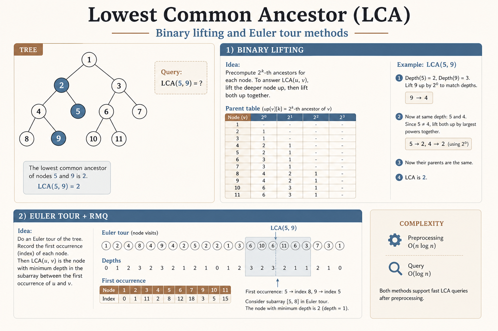
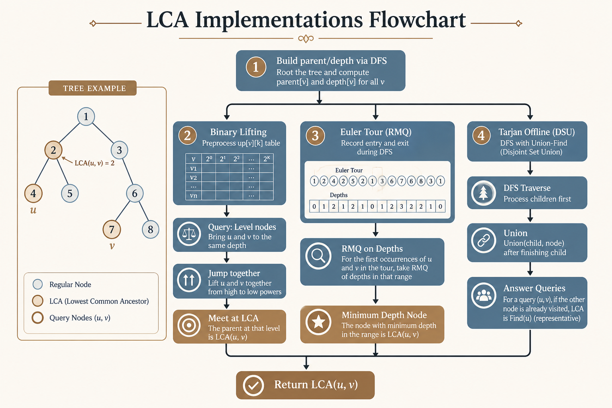
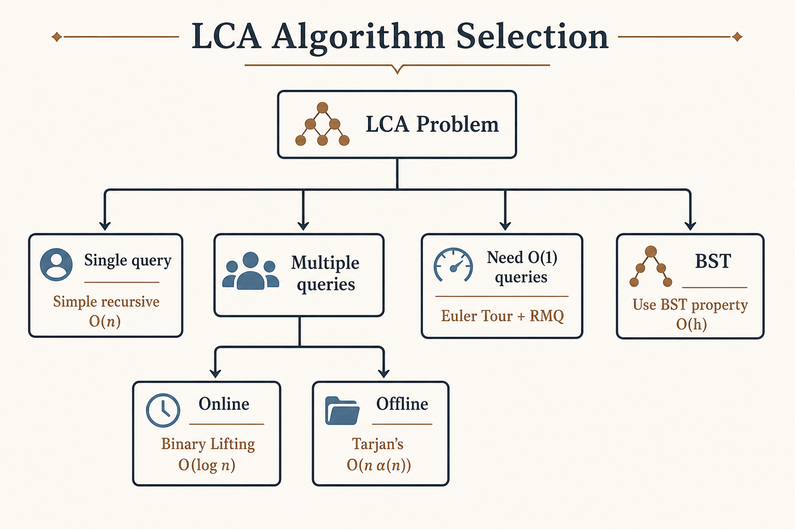

# 🔍 Lowest Common Ancestor (LCA)

### *Lowest Common Ancestor (LCA)*

  
  

---

## 📊 Visual Overview

---

## 🎯 At a Glance

| | |
|:---|:---|
| **Difficulty** | Medium to Hard |
| **Problems** | 12+ |

{: .highlight }
> **How to use this page:** Start with the visual overview, scan **At a Glance**, then work through theory → walkthroughs → code.

---

## 🧭 Navigation

| ⬅️ Previous | 📂 Current | ➡️ Next |
|:------------|:----------:|--------:|
| [← Tree Algorithms](../README.md) | **01. LCA** | [02. Tree DP →](../02_tree_dp/README.md) |

---

## 📐 Mathematical Foundation
### 1️⃣ LCA Definition

**Lowest Common Ancestor** of nodes $u$ and $v$ in tree $T$:

$$\text{LCA}(u, v) = w \text{ where } w \text{ is ancestor of both } u, v \text{ and deepest such node}$$

**Properties:**

- $\text{LCA}(u, u) = u$

- $\text{LCA}(u, v) = \text{LCA}(v, u)$ (symmetric)

- If $u$ is ancestor of $v$, then $\text{LCA}(u, v) = u$

---

### 2️⃣ Algorithm Comparison

| Algorithm | Preprocessing | Query | Space | Notes |
|-----------|:-------------:|:-----:|:-----:|-------|
| **Naive DFS** | O(1) | O(n) | O(n) | Simple, slow queries |
| **Parent Pointers** | O(n) | O(h) | O(n) | Good for balanced trees |
| **Binary Lifting** | O(n log n) | O(log n) | O(n log n) | Most common |
| **Euler Tour + RMQ** | O(n) | O(1) | O(n) | Optimal, complex |
| **Tarjan's Offline** | O(n α(n)) | - | O(n) | All queries at once |

---

### 3️⃣ Binary Lifting

**Idea:** Precompute ancestors at powers of 2 distances.

**Table:** $\text{up}[v][k] = 2^k$-th ancestor of $v$

**Recurrence:**

$$\text{up}[v][k] = \begin{cases}
\text{parent}[v] & \text{if } k = 0 \\
\text{up}[\text{up}[v][k-1]][k-1] & \text{if } k > 0
\end{cases}$$

**Query Algorithm:**

1. Bring $u$ and $v$ to same level

2. Binary search for LCA by jumping up in powers of 2

**Complexity:**

- Preprocess: $O(n \log n)$

- Query: $O(\log n)$

- Space: $O(n \log n)$

---

### 4️⃣ Euler Tour + RMQ

**Euler Tour:** Visit nodes in DFS, recording each entry/exit.

**Properties:**

- Length $= 2n - 1$

- LCA$(u, v)$ = node with minimum depth in tour between first occurrences of $u$ and $v$

**Steps:**

1. Build Euler tour with depths

2. Record first occurrence of each node

3. LCA query = RMQ (Range Minimum Query) on depths

**Complexity:**

- Preprocess: $O(n)$ with RMQ

- Query: $O(1)$

- Space: $O(n)$

---

### 5️⃣ Tarjan's Offline Algorithm

**Union-Find based approach** for all queries at once.

**Algorithm:**

1. DFS through tree

2. Union visited nodes

3. Answer queries when both nodes visited

**Complexity:** $O(n \cdot \alpha(n))$ for all queries

---

### 6️⃣ Distance Between Nodes

**Distance** between $u$ and $v$:

$$\text{dist}(u, v) = \text{depth}[u] + \text{depth}[v] - 2 \cdot \text{depth}[\text{LCA}(u, v)]$$

---

### 7️⃣ Path Queries

**Check if $w$ is on path from $u$ to $v$:**

$$w \text{ on path} \iff \text{LCA}(u, v) = \text{LCA}(u, w) = \text{LCA}(w, v)$$

or equivalently:

$$\text{dist}(u, v) = \text{dist}(u, w) + \text{dist}(w, v)$$

---

## 💻 Code Implementations

---

## 🏆 LeetCode Problems

### 🟢 Easy

| # | Problem | Pattern | Time | Space |
|:-:|---------|---------|:----:|:-----:|
| 235 | [LCA of BST](https://leetcode.com/problems/lowest-common-ancestor-of-a-binary-search-tree/) | BST Property | O(h) | O(1) |

### 🟡 Medium

| # | Problem | Pattern | Time | Space |
|:-:|---------|---------|:----:|:-----:|
| 236 | [LCA of Binary Tree](https://leetcode.com/problems/lowest-common-ancestor-of-a-binary-tree/) | Recursive | O(n) | O(h) |
| 863 | [Nodes Distance K](https://leetcode.com/problems/all-nodes-distance-k-in-binary-tree/) | Parent Pointers + BFS | O(n) | O(n) |
| 865 | [Smallest Subtree with Deepest Nodes](https://leetcode.com/problems/smallest-subtree-with-all-the-deepest-nodes/) | DFS | O(n) | O(h) |
| 1123 | [LCA of Deepest Leaves](https://leetcode.com/problems/lowest-common-ancestor-of-deepest-leaves/) | DFS | O(n) | O(h) |
| 1123 | [LCA Deepest Leaves](https://leetcode.com/problems/lowest-common-ancestor-of-deepest-leaves/) | Post-order DFS | O(n) | O(h) |
| 1530 | [Good Leaf Nodes Pairs](https://leetcode.com/problems/number-of-good-leaf-nodes-pairs/) | Distance | O(n²) | O(n) |
| 1650 | [LCA III (with parent)](https://leetcode.com/problems/lowest-common-ancestor-of-a-binary-tree-iii/) | Two Pointers | O(h) | O(1) |

### 🔴 Hard

| # | Problem | Pattern | Time | Space |
|:-:|---------|---------|:----:|:-----:|
| 1483 | [Kth Ancestor](https://leetcode.com/problems/kth-ancestor-of-a-tree-node/) | Binary Lifting | O(log n) query | O(n log n) |
| 1569 | [Ways to Arrange Array](https://leetcode.com/problems/number-of-ways-to-reorder-array-to-get-same-bst/) | Tree + Combinatorics | O(n²) | O(n²) |

---

## 📊 Algorithm Selection

---

## 🎯 Key Insights

1. **Binary Lifting** most practical for online queries

2. **Euler Tour + RMQ** optimal but complex to implement

3. **Simple recursion** sufficient for single/few queries

4. **Distance** = sum of depths minus 2 × LCA depth

5. **K-th ancestor** easily solved with binary lifting

---

## 📚 References

| Resource | Link |
|----------|------|
| **LCA** | [Wikipedia](https://en.wikipedia.org/wiki/Lowest_common_ancestor) |
| **Binary Lifting** | [CP-Algorithms](https://cp-algorithms.com/graph/lca_binary_lifting.html) |
| **RMQ** | [CP-Algorithms](https://cp-algorithms.com/sequences/rmq.html) |

---

**Made with ❤️ by [Gaurav Goswami](https://github.com/Gaurav14cs17)**

---
