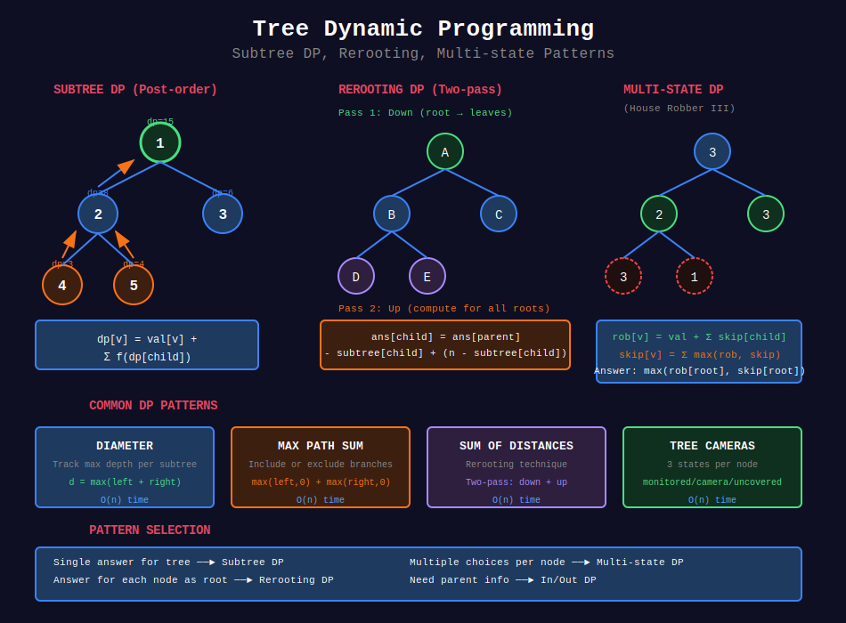

<div align="center">

# 🌿 Tree Dynamic Programming

<p>
  
  
</p>

</div>

---

## 🧭 Navigation

| ⬅️ Previous | 📂 Current | ➡️ Next |
|:------------|:----------:|--------:|
| [← 01. LCA](../01_lowest_common_ancestor/README.md) | **02. Tree DP** | [03. Tree Construction →](../03_tree_construction/README.md) |

---

## 📊 Visual Overview

<div align="center">

</div>

---

## 📐 Mathematical Foundations

### 1️⃣ Tree DP Definition

**Dynamic Programming on Trees:** Compute optimal solutions by combining results from subtrees.

**Key insight:** Tree structure provides natural subproblems.

**General pattern:**
```
dp[node] = combine(dp[child₁], dp[child₂], ..., dp[childₖ])
```

---

### 2️⃣ DP State Types

| Type | Description | Example |
|------|-------------|---------|
| **Subtree DP** | State depends only on subtree | Diameter, max path sum |
| **In/Out DP** | State from parent + subtree | All distances from nodes |
| **Rerooting DP** | Compute for all roots | Sum of distances |
| **Multi-state DP** | Multiple states per node | House Robber III |

---

### 3️⃣ Subtree DP Pattern

**Recurrence:**

$$
\text{dp}[v] = f(\text{dp}[\text{child}_1], \text{dp}[\text{child}_2], \ldots)
$$

**Post-order traversal:** Process children before parent.

**Time:** $O(n)$ - visit each node once

---

### 4️⃣ Rerooting Technique

**Problem:** Compute answer for each node as root.

**Naive:** $O(n^2)$ - DFS from each node

**Optimized:** $O(n)$ using two passes:
1. **Down pass:** Compute answer for original root
2. **Up pass:** Update answers when moving root to children

**Key idea:** Reuse computation from parent when moving root.

---

### 5️⃣ In/Out DP

**Two states per node:**
- **In:** Best answer using only subtree of $v$
- **Out:** Best answer using everything except subtree of $v$

**Combination:**

$$
\text{ans}[v] = \text{combine}(\text{in}[v], \text{out}[v])
$$

---

### 6️⃣ Multi-state DP

**Multiple states per node** representing different scenarios.

**Example (House Robber III):**
- $\text{rob}[v]$ = max money if rob node $v$
- $\text{not\_rob}[v]$ = max money if don't rob $v$

**Recurrence:**

$$
\text{rob}[v] = v.\text{val} + \sum \text{not\_rob}[\text{child}]
\text{not\_rob}[v] = \sum \max(\text{rob}[\text{child}], \text{not\_rob}[\text{child}])
$$

---

### 7️⃣ Common DP Problems on Trees

| Problem | States | Time |
|---------|--------|:----:|
| **Diameter** | Max path through node | O(n) |
| **Max Path Sum** | Max path ending at node | O(n) |
| **Independent Set** | Include/exclude node | O(n) |
| **Vertex Cover** | Cover/not cover | O(n) |
| **Center(s)** | Distance to farthest leaf | O(n) |
| **All Distances** | Rerooting | O(n) |

---

## 💻 Code Implementations

```python
from typing import List, Optional, Tuple
from collections import defaultdict

class TreeNode:
    def __init__(self, val=0, left=None, right=None):
        self.val = val
        self.left = left
        self.right = right

def diameter_binary_tree(root: TreeNode) -> int:
    """
    LeetCode 543: Diameter of Binary Tree
    
    Diameter = longest path between any two nodes.
    
    Time: O(n), Space: O(h)
    """
    diameter = 0
    
    def height(node: Optional[TreeNode]) -> int:
        """Returns height, updates diameter."""
        nonlocal diameter
        if not node:
            return 0
        
        left_height = height(node.left)
        right_height = height(node.right)
        
        # Update diameter: path through this node
        diameter = max(diameter, left_height + right_height)
        
        # Return height
        return 1 + max(left_height, right_height)
    
    height(root)
    return diameter

def max_path_sum(root: TreeNode) -> int:
    """
    LeetCode 124: Binary Tree Maximum Path Sum
    
    Find maximum sum path (can start/end anywhere).
    
    Time: O(n), Space: O(h)
    """
    max_sum = float('-inf')
    
    def max_gain(node: Optional[TreeNode]) -> int:
        """Returns max gain from this node going down."""
        nonlocal max_sum
        if not node:
            return 0
        
        # Max gain from left and right (negative = don't include)
        left_gain = max(max_gain(node.left), 0)
        right_gain = max(max_gain(node.right), 0)
        
        # Price to start new path at this node
        price_new_path = node.val + left_gain + right_gain
        max_sum = max(max_sum, price_new_path)
        
        # Return max gain continuing from this node
        return node.val + max(left_gain, right_gain)
    
    max_gain(root)
    return max_sum

def rob_tree(root: TreeNode) -> int:
    """
    LeetCode 337: House Robber III
    
    Rob houses in tree (can't rob adjacent nodes).
    
    Time: O(n), Space: O(h)
    """
    def dfs(node: Optional[TreeNode]) -> Tuple[int, int]:
        """Returns (rob_this, skip_this)."""
        if not node:
            return (0, 0)
        
        left_rob, left_skip = dfs(node.left)
        right_rob, right_skip = dfs(node.right)
        
        # If rob this node, must skip children
        rob_this = node.val + left_skip + right_skip
        
        # If skip this node, can rob or skip children
        skip_this = max(left_rob, left_skip) + max(right_rob, right_skip)
        
        return (rob_this, skip_this)
    
    rob, skip = dfs(root)
    return max(rob, skip)

def binary_tree_cameras(root: TreeNode) -> int:
    """
    LeetCode 968: Binary Tree Cameras
    
    Minimum cameras to monitor all nodes.
    
    States: 0=not covered, 1=covered no camera, 2=has camera
    
    Time: O(n), Space: O(h)
    """
    cameras = 0
    
    def dfs(node: Optional[TreeNode]) -> int:
        """Returns state of node."""
        nonlocal cameras
        if not node:
            return 1  # Null is covered
        
        left = dfs(node.left)
        right = dfs(node.right)
        
        # If any child not covered, place camera here
        if left == 0 or right == 0:
            cameras += 1
            return 2
        
        # If any child has camera, this is covered
        if left == 2 or right == 2:
            return 1
        
        # Both children covered but no camera, this is not covered
        return 0
    
    # If root not covered, add camera
    if dfs(root) == 0:
        cameras += 1
    
    return cameras

class TreeDPRerooting:
    """
    Rerooting DP: Compute answer for all possible roots.
    
    Example: Sum of distances from each node to all others.
    """
    
    def __init__(self, n: int, edges: List[List[int]]):
        """
        Initialize tree.
        
        Args:
            n: number of nodes (0 to n-1)
            edges: list of [u, v] edges
        """
        self.n = n
        self.graph = defaultdict(list)
        for u, v in edges:
            self.graph[u].append(v)
            self.graph[v].append(u)
        
        # DP arrays
        self.subtree_size = [0] * n
        self.subtree_sum = [0] * n
        self.answer = [0] * n
    
    def sum_of_distances(self) -> List[int]:
        """
        LeetCode 834: Sum of Distances in Tree
        
        For each node, sum of distances to all other nodes.
        
        Time: O(n), Space: O(n)
        """

        # First DFS: compute subtree sizes and sums
        def dfs1(u: int, parent: int):
            self.subtree_size[u] = 1
            self.subtree_sum[u] = 0
            
            for v in self.graph[u]:
                if v != parent:
                    dfs1(v, u)
                    self.subtree_size[u] += self.subtree_size[v]
                    self.subtree_sum[u] += self.subtree_sum[v] + self.subtree_size[v]
        
        # Second DFS: reroot to compute answer for each node
        def dfs2(u: int, parent: int):
            for v in self.graph[u]:
                if v != parent:

                    # Move root from u to v
                    # Nodes in v's subtree get 1 closer
                    # Nodes outside v's subtree get 1 farther
                    self.answer[v] = (self.answer[u] - self.subtree_size[v] + 
                                     (self.n - self.subtree_size[v]))
                    dfs2(v, u)
        
        dfs1(0, -1)
        self.answer[0] = self.subtree_sum[0]
        dfs2(0, -1)
        
        return self.answer

def longest_path(n: int, parent: List[int], s: str) -> int:
    """
    LeetCode 2246: Longest Path With Different Adjacent Characters
    
    Find longest path where adjacent characters differ.
    
    Time: O(n), Space: O(n)
    """
    graph = defaultdict(list)
    for i in range(1, n):
        graph[parent[i]].append(i)
    
    max_length = 0
    
    def dfs(node: int) -> int:
        """Returns longest path going down from node."""
        nonlocal max_length
        
        # Get two longest paths from children with different characters
        max1 = max2 = 0
        
        for child in graph[node]:
            child_len = dfs(child)
            
            # Only add if characters differ
            if s[child] != s[node]:
                if child_len >= max1:
                    max2 = max1
                    max1 = child_len
                elif child_len > max2:
                    max2 = child_len
        
        # Update global max: path through this node
        max_length = max(max_length, max1 + max2 + 1)
        
        # Return longest path from this node
        return max1 + 1
    
    dfs(0)
    return max_length

def tree_height(root: TreeNode) -> int:
    """
    Height of tree using DP.
    
    Time: O(n), Space: O(h)
    """
    if not root:
        return 0
    return 1 + max(tree_height(root.left), tree_height(root.right))

def count_good_nodes(root: TreeNode) -> int:
    """
    LeetCode 1448: Count Good Nodes in Binary Tree
    
    Good node: no node on path from root has greater value.
    
    Time: O(n), Space: O(h)
    """
    def dfs(node: Optional[TreeNode], max_val: int) -> int:
        if not node:
            return 0
        
        count = 1 if node.val >= max_val else 0
        new_max = max(max_val, node.val)
        
        count += dfs(node.left, new_max)
        count += dfs(node.right, new_max)
        
        return count
    
    return dfs(root, float('-inf'))

def distribute_coins(root: TreeNode) -> int:
    """
    LeetCode 979: Distribute Coins in Binary Tree
    
    Each node should have exactly 1 coin.
    Return minimum moves needed.
    
    Time: O(n), Space: O(h)
    """
    moves = 0
    
    def dfs(node: Optional[TreeNode]) -> int:
        """Returns excess coins in subtree (+ or -)."""
        nonlocal moves
        if not node:
            return 0
        
        left_excess = dfs(node.left)
        right_excess = dfs(node.right)
        
        # Moves needed to balance this subtree
        moves += abs(left_excess) + abs(right_excess)
        
        # Return excess for parent
        return node.val + left_excess + right_excess - 1
    
    dfs(root)
    return moves

def longest_univalue_path(root: TreeNode) -> int:
    """
    LeetCode 687: Longest Univalue Path
    
    Longest path where all nodes have same value.
    
    Time: O(n), Space: O(h)
    """
    max_length = 0
    
    def dfs(node: Optional[TreeNode]) -> int:
        """Returns longest univalue path going down from node."""
        nonlocal max_length
        if not node:
            return 0
        
        left_len = dfs(node.left)
        right_len = dfs(node.right)
        
        # Extend path if child has same value
        left_arrow = right_arrow = 0
        if node.left and node.left.val == node.val:
            left_arrow = left_len + 1
        if node.right and node.right.val == node.val:
            right_arrow = right_len + 1
        
        # Update max: path through this node
        max_length = max(max_length, left_arrow + right_arrow)
        
        # Return longest path going down
        return max(left_arrow, right_arrow)
    
    dfs(root)
    return max_length

def min_camera_cover(root: TreeNode) -> int:
    """
    Alternative implementation of camera problem.
    
    States: NOT_MONITORED=0, MONITORED_NO_CAM=1, HAS_CAMERA=2
    
    Time: O(n), Space: O(h)
    """
    NOT_MONITORED, MONITORED_NO_CAM, HAS_CAMERA = 0, 1, 2
    cameras = 0
    
    def dfs(node: Optional[TreeNode]) -> int:
        nonlocal cameras
        if not node:
            return MONITORED_NO_CAM
        
        left = dfs(node.left)
        right = dfs(node.right)
        
        # If either child not monitored, need camera here
        if left == NOT_MONITORED or right == NOT_MONITORED:
            cameras += 1
            return HAS_CAMERA
        
        # If either child has camera, this is monitored
        if left == HAS_CAMERA or right == HAS_CAMERA:
            return MONITORED_NO_CAM
        
        # Both children monitored but no camera nearby
        return NOT_MONITORED
    
    root_state = dfs(root)
    if root_state == NOT_MONITORED:
        cameras += 1
    
    return cameras

def count_nodes_equal_to_sum_of_descendants(root: TreeNode) -> int:
    """
    Count nodes where value equals sum of all descendants.
    
    Time: O(n), Space: O(h)
    """
    count = 0
    
    def dfs(node: Optional[TreeNode]) -> int:
        """Returns sum of subtree."""
        nonlocal count
        if not node:
            return 0
        
        left_sum = dfs(node.left)
        right_sum = dfs(node.right)
        
        subtree_sum = left_sum + right_sum
        if node.val == subtree_sum:
            count += 1
        
        return node.val + subtree_sum
    
    dfs(root)
    return count

def max_product_splitted_tree(root: TreeNode) -> int:
    """
    LeetCode 1339: Maximum Product of Splitted Binary Tree
    
    Remove one edge to maximize product of two subtree sums.
    
    Time: O(n), Space: O(h)
    """
    MOD = 10**9 + 7
    subtree_sums = []
    
    def dfs(node: Optional[TreeNode]) -> int:
        """Returns sum of subtree."""
        if not node:
            return 0
        
        subtree_sum = node.val + dfs(node.left) + dfs(node.right)
        subtree_sums.append(subtree_sum)
        return subtree_sum
    
    total_sum = dfs(root)
    
    max_product = 0
    for subtree_sum in subtree_sums:
        other_sum = total_sum - subtree_sum
        max_product = max(max_product, subtree_sum * other_sum)
    
    return max_product % MOD
```

---

## 🏆 LeetCode Problems

### 🟢 Easy

| # | Problem | Pattern | Time | Space |
|:-:|---------|---------|:----:|:-----:|
| 104 | [Maximum Depth](https://leetcode.com/problems/maximum-depth-of-binary-tree/) | Simple DP | O(n) | O(h) |
| 110 | [Balanced Binary Tree](https://leetcode.com/problems/balanced-binary-tree/) | Height DP | O(n) | O(h) |
| 543 | [Diameter](https://leetcode.com/problems/diameter-of-binary-tree/) | Max Path | O(n) | O(h) |
| 687 | [Longest Univalue Path](https://leetcode.com/problems/longest-univalue-path/) | Path DP | O(n) | O(h) |

### 🟡 Medium

| # | Problem | Pattern | Time | Space |
|:-:|---------|---------|:----:|:-----:|
| 337 | [House Robber III](https://leetcode.com/problems/house-robber-iii/) | Multi-state DP | O(n) | O(h) |
| 508 | [Most Frequent Subtree Sum](https://leetcode.com/problems/most-frequent-subtree-sum/) | Subtree DP | O(n) | O(n) |
| 834 | [Sum of Distances](https://leetcode.com/problems/sum-of-distances-in-tree/) | Rerooting DP | O(n) | O(n) |
| 979 | [Distribute Coins](https://leetcode.com/problems/distribute-coins-in-binary-tree/) | Excess DP | O(n) | O(h) |
| 1339 | [Max Product Splitted Tree](https://leetcode.com/problems/maximum-product-of-splitted-binary-tree/) | Subtree Sum | O(n) | O(n) |
| 1448 | [Count Good Nodes](https://leetcode.com/problems/count-good-nodes-in-binary-tree/) | Path DP | O(n) | O(h) |
| 2246 | [Longest Path Different Chars](https://leetcode.com/problems/longest-path-with-different-adjacent-characters/) | Tree DP | O(n) | O(n) |

### 🔴 Hard

| # | Problem | Pattern | Time | Space |
|:-:|---------|---------|:----:|:-----:|
| 124 | [Binary Tree Max Path Sum](https://leetcode.com/problems/binary-tree-maximum-path-sum/) | Max Path DP | O(n) | O(h) |
| 968 | [Binary Tree Cameras](https://leetcode.com/problems/binary-tree-cameras/) | Multi-state DP | O(n) | O(h) |
| 1516 | [Move Subtree](https://leetcode.com/problems/move-sub-tree-of-n-ary-tree/) | Tree DP | O(n) | O(n) |

---

## 📊 DP Pattern Selection

```
Tree DP Problem
     |
     +-- Single answer for tree → Subtree DP
     |   Examples: diameter, max path sum
     |
     +-- Answer for each node as root → Rerooting DP
     |   Examples: sum of distances
     |
     +-- Multiple choices per node → Multi-state DP
     |   Examples: rob/not rob, camera/no camera
     |
     +-- Need parent info → In/Out DP
         Examples: all distances from node
```

---

## 🎯 Key Insights

1. **Post-order traversal** most common for tree DP
2. **Rerooting** avoids O(n²) by reusing computation
3. **Multi-state DP** models decision trees
4. **Diameter/Max Path** pattern appears frequently
5. **Tree = natural recursion** structure for DP

---

## 📚 References

| Resource | Link |
|----------|------|
| **Tree DP** | [CP-Algorithms](https://cp-algorithms.com/dynamic_programming/tree_dp.html) |
| **Rerooting** | [Codeforces Blog](https://codeforces.com/blog/entry/20935) |
| **DP on Trees** | [GeeksforGeeks](https://www.geeksforgeeks.org/dynamic-programming-trees-set-1/) |

---

<div align="center">

**Made with ❤️ by [Gaurav Goswami](https://github.com/Gaurav14cs17)**

</div>

---

## 🧭 Navigation

| ⬅️ Previous | 📂 Current | ➡️ Next |
|:------------|:----------:|--------:|
| [← 01. LCA](../01_lowest_common_ancestor/README.md) | **02. Tree DP** | [03. Tree Construction →](../03_tree_construction/README.md) |

