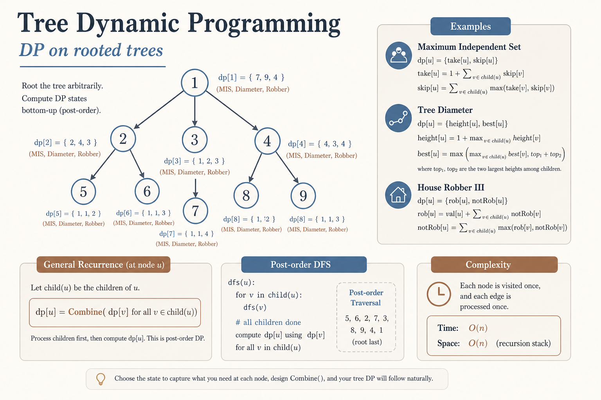
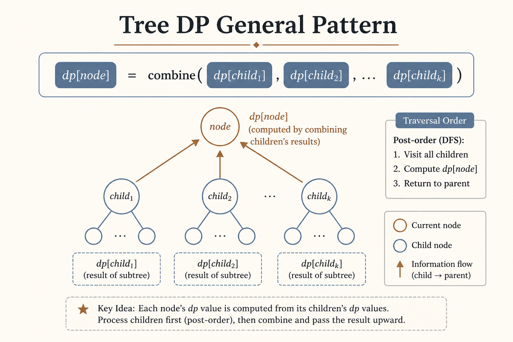
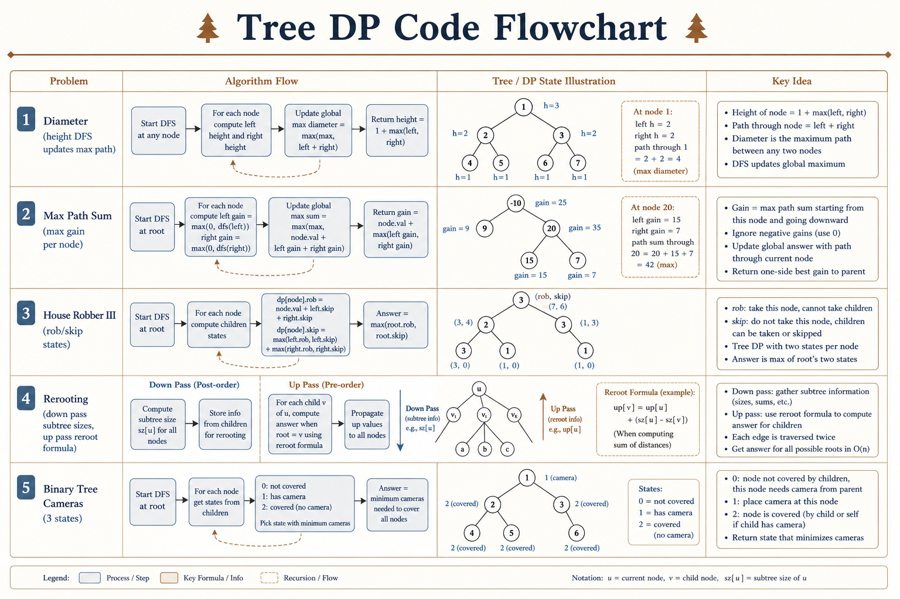
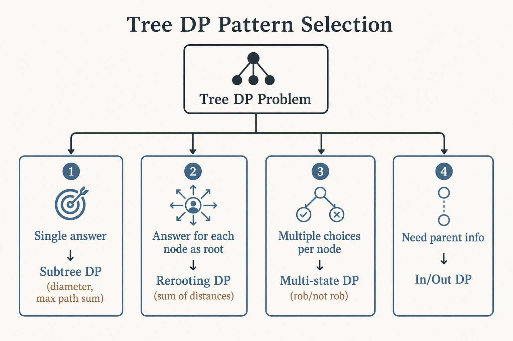

# 🌿 Tree Dynamic Programming

### *Tree Dynamic Programming*

  
  

---

## 📊 Visual Overview

---

## 🎯 At a Glance

| | |
|:---|:---|
| **Difficulty** | Medium to Hard |
| **Problems** | 15+ |

{: .highlight }
> **How to use this page:** Start with the visual overview, scan **At a Glance**, then work through theory → walkthroughs → code.

---

## 🧭 Navigation

| ⬅️ Previous | 📂 Current | ➡️ Next |
|:------------|:----------:|--------:|
| [← 01. LCA](../01_lowest_common_ancestor/README.md) | **02. Tree DP** | [03. Tree Construction →](../03_tree_construction/README.md) |

---

## 📐 Mathematical Foundation
### 1️⃣ Tree DP Definition

**Dynamic Programming on Trees:** Compute optimal solutions by combining results from subtrees.

**Key insight:** Tree structure provides natural subproblems.

---

### 2️⃣ DP State Types

| Type | Description | Example |
|------|-------------|---------|
| **Subtree DP** | State depends only on subtree | Diameter, max path sum |
| **In/Out DP** | State from parent + subtree | All distances from nodes |
| **Rerooting DP** | Compute for all roots | Sum of distances |
| **Multi-state DP** | Multiple states per node | House Robber III |

---

### 3️⃣ Subtree DP Pattern

**Recurrence:**

$$\text{dp}[v] = f(\text{dp}[\text{child}_1], \text{dp}[\text{child}_2], \ldots)$$

**Post-order traversal:** Process children before parent.

**Time:** $O(n)$ - visit each node once

---

### 4️⃣ Rerooting Technique

**Problem:** Compute answer for each node as root.

**Naive:** $O(n^2)$ - DFS from each node

**Optimized:** $O(n)$ using two passes:

1. **Down pass:** Compute answer for original root

2. **Up pass:** Update answers when moving root to children

**Key idea:** Reuse computation from parent when moving root.

---

### 5️⃣ In/Out DP

**Two states per node:**

- **In:** Best answer using only subtree of $v$

- **Out:** Best answer using everything except subtree of $v$

**Combination:**

$$\text{ans}[v] = \text{combine}(\text{in}[v], \text{out}[v])$$

---

### 6️⃣ Multi-state DP

**Multiple states per node** representing different scenarios.

**Example (House Robber III):**

- $\text{rob}[v]$ = max money if rob node $v$

- $\text{not\_rob}[v]$ = max money if don't rob $v$

**Recurrence:**

$$\text{rob}[v] = v.\text{val} + \sum \text{not\_rob}[\text{child}]
\text{not\_rob}[v] = \sum \max(\text{rob}[\text{child}], \text{not\_rob}[\text{child}])$$

---

### 7️⃣ Common DP Problems on Trees

| Problem | States | Time |
|---------|--------|:----:|
| **Diameter** | Max path through node | O(n) |
| **Max Path Sum** | Max path ending at node | O(n) |
| **Independent Set** | Include/exclude node | O(n) |
| **Vertex Cover** | Cover/not cover | O(n) |
| **Center(s)** | Distance to farthest leaf | O(n) |
| **All Distances** | Rerooting | O(n) |

---

## 💻 Code Implementations

---

## 🏆 LeetCode Problems

### 🟢 Easy

| # | Problem | Pattern | Time | Space |
|:-:|---------|---------|:----:|:-----:|
| 104 | [Maximum Depth](https://leetcode.com/problems/maximum-depth-of-binary-tree/) | Simple DP | O(n) | O(h) |
| 110 | [Balanced Binary Tree](https://leetcode.com/problems/balanced-binary-tree/) | Height DP | O(n) | O(h) |
| 543 | [Diameter](https://leetcode.com/problems/diameter-of-binary-tree/) | Max Path | O(n) | O(h) |
| 687 | [Longest Univalue Path](https://leetcode.com/problems/longest-univalue-path/) | Path DP | O(n) | O(h) |

### 🟡 Medium

| # | Problem | Pattern | Time | Space |
|:-:|---------|---------|:----:|:-----:|
| 337 | [House Robber III](https://leetcode.com/problems/house-robber-iii/) | Multi-state DP | O(n) | O(h) |
| 508 | [Most Frequent Subtree Sum](https://leetcode.com/problems/most-frequent-subtree-sum/) | Subtree DP | O(n) | O(n) |
| 834 | [Sum of Distances](https://leetcode.com/problems/sum-of-distances-in-tree/) | Rerooting DP | O(n) | O(n) |
| 979 | [Distribute Coins](https://leetcode.com/problems/distribute-coins-in-binary-tree/) | Excess DP | O(n) | O(h) |
| 1339 | [Max Product Splitted Tree](https://leetcode.com/problems/maximum-product-of-splitted-binary-tree/) | Subtree Sum | O(n) | O(n) |
| 1448 | [Count Good Nodes](https://leetcode.com/problems/count-good-nodes-in-binary-tree/) | Path DP | O(n) | O(h) |
| 2246 | [Longest Path Different Chars](https://leetcode.com/problems/longest-path-with-different-adjacent-characters/) | Tree DP | O(n) | O(n) |

### 🔴 Hard

| # | Problem | Pattern | Time | Space |
|:-:|---------|---------|:----:|:-----:|
| 124 | [Binary Tree Max Path Sum](https://leetcode.com/problems/binary-tree-maximum-path-sum/) | Max Path DP | O(n) | O(h) |
| 968 | [Binary Tree Cameras](https://leetcode.com/problems/binary-tree-cameras/) | Multi-state DP | O(n) | O(h) |
| 1516 | [Move Subtree](https://leetcode.com/problems/move-sub-tree-of-n-ary-tree/) | Tree DP | O(n) | O(n) |

---

## 📊 DP Pattern Selection

---

## 🎯 Key Insights

1. **Post-order traversal** most common for tree DP

2. **Rerooting** avoids O(n²) by reusing computation

3. **Multi-state DP** models decision trees

4. **Diameter/Max Path** pattern appears frequently

5. **Tree = natural recursion** structure for DP

---

## 📚 References

| Resource | Link |
|----------|------|
| **Tree DP** | [CP-Algorithms](https://cp-algorithms.com/dynamic_programming/tree_dp.html) |
| **Rerooting** | [Codeforces Blog](https://codeforces.com/blog/entry/20935) |
| **DP on Trees** | [GeeksforGeeks](https://www.geeksforgeeks.org/dynamic-programming-trees-set-1/) |

---

**Made with ❤️ by [Gaurav Goswami](https://github.com/Gaurav14cs17)**

---
