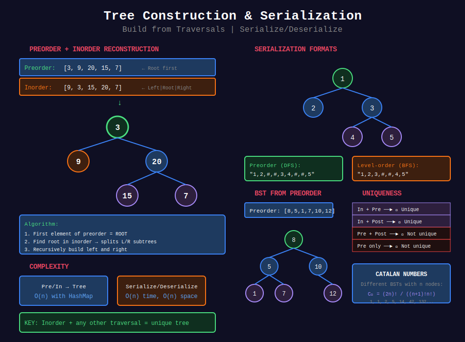

<div align="center">

# 🏗️ Tree Construction & Serialization

<p>
  
  
</p>

</div>

---

## 🧭 Navigation

| ⬅️ Previous | 📂 Current | ➡️ Next |
|:------------|:----------:|--------:|
| [← 02. Tree DP](../02_tree_dp/README.md) | **03. Tree Construction** | [🏠 Home](../README.md) |

---

## 📊 Visual Overview

<div align="center">

</div>

---

## 📐 Mathematical Foundations

### 1️⃣ Tree Traversals

**Three main traversals** of binary tree:

| Traversal | Order | Use Case |
|-----------|-------|----------|
| **Preorder** | Root → Left → Right | Copy tree, prefix expression |
| **Inorder** | Left → Root → Right | BST sorted order |
| **Postorder** | Left → Right → Root | Delete tree, postfix expression |

**Level-order:** BFS traversal by levels.

---

### 2️⃣ Tree Reconstruction

**Uniqueness requirements:**

| Combination | Unique? | Algorithm |
|-------------|:-------:|-----------|
| **Inorder + Preorder** | ✅ Yes | Recursive divide |
| **Inorder + Postorder** | ✅ Yes | Recursive divide |
| **Inorder + Level-order** | ✅ Yes | BFS construction |
| **Preorder + Postorder** | ❌ No* | Only for full binary tree |
| **Preorder only** | ❌ No | Infinite possibilities |
| **Postorder only** | ❌ No | Infinite possibilities |

\* *Can reconstruct if full binary tree (every node has 0 or 2 children)*

---

### 3️⃣ Preorder + Inorder Reconstruction

**Algorithm:**

1. First element of preorder = root

2. Find root in inorder → splits into left/right subtrees

3. Recursively build left and right

**Time:** $O(n)$ with hash map for indices  
**Space:** $O(n)$

**Example:**

```
Preorder: [3, 9, 20, 15, 7]
Inorder:  [9, 3, 15, 20, 7]

Root = 3
Left subtree: [9] (preorder), [9] (inorder)
Right subtree: [20, 15, 7] (preorder), [15, 20, 7] (inorder)

```

---

### 4️⃣ Inorder + Postorder Reconstruction

**Algorithm:**

1. Last element of postorder = root

2. Find root in inorder → splits into left/right subtrees

3. Recursively build left and right

**Key difference:** Process right subtree first (since postorder ends with right).

---

### 5️⃣ Serialization Format

**Common formats:**

| Format | Example | Advantages |
|--------|---------|------------|
| **Preorder** | `1,2,#,#,3,4,#,#,5` | Simple, compact |
| **Level-order** | `1,2,3,#,#,4,5` | Natural BFS |
| **Parentheses** | `1(2()(3))` | Human-readable |
| **JSON** | `{"val":1,"left":{...}}` | Standard format |

**Null handling:** Use special marker (`#`, `null`, `None`).

---

### 6️⃣ Unique Tree Properties

**N nodes → Catalan number of different binary trees:**

```math
C_n = \frac{1}{n+1}\binom{2n}{n} = \frac{(2n)!}{(n+1)!n!}

```

**First few:** 1, 1, 2, 5, 14, 42, 132, ...

---

### 7️⃣ BST Construction

**From preorder:** O(n) using stack or recursion with bounds.

**Key property:** All left descendants < root < all right descendants

---

## 💻 Code Implementations

```python
from typing import List, Optional
from collections import deque

class TreeNode:
    def __init__(self, val=0, left=None, right=None):
        self.val = val
        self.left = left
        self.right = right

def build_tree_preorder_inorder(preorder: List[int], inorder: List[int]) -> Optional[TreeNode]:
    """
    LeetCode 105: Construct Binary Tree from Preorder and Inorder
    
    Time: O(n), Space: O(n)
    """
    if not preorder or not inorder:
        return None
    
    # Build index map for O(1) lookup
    inorder_map = {val: i for i, val in enumerate(inorder)}
    pre_idx = 0
    
    def build(in_left: int, in_right: int) -> Optional[TreeNode]:
        nonlocal pre_idx
        if in_left > in_right:
            return None
        
        # Root is next element in preorder
        root_val = preorder[pre_idx]
        root = TreeNode(root_val)
        pre_idx += 1
        
        # Find root position in inorder
        in_idx = inorder_map[root_val]
        
        # Build left subtree (before root in inorder)
        root.left = build(in_left, in_idx - 1)
        
        # Build right subtree (after root in inorder)
        root.right = build(in_idx + 1, in_right)
        
        return root
    
    return build(0, len(inorder) - 1)

def build_tree_inorder_postorder(inorder: List[int], postorder: List[int]) -> Optional[TreeNode]:
    """
    LeetCode 106: Construct Binary Tree from Inorder and Postorder
    
    Time: O(n), Space: O(n)
    """
    if not inorder or not postorder:
        return None
    
    inorder_map = {val: i for i, val in enumerate(inorder)}
    post_idx = len(postorder) - 1
    
    def build(in_left: int, in_right: int) -> Optional[TreeNode]:
        nonlocal post_idx
        if in_left > in_right:
            return None
        
        # Root is next element from end of postorder
        root_val = postorder[post_idx]
        root = TreeNode(root_val)
        post_idx -= 1
        
        in_idx = inorder_map[root_val]
        
        # Build RIGHT first (postorder: left, right, root)
        root.right = build(in_idx + 1, in_right)
        root.left = build(in_left, in_idx - 1)
        
        return root
    
    return build(0, len(inorder) - 1)

def build_tree_preorder_postorder(preorder: List[int], postorder: List[int]) -> Optional[TreeNode]:
    """
    LeetCode 889: Construct Binary Tree from Preorder and Postorder
    
    Only works for full binary trees.
    
    Time: O(n), Space: O(n)
    """
    if not preorder:
        return None
    
    postorder_map = {val: i for i, val in enumerate(postorder)}
    pre_idx = 0
    
    def build(post_left: int, post_right: int) -> Optional[TreeNode]:
        nonlocal pre_idx
        if post_left > post_right:
            return None
        
        root_val = preorder[pre_idx]
        root = TreeNode(root_val)
        pre_idx += 1
        
        if post_left == post_right:
            return root
        
        # Next in preorder is left child's root
        left_root_val = preorder[pre_idx]
        left_root_post_idx = postorder_map[left_root_val]
        
        # Build left subtree
        root.left = build(post_left, left_root_post_idx)
        
        # Build right subtree
        root.right = build(left_root_post_idx + 1, post_right - 1)
        
        return root
    
    return build(0, len(postorder) - 1)

def bst_from_preorder(preorder: List[int]) -> Optional[TreeNode]:
    """
    LeetCode 1008: Construct BST from Preorder Traversal
    
    Time: O(n), Space: O(h)
    """
    def build(lower: float, upper: float) -> Optional[TreeNode]:
        nonlocal idx
        if idx == len(preorder):
            return None
        
        val = preorder[idx]
        if val < lower or val > upper:
            return None
        
        idx += 1
        root = TreeNode(val)
        root.left = build(lower, val)
        root.right = build(val, upper)
        return root
    
    idx = 0
    return build(float('-inf'), float('inf'))

def bst_from_preorder_iterative(preorder: List[int]) -> Optional[TreeNode]:
    """
    LeetCode 1008: Iterative solution using stack.
    
    Time: O(n), Space: O(h)
    """
    if not preorder:
        return None
    
    root = TreeNode(preorder[0])
    stack = [root]
    
    for val in preorder[1:]:
        node = TreeNode(val)
        
        if val < stack[-1].val:
            # Left child
            stack[-1].left = node
        else:
            # Right child: find correct parent
            parent = None
            while stack and stack[-1].val < val:
                parent = stack.pop()
            parent.right = node
        
        stack.append(node)
    
    return root

class Codec:
    """
    LeetCode 297: Serialize and Deserialize Binary Tree
    
    Using preorder traversal with null markers.
    """
    
    def serialize(self, root: Optional[TreeNode]) -> str:
        """
        Encode tree to string.
        
        Time: O(n), Space: O(n)
        """
        def dfs(node):
            if not node:
                vals.append('#')
                return
            vals.append(str(node.val))
            dfs(node.left)
            dfs(node.right)
        
        vals = []
        dfs(root)
        return ','.join(vals)
    
    def deserialize(self, data: str) -> Optional[TreeNode]:
        """
        Decode string to tree.
        
        Time: O(n), Space: O(n)
        """
        def dfs():
            val = next(vals)
            if val == '#':
                return None
            node = TreeNode(int(val))
            node.left = dfs()
            node.right = dfs()
            return node
        
        vals = iter(data.split(','))
        return dfs()

class CodecBFS:
    """
    Serialize/Deserialize using level-order (BFS).
    """
    
    def serialize(self, root: Optional[TreeNode]) -> str:
        """
        Level-order serialization.
        
        Time: O(n), Space: O(n)
        """
        if not root:
            return ""
        
        result = []
        queue = deque([root])
        
        while queue:
            node = queue.popleft()
            if node:
                result.append(str(node.val))
                queue.append(node.left)
                queue.append(node.right)
            else:
                result.append('#')
        
        return ','.join(result)
    
    def deserialize(self, data: str) -> Optional[TreeNode]:
        """
        Level-order deserialization.
        
        Time: O(n), Space: O(n)
        """
        if not data:
            return None
        
        vals = data.split(',')
        root = TreeNode(int(vals[0]))
        queue = deque([root])
        i = 1
        
        while queue:
            node = queue.popleft()
            
            if vals[i] != '#':
                node.left = TreeNode(int(vals[i]))
                queue.append(node.left)
            i += 1
            
            if vals[i] != '#':
                node.right = TreeNode(int(vals[i]))
                queue.append(node.right)
            i += 1
        
        return root

def sorted_array_to_bst(nums: List[int]) -> Optional[TreeNode]:
    """
    LeetCode 108: Convert Sorted Array to BST
    
    Build height-balanced BST.
    
    Time: O(n), Space: O(log n)
    """
    def build(left: int, right: int) -> Optional[TreeNode]:
        if left > right:
            return None
        
        mid = (left + right) // 2
        root = TreeNode(nums[mid])
        root.left = build(left, mid - 1)
        root.right = build(mid + 1, right)
        return root
    
    return build(0, len(nums) - 1)

def sorted_list_to_bst(head: Optional['ListNode']) -> Optional[TreeNode]:
    """
    LeetCode 109: Convert Sorted List to BST
    
    Build height-balanced BST from linked list.
    
    Time: O(n), Space: O(log n)
    """
    def get_length(node):
        length = 0
        while node:
            length += 1
            node = node.next
        return length
    
    def build(left: int, right: int) -> Optional[TreeNode]:
        nonlocal curr
        if left > right:
            return None
        
        mid = (left + right) // 2
        
        # Build left subtree first (inorder)
        left_child = build(left, mid - 1)
        
        # Current node
        root = TreeNode(curr.val)
        root.left = left_child
        curr = curr.next
        
        # Build right subtree
        root.right = build(mid + 1, right)
        
        return root
    
    length = get_length(head)
    curr = head
    return build(0, length - 1)

def construct_max_binary_tree(nums: List[int]) -> Optional[TreeNode]:
    """
    LeetCode 654: Maximum Binary Tree
    
    Root = max element, recursively build left/right.
    
    Time: O(n²) worst, O(n log n) average
    Space: O(n)
    """
    if not nums:
        return None
    
    max_val = max(nums)
    max_idx = nums.index(max_val)
    
    root = TreeNode(max_val)
    root.left = construct_max_binary_tree(nums[:max_idx])
    root.right = construct_max_binary_tree(nums[max_idx + 1:])
    
    return root

def construct_max_binary_tree_optimized(nums: List[int]) -> Optional[TreeNode]:
    """
    Optimized using monotonic stack.
    
    Time: O(n), Space: O(n)
    """
    stack = []
    
    for num in nums:
        node = TreeNode(num)
        
        while stack and stack[-1].val < num:
            node.left = stack.pop()
        
        if stack:
            stack[-1].right = node
        
        stack.append(node)
    
    return stack[0] if stack else None

def build_tree_descriptions(descriptions: List[List[int]]) -> Optional[TreeNode]:
    """
    LeetCode 2196: Create Binary Tree From Descriptions
    
    descriptions[i] = [parent, child, isLeft]
    
    Time: O(n), Space: O(n)
    """
    nodes = {}
    children = set()
    
    for parent, child, is_left in descriptions:
        if parent not in nodes:
            nodes[parent] = TreeNode(parent)
        if child not in nodes:
            nodes[child] = TreeNode(child)
        
        if is_left:
            nodes[parent].left = nodes[child]
        else:
            nodes[parent].right = nodes[child]
        
        children.add(child)
    
    # Find root (not in children set)
    for parent, _, _ in descriptions:
        if parent not in children:
            return nodes[parent]
    
    return None

def recover_from_preorder(traversal: str) -> Optional[TreeNode]:
    """
    LeetCode 1028: Recover Tree from Preorder Traversal
    
    Format: "1-2--3--4-5--6--7" (dashes = depth)
    
    Time: O(n), Space: O(h)
    """
    stack = []
    i = 0
    
    while i < len(traversal):
        # Count depth (number of dashes)
        depth = 0
        while i < len(traversal) and traversal[i] == '-':
            depth += 1
            i += 1
        
        # Parse value
        val = 0
        while i < len(traversal) and traversal[i].isdigit():
            val = val * 10 + int(traversal[i])
            i += 1
        
        node = TreeNode(val)
        
        # Pop stack to correct depth
        while len(stack) > depth:
            stack.pop()
        
        # Attach to parent
        if stack:
            parent = stack[-1]
            if not parent.left:
                parent.left = node
            else:
                parent.right = node
        
        stack.append(node)
    
    return stack[0] if stack else None

```

---

## 🏆 LeetCode Problems

### 🟢 Easy

| # | Problem | Pattern | Time | Space |
|:-:|---------|---------|:----:|:-----:|
| 108 | [Sorted Array to BST](https://leetcode.com/problems/convert-sorted-array-to-binary-search-tree/) | Divide & Conquer | O(n) | O(log n) |
| 654 | [Maximum Binary Tree](https://leetcode.com/problems/maximum-binary-tree/) | Recursion | O(n²) | O(n) |

### 🟡 Medium

| # | Problem | Pattern | Time | Space |
|:-:|---------|---------|:----:|:-----:|
| 105 | [Preorder + Inorder](https://leetcode.com/problems/construct-binary-tree-from-preorder-and-inorder-traversal/) | Hash Map | O(n) | O(n) |
| 106 | [Inorder + Postorder](https://leetcode.com/problems/construct-binary-tree-from-inorder-and-postorder-traversal/) | Hash Map | O(n) | O(n) |
| 109 | [Sorted List to BST](https://leetcode.com/problems/convert-sorted-list-to-binary-search-tree/) | Inorder Build | O(n) | O(log n) |
| 297 | [Serialize/Deserialize](https://leetcode.com/problems/serialize-and-deserialize-binary-tree/) | DFS/BFS | O(n) | O(n) |
| 449 | [Serialize/Deserialize BST](https://leetcode.com/problems/serialize-and-deserialize-bst/) | Preorder | O(n) | O(n) |
| 889 | [Preorder + Postorder](https://leetcode.com/problems/construct-binary-tree-from-preorder-and-postorder-traversal/) | Recursion | O(n) | O(n) |
| 1008 | [BST from Preorder](https://leetcode.com/problems/construct-binary-search-tree-from-preorder-traversal/) | Bounds Check | O(n) | O(h) |
| 1028 | [Recover from Preorder](https://leetcode.com/problems/recover-a-tree-from-preorder-traversal/) | Stack | O(n) | O(h) |
| 2196 | [Create from Descriptions](https://leetcode.com/problems/create-binary-tree-from-descriptions/) | Hash Map | O(n) | O(n) |

### 🔴 Hard

| # | Problem | Pattern | Time | Space |
|:-:|---------|---------|:----:|:-----:|
| 297 | [Serialize/Deserialize Tree](https://leetcode.com/problems/serialize-and-deserialize-binary-tree/) | Multiple approaches | O(n) | O(n) |

---

## 📊 Construction Pattern Selection

```
Tree Construction
     |
     +-- From traversals
     |   +-- Inorder + Preorder → Hash map, recursion
     |   +-- Inorder + Postorder → Hash map, recursion
     |   +-- Preorder + Postorder → Only full binary tree
     |
     +-- From sorted sequence
     |   +-- Array → Binary search
     |   +-- Linked list → Inorder construction
     |
     +-- BST from preorder → Bounds check O(n)
     |
     +-- Serialization
         +-- DFS (preorder) → Simple, compact
         +-- BFS (level-order) → Natural representation

```

---

## 🎯 Key Insights

1. **Inorder + any other traversal** uniquely determines tree

2. **Hash map** for O(1) index lookup in inorder

3. **BST from preorder** possible in O(n) using bounds

4. **Serialization** needs null markers for reconstruction

5. **Level-order** serialization more intuitive for debugging

---

## 📚 References

| Resource | Link |
|----------|------|
| **Tree Traversals** | [Wikipedia](https://en.wikipedia.org/wiki/Tree_traversal) |
| **Tree Construction** | [GeeksforGeeks](https://www.geeksforgeeks.org/construct-tree-from-given-inorder-and-preorder-traversal/) |
| **Serialization** | [LeetCode](https://leetcode.com/problems/serialize-and-deserialize-binary-tree/) |

---

<div align="center">

**Made with ❤️ by [Gaurav Goswami](https://github.com/Gaurav14cs17)**

</div>

---

## 🧭 Navigation

| ⬅️ Previous | 📂 Current | ➡️ Next |
|:------------|:----------:|--------:|
| [← 02. Tree DP](../02_tree_dp/README.md) | **03. Tree Construction** | [🏠 Home](../README.md) |

