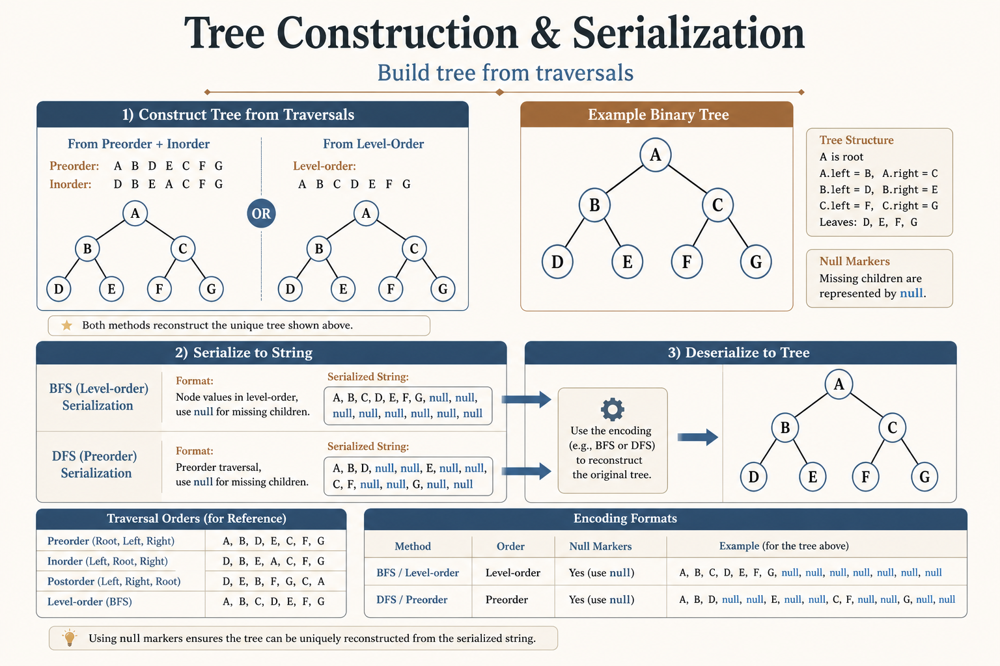
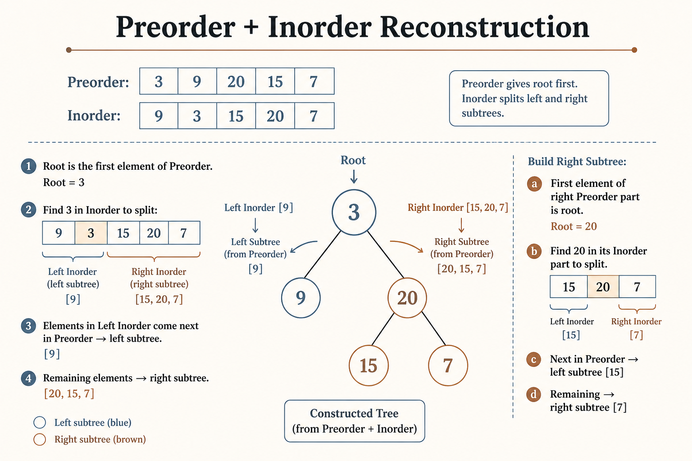
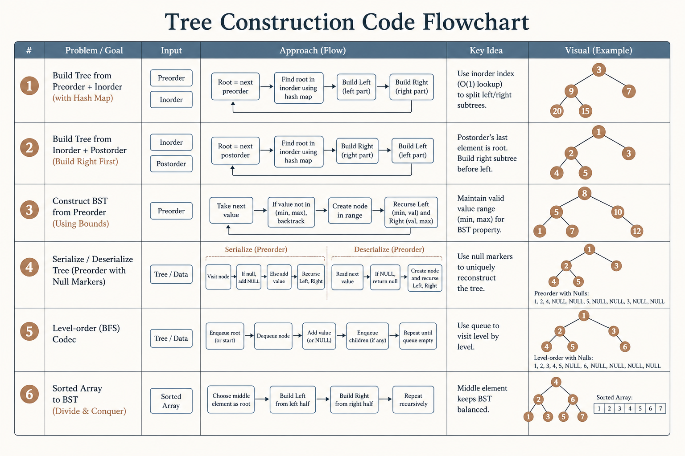
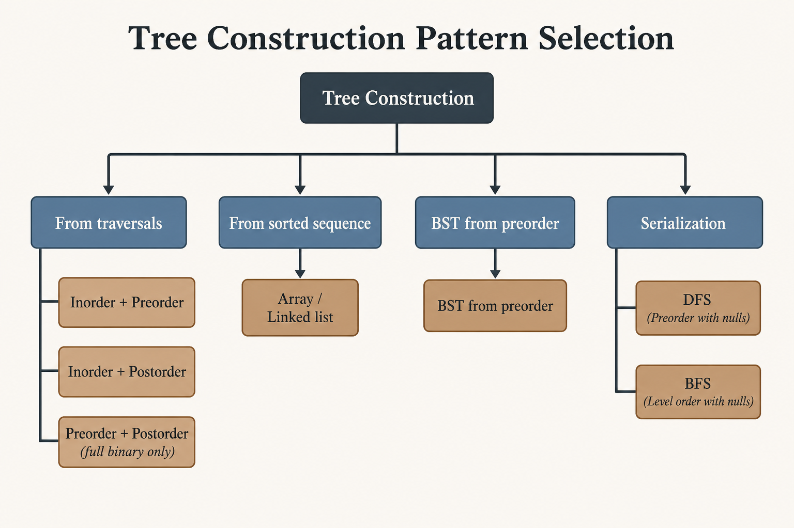

# 🏗️ Tree Construction & Serialization

### *Tree Construction & Serialization*

  
  

---

## 📊 Visual Overview

---

## 🎯 At a Glance

| | |
|:---|:---|
| **Difficulty** | Medium to Hard |
| **Problems** | 10+ |

> **How to use this page:** Start with the visual overview, scan **At a Glance**, then work through theory → walkthroughs → code.

---

## 🧭 Navigation

| ⬅️ Previous | 📂 Current | ➡️ Next |
|:------------|:----------:|--------:|
| [← 02. Tree DP](../02_tree_dp/README.md) | **03. Tree Construction** | [🏠 Home](../README.md) |

---

## 📐 Mathematical Foundation
### 1️⃣ Tree Traversals

**Three main traversals** of binary tree:

| Traversal | Order | Use Case |
|-----------|-------|----------|
| **Preorder** | Root → Left → Right | Copy tree, prefix expression |
| **Inorder** | Left → Root → Right | BST sorted order |
| **Postorder** | Left → Right → Root | Delete tree, postfix expression |

**Level-order:** BFS traversal by levels.

---

### 2️⃣ Tree Reconstruction

**Uniqueness requirements:**

| Combination | Unique? | Algorithm |
|-------------|:-------:|-----------|
| **Inorder + Preorder** | ✅ Yes | Recursive divide |
| **Inorder + Postorder** | ✅ Yes | Recursive divide |
| **Inorder + Level-order** | ✅ Yes | BFS construction |
| **Preorder + Postorder** | ❌ No* | Only for full binary tree |
| **Preorder only** | ❌ No | Infinite possibilities |
| **Postorder only** | ❌ No | Infinite possibilities |

\* *Can reconstruct if full binary tree (every node has 0 or 2 children)*

---

### 3️⃣ Preorder + Inorder Reconstruction

**Algorithm:**

1. First element of preorder = root

2. Find root in inorder → splits into left/right subtrees

3. Recursively build left and right

**Time:** $O(n)$ with hash map for indices  
**Space:** $O(n)$

---

### 4️⃣ Inorder + Postorder Reconstruction

**Algorithm:**

1. Last element of postorder = root

2. Find root in inorder → splits into left/right subtrees

3. Recursively build left and right

**Key difference:** Process right subtree first (since postorder ends with right).

---

### 5️⃣ Serialization Format

**Common formats:**

| Format | Example | Advantages |
|--------|---------|------------|
| **Preorder** | `1,2,#,#,3,4,#,#,5` | Simple, compact |
| **Level-order** | `1,2,3,#,#,4,5` | Natural BFS |
| **Parentheses** | `1(2()(3))` | Human-readable |
| **JSON** | `{"val":1,"left":{...}}` | Standard format |

**Null handling:** Use special marker (`#`, `null`, `None`).

---

### 6️⃣ Unique Tree Properties

**N nodes → Catalan number of different binary trees:**

$$C_n = \frac{1}{n+1}\binom{2n}{n} = \frac{(2n)!}{(n+1)!n!}$$

**First few:** 1, 1, 2, 5, 14, 42, 132, ...

---

### 7️⃣ BST Construction

**From preorder:** O(n) using stack or recursion with bounds.

**Key property:** All left descendants < root < all right descendants

---

## 💻 Code Implementations

---

## 🏆 LeetCode Problems

### 🟢 Easy

| # | Problem | Pattern | Time | Space |
|:-:|---------|---------|:----:|:-----:|
| 108 | [Sorted Array to BST](https://leetcode.com/problems/convert-sorted-array-to-binary-search-tree/) | Divide & Conquer | O(n) | O(log n) |
| 654 | [Maximum Binary Tree](https://leetcode.com/problems/maximum-binary-tree/) | Recursion | O(n²) | O(n) |

### 🟡 Medium

| # | Problem | Pattern | Time | Space |
|:-:|---------|---------|:----:|:-----:|
| 105 | [Preorder + Inorder](https://leetcode.com/problems/construct-binary-tree-from-preorder-and-inorder-traversal/) | Hash Map | O(n) | O(n) |
| 106 | [Inorder + Postorder](https://leetcode.com/problems/construct-binary-tree-from-inorder-and-postorder-traversal/) | Hash Map | O(n) | O(n) |
| 109 | [Sorted List to BST](https://leetcode.com/problems/convert-sorted-list-to-binary-search-tree/) | Inorder Build | O(n) | O(log n) |
| 297 | [Serialize/Deserialize](https://leetcode.com/problems/serialize-and-deserialize-binary-tree/) | DFS/BFS | O(n) | O(n) |
| 449 | [Serialize/Deserialize BST](https://leetcode.com/problems/serialize-and-deserialize-bst/) | Preorder | O(n) | O(n) |
| 889 | [Preorder + Postorder](https://leetcode.com/problems/construct-binary-tree-from-preorder-and-postorder-traversal/) | Recursion | O(n) | O(n) |
| 1008 | [BST from Preorder](https://leetcode.com/problems/construct-binary-search-tree-from-preorder-traversal/) | Bounds Check | O(n) | O(h) |
| 1028 | [Recover from Preorder](https://leetcode.com/problems/recover-a-tree-from-preorder-traversal/) | Stack | O(n) | O(h) |
| 2196 | [Create from Descriptions](https://leetcode.com/problems/create-binary-tree-from-descriptions/) | Hash Map | O(n) | O(n) |

### 🔴 Hard

| # | Problem | Pattern | Time | Space |
|:-:|---------|---------|:----:|:-----:|
| 297 | [Serialize/Deserialize Tree](https://leetcode.com/problems/serialize-and-deserialize-binary-tree/) | Multiple approaches | O(n) | O(n) |

---

## 📊 Construction Pattern Selection

---

## 🎯 Key Insights

1. **Inorder + any other traversal** uniquely determines tree

2. **Hash map** for O(1) index lookup in inorder

3. **BST from preorder** possible in O(n) using bounds

4. **Serialization** needs null markers for reconstruction

5. **Level-order** serialization more intuitive for debugging

---

## 📚 References

| Resource | Link |
|----------|------|
| **Tree Traversals** | [Wikipedia](https://en.wikipedia.org/wiki/Tree_traversal) |
| **Tree Construction** | [GeeksforGeeks](https://www.geeksforgeeks.org/construct-tree-from-given-inorder-and-preorder-traversal/) |
| **Serialization** | [LeetCode](https://leetcode.com/problems/serialize-and-deserialize-binary-tree/) |

---

**Made with ❤️ by [Gaurav Goswami](https://github.com/Gaurav14cs17)**

---
