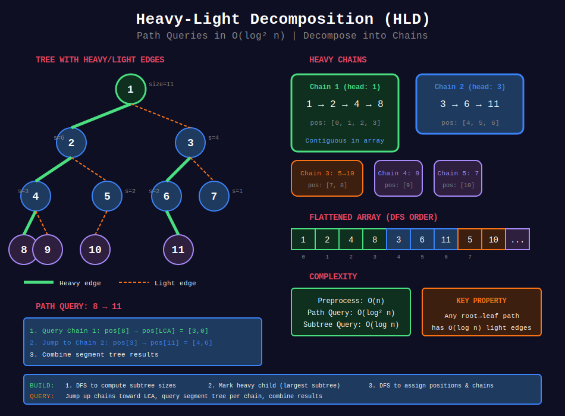

<div align="center">

# ⚡ Heavy-Light Decomposition (HLD)

<p>
  
  
</p>

</div>

---

## 🧭 Navigation

| ⬅️ Previous | 📂 Current | ➡️ Next |
|:------------|:----------:|--------:|
| [← 03. Tree Construction](../03_tree_construction/README.md) | **04. HLD** | [05. Centroid Decomposition →](../05_centroid_decomposition/README.md) |

---

## 📊 Visual Overview

<div align="center">

</div>

---

## 📐 Mathematical Foundations

### 1️⃣ HLD Definition

**Heavy-Light Decomposition:** Partition tree edges into **heavy** and **light** chains.

**Heavy edge:** Edge to child with largest subtree.  
**Light edge:** All other edges.

**Key property:** Any root-to-leaf path has at most $O(\log n)$ light edges.

---

### 2️⃣ Heavy Path Chains

**Heavy chain:** Maximal path of heavy edges.

**Decomposition results in:**
- $O(\log n)$ chains per root-to-leaf path
- Each node belongs to exactly one chain
- Chain heads can be identified

---

### 3️⃣ Path Query Complexity

**Query on path $(u, v)$:**

$$
\text{Time} = O(\log^2 n)
$$

- $O(\log n)$ chains to traverse
- $O(\log n)$ per chain query (using segment tree)

---

### 4️⃣ Applications

| Operation | Without HLD | With HLD |
|-----------|:-----------:|:--------:|
| **Path sum** | O(n) | O(log² n) |
| **Path max/min** | O(n) | O(log² n) |
| **Path update** | O(n) | O(log² n) |
| **Subtree query** | O(n) | O(log n) |
| **LCA** | O(n) | O(log n) |

---

### 5️⃣ DFS Order

**Flatten tree** using DFS to assign positions:
- Nodes in same chain get consecutive positions
- Enables range queries on chains

**Two arrays:**
- `pos[v]`: Position of node $v$ in flattened array
- `heavy[v]`: Heavy child of node $v$

---

### 6️⃣ Implementation Steps

1. **First DFS:** Compute subtree sizes
2. **Mark heavy children:** Child with largest subtree
3. **Second DFS:** Assign positions, mark chain heads
4. **Build segment tree** on flattened array
5. **Query/Update:** Decompose path into chains

---

### 7️⃣ Query Algorithm

**Path query from $u$ to $v$:**
1. Find LCA of $u$ and $v$
2. Process $u$ to LCA:
   - Jump to chain head
   - Query segment tree
   - Move to parent of chain head
3. Process $v$ to LCA similarly
4. Combine results

---

## 💻 Code Implementations

```python
from typing import List, Callable
from collections import defaultdict

class SegmentTree:
    """Generic segment tree for range queries."""
    
    def __init__(self, arr: List[int], combine: Callable, identity):
        """
        Args:
            arr: Initial array
            combine: Function to combine two values (e.g., sum, max, min)
            identity: Identity element (0 for sum, -inf for max, inf for min)
        """
        self.n = len(arr)
        self.combine = combine
        self.identity = identity
        self.tree = [identity] * (4 * self.n)
        if arr:
            self._build(arr, 0, 0, self.n - 1)
    
    def _build(self, arr: List[int], node: int, start: int, end: int):
        if start == end:
            self.tree[node] = arr[start]
            return
        
        mid = (start + end) // 2
        self._build(arr, 2 * node + 1, start, mid)
        self._build(arr, 2 * node + 2, mid + 1, end)
        self.tree[node] = self.combine(self.tree[2 * node + 1], self.tree[2 * node + 2])
    
    def query(self, left: int, right: int) -> int:
        """Query range [left, right]."""
        return self._query(0, 0, self.n - 1, left, right)
    
    def _query(self, node: int, start: int, end: int, left: int, right: int):
        if right < start or left > end:
            return self.identity
        
        if left <= start and end <= right:
            return self.tree[node]
        
        mid = (start + end) // 2
        left_val = self._query(2 * node + 1, start, mid, left, right)
        right_val = self._query(2 * node + 2, mid + 1, end, left, right)
        return self.combine(left_val, right_val)
    
    def update(self, idx: int, val: int):
        """Update value at index idx."""
        self._update(0, 0, self.n - 1, idx, val)
    
    def _update(self, node: int, start: int, end: int, idx: int, val: int):
        if start == end:
            self.tree[node] = val
            return
        
        mid = (start + end) // 2
        if idx <= mid:
            self._update(2 * node + 1, start, mid, idx, val)
        else:
            self._update(2 * node + 2, mid + 1, end, idx, val)
        
        self.tree[node] = self.combine(self.tree[2 * node + 1], self.tree[2 * node + 2])

class HeavyLightDecomposition:
    """
    Heavy-Light Decomposition for path queries on trees.
    
    Supports:
    - Path sum/max/min queries in O(log² n)
    - Path updates in O(log² n)
    - Subtree queries in O(log n)
    """
    
    def __init__(self, n: int, edges: List[List[int]], values: List[int], 
                 root: int = 0, combine=sum, identity=0):
        """
        Args:
            n: number of nodes (0 to n-1)
            edges: list of [u, v] edges
            values: node values
            root: root node
            combine: aggregation function (sum, max, min, etc.)
            identity: identity element
        """
        self.n = n
        self.root = root
        self.combine = combine
        self.identity = identity
        
        # Build adjacency list
        self.graph = defaultdict(list)
        for u, v in edges:
            self.graph[u].append(v)
            self.graph[v].append(u)
        
        # HLD arrays
        self.parent = [-1] * n
        self.depth = [0] * n
        self.subtree_size = [0] * n
        self.heavy = [-1] * n  # Heavy child
        self.chain_head = list(range(n))  # Head of chain
        self.pos = [0] * n  # Position in flattened array
        self.pos_to_node = [0] * n  # Node at position
        
        self.timer = 0
        
        # Build HLD
        self._dfs_size(root, -1, 0)
        self._dfs_hld(root, -1, root)
        
        # Build segment tree on flattened array
        flattened = [values[self.pos_to_node[i]] for i in range(n)]
        
        # Choose combine function
        if combine == max:
            combine_func = max
            identity_val = float('-inf')
        elif combine == min:
            combine_func = min
            identity_val = float('inf')
        else:
            combine_func = lambda a, b: a + b
            identity_val = 0
        
        self.seg_tree = SegmentTree(flattened, combine_func, identity_val)
    
    def _dfs_size(self, u: int, p: int, d: int):
        """First DFS: compute subtree sizes and mark heavy children."""
        self.parent[u] = p
        self.depth[u] = d
        self.subtree_size[u] = 1
        
        max_size = 0
        for v in self.graph[u]:
            if v != p:
                self._dfs_size(v, u, d + 1)
                self.subtree_size[u] += self.subtree_size[v]
                
                # Mark heavy child (largest subtree)
                if self.subtree_size[v] > max_size:
                    max_size = self.subtree_size[v]
                    self.heavy[u] = v
    
    def _dfs_hld(self, u: int, p: int, head: int):
        """Second DFS: assign positions and chain heads."""
        self.chain_head[u] = head
        self.pos[u] = self.timer
        self.pos_to_node[self.timer] = u
        self.timer += 1
        
        # Process heavy child first (same chain)
        if self.heavy[u] != -1:
            self._dfs_hld(self.heavy[u], u, head)
        
        # Process light children (new chains)
        for v in self.graph[u]:
            if v != p and v != self.heavy[u]:
                self._dfs_hld(v, u, v)
    
    def query_path(self, u: int, v: int):
        """
        Query on path from u to v.
        
        Time: O(log² n)
        """
        result = self.identity
        
        # Process u upwards to LCA
        while self.chain_head[u] != self.chain_head[v]:
            if self.depth[self.chain_head[u]] < self.depth[self.chain_head[v]]:
                u, v = v, u
            
            # Query from chain_head[u] to u
            chain_result = self.seg_tree.query(self.pos[self.chain_head[u]], self.pos[u])
            result = self.combine([result, chain_result]) if isinstance(result, (int, float)) else self.combine(result, chain_result)
            
            # Move to parent of chain head
            u = self.parent[self.chain_head[u]]
        
        # Both in same chain - query the remaining path
        if self.depth[u] > self.depth[v]:
            u, v = v, u
        
        chain_result = self.seg_tree.query(self.pos[u], self.pos[v])
        result = self.combine([result, chain_result]) if isinstance(result, (int, float)) else self.combine(result, chain_result)
        
        return result
    
    def update_node(self, node: int, value: int):
        """
        Update value of a node.
        
        Time: O(log n)
        """
        self.seg_tree.update(self.pos[node], value)
    
    def query_subtree(self, node: int):
        """
        Query on subtree rooted at node.
        
        Time: O(log n)
        """

        # Subtree occupies contiguous range in DFS order
        return self.seg_tree.query(self.pos[node], 
                                   self.pos[node] + self.subtree_size[node] - 1)
    
    def lca(self, u: int, v: int) -> int:
        """
        Find LCA using HLD.
        
        Time: O(log n)
        """
        while self.chain_head[u] != self.chain_head[v]:
            if self.depth[self.chain_head[u]] < self.depth[self.chain_head[v]]:
                u, v = v, u
            u = self.parent[self.chain_head[u]]
        
        return u if self.depth[u] < self.depth[v] else v

# ============= Example Usage =============

def example_path_sum():
    """
    Example: Path sum queries on tree
    
    Tree:
        0(5)
       / \
      1(3) 2(8)
     / \
    3(2) 4(6)
    """
    n = 5
    edges = [[0, 1], [0, 2], [1, 3], [1, 4]]
    values = [5, 3, 8, 2, 6]
    
    hld = HeavyLightDecomposition(n, edges, values, root=0, combine=sum, identity=0)
    
    # Query path sum from node 3 to node 2
    path_sum = hld.query_path(3, 2)
    print(f"Path sum from 3 to 2: {path_sum}")  # 2 + 3 + 5 + 8 = 18
    
    # Update node 1
    hld.update_node(1, 10)
    
    # Query again
    path_sum = hld.query_path(3, 2)
    print(f"Path sum after update: {path_sum}")  # 2 + 10 + 5 + 8 = 25
    
    # Query subtree sum
    subtree_sum = hld.query_subtree(1)
    print(f"Subtree sum of node 1: {subtree_sum}")  # 10 + 2 + 6 = 18

def example_path_max():
    """Example: Path maximum queries"""
    n = 5
    edges = [[0, 1], [0, 2], [1, 3], [1, 4]]
    values = [5, 3, 8, 2, 6]
    
    hld = HeavyLightDecomposition(n, edges, values, root=0, 
                                  combine=max, identity=float('-inf'))
    
    # Query path maximum
    path_max = hld.query_path(3, 2)
    print(f"Path max from 3 to 2: {path_max}")  # max(2, 3, 5, 8) = 8

# ============= LeetCode-style Problems =============

def maxPathSum(n: int, edges: List[List[int]], values: List[int], 
               queries: List[List[int]]) -> List[int]:
    """
    Answer multiple path sum queries.
    
    Time: O(n + q log² n) where q = number of queries
    """
    hld = HeavyLightDecomposition(n, edges, values, combine=sum, identity=0)
    
    result = []
    for u, v in queries:
        result.append(hld.query_path(u, v))
    
    return result

def dynamicPathQueries(n: int, edges: List[List[int]], 
                      initial: List[int], operations: List[List]) -> List[int]:
    """
    Handle path queries and updates dynamically.
    
    operations[i] = ['query', u, v] or ['update', node, value]
    
    Time: O((n + m) log² n) where m = number of operations
    """
    hld = HeavyLightDecomposition(n, edges, initial, combine=sum, identity=0)
    
    result = []
    for op in operations:
        if op[0] == 'query':
            result.append(hld.query_path(op[1], op[2]))
        else:  # update
            hld.update_node(op[1], op[2])
    
    return result
```

---

## 🏆 Related LeetCode Problems

### 🟡 Medium

| # | Problem | Pattern | Time | Space |
|:-:|---------|---------|:----:|:-----:|
| 1483 | [Kth Ancestor](https://leetcode.com/problems/kth-ancestor-of-a-tree-node/) | Can use HLD | O(log n) | O(n log n) |
| 2277 | [Closest Node to Path](https://leetcode.com/problems/closest-node-to-path-in-tree/) | Path queries | O(log² n) | O(n) |

### 🔴 Hard

| # | Problem | Pattern | Time | Space |
|:-:|---------|---------|:----:|:-----:|
| 2003 | [Smallest Missing Genetic Value](https://leetcode.com/problems/smallest-missing-genetic-value-in-each-subtree/) | Tree + HLD | O(n log n) | O(n) |
| 2322 | [Minimum Score After Removals](https://leetcode.com/problems/minimum-score-after-removals-on-a-tree/) | Subtree queries | O(n²) | O(n) |

---

## 📊 When to Use HLD

```
Tree Query Problem
     |
     +-- Single query → Simple DFS O(n)
     |
     +-- Multiple queries
     |   +-- Path queries → HLD O(log² n) per query
     |   +-- Subtree queries → DFS order + Segment Tree O(log n)
     |   +-- Point updates → HLD O(log² n)
     |
     +-- Complex operations
         +-- Path updates/queries → HLD + Lazy Propagation
```

---

## 🎯 Key Insights

1. **Heavy child** = child with largest subtree
2. **At most O(log n) chains** on any path
3. **DFS order** makes chains contiguous
4. **Segment tree** handles range queries efficiently
5. **Can be extended** with lazy propagation for range updates

---

## 📚 References

| Resource | Link |
|----------|------|
| **HLD** | [CP-Algorithms](https://cp-algorithms.com/graph/hld.html) |
| **Tutorial** | [Codeforces](https://codeforces.com/blog/entry/22072) |
| **Video** | [William Fiset](https://www.youtube.com/watch?v=IOtgdZGLKf0) |

---

<div align="center">

**Made with ❤️ by [Gaurav Goswami](https://github.com/Gaurav14cs17)**

</div>

---

## 🧭 Navigation

| ⬅️ Previous | 📂 Current | ➡️ Next |
|:------------|:----------:|--------:|
| [← 03. Tree Construction](../03_tree_construction/README.md) | **04. HLD** | [05. Centroid Decomposition →](../05_centroid_decomposition/README.md) |

