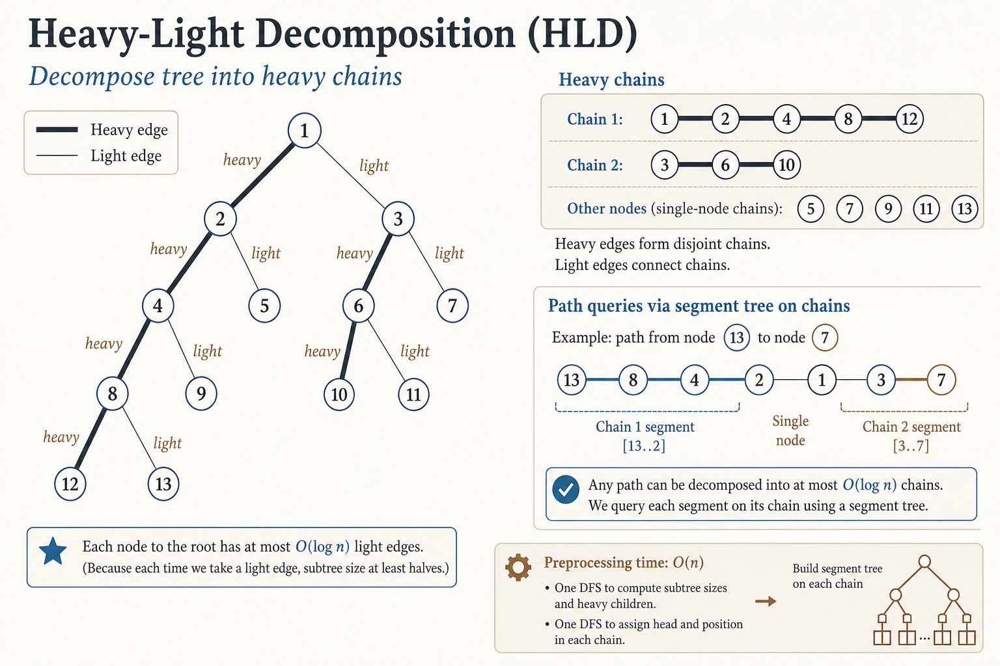
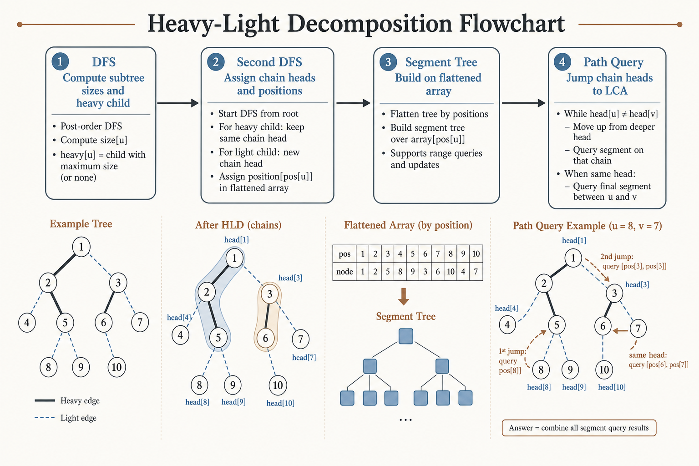
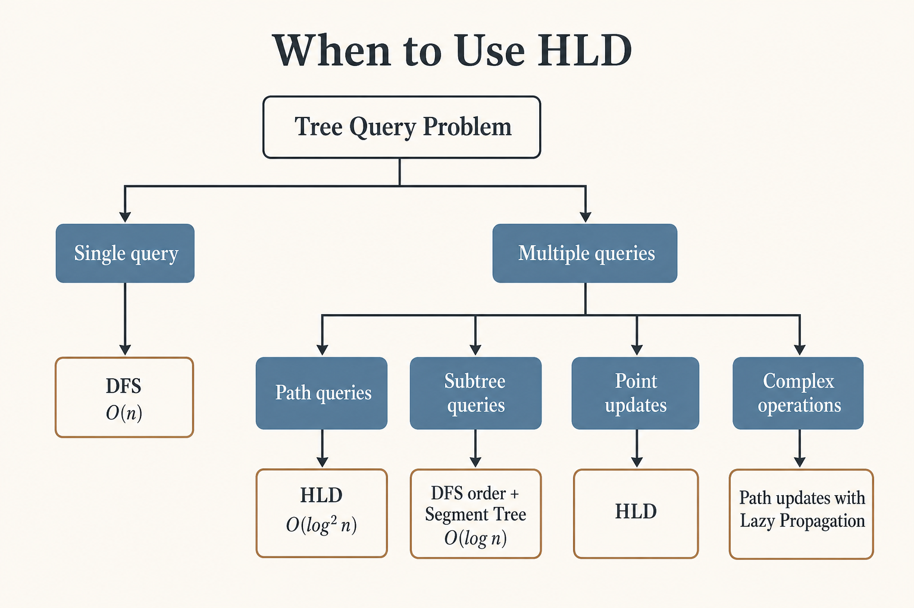

# ⚡ Heavy-Light Decomposition (HLD)

### *Heavy-Light Decomposition (HLD)*

  
  

---

## 📊 Visual Overview

---

## 🎯 At a Glance

| | |
|:---|:---|
| **Difficulty** | Hard |
| **Problems** | 8+ |

> **How to use this page:** Start with the visual overview, scan **At a Glance**, then work through theory → walkthroughs → code.

---

## 🧭 Navigation

| ⬅️ Previous | 📂 Current | ➡️ Next |
|:------------|:----------:|--------:|
| [← 03. Tree Construction](../03_tree_construction/README.md) | **04. HLD** | [05. Centroid Decomposition →](../05_centroid_decomposition/README.md) |

---

## 📐 Mathematical Foundation
### 1️⃣ HLD Definition

**Heavy-Light Decomposition:** Partition tree edges into **heavy** and **light** chains.

**Heavy edge:** Edge to child with largest subtree.  
**Light edge:** All other edges.

**Key property:** Any root-to-leaf path has at most $O(\log n)$ light edges.

---

### 2️⃣ Heavy Path Chains

**Heavy chain:** Maximal path of heavy edges.

**Decomposition results in:**

- $O(\log n)$ chains per root-to-leaf path

- Each node belongs to exactly one chain

- Chain heads can be identified

---

### 3️⃣ Path Query Complexity

**Query on path $(u, v)$:**

$$\text{Time} = O(\log^2 n)$$

- $O(\log n)$ chains to traverse

- $O(\log n)$ per chain query (using segment tree)

---

### 4️⃣ Applications

| Operation | Without HLD | With HLD |
|-----------|:-----------:|:--------:|
| **Path sum** | O(n) | O(log² n) |
| **Path max/min** | O(n) | O(log² n) |
| **Path update** | O(n) | O(log² n) |
| **Subtree query** | O(n) | O(log n) |
| **LCA** | O(n) | O(log n) |

---

### 5️⃣ DFS Order

**Flatten tree** using DFS to assign positions:

- Nodes in same chain get consecutive positions

- Enables range queries on chains

**Two arrays:**

- `pos[v]`: Position of node $v$ in flattened array

- `heavy[v]`: Heavy child of node $v$

---

### 6️⃣ Implementation Steps

1. **First DFS:** Compute subtree sizes

2. **Mark heavy children:** Child with largest subtree

3. **Second DFS:** Assign positions, mark chain heads

4. **Build segment tree** on flattened array

5. **Query/Update:** Decompose path into chains

---

### 7️⃣ Query Algorithm

**Path query from $u$ to $v$:**

1. Find LCA of $u$ and $v$

2. Process $u$ to LCA:
   - Jump to chain head
   - Query segment tree
   - Move to parent of chain head

3. Process $v$ to LCA similarly

4. Combine results

---

## 💻 Code Implementations

---

## 🏆 Related LeetCode Problems

### 🟡 Medium

| # | Problem | Pattern | Time | Space |
|:-:|---------|---------|:----:|:-----:|
| 1483 | [Kth Ancestor](https://leetcode.com/problems/kth-ancestor-of-a-tree-node/) | Can use HLD | O(log n) | O(n log n) |
| 2277 | [Closest Node to Path](https://leetcode.com/problems/closest-node-to-path-in-tree/) | Path queries | O(log² n) | O(n) |

### 🔴 Hard

| # | Problem | Pattern | Time | Space |
|:-:|---------|---------|:----:|:-----:|
| 2003 | [Smallest Missing Genetic Value](https://leetcode.com/problems/smallest-missing-genetic-value-in-each-subtree/) | Tree + HLD | O(n log n) | O(n) |
| 2322 | [Minimum Score After Removals](https://leetcode.com/problems/minimum-score-after-removals-on-a-tree/) | Subtree queries | O(n²) | O(n) |

---

## 📊 When to Use HLD

---

## 🎯 Key Insights

1. **Heavy child** = child with largest subtree

2. **At most O(log n) chains** on any path

3. **DFS order** makes chains contiguous

4. **Segment tree** handles range queries efficiently

5. **Can be extended** with lazy propagation for range updates

---

## 📚 References

| Resource | Link |
|----------|------|
| **HLD** | [CP-Algorithms](https://cp-algorithms.com/graph/hld.html) |
| **Tutorial** | [Codeforces](https://codeforces.com/blog/entry/22072) |
| **Video** | [William Fiset](https://www.youtube.com/watch?v=IOtgdZGLKf0) |

---

**Made with ❤️ by [Gaurav Goswami](https://github.com/Gaurav14cs17)**

---
