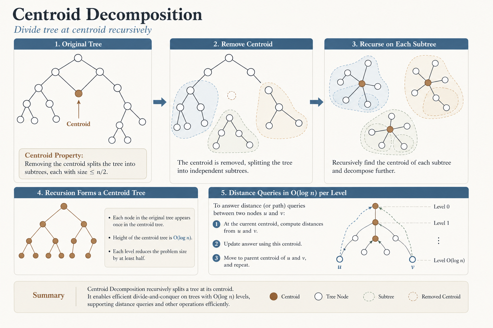
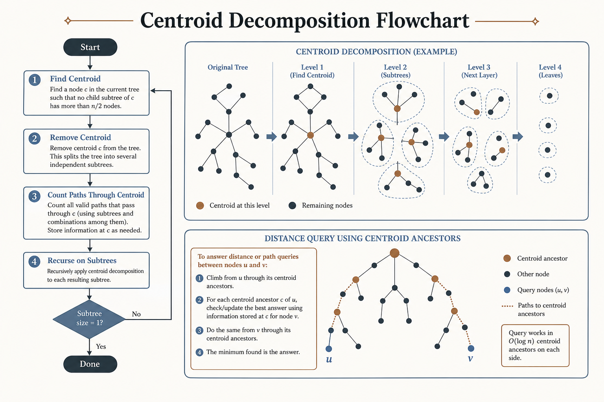
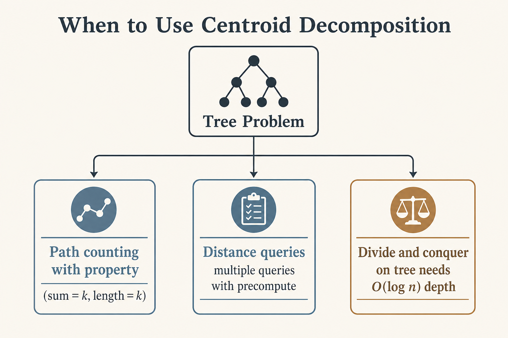

# 🎯 Centroid Decomposition

### *Centroid Decomposition*

  
  

---

## 📊 Visual Overview

---

## 🎯 At a Glance

| | |
|:---|:---|
| **Difficulty** | Hard |
| **Problems** | 6+ |

{: .highlight }
> **How to use this page:** Start with the visual overview, scan **At a Glance**, then work through theory → walkthroughs → code.

---

## 🧭 Navigation

| ⬅️ Previous | 📂 Current | ➡️ Next |
|:------------|:----------:|--------:|
| [← 04. HLD](../04_heavy_light_decomposition/README.md) | **05. Centroid Decomposition** | [06. DSU on Tree →](../06_dsu_on_tree/README.md) |

---

## 📐 Mathematical Foundation
### 1️⃣ Centroid Definition

**Centroid** of tree: Node whose removal results in no subtree with more than $n/2$ nodes.

**Key property:** Every tree has at least one centroid (at most two).

**Proof:** Start at any node, move to heaviest child until all children ≤ n/2.

---

### 2️⃣ Centroid Decomposition

**Recursively decompose tree:**

1. Find centroid of tree

2. Remove centroid

3. Recursively decompose resulting subtrees

4. Build centroid tree

**Depth of centroid tree:** $O(\log n)$

---

### 3️⃣ Centroid Tree Properties

**Structure:**

- Root = centroid of original tree

- Children = centroids of subtrees after removal

- Height = $O(\log n)$

- Each node appears once

**Path decomposition:** Any path passes through $O(\log n)$ centroids.

---

### 4️⃣ Applications

| Problem | Technique | Complexity |
|---------|-----------|:----------:|
| **k-th Path** | Centroid + counting | O(n log n) |
| **Paths with sum k** | Centroid + hash map | O(n log n) |
| **Closest colored node** | Centroid + BFS | O(n log n) |
| **Tree distances** | Centroid + DP | O(n log n) |

---

### 5️⃣ Algorithm Complexity

**Decomposition:** $O(n \log n)$

- Finding centroid: $O(n)$

- Depth: $O(\log n)$

- Total: $O(n) \times O(\log n) = O(n \log n)$

**Query:** Typically $O(\log n)$ to $O(\log^2 n)$

---

### 6️⃣ Distance Counting

**Count paths with specific property:**

1. Root at centroid

2. Count paths through centroid

3. Subtract paths entirely in one subtree

4. Recurse on subtrees

**Key insight:** Every path passes through exactly one centroid ancestor.

---

## 💻 Code Implementations

---

## 🏆 Related LeetCode Problems

### 🟡 Medium

| # | Problem | Pattern | Time | Space |
|:-:|---------|---------|:----:|:-----:|
| 2049 | [Count Nodes With Highest Score](https://leetcode.com/problems/count-nodes-with-the-highest-score/) | Tree decomposition | O(n) | O(n) |

### 🔴 Hard

| # | Problem | Pattern | Time | Space |
|:-:|---------|---------|:----:|:-----:|
| 1617 | [Count Subtrees With Max Distance](https://leetcode.com/problems/count-subtrees-with-max-distance-between-cities/) | Centroid + bitmask | O(n² 2ⁿ) | O(2ⁿ) |
| 2277 | [Closest Node to Path in Tree](https://leetcode.com/problems/closest-node-to-path-in-tree/) | Centroid decomp | O(n log n) | O(n log n) |
| 2791 | [Count Paths That Can Form Palindrome](https://leetcode.com/problems/count-paths-that-can-form-a-palindrome-in-a-tree/) | Centroid + XOR | O(n log n) | O(n) |

---

## 📊 When to Use Centroid Decomposition

---

## 🎯 Key Insights

1. **Centroid removes balanced part** of tree

2. **Every path** passes through O(log n) centroids

3. **Decomposition depth** = O(log n)

4. **Total complexity** typically O(n log n)

5. **Powerful for path problems** that are hard otherwise

---

## 📚 References

| Resource | Link |
|----------|------|
| **Centroid Decomposition** | [CP-Algorithms](https://cp-algorithms.com/graph/centroid_decomposition.html) |
| **Tutorial** | [Codeforces](https://codeforces.com/blog/entry/81661) |
| **Video** | [Errichto](https://www.youtube.com/watch?v=nzF_9bjDzdc) |

---

**Made with ❤️ by [Gaurav Goswami](https://github.com/Gaurav14cs17)**

---
