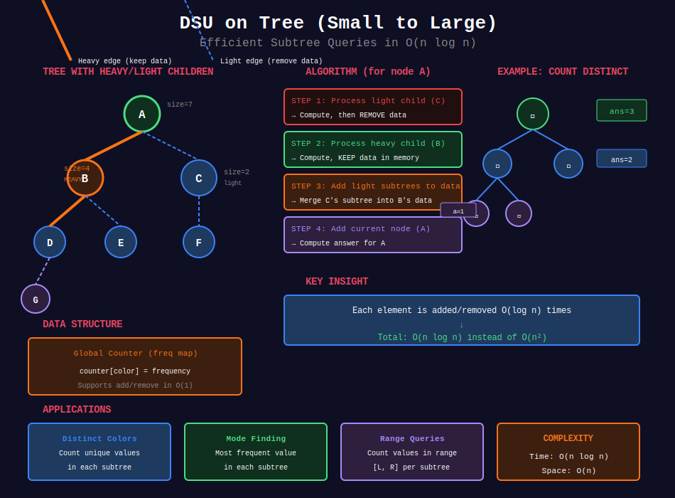

<div align="center">

# 🔄 DSU on Tree (Small to Large)

<p>
  
  
</p>

</div>

---

## 🧭 Navigation

| ⬅️ Previous | 📂 Current | ➡️ Next |
|:------------|:----------:|--------:|
| [← 05. Centroid Decomposition](../05_centroid_decomposition/README.md) | **06. DSU on Tree** | [07. Euler Tour →](../07_euler_tour/README.md) |

---

## 📊 Visual Overview

<div align="center">

</div>

---

## 📐 Mathematical Foundations

### 1️⃣ Small to Large Technique

**Idea:** When merging two sets, always add smaller to larger.

**Key insight:** Each element moved at most $O(\log n)$ times.

**Total complexity:** $O(n \log n)$ instead of $O(n^2)$

---

### 2️⃣ DSU on Tree Pattern

**Problem type:** Compute answer for each subtree.

**Naive approach:** DFS for each subtree = $O(n^2)$

**Optimized approach:**
1. Process light children, erase their data
2. Process heavy child, keep its data
3. Add contributions from light children
4. Answer query for current node

**Complexity:** $O(n \log n)$

---

### 3️⃣ Algorithm Steps

```
For each node u:
1. Recursively solve light children, remove their data
2. Recursively solve heavy child, KEEP its data
3. Add nodes from light subtrees one by one
4. Compute answer for u
5. If u is light child of parent, remove all data

```

---

### 4️⃣ Why O(n log n)?

**Analysis:**
- Each node visited once per ancestor in heavy path
- Heavy path length = $O(\log n)$
- Total: $O(n \log n)$

**Amortized:** Each node added/removed $O(\log n)$ times.

---

### 5️⃣ Applications

| Problem Type | Query | Complexity |
|--------------|-------|:----------:|
| **Color counting** | Distinct colors in subtree | O(n log n) |
| **Mode finding** | Most frequent value | O(n log n) |
| **Range queries** | Values in range for subtree | O(n log n) |
| **Set operations** | Union of subtree sets | O(n log n) |

---

## 💻 Code Implementations

```python
from typing import List, Callable
from collections import defaultdict, Counter

class DsuOnTree:
    """
    DSU (Disjoint Set Union) on Tree / Small to Large
    
    Efficiently compute subtree queries in O(n log n).
    """
    
    def __init__(self, n: int, edges: List[List[int]], root: int = 0):
        """
        Args:
            n: number of nodes (0 to n-1)
            edges: list of [u, v] edges
            root: root node
        """
        self.n = n
        self.root = root
        
        # Build adjacency list
        self.graph = defaultdict(list)
        for u, v in edges:
            self.graph[u].append(v)
            self.graph[v].append(u)
        
        # Tree properties
        self.parent = [-1] * n
        self.subtree_size = [0] * n
        self.heavy = [-1] * n  # Heavy child
        self.start_time = [0] * n
        self.end_time = [0] * n
        self.node_at_time = [0] * n
        
        self.timer = 0
        
        # First DFS: compute sizes and mark heavy children
        self._dfs_size(root, -1)
        
        # Second DFS: compute DFS order
        self._dfs_time(root, -1)
    
    def _dfs_size(self, u: int, p: int):
        """Compute subtree sizes and mark heavy children."""
        self.parent[u] = p
        self.subtree_size[u] = 1
        
        max_size = 0
        for v in self.graph[u]:
            if v != p:
                self._dfs_size(v, u)
                self.subtree_size[u] += self.subtree_size[v]
                
                if self.subtree_size[v] > max_size:
                    max_size = self.subtree_size[v]
                    self.heavy[u] = v
    
    def _dfs_time(self, u: int, p: int):
        """Compute DFS times."""
        self.start_time[u] = self.timer
        self.node_at_time[self.timer] = u
        self.timer += 1
        
        for v in self.graph[u]:
            if v != p:
                self._dfs_time(v, u)
        
        self.end_time[u] = self.timer - 1
    
    def solve_subtrees(self, values: List[int], 
                      process_func: Callable[[int, List[int]], None]):
        """
        Generic DSU on tree solver.
        
        Args:
            values: node values
            process_func: function(node, answers) to compute answer for node
        
        Time: O(n log n), Space: O(n)
        """
        # Global data structure for current subtree
        counter = Counter()
        answers = [None] * self.n
        
        def add_node(u: int, p: int):
            """Add node u and its subtree to counter."""
            counter[values[u]] += 1
            for v in self.graph[u]:
                if v != p:
                    add_node(v, u)
        
        def remove_subtree(u: int, p: int):
            """Remove node u and its subtree from counter."""
            counter[values[u]] -= 1
            if counter[values[u]] == 0:
                del counter[values[u]]
            for v in self.graph[u]:
                if v != p:
                    remove_subtree(v, u)
        
        def dfs(u: int, p: int, keep: bool):
            """
            Main DSU on tree DFS.
            
            Args:
                u: current node
                p: parent
                keep: whether to keep data after processing
            """
            # Process light children first
            heavy_child = self.heavy[u]
            for v in self.graph[u]:
                if v != p and v != heavy_child:
                    dfs(v, u, False)  # Don't keep light children
            
            # Process heavy child, keep its data
            if heavy_child != -1:
                dfs(heavy_child, u, True)
            
            # Add contributions from light children
            for v in self.graph[u]:
                if v != p and v != heavy_child:
                    add_node(v, u)
            
            # Add current node
            counter[values[u]] += 1
            
            # Compute answer for this node
            process_func(u, answers)
            
            # Remove data if this is light child
            if not keep:
                remove_subtree(u, p)
        
        dfs(self.root, -1, False)
        return answers

def count_distinct_in_subtrees(n: int, edges: List[List[int]], 
                               values: List[int]) -> List[int]:
    """
    Count distinct values in each subtree.
    
    Time: O(n log n), Space: O(n)
    """
    dsu = DsuOnTree(n, edges)
    
    def process(node: int, answers: List[int]):
        # Counter is available from closure
        # Count distinct values (keys in counter)
        answers[node] = len(counter)
    
    # Need to access counter
    counter = Counter()
    
    def add_node(u: int, p: int, graph: dict):
        counter[values[u]] += 1
        for v in graph[u]:
            if v != p:
                add_node(v, u, graph)
    
    def remove_subtree(u: int, p: int, graph: dict):
        counter[values[u]] -= 1
        if counter[values[u]] == 0:
            del counter[values[u]]
        for v in graph[u]:
            if v != p:
                remove_subtree(v, u, graph)
    
    answers = [0] * n
    
    def dfs(u: int, p: int, keep: bool):
        heavy_child = dsu.heavy[u]
        
        for v in dsu.graph[u]:
            if v != p and v != heavy_child:
                dfs(v, u, False)
        
        if heavy_child != -1:
            dfs(heavy_child, u, True)
        
        for v in dsu.graph[u]:
            if v != p and v != heavy_child:
                add_node(v, u, dsu.graph)
        
        counter[values[u]] += 1
        answers[u] = len(counter)
        
        if not keep:
            remove_subtree(u, p, dsu.graph)
    
    dfs(0, -1, False)
    return answers

def find_mode_in_subtrees(n: int, edges: List[List[int]], 
                          values: List[int]) -> List[int]:
    """
    Find most frequent value in each subtree.
    
    If tie, return smallest value.
    
    Time: O(n log n), Space: O(n)
    """
    dsu = DsuOnTree(n, edges)
    counter = Counter()
    answers = [0] * n
    max_freq = [0]  # Mutable for closure
    best_val = [float('inf')]
    
    def add_node(u: int, p: int):
        counter[values[u]] += 1
        freq = counter[values[u]]
        
        if freq > max_freq[0]:
            max_freq[0] = freq
            best_val[0] = values[u]
        elif freq == max_freq[0]:
            best_val[0] = min(best_val[0], values[u])
        
        for v in dsu.graph[u]:
            if v != p:
                add_node(v, u)
    
    def remove_subtree(u: int, p: int):
        counter[values[u]] -= 1
        if counter[values[u]] == 0:
            del counter[values[u]]
        for v in dsu.graph[u]:
            if v != p:
                remove_subtree(v, u)
    
    def recompute_max():
        """Recompute max frequency and best value."""
        if counter:
            max_freq[0] = max(counter.values())
            best_val[0] = min(k for k, v in counter.items() if v == max_freq[0])
        else:
            max_freq[0] = 0
            best_val[0] = float('inf')
    
    def dfs(u: int, p: int, keep: bool):
        heavy_child = dsu.heavy[u]
        
        for v in dsu.graph[u]:
            if v != p and v != heavy_child:
                dfs(v, u, False)
        
        if heavy_child != -1:
            dfs(heavy_child, u, True)
        
        for v in dsu.graph[u]:
            if v != p and v != heavy_child:
                add_node(v, u)
        
        counter[values[u]] += 1
        recompute_max()
        answers[u] = best_val[0]
        
        if not keep:
            remove_subtree(u, p)
            max_freq[0] = 0
            best_val[0] = float('inf')
    
    dfs(0, -1, False)
    return answers

# ============= LeetCode-style Problems =============

def subtreeQueries(n: int, edges: List[List[int]], values: List[int], 
                  queries: List[List[int]]) -> List[int]:
    """
    For each query [node, k], count values ≥ k in subtree.
    
    Time: O((n + q) log n), Space: O(n)
    """
    dsu = DsuOnTree(n, edges)
    counter = Counter()
    
    # Store queries by node
    node_queries = defaultdict(list)
    for i, (node, k) in enumerate(queries):
        node_queries[node].append((k, i))
    
    answers = [0] * len(queries)
    
    def add_node(u: int, p: int):
        counter[values[u]] += 1
        for v in dsu.graph[u]:
            if v != p:
                add_node(v, u)
    
    def remove_subtree(u: int, p: int):
        counter[values[u]] -= 1
        if counter[values[u]] == 0:
            del counter[values[u]]
        for v in dsu.graph[u]:
            if v != p:
                remove_subtree(v, u)
    
    def dfs(u: int, p: int, keep: bool):
        heavy_child = dsu.heavy[u]
        
        for v in dsu.graph[u]:
            if v != p and v != heavy_child:
                dfs(v, u, False)
        
        if heavy_child != -1:
            dfs(heavy_child, u, True)
        
        for v in dsu.graph[u]:
            if v != p and v != heavy_child:
                add_node(v, u)
        
        counter[values[u]] += 1
        
        # Answer queries for this node
        for k, query_idx in node_queries[u]:
            count = sum(freq for val, freq in counter.items() if val >= k)
            answers[query_idx] = count
        
        if not keep:
            remove_subtree(u, p)
    
    dfs(0, -1, False)
    return answers

def example_distinct_colors():
    """Example: Count distinct colors in subtrees"""
    n = 7
    edges = [[0, 1], [0, 2], [1, 3], [1, 4], [2, 5], [2, 6]]
    colors = [1, 2, 3, 1, 2, 3, 4]
    
    result = count_distinct_in_subtrees(n, edges, colors)
    print("Distinct colors in each subtree:")
    for i, count in enumerate(result):
        print(f"  Node {i}: {count}")

def example_mode_finding():
    """Example: Find most frequent value in subtrees"""
    n = 5
    edges = [[0, 1], [0, 2], [1, 3], [1, 4]]
    values = [1, 2, 1, 2, 1]
    
    result = find_mode_in_subtrees(n, edges, values)
    print("Most frequent value in each subtree:")
    for i, mode in enumerate(result):
        print(f"  Node {i}: {mode}")

```

---

## 🏆 Related LeetCode Problems

### 🟡 Medium

| # | Problem | Pattern | Time | Space |
|:-:|---------|---------|:----:|:-----:|
| 2003 | [Smallest Missing Genetic Value](https://leetcode.com/problems/smallest-missing-genetic-value-in-each-subtree/) | DSU on Tree | O(n log n) | O(n) |

### 🔴 Hard

| # | Problem | Pattern | Time | Space |
|:-:|---------|---------|:----:|:-----:|
| 2277 | [Closest Node to Path](https://leetcode.com/problems/closest-node-to-path-in-tree/) | Small to Large | O(n log n) | O(n) |

---

## 📊 When to Use DSU on Tree

```
Subtree Query Problem
     |
     +-- Can be computed incrementally? → DSU on Tree
     |   Examples: count distinct, find mode, sum
     |
     +-- Need all subtree answers? → O(n log n) with DSU
     |
     +-- Complex aggregation
         +-- Merge small to large → O(n log n)

```

---

## 🎯 Key Insights

1. **Small to large** ensures $O(\log n)$ merges per element
2. **Heavy child trick** keeps data between siblings
3. **Total complexity** $O(n \log n)$ instead of $O(n^2)$
4. **Works for** count, sum, distinct, mode, range queries
5. **Similar to HLD** but different applications

---

## 📚 References

| Resource | Link |
|----------|------|
| **DSU on Tree** | [Codeforces Tutorial](https://codeforces.com/blog/entry/44351) |
| **Small to Large** | [CP-Algorithms](https://cp-algorithms.com/data_structures/disjoint_set_union.html) |
| **Video** | [Errichto](https://www.youtube.com/watch?v=0W9ZvNWHhKE) |

---

<div align="center">

**Made with ❤️ by [Gaurav Goswami](https://github.com/Gaurav14cs17)**

</div>

---

## 🧭 Navigation

| ⬅️ Previous | 📂 Current | ➡️ Next |
|:------------|:----------:|--------:|
| [← 05. Centroid Decomposition](../05_centroid_decomposition/README.md) | **06. DSU on Tree** | [07. Euler Tour →](../07_euler_tour/README.md) |

