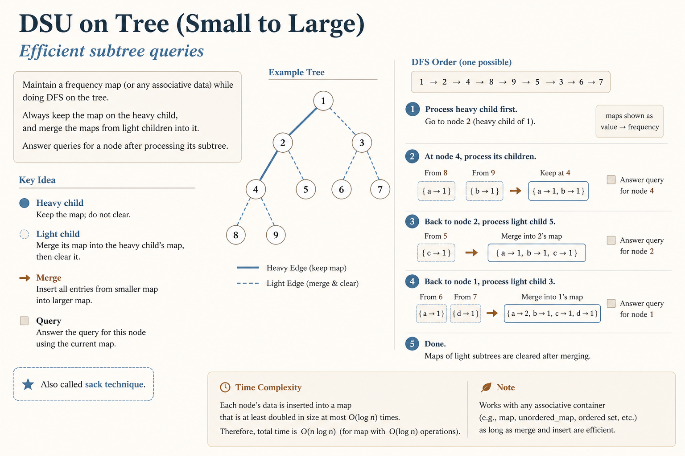
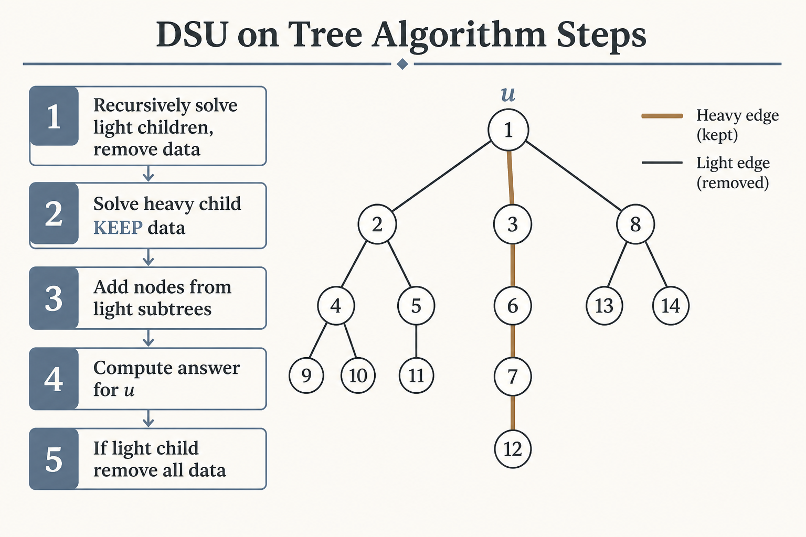
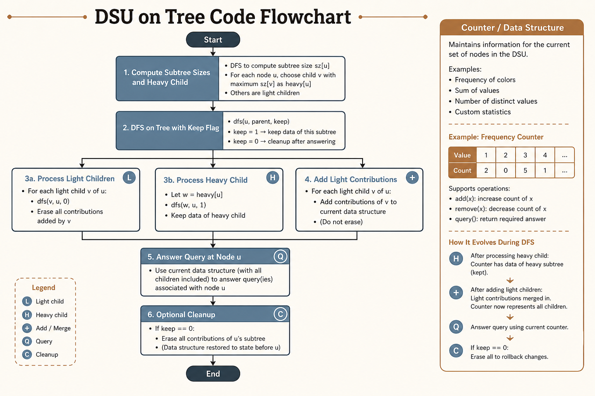
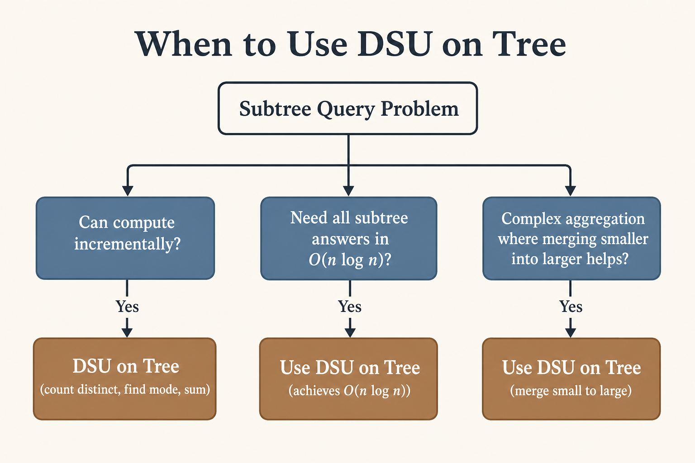

# 🔄 DSU on Tree (Small to Large)

### *DSU on Tree (Small to Large)*

  
  

---

## 📊 Visual Overview

---

## 🎯 At a Glance

| | |
|:---|:---|
| **Difficulty** | Hard |
| **Problems** | 5+ |

> **How to use this page:** Start with the visual overview, scan **At a Glance**, then work through theory → walkthroughs → code.

---

## 🧭 Navigation

| ⬅️ Previous | 📂 Current | ➡️ Next |
|:------------|:----------:|--------:|
| [← 05. Centroid Decomposition](../05_centroid_decomposition/README.md) | **06. DSU on Tree** | [07. Euler Tour →](../07_euler_tour/README.md) |

---

## 📐 Mathematical Foundation
### 1️⃣ Small to Large Technique

**Idea:** When merging two sets, always add smaller to larger.

**Key insight:** Each element moved at most $O(\log n)$ times.

**Total complexity:** $O(n \log n)$ instead of $O(n^2)$

---

### 2️⃣ DSU on Tree Pattern

**Problem type:** Compute answer for each subtree.

**Naive approach:** DFS for each subtree = $O(n^2)$

**Optimized approach:**

1. Process light children, erase their data

2. Process heavy child, keep its data

3. Add contributions from light children

4. Answer query for current node

**Complexity:** $O(n \log n)$

---

### 3️⃣ Algorithm Steps

---

### 4️⃣ Why O(n log n)?

**Analysis:**

- Each node visited once per ancestor in heavy path

- Heavy path length = $O(\log n)$

- Total: $O(n \log n)$

**Amortized:** Each node added/removed $O(\log n)$ times.

---

### 5️⃣ Applications

| Problem Type | Query | Complexity |
|--------------|-------|:----------:|
| **Color counting** | Distinct colors in subtree | O(n log n) |
| **Mode finding** | Most frequent value | O(n log n) |
| **Range queries** | Values in range for subtree | O(n log n) |
| **Set operations** | Union of subtree sets | O(n log n) |

---

## 💻 Code Implementations

---

## 🏆 Related LeetCode Problems

### 🟡 Medium

| # | Problem | Pattern | Time | Space |
|:-:|---------|---------|:----:|:-----:|
| 2003 | [Smallest Missing Genetic Value](https://leetcode.com/problems/smallest-missing-genetic-value-in-each-subtree/) | DSU on Tree | O(n log n) | O(n) |

### 🔴 Hard

| # | Problem | Pattern | Time | Space |
|:-:|---------|---------|:----:|:-----:|
| 2277 | [Closest Node to Path](https://leetcode.com/problems/closest-node-to-path-in-tree/) | Small to Large | O(n log n) | O(n) |

---

## 📊 When to Use DSU on Tree

---

## 🎯 Key Insights

1. **Small to large** ensures $O(\log n)$ merges per element

2. **Heavy child trick** keeps data between siblings

3. **Total complexity** $O(n \log n)$ instead of $O(n^2)$

4. **Works for** count, sum, distinct, mode, range queries

5. **Similar to HLD** but different applications

---

## 📚 References

| Resource | Link |
|----------|------|
| **DSU on Tree** | [Codeforces Tutorial](https://codeforces.com/blog/entry/44351) |
| **Small to Large** | [CP-Algorithms](https://cp-algorithms.com/data_structures/disjoint_set_union.html) |
| **Video** | [Errichto](https://www.youtube.com/watch?v=0W9ZvNWHhKE) |

---

**Made with ❤️ by [Gaurav Goswami](https://github.com/Gaurav14cs17)**

---
