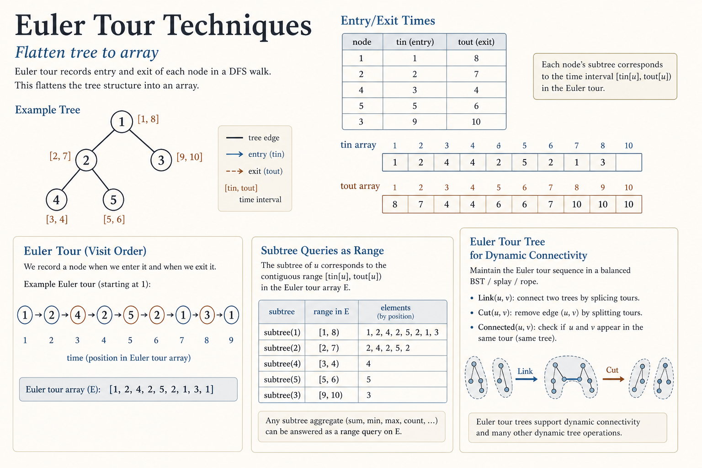
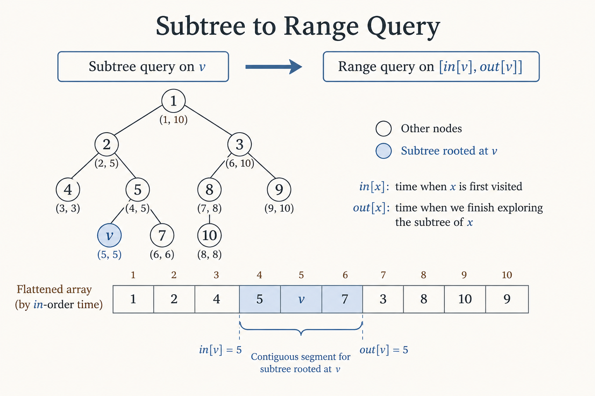
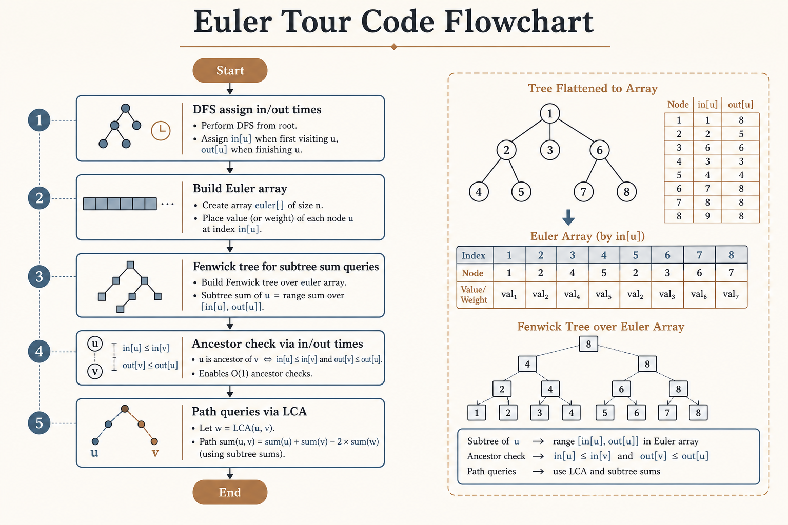
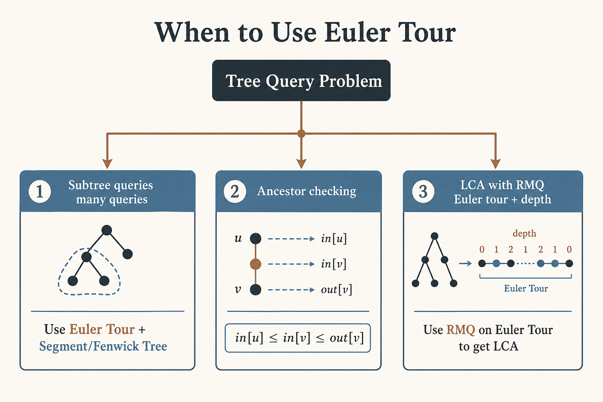

# 🔄 Euler Tour Techniques

### *Euler Tour Techniques*

  
  

---

## 📊 Visual Overview

---

## 🎯 At a Glance

| | |
|:---|:---|
| **Difficulty** | Medium to Hard |
| **Problems** | 8+ |

> **How to use this page:** Start with the visual overview, scan **At a Glance**, then work through theory → walkthroughs → code.

---

## 🧭 Navigation

| ⬅️ Previous | 📂 Current | ➡️ Next |
|:------------|:----------:|--------:|
| [← 06. DSU on Tree](../06_dsu_on_tree/README.md) | **07. Euler Tour** | [🏠 Home](../README.md) |

---

## 📐 Mathematical Foundation
### 1️⃣ Euler Tour Definition

**Euler Tour:** Flatten tree into array by recording entry/exit times in DFS.

**Two variants:**

1. **Node-based:** Record each node once (entry time only)

2. **Edge-based:** Record each node twice (entry and exit)

---

### 2️⃣ DFS Order (Flattening)

**DFS Order:** Assign each node a position based on DFS traversal.

**Properties:**

- Subtree occupies contiguous range

- Range $[\text{in}[v], \text{out}[v]]$ = subtree of $v$

- Enables range queries on subtrees

**Time:** $O(n)$ to build  
**Space:** $O(n)$

---

### 3️⃣ Subtree to Range Query

**Applications:**

- Subtree sum → Range sum

- Subtree update → Range update

- Subtree max/min → Range max/min

---

### 4️⃣ Path to Two Ranges

**Path from $u$ to $v$:**

- Can be split using LCA

- Convert to two ranges in Euler tour

- Union of ranges covers path

---

### 5️⃣ Complexity Analysis

| Operation | Without Euler Tour | With Euler Tour |
|-----------|:------------------:|:---------------:|
| **Subtree sum** | O(n) DFS | O(log n) |
| **Subtree update** | O(n) DFS | O(log n) |
| **Subtree max** | O(n) DFS | O(log n) |
| **Build** | - | O(n) |

---

### 6️⃣ Data Structures Used

**Combined with:**

- **Segment Tree:** Range queries/updates

- **Fenwick Tree:** Prefix sums

- **Sparse Table:** RMQ (read-only)

---

## 💻 Code Implementations

---

## 🏆 Related LeetCode Problems

### 🟡 Medium

| # | Problem | Pattern | Time | Space |
|:-:|---------|---------|:----:|:-----:|
| 1305 | [All Elements in Two BSTs](https://leetcode.com/problems/all-elements-in-two-binary-search-trees/) | Inorder | O(n+m) | O(n+m) |
| 2003 | [Smallest Missing Value](https://leetcode.com/problems/smallest-missing-genetic-value-in-each-subtree/) | DFS Order | O(n) | O(n) |

### 🔴 Hard

| # | Problem | Pattern | Time | Space |
|:-:|---------|---------|:----:|:-----:|
| 2322 | [Minimum Score After Removals](https://leetcode.com/problems/minimum-score-after-removals-on-a-tree/) | Subtree ranges | O(n²) | O(n) |

---

## 📊 When to Use Euler Tour

---

## 🎯 Key Insights

1. **Subtree = contiguous range** in DFS order

2. **Enables range data structures** on trees

3. **O(1) ancestor checking** with in/out times

4. **Combined with segment tree** for updates

5. **Foundation for HLD** and other advanced techniques

---

## 📚 References

| Resource | Link |
|----------|------|
| **Euler Tour** | [CP-Algorithms](https://cp-algorithms.com/graph/euler_path.html) |
| **DFS Order** | [Codeforces](https://codeforces.com/blog/entry/18369) |
| **Tree Flattening** | [GeeksforGeeks](https://www.geeksforgeeks.org/flatten-a-binary-tree-into-linked-list/) |

---

**Made with ❤️ by [Gaurav Goswami](https://github.com/Gaurav14cs17)**

---
