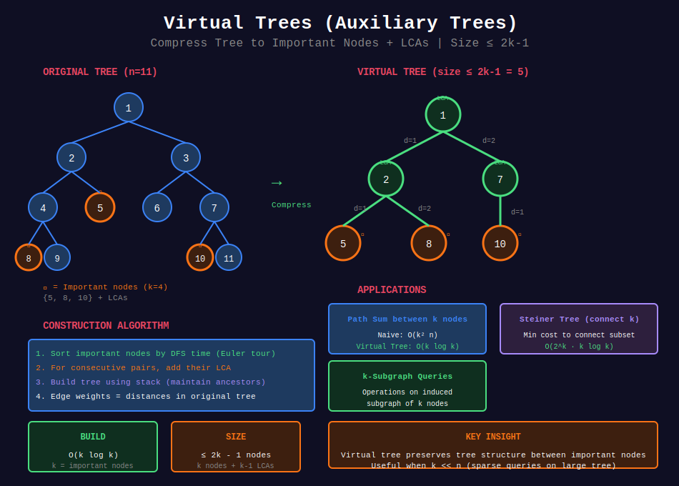

<div align="center">

# 🌐 Virtual Trees (Auxiliary Trees)

<p>
  
  
</p>

</div>

---

## 🧭 Navigation

| ⬅️ Previous | 📂 Current | ➡️ Next |
|:------------|:----------:|--------:|
| [← 07. Euler Tour](../07_euler_tour/README.md) | **08. Virtual Trees** | [09. Tree Hashing →](../09_tree_hashing/README.md) |

---

## 📊 Visual Overview

<div align="center">

</div>

---

## 📐 Mathematical Foundations

### 1️⃣ Virtual Tree Definition

**Virtual Tree (Auxiliary Tree):** Compressed tree containing only **important nodes** and their LCAs.

**Given:**

- Original tree $T$ with $n$ nodes

- Set $K$ of $k$ important nodes ($k \ll n$)

**Build:** Tree with only nodes in $K$ plus their LCAs.

**Size:** At most $2k - 1$ nodes (important nodes + LCAs)

---

### 2️⃣ Why Virtual Trees?

**Problem pattern:**

- Query on subset of nodes

- Need tree structure between them

- Don't want to process entire tree

**Example:** Sum of edges on paths between k nodes.

**Naive:** $O(k^2 \cdot n)$ - check all pairs  
**With Virtual Tree:** $O(k \log n)$ - build and process compressed tree

---

### 3️⃣ Construction Algorithm

**Steps:**

1. Sort important nodes by DFS order (Euler tour)

2. For consecutive nodes, add their LCA

3. Build tree from this set using stack

4. Result: compressed tree with only relevant nodes

**Time:** $O(k \log k)$ for sorting + $O(k)$ for building = $O(k \log k)$

---

### 4️⃣ Stack-Based Construction

**Algorithm:**

```
1. Sort nodes by in-time (DFS order)

2. Stack maintains path from root to current node

3. For each node u:
   - Pop stack until top is ancestor of u
   - LCA(top, u) becomes parent
   - Add edge, push u

```

**Invariant:** Stack contains ancestors in DFS order.

---

### 5️⃣ Applications

| Problem | Without Virtual Tree | With Virtual Tree |
|---------|:--------------------:|:-----------------:|
| **k nodes path sum** | O(k² n) | O(k log k) |
| **Steiner tree** | O(2^k n) | O(2^k k log k) |
| **k-subgraph queries** | O(kn) | O(k log k) |

---

### 6️⃣ Edge Weights in Virtual Tree

**Edge weight** from $u$ to $v$ in virtual tree:

- Distance in original tree

- Or sum of edges on path

**Computation:** Using LCA and precomputed depths/distances.

---

## 💻 Code Implementations

```python
from typing import List, Set, Tuple
from collections import defaultdict
import math

class VirtualTree:
    """
    Virtual Tree (Auxiliary Tree) construction.
    
    Compresses tree to contain only important nodes and their LCAs.
    """
    
    def __init__(self, n: int, edges: List[List[int]], root: int = 0):
        """
        Initialize with original tree.
        
        Args:
            n: number of nodes (0 to n-1)
            edges: list of [u, v] edges
            root: root node
        """
        self.n = n
        self.root = root
        
        # Build adjacency list
        self.graph = defaultdict(list)
        for u, v in edges:
            self.graph[u].append(v)
            self.graph[v].append(u)
        
        # Precompute for LCA
        self.parent = [-1] * n
        self.depth = [0] * n
        self.in_time = [0] * n
        self.out_time = [0] * n
        
        self.LOG = math.ceil(math.log2(n)) + 1
        self.up = [[-1] * self.LOG for _ in range(n)]
        
        self.timer = 0
        
        # Build preprocessing structures
        self._dfs(root, -1, 0)
        
        # Build binary lifting table for LCA
        for k in range(1, self.LOG):
            for v in range(n):
                if self.up[v][k - 1] != -1:
                    self.up[v][k] = self.up[self.up[v][k - 1]][k - 1]
    
    def _dfs(self, u: int, p: int, d: int):
        """DFS to compute parent, depth, and DFS times."""
        self.parent[u] = p
        self.depth[u] = d
        self.up[u][0] = p
        
        self.in_time[u] = self.timer
        self.timer += 1
        
        for v in self.graph[u]:
            if v != p:
                self._dfs(v, u, d + 1)
        
        self.out_time[u] = self.timer - 1
    
    def lca(self, u: int, v: int) -> int:
        """Find LCA using binary lifting."""
        if self.depth[u] < self.depth[v]:
            u, v = v, u
        
        # Bring u to same level
        diff = self.depth[u] - self.depth[v]
        for k in range(self.LOG):
            if (diff >> k) & 1:
                u = self.up[u][k]
        
        if u == v:
            return u
        
        # Binary search
        for k in range(self.LOG - 1, -1, -1):
            if self.up[u][k] != self.up[v][k]:
                u = self.up[u][k]
                v = self.up[v][k]
        
        return self.up[u][0]
    
    def distance(self, u: int, v: int) -> int:
        """Distance between u and v."""
        lca_node = self.lca(u, v)
        return self.depth[u] + self.depth[v] - 2 * self.depth[lca_node]
    
    def is_ancestor(self, u: int, v: int) -> bool:
        """Check if u is ancestor of v."""
        return (self.in_time[u] <= self.in_time[v] and 
                self.out_time[v] <= self.out_time[u])
    
    def build_virtual_tree(self, important: List[int]) -> Tuple[dict, int]:
        """
        Build virtual tree containing only important nodes and their LCAs.
        
        Args:
            important: list of important node IDs
        
        Returns:
            (virtual_graph, virtual_root)
            virtual_graph: adjacency list of virtual tree
            virtual_root: root of virtual tree
        
        Time: O(k log k) where k = len(important)
        Space: O(k)
        """
        if not important:
            return {}, -1
        
        # Sort by DFS order (in_time)
        important = sorted(important, key=lambda x: self.in_time[x])
        
        # Add LCAs between consecutive nodes
        nodes_set = set(important)
        for i in range(len(important) - 1):
            lca_node = self.lca(important[i], important[i + 1])
            nodes_set.add(lca_node)
        
        # Convert to sorted list
        nodes = sorted(nodes_set, key=lambda x: self.in_time[x])
        
        if not nodes:
            return {}, -1
        
        # Build virtual tree using stack
        virtual_graph = defaultdict(list)
        stack = [nodes[0]]
        virtual_root = nodes[0]
        
        for i in range(1, len(nodes)):
            u = nodes[i]
            
            # Pop stack until we find ancestor of u
            while stack and not self.is_ancestor(stack[-1], u):
                stack.pop()
            
            if stack:
                parent = stack[-1]
                virtual_graph[parent].append(u)
                virtual_graph[u].append(parent)  # Undirected
            
            stack.append(u)
        
        return virtual_graph, virtual_root
    
    def build_virtual_tree_with_weights(self, important: List[int]) -> Tuple[dict, int]:
        """
        Build virtual tree with edge weights (distances).
        
        Returns:
            (virtual_graph, virtual_root)
            virtual_graph[u] = [(v, weight), ...]
        """
        if not important:
            return {}, -1
        
        # Sort by DFS order
        important = sorted(important, key=lambda x: self.in_time[x])
        
        # Add LCAs
        nodes_set = set(important)
        for i in range(len(important) - 1):
            lca_node = self.lca(important[i], important[i + 1])
            nodes_set.add(lca_node)
        
        nodes = sorted(nodes_set, key=lambda x: self.in_time[x])
        
        if not nodes:
            return {}, -1
        
        # Build with edge weights
        virtual_graph = defaultdict(list)
        stack = [nodes[0]]
        virtual_root = nodes[0]
        
        for i in range(1, len(nodes)):
            u = nodes[i]
            
            while stack and not self.is_ancestor(stack[-1], u):
                stack.pop()
            
            if stack:
                parent = stack[-1]
                weight = self.distance(parent, u)
                virtual_graph[parent].append((u, weight))
                virtual_graph[u].append((parent, weight))
            
            stack.append(u)
        
        return virtual_graph, virtual_root

# ============= Applications =============

def sum_of_paths_between_k_nodes(n: int, edges: List[List[int]], 
                                 important: List[int], 
                                 edge_weights: dict) -> int:
    """
    Find sum of all pairwise path lengths between k important nodes.
    
    Using virtual tree for efficiency.
    
    Time: O(k log k + k), Space: O(k)
    """
    vt = VirtualTree(n, edges)
    virtual_graph, virtual_root = vt.build_virtual_tree_with_weights(important)
    
    if virtual_root == -1:
        return 0
    
    # Mark important nodes
    is_important = set(important)
    
    # DFS on virtual tree to compute answer
    result = [0]
    
    def dfs(u: int, parent: int) -> Tuple[int, int]:
        """
        Returns (count_important_in_subtree, sum_of_distances)
        """
        count = 1 if u in is_important else 0
        
        for v, weight in virtual_graph[u]:
            if v != parent:
                child_count, child_sum = dfs(v, u)
                
                # Contribution of edge (u, v)
                # Used by: child_count * (total - child_count) pairs
                contribution = weight * child_count * (len(important) - child_count)
                result[0] += contribution
                
                count += child_count
        
        return count, 0
    
    dfs(virtual_root, -1)
    return result[0]

def steiner_tree_k_nodes(n: int, edges: List[List[int]], 
                         important: List[int]) -> int:
    """
    Find minimum cost to connect k important nodes (Steiner Tree).
    
    Using virtual tree + DP.
    
    Time: O(2^k * k log k), Space: O(2^k * k)
    """
    vt = VirtualTree(n, edges)
    virtual_graph, virtual_root = vt.build_virtual_tree_with_weights(important)
    
    if not important:
        return 0
    
    # Map important nodes to indices
    idx_map = {node: i for i, node in enumerate(important)}
    k = len(important)
    
    # dp[node][mask] = min cost to connect subset mask in subtree of node
    dp = defaultdict(lambda: defaultdict(lambda: float('inf')))
    
    def dfs(u: int, parent: int) -> dict:
        """Returns dp[u][mask] for all masks."""
        local_dp = defaultdict(lambda: float('inf'))
        
        # Base case: if u is important
        if u in idx_map:
            local_dp[1 << idx_map[u]] = 0
        else:
            local_dp[0] = 0
        
        # Process children
        for v, weight in virtual_graph[u]:
            if v != parent:
                child_dp = dfs(v, u)
                
                # Merge child DP
                new_dp = defaultdict(lambda: float('inf'))
                for mask1, cost1 in local_dp.items():
                    for mask2, cost2 in child_dp.items():
                        combined = mask1 | mask2
                        new_dp[combined] = min(new_dp[combined], 
                                              cost1 + cost2 + weight)
                
                local_dp = new_dp
        
        dp[u] = local_dp
        return local_dp
    
    result = dfs(virtual_root, -1)
    full_mask = (1 << k) - 1
    return result.get(full_mask, float('inf'))

# ============= Example Usage =============

def example_virtual_tree():
    """Example: Build virtual tree"""
    n = 7
    edges = [[0, 1], [0, 2], [1, 3], [1, 4], [2, 5], [2, 6]]
    
    vt = VirtualTree(n, edges)
    
    # Important nodes: 3, 5, 6
    important = [3, 5, 6]
    
    virtual_graph, virtual_root = vt.build_virtual_tree(important)
    
    print("Virtual tree structure:")
    for u, neighbors in virtual_graph.items():
        print(f"  {u}: {neighbors}")
    print(f"Virtual root: {virtual_root}")

def count_subtrees_with_k_marked(n: int, edges: List[List[int]], 
                                 marked: List[int]) -> int:
    """
    Count subtrees that contain all k marked nodes.
    
    Using virtual tree.
    
    Time: O(k log k + k), Space: O(k)
    """
    vt = VirtualTree(n, edges)
    virtual_graph, virtual_root = vt.build_virtual_tree(marked)
    
    if virtual_root == -1:
        return 0
    
    marked_set = set(marked)
    count = [0]
    
    def dfs(u: int, parent: int) -> int:
        """Returns number of marked nodes in subtree."""
        marked_in_subtree = 1 if u in marked_set else 0
        
        for v in virtual_graph[u]:
            if v != parent:
                child_marked = dfs(v, u)
                marked_in_subtree += child_marked
        
        # If all marked nodes in subtree, this is valid root
        if marked_in_subtree == len(marked):
            count[0] += 1
        
        return marked_in_subtree
    
    dfs(virtual_root, -1)
    return count[0]

```

---

## 🏆 Related LeetCode Problems

### 🔴 Hard

| # | Problem | Pattern | Time | Space |
|:-:|---------|---------|:----:|:-----:|
| 2421 | [Number of Good Paths](https://leetcode.com/problems/number-of-good-paths/) | Virtual tree concept | O(n log n) | O(n) |
| 2872 | [Maximum Good Subarray Sum](https://leetcode.com/problems/maximum-number-of-k-divisible-components/) | Tree decomposition | O(n) | O(n) |

---

## 📊 When to Use Virtual Trees

```
Tree Problem
     |
     +-- Query on k nodes (k << n)
     |   +-- Need tree structure between them
     |       → Virtual Tree O(k log k)
     |
     +-- Steiner tree problems
     |   +-- Connect subset optimally
     |       → Virtual Tree + DP
     |
     +-- Subtree queries on subsets
         +-- Don't need full tree
             → Virtual Tree compression

```

---

## 🎯 Key Insights

1. **Compress tree** to only relevant nodes + LCAs

2. **Size at most 2k - 1** for k important nodes

3. **Build in O(k log k)** using sort + stack

4. **Preserves tree structure** between important nodes

5. **Useful when k << n** (sparse queries)

---

## 📚 References

| Resource | Link |
|----------|------|
| **Virtual Trees** | [Codeforces Tutorial](https://codeforces.com/blog/entry/53170) |
| **Auxiliary Trees** | [CP-Algorithms](https://cp-algorithms.com/) |
| **Video** | [Algorithms Live](https://www.youtube.com/watch?v=Y9OXQu1BX9o) |

---

<div align="center">

**Made with ❤️ by [Gaurav Goswami](https://github.com/Gaurav14cs17)**

</div>

---

## 🧭 Navigation

| ⬅️ Previous | 📂 Current | ➡️ Next |
|:------------|:----------:|--------:|
| [← 07. Euler Tour](../07_euler_tour/README.md) | **08. Virtual Trees** | [09. Tree Hashing →](../09_tree_hashing/README.md) |

