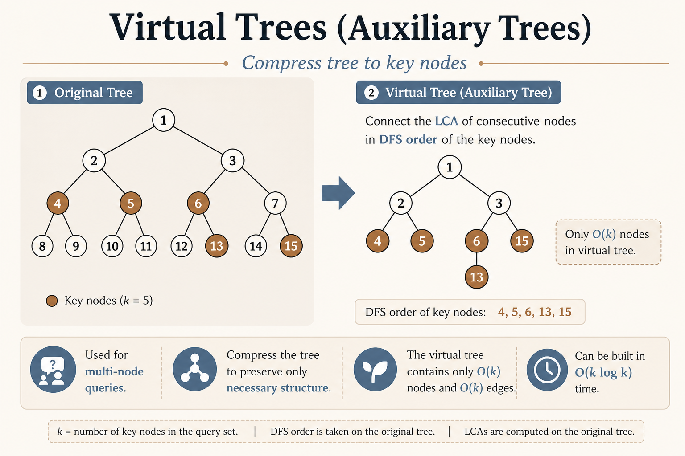
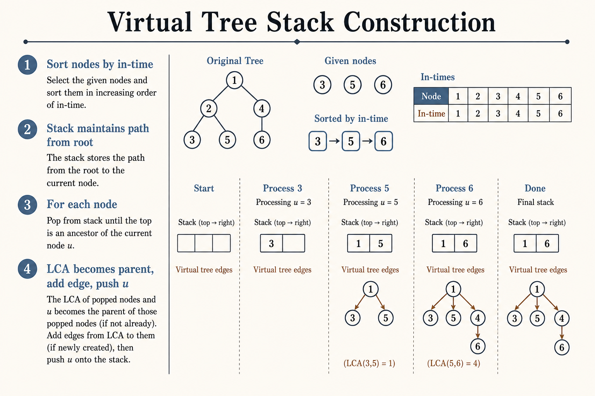
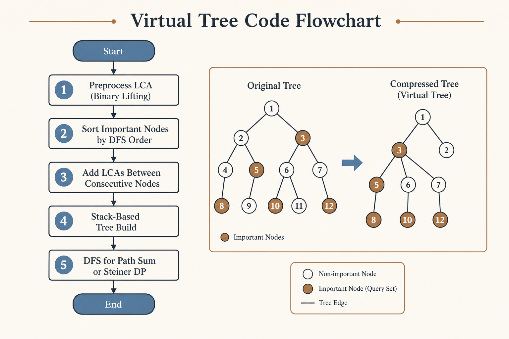
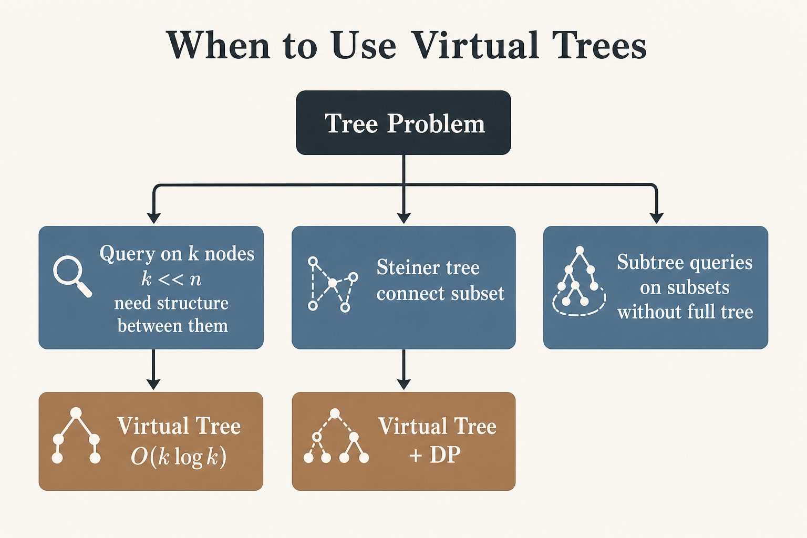

# 🌐 Virtual Trees (Auxiliary Trees)

### *Virtual Trees (Auxiliary Trees)*

  
  

---

## 📊 Visual Overview

---

## 🎯 At a Glance

| | |
|:---|:---|
| **Difficulty** | Hard |
| **Problems** | 5+ |

> **How to use this page:** Start with the visual overview, scan **At a Glance**, then work through theory → walkthroughs → code.

---

## 🧭 Navigation

| ⬅️ Previous | 📂 Current | ➡️ Next |
|:------------|:----------:|--------:|
| [← 07. Euler Tour](../07_euler_tour/README.md) | **08. Virtual Trees** | [09. Tree Hashing →](../09_tree_hashing/README.md) |

---

## 📐 Mathematical Foundation
### 1️⃣ Virtual Tree Definition

**Virtual Tree (Auxiliary Tree):** Compressed tree containing only **important nodes** and their LCAs.

**Given:**

- Original tree $T$ with $n$ nodes

- Set $K$ of $k$ important nodes ($k \ll n$)

**Build:** Tree with only nodes in $K$ plus their LCAs.

**Size:** At most $2k - 1$ nodes (important nodes + LCAs)

---

### 2️⃣ Why Virtual Trees?

**Problem pattern:**

- Query on subset of nodes

- Need tree structure between them

- Don't want to process entire tree

**Example:** Sum of edges on paths between k nodes.

**Naive:** $O(k^2 \cdot n)$ - check all pairs  
**With Virtual Tree:** $O(k \log n)$ - build and process compressed tree

---

### 3️⃣ Construction Algorithm

**Steps:**

1. Sort important nodes by DFS order (Euler tour)

2. For consecutive nodes, add their LCA

3. Build tree from this set using stack

4. Result: compressed tree with only relevant nodes

**Time:** $O(k \log k)$ for sorting + $O(k)$ for building = $O(k \log k)$

---

### 4️⃣ Stack-Based Construction

**Invariant:** Stack contains ancestors in DFS order.

---

### 5️⃣ Applications

| Problem | Without Virtual Tree | With Virtual Tree |
|---------|:--------------------:|:-----------------:|
| **k nodes path sum** | O(k² n) | O(k log k) |
| **Steiner tree** | O(2^k n) | O(2^k k log k) |
| **k-subgraph queries** | O(kn) | O(k log k) |

---

### 6️⃣ Edge Weights in Virtual Tree

**Edge weight** from $u$ to $v$ in virtual tree:

- Distance in original tree

- Or sum of edges on path

**Computation:** Using LCA and precomputed depths/distances.

---

## 💻 Code Implementations

---

## 🏆 Related LeetCode Problems

### 🔴 Hard

| # | Problem | Pattern | Time | Space |
|:-:|---------|---------|:----:|:-----:|
| 2421 | [Number of Good Paths](https://leetcode.com/problems/number-of-good-paths/) | Virtual tree concept | O(n log n) | O(n) |
| 2872 | [Maximum Good Subarray Sum](https://leetcode.com/problems/maximum-number-of-k-divisible-components/) | Tree decomposition | O(n) | O(n) |

---

## 📊 When to Use Virtual Trees

---

## 🎯 Key Insights

1. **Compress tree** to only relevant nodes + LCAs

2. **Size at most 2k - 1** for k important nodes

3. **Build in O(k log k)** using sort + stack

4. **Preserves tree structure** between important nodes

5. **Useful when k << n** (sparse queries)

---

## 📚 References

| Resource | Link |
|----------|------|
| **Virtual Trees** | [Codeforces Tutorial](https://codeforces.com/blog/entry/53170) |
| **Auxiliary Trees** | [CP-Algorithms](https://cp-algorithms.com/) |
| **Video** | [Algorithms Live](https://www.youtube.com/watch?v=Y9OXQu1BX9o) |

---

**Made with ❤️ by [Gaurav Goswami](https://github.com/Gaurav14cs17)**

---
